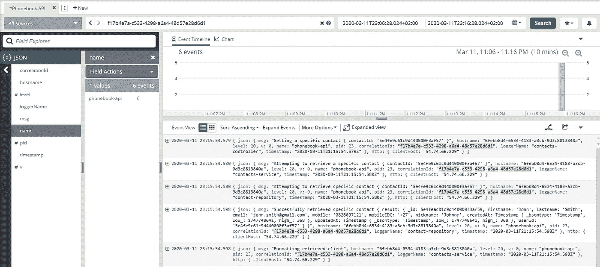

# Loggly 和 Bunyan 的集中测井

> 原文：<https://levelup.gitconnected.com/centralised-logging-with-loggly-and-bunyan-63c24f4d5617>


你是否曾经在没有任何有意义的日志记录的情况下尝试调试软件？如果没有，请认为你是幸运的，并心存感激！日志实现起来相对简单，并且提供了对生产中代码内部发生的事情的大量洞察——当然假设它被正确实现。

本文假设您对 TypeScript 有基本的了解，并且能够阅读和理解一些代码片段。

让我们看看如何将一个专用的日志库引入我们的代码库，并将日志集中在 Loggly 上。本文将使用 TypeScript 来演示与 Loggly 的集成。

# 班扬入门

Bunyan 是一个很棒的日志库，实现起来非常简单。我们还将使用 bunyan-loggly 作为我们的客户来与 loggly 集成。让我们安装我们的依赖项并开始行动吧！

```
$ npm i bunyan bunyan-loggly
$ npm i -D @types/bunyan
```

既然我们已经安装了日志库及其适当的类型定义，我们就可以开始记录代码了。

我们应该从创建一个`LoggerFactory`类开始。原因很简单，我们可以用特定的配置定义一个记录器，然后我们可以调用一个函数来返回一个子记录器。子记录器将从应用程序级记录器派生出来，继承已经定义的配置，并被恰当地命名！这也将在以后变得更加重要。

让我们看看这是如何实现的，好吗？

实现 bunyan 的 LoggerFactory 示例

在上面的要点中，我们可以看到，在构造函数中，我们正在初始化我们的第一个记录器。这个日志记录器不会用于日志记录，但将用于生成我们的子日志记录器，这同样会继承父日志记录器的配置。

这很好，但是我们现在如何在现有的代码库中实现这个工厂方法呢？

通过依赖注入实现 LoggerFactory 的示例类

上面我们可以看到如何利用伐木工厂。我们可以将它依赖注入到我们的一个类中，并在构造函数中检索一个新的记录器命名实例。在我们的`bar()`函数中，我们可以看到一些普通的日志记录函数，`info`，`debug`，`warn`和`error`，它们可以用来记录数据和消息。正如所料，这些函数返回一个`void`数据类型。


# 听说过集中伐木吗？

对于那些可能没有意识到的人来说，集中日志正是这样做的…集中你的日志。它会将我们所有的日志发送到一个专门处理日志数据的单一系统。它还提供了一个易于使用的界面来查看这些日志！

在我们的例子中，我们将实现一个 Loggly 集成，因为谢天谢地，它是免费使用的！

那么我们如何着手做这件事呢？嗯，我们首先需要在 Loggly 上创建一个帐户。[你可以在这里报名](https://www.loggly.com/signup/)。这是免费的，根本不需要信用卡。快乐的日子！

现在我们有了一个帐户，我们想创建一个“客户令牌”,这样我们就可以将我们的日志发送到 Loggly。导航至“源设置”→“客户令牌”并创建一个新令牌，该令牌将用于我们的集成。

让我们开始将我们的 Loggly 集成添加到我们现有的`LoggerFactory`类中。

我们的 LoggerFactory 与集中日志记录的 Loggly 集成示例

在上面的要点中，我们可以看到，我们真正改变的只是用我们新生成的“客户令牌”和子域作为配置实例化了 bunyan-loggly 库的一个新实例。就这么简单。

现在这一切都完成了，当我们旋转应用程序并调用上面定义的`bar()`函数时，我们的日志将被发送到 Loggly。



我们的日志在 Loggly 中的样子

# 把我们的日志联系起来怎么样？

让我们假设一下，我们的应用程序可以处理许多请求，我们可能希望通过系统跟踪一个特定的请求，我们该如何做呢？*输入相关 ID*

让我们快速地看一下如何将一个关联 ID 添加到我们的日志中，这样我们就可以在 Loggly 中看到一个完整的请求，从传入的请求到传出的响应。

首先，我们需要构建一个 decorator 类，它能够在每个日志被发送到 Loggly 之前，将相关 ID 添加到我们的日志对象中。如果你不熟悉装饰设计模式，你可以在本文的底部找到更多！

一个装饰类的例子，它将把相关 ID 添加到给定的流中

在这里，我们可以看到我们正在接收一个“WritableStream”对象和一个函数，该函数可用于从某个全局上下文中检索我们的相关 ID。这很好，因为我们可以决定每个流如何获取 ID。

然后，我们解析流对象，添加我们的相关 ID，并在写入流之前解析它。我们的日志现在应该包括我们从注入函数中检索到的任何 ID。相当直接的东西！

让我们看看如何在我们的`LoggerFactory.ts`中实现它。

我们的 LoggerFactory 示例，在 bunyan-loggly 实例周围有一个流装饰器，用于附加我们的相关 ID

如您所见，我们非常简单地将实例化的 Bunyan-logly 实例转换为“WritableStream ”,并将其提供给我们的装饰器类。然后我们可以直接把它作为一条小溪还给班扬，然后砰！我们现在有了 Loggly 中的相关 ID！

# 集中记录的好处是什么？

让我们考虑一下这个问题。首先，我们可以让员工在无法访问生产环境的情况下为客户提供支持。挺有用的。

如果我们有多台服务器运行并相互集成，我们可以将所有的日志发送到一个中央系统。这使我们能够在整个生态系统中端到端地查看请求。(关联 ID 在这里非常有用)


# 还有别的吗？

这里有一些链接可以帮助你在未来的项目中更好更有效地记录日志！

*   [班扬-logly](https://www.npmjs.com/package/bunyan-loggly)
*   [班扬](https://www.npmjs.com/package/bunyan)
*   [logly](https://www.loggly.com/)
*   [打字稿 3.8](https://www.typescriptlang.org/docs/handbook/release-notes/typescript-3-8.html)
*   [装饰设计模式](https://www.tutorialspoint.com/design_pattern/decorator_pattern.htm)
*   [工厂设计模式](https://www.tutorialspoint.com/design_pattern/factory_pattern.htm)

感谢你阅读这篇文章，我希望你学到了一些新的东西。如果你有任何意见，请随意写在下面的评论区！

如果你喜欢就鼓掌，如果你有兴趣看更多，就跟随！

再见了。