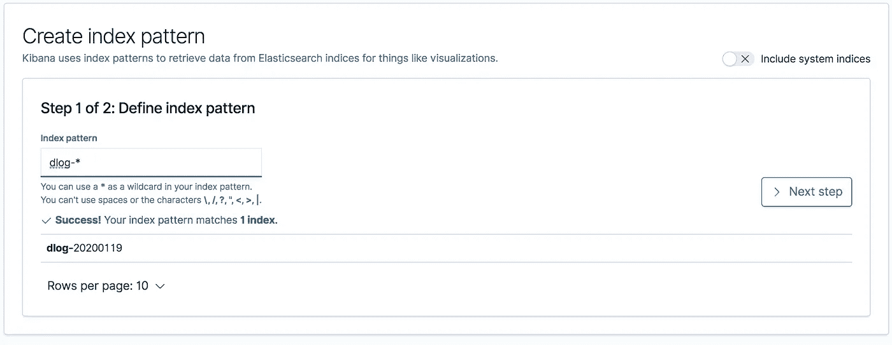
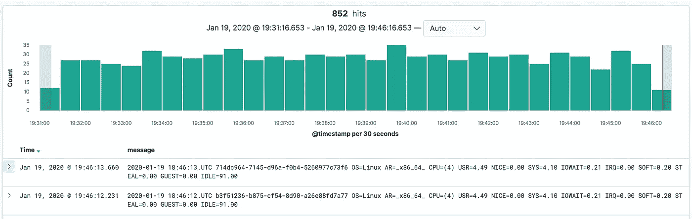
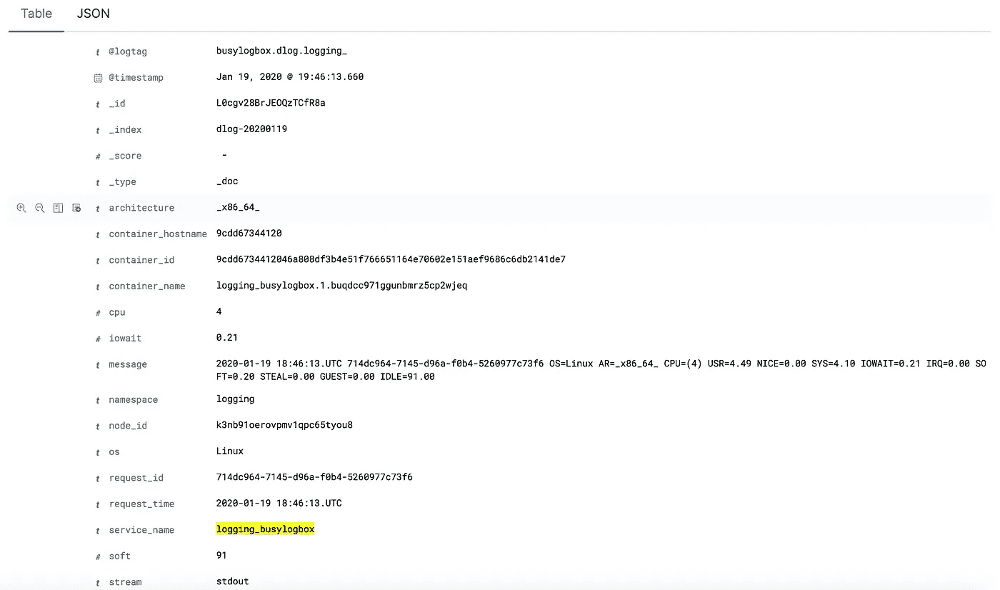

# 使用 FluentD 集中您的 Docker 日志记录

> 原文：<https://levelup.gitconnected.com/centralize-your-docker-logging-with-fluentd-a2b7e0a379ce>

## 集中记录

## 使用 FluentD 开始将容器日志传送到集中的日志服务器


由[休伯特·纽菲尔德](https://unsplash.com/@htn_films?utm_source=medium&utm_medium=referral)在 [Unsplash](https://unsplash.com?utm_source=medium&utm_medium=referral) 拍摄的照片

在我的上一篇文章[中，我解释了如何使用 Syslog 为 Docker 服务实现一个集中的日志系统。所描述的方法仅适用于可用于构建基础设施的资源有一些限制或者运行现代测井系统有限制的情况。另一方面，目前有几种选择来构建一个集中的日志系统，其中之一是使用 Fluentd、Elasticsearch 和 Kibana，也称为 EFK 堆栈。](https://medium.com/@wshihadeh/docker-centralized-logging-with-syslog-97b9c147bd30)

[](https://medium.com/better-programming/docker-centralized-logging-with-syslog-97b9c147bd30) [## 使用 Syslog 集中您的 Docker 日志记录

### 了解我们的系统及其成功或失败的最佳方式是通过大量的日志记录

medium.com](https://medium.com/better-programming/docker-centralized-logging-with-syslog-97b9c147bd30) 

> Fluentd 是一个跨平台的开源数据收集软件项目，最初是在 Treasure Data 开发的。它主要是用 Ruby 编程语言编写的。[维基百科](https://en.wikipedia.org/wiki/Fluentd)

Fluentd 可用于收集应用程序日志并解析它们，以便发送到远程目的地(在我们的例子中，这将是 Elasticsearch 实例)或将日志存储在本地日志文件中。

在这篇文章中，我将演示如何在 Docker Swarm 中构建一个集中式日志系统，并使用 Fluentd 解析应用程序日志。

## 测井堆栈应用:

**演示应用**

我们需要部署的第一个应用程序是演示应用程序，它模拟为运行在集群中的服务生成日志。该应用程序可以是任何能够作为 docker 群服务运行并向 STDOUT 写入日志的应用程序。出于简单的原因，我为一个轻量级容器准备了一个 Docker 映像，该容器生成描述当前系统状态的日志消息。该容器的 Docker 图像是`wshihadeh/busylogbox`。这个应用程序将生成如下所示的日志。

应用程序背后的逻辑如下所示

**弹性搜索**

栈需要的第二个应用程序是 Elasticsearch。这个应用程序将作为日志和日志索引的数据库。换句话说，我们将配置`FluentD`将日志转发给 Elasticsearch 实例，由服务存储和索引。Elasticsearch 允许查看和查找基于所有可用属性的日志。我将使用官方 Docker 图像`elastic/elasticsearch:7.5.1`来部署服务。

**基巴纳**

这个应用程序为我们提供了一个简单而直观的 web 界面来连接到 Elasticsearch 服务，查看日志，查询日志，使用多种类型的图表和更多功能来可视化日志。为了部署 Kibana，我将使用最新的官方 Docker 图片`elastic/kibana:7.5.1`。

**流体化**

我们将使用 Fluentd 来收集应用程序日志，解析它们，然后将它们转发给 Elatsicsearch 实例。为了实现这个目标，我决定构建一个 Docker 映像，其中包含运行 Fluentd 和解析日志所需的所有库和配置。下面是转换 Flunetd 配置和构建 Docker 映像的逐步说明。

**流体配置**

FlunetD 配置中的第一部分是源部分，该部分定义了将由 Flunetd 解析的日志文件。在 docker 世界中，容器被期望将日志写到容器的 **STDOUT** 中，Docker 还提供了一种为每个容器配置日志驱动程序的方法。这意味着我们可以配置 docker 将日志直接转发到 Fluentd 实例，然后使用 **forward source 部分配置 Fluentd，**但是，我不喜欢这种想法，原因如下:

*   Docker 集群上的命令行将不提供日志。
*   如果 Flunetd 服务关闭，会有丢失一些日志的风险。

出于以上原因，我建议继续使用 Docker 默认日志驱动程序`json-file`，并使用一个**尾源部分。**默认情况下，每个 docker 容器都会在下面的路径下有一个日志文件**/var/lib/Docker/containers**该文件中的日志与发送到 Docker 容器的 STDOUT 的日志相同，也与使用`docker logs`命令显示的日志相同。下面是指示 Flunetd 开始跟踪所有部署的 docker 容器的日志文件所需的配置，并简要描述了配置中使用的最重要的键

*   **@type** :该属性定义了输入插件的类型，如上所述 Flunetd 支持多个[输入插件](https://docs.fluentd.org/input)。
*   **@id** :代表输入源的唯一标识符。
*   **路径**:要读取的文件的路径。
*   **位置文件**:位置文件的路径。用于存储最后一次读取位置的文件。
*   **标签**:用于标记来自该输入的日志消息的标签。
*   **格式**:输入数据的预期格式。

一旦配置了输入源，我们就可以开始处理日志消息并对这些消息执行操作。我通常做的第一件事是将 Docker 元数据添加到日志消息中，比如服务名称空间、服务名称和容器名称。这个任务可以使用 [docker_metadata](https://github.com/wshihadeh/fluent-plugin-filter-docker_metadata) 插件来完成。下面是将这些属性附加到从定义的输入源读取的所有日志消息所需的配置(标记是选择这些日志的关键)。

下一步是根据属性对日志进行分类，以便能够单独处理它们。在 swarm 集群托管具有不同日志格式的应用程序，并且需要不同地解析来自这些应用程序的日志的情况下，这是非常重要的一步。这也适用于我们试图构建的堆栈，因为上述每个应用程序都有不同的日志格式，因此我们需要分别处理它们。为了简单起见，我决定只解析和转发演示应用程序的日志。来自其他应用程序的日志将被忽略。下面是我用来根据 Docker 属性`container_name`对日志进行分类的配置。如图所示，`busylogbox`日志将被标记为`row.busyboxlog.*`标签，而其他应用程序的日志将被标记为`ignore.dlog`。

接下来，我们需要处理应用程序的日志。一方面，我们会忽略所有带有`ignore.**`标签的日志消息。

另一方面，需要解析`busylogbox`日志，并从日志消息中提取更多的属性，以便能够在 Kibana 中使用它们，并基于提取的属性构建图表和可视化。为了完成这个任务，我将使用`record_reformer`插件来修改日志消息并给消息添加属性。此外，需要 Ruby Regex 来提取每个属性的值。

一旦我们完成了对应用程序日志消息的解析，我们就可以对日志消息执行最终检查，以删除所有空属性并为已定义的属性提供默认值。以下是可用于完成此任务的配置。

最后一步是配置 Flunetd 将日志转发给 Elasticsearch 实例。这个任务可以通过使用 Elasticsearch 插件来完成，下面是实现 forward 特性所需的配置。

在一段时间内与 Elasticsearch 的连接不可用的情况下，配置缓冲区对于不断重试向 Elasticsearch 发送日志非常重要。在这些情况下，Flunetd 会将日志消息写入定义的缓冲区，并不断尝试将这些日志发送到 Elasticsearch 实例。

**建立基础码头工人形象**

现在我们已经完成了 Fluentd 配置的编写，下一步是将 Fluentd 服务部署到 docker swarm。因此，我们首先需要构建一个定制的 docker 映像，其中包含解析日志所需的所有依赖项(Flunetd 插件和配置)。

由于安装这些库和插件需要一些时间，我决定构建一个包含这些库的 Fluentd 基础映像，然后使用这个基础映像构建 Fluentd docker 映像来收集日志。

上述 Docker 文件用于生成基于官方 Fluentd Docker 图像`fluent/fluentd:v1.2.2-onbuild`的 Fluentd 基本图像。基本映像的 docker 文件包括安装解析日志所需的插件的指令，例如**fluent-plugin-filter-docker _ metadata、**，这是一个将 docker 元数据附加到记录的消息的插件，例如容器名称，插件"**fluent-plugin-elasticsearch "**用于将日志转发到 elastic search 实例。

**构建浮动 Docker 图像**

使用 Flunetd 的基本映像可以非常容易、快速和简单地构建包含所需配置的 Flunetd Docker 映像。下面是这样一个映像的 docker 文件示例，它只负责将 Flunetd 配置和入口点包含到 docker 映像中。这种方法的主要好处是，在更改只影响 Flunetd 配置的情况下，构建 docker 映像会快得多。

**部署演示堆栈**

上面提到的所有应用程序都可以简单地使用下面的 Docker 堆栈文件部署到 Swarm 集群。下面的堆栈文件包括 Fluentd、Busylogbox、Elasticsearch 和 Kibana 的服务定义。关于 Fluentd 配置的一个重要注意事项是，需要使用`global`模式部署服务，以确保我们在每个 Docker swarm 主机上部署 Fluentd 容器，以便从这些节点上的所有容器中收集日志。

通过在 Docker Swarm manager 节点上执行下面的命令，可以简单地部署上面的堆栈。

```
$ docker stack deploy -c docker-stack-fke.yml logging
```

**查看基巴纳的日志**

一旦部署了服务，并且 Elasicsearch 和 Kibana 是健康的和可访问的，我们就可以通过配置 Kibana 来查看日志。为此，我们需要在以下 URL `[http://127.0.0.1:5601](http://127.0.0.1:5601.)`下连接到 Kibana web 界面。然后添加一个新的索引对象，如下图所示



一旦创建了索引，搜索页面中的日志将是可行的，您可以开始基于解析的属性过滤日志



如上图所示，经过解析的属性将出现在 Kibana web 界面中，最终用户可以根据这些属性过滤日志、构建可视化、图表和仪表板。

**结论**

系统日志不是实现集中式日志记录系统的唯一方式😆事实上，还有其他几种选择来实现它。Fluentd 结合 Elasticsearch 和 Kibana 被认为是构建集中式日志系统的另一种方法。此外，Fluentd 为我们提供了一种从日志消息中分析、解析和提取属性的简单方法，因此基于这些属性可视化和查询日志变得更加容易。