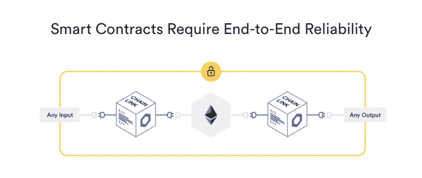
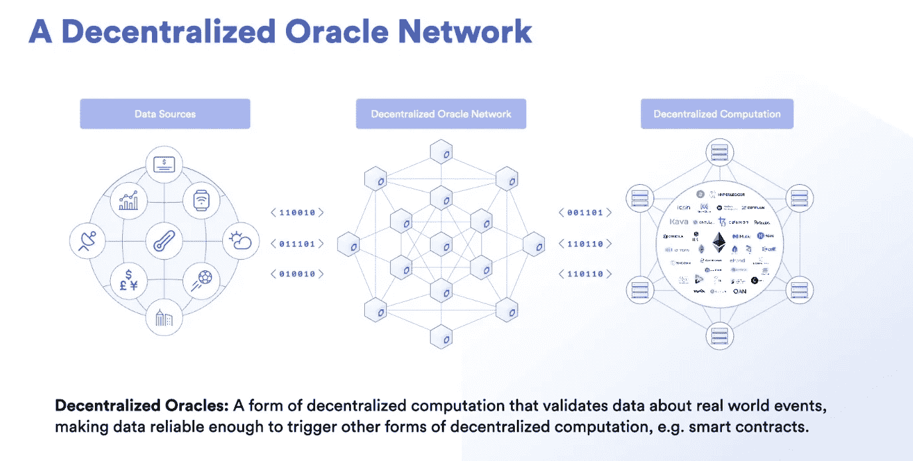

# 集中式和分散式系统最终被“连锁”

> 原文：<https://levelup.gitconnected.com/centralized-and-decentralized-systems-finally-get-chained-ba702dea972>

## 什么是 Chainlink，它与其他加密货币有何不同

照片由 [Unsplash](https://unsplash.com/s/photos/connection?utm_source=unsplash&utm_medium=referral&utm_content=creditCopyText) 上的 [israel palacio](https://unsplash.com/@othentikisra?utm_source=unsplash&utm_medium=referral&utm_content=creditCopyText) 拍摄

虽然比特币和以太币继续在相对狭窄的范围内交易，但替代币的价值每天都在飙升。我听到你问什么是代用币？嗯，除了比特币之外的任何加密货币。最近头条新闻中的一个另类硬币是 Chainlink。

大多数加密货币通过令牌化发挥作用，因此仅被视为一种投资。比特币被视为一种货币代币，它存储的唯一价值是双方之间的交易。

> [令牌化](https://www.iisd.org/library/tokenization-infrastructure-blockchain-based-solution-financing-sustainable-infrastructure#:~:text=Tokenization%20is%20the%20digitalization%20of,tokens%20in%20a%20frictionless%20manner.)是资产的数字化，其中每个令牌代表底层基础设施项目的一部分的所有权。

## 那么，所有这些区块链的麻烦只是为了买一个 frappe？

嗯，没有。

比特币是一个经典的例子，它能够以最安全的方式进行交易，不依赖第三方。这使得交易更加可信，并且不受任何个人的控制。

区块链的一个更高级的用例是[智能合同](https://blog.chain.link/what-is-a-smart-contract-and-why-it-is-a-superior-form-of-digital-agreement/)，它向双方提供信任，即合同条款将得到满足。

没有传统互联网上的智能合同，双方依靠第三方(通常是盈利性公司)来执行合同条款。例如，你从亚马逊上的一个卖家那里购买了一本书，现在公司有责任确保卖家收到付款，客户收到购买的商品。

> 智能契约专注于将业务逻辑(契约)从可能根据条款执行的概率状态转移到保证根据条款执行的确定状态。

## 好了，基础知识结束了，现在让我们看看链环

智能合同需要来自多个链外来源(集中式系统)的数据来执行程序。**这些链外资源被称为 oracles，它们为 smart contracts 提供输入，因为它们的本质是集中式的，它们否定了分散式系统的好处。这是甲骨文的问题。**

来源:[链环](https://chain.link/)

Chainlink 是传统方和智能合约之间的一个去中心化的中间代理，它试图解决 Oracle 问题。再说一次，这和甲骨文科技公司没有任何关系。

这就是为什么 Chainlink 是不同的，并在头条新闻。大多数区块链网络的主要目标是创建分散的智能合同或发展分散的银行。Chainlink 试图帮助双方，中央机构和分散系统。

它有自己的令牌 LINK，用来奖励节点操作者提供可靠的防篡改数据作为输入和输出。不像比特币，令牌被授予解决一个无用的数学难题，链接被授予节点以认证传入和传出的数据。这样，就不会浪费计算能力。**这些链接令牌的功能相当于木桩；如果任何节点(oracle)未能满足合同要求/规范，则从它们那里收回链接并返回给合同创建者。**

## 链环神谕看起来像什么

来源:[链环](https://chain.link/)

*   **分散式 Oracle-**chain link 使用一组[抗 Sybil】分散式 Oracle 来验证来自离线系统的数据。只有当相同的数据被多个链接验证时，才会触发智能合约。](https://www.geeksforgeeks.org/sybil-attack/)
*   **质量节点-** 智能合同创建者可以配置这些 oracles 的安全性。一些用例需要高度分散，在这种情况下，节点质量可能会有所不同。有时节点质量比分散化更重要，在这种情况下，契约创建者可以选择分散化。
*   **加密经济安全-**chain link 中的甲骨文有提供防篡改数据的动机，智能合约的分配基于它们的性能。这种机制激励节点提供高质量的数据，从而提高网络的整体安全性和可靠性。
*   **纵深防御-** 系列防御机制分层维护安全，如果前一个机制被破坏，下一个机制将停止攻击。Chainlink 使用各种机制，如零知识证明(ZKP)和可信执行环境(TEEs)
*   **有保证的质量数据-** Chainlink 使用链上服务协议来确保质量数据将按照用户的要求交付给用户。这包括在特定时间段、频率或智能合约创建者应用程序所需的任何其他规范内交付数据。

Chainlink 专门从事从外链源到运行智能合同的区块链网络的高质量数据传输，反之亦然。外链来源可以是从银行到游戏公司的任何东西，同样，任何智能合同平台，如以太坊或 Cardano，都可以使用。

我发现了一篇由 Alexander Tsankov 写的关于为什么 Oracle 问题不是问题的精彩文章。这很有趣。看看这个。

 [## “甲骨文问题”不是一个问题，为什么智能合同让保险对每个人都更好。

### 对智能合约有用性的众多批评之一就是众所周知的甲骨文问题。简单地说，因为…

medium.com](https://medium.com/@antsankov/the-oracle-problem-isnt-a-problem-and-why-smart-contracts-makes-insurance-better-for-everyone-8c979f09851c) 

# 资源和参考资料

[YouTube 上 Chainlink 的视频](https://www.youtube.com/watch?v=ufVyX7JDCgg)

[](https://cointelegraph.com/news/chainlink-link-becomes-the-tesla-of-cryptocurrency-whats-next?__cf_chl_captcha_tk__=99a9bcf10948bc07ef2b680acfd2191a07e0c3ba-1594755528-0-Af2YaAdBGczfIZMqegRytotm6jxfjED_QkzTsf_qveozjgJmCZ0-dz-zEyGH0xXd1eEE4KRW_8pPP4CT2IfvqjO5oO-Mq34XRFCSDBwSyzsQpoQ6uiAtpJYF7yyxBV6x2emg_00xvBIDZgxOXX6ty1PPjH3XLzRNhTQGbkf1I9US7Q4F5L1dBng0Avkxd8jttRgsBvfZYfHQ7PKtRyD5gA7sj4iU9RxRoyCn_7NULRMMDpitrMdI13-iu-f760TtEh5o0BItrsDcwCtShqhfvB8Q6aeCk4JZ57U_KUs8LJ-3Rwg-gk0OXyj9mOQkR9CDuto_2r6F-Wcv1-_UJaSJZSfDYFqU3tca9TpHNA04b62ej26JMcelXTaRhh43B0lSJ-NvHGmYpN3RBPP8zLRqka7GCiu-Rv-XgZb-jp3xkYZmd7gwrpN5yJR1nHc91F94AnC7ku2lzikIqiT79VNW5LjKwlKza8rinblhycpbARz_lJCAXpNkHV-aZxz6UEwxV40fbwBI-2JwSsuAMDvxzbm2N9MJpju-dAKAlwszaTN3roJKZ7Ud0tT2fxSSR4X7Gt_8oZ_F3TZjPgbeBIbYjkE) [## Chainlink(链接)成为加密货币的‘特斯拉’——下一步是什么？

### 随着比特币(BTC)价格继续在收紧的区间内交易，替代比特币市场一直在推高每…

cointelegraph.com](https://cointelegraph.com/news/chainlink-link-becomes-the-tesla-of-cryptocurrency-whats-next?__cf_chl_captcha_tk__=99a9bcf10948bc07ef2b680acfd2191a07e0c3ba-1594755528-0-Af2YaAdBGczfIZMqegRytotm6jxfjED_QkzTsf_qveozjgJmCZ0-dz-zEyGH0xXd1eEE4KRW_8pPP4CT2IfvqjO5oO-Mq34XRFCSDBwSyzsQpoQ6uiAtpJYF7yyxBV6x2emg_00xvBIDZgxOXX6ty1PPjH3XLzRNhTQGbkf1I9US7Q4F5L1dBng0Avkxd8jttRgsBvfZYfHQ7PKtRyD5gA7sj4iU9RxRoyCn_7NULRMMDpitrMdI13-iu-f760TtEh5o0BItrsDcwCtShqhfvB8Q6aeCk4JZ57U_KUs8LJ-3Rwg-gk0OXyj9mOQkR9CDuto_2r6F-Wcv1-_UJaSJZSfDYFqU3tca9TpHNA04b62ej26JMcelXTaRhh43B0lSJ-NvHGmYpN3RBPP8zLRqka7GCiu-Rv-XgZb-jp3xkYZmd7gwrpN5yJR1nHc91F94AnC7ku2lzikIqiT79VNW5LjKwlKza8rinblhycpbARz_lJCAXpNkHV-aZxz6UEwxV40fbwBI-2JwSsuAMDvxzbm2N9MJpju-dAKAlwszaTN3roJKZ7Ud0tT2fxSSR4X7Gt_8oZ_F3TZjPgbeBIbYjkE)  [## 使用 Chainlink oracles 增强区块链智能合约的 44 种方式

### 从根本上说，合同定义了价值交换中多方之间的义务。感谢分布式…

博客.连锁.链接](https://blog.chain.link/44-ways-to-enhance-your-smart-contract-with-chainlink/)  [## “甲骨文问题”不是一个问题，为什么智能合同让保险对每个人都更好。

### 对智能合约有用性的众多批评之一就是众所周知的甲骨文问题。简单地说，因为…

medium.com](https://medium.com/@antsankov/the-oracle-problem-isnt-a-problem-and-why-smart-contracts-makes-insurance-better-for-everyone-8c979f09851c)  [## 什么是以太币:初学者终极指南

### 对于初学者来说，以太坊和以太坊令牌的整个概念会很快变得非常混乱…

blockgeeks.com](https://blockgeeks.com/guides/ethereum-token/) 

[https://blog . chain . link/what-a-smart-contract-and-why-it-a-superior-form-of-digital-agreement/](https://blog.chain.link/what-is-a-smart-contract-and-why-it-is-a-superior-form-of-digital-agreement/)