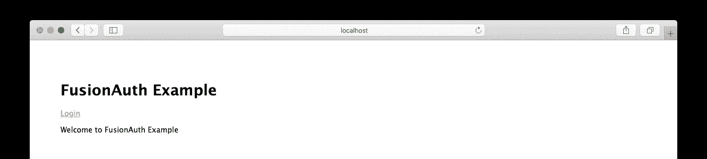

# 通过微服务网关进行集中认证

> 原文：<https://levelup.gitconnected.com/centralized-authentication-with-a-microservices-gateway-aa83f7211a1b>

在本文中，我们将为路由到两个不同微服务的网关 API 应用程序实现身份验证和授权。FusionAuth 将成为网关的认证服务器。

带有微服务的 API 网关是企业架构的常见模式。在本帖中，我们将假装我们正在为一个电子商务企业设置这个。我们的网关应用程序是一个中央 API，它将控制对产品目录服务和产品库存服务的访问。我们将允许客户访问公共端点，但要求对一些产品清单端点进行身份验证。

对于本文，我们需要一个正在运行的 FusionAuth 实例和三个简单的 Node/Express 应用程序。您可以下载本文的[示例项目](https://github.com/FusionAuth/fusionauth-example-node-services-gateway)，并相应地定制您的 FusionAuth 配置，或者您也可以从概念上遵循。

如果你想跟着做，先浏览一下 [5 分钟设置指南](https://fusionauth.io/docs/v1/tech/5-minute-setup-guide)会很有帮助，因为这将在 FusionAuth 中设置所需的用户和角色。

我们将在以下端口上运行四个应用程序:

*   FusionAuth: `9011`
*   网关应用:`3000`
*   产品目录服务:`3001`
*   产品库存服务:`3002`

我们还将涉及相当多的身份验证和授权，所以让我们简单地澄清一下这些术语的含义。

# 认证和授权

认证是对特定用户的验证。当用户登录时，他们对应用程序说，“嘿，这是真正的无名氏，让我进去。”应用程序验证他们的凭据，他们就可以访问。

在我们的 API gateway 中，我们将根据上面提到的 5 分钟设置指南使用 FusionAuth。我们将在稍后设置 API 网关应用程序时讨论具体的细节。

授权是我们验证特定用户(如 John Doe)有权访问我们系统的某些部分(如产品库存)的过程。在我们的电子商务生态系统中，我们将要求产品库存 API 的授权，但不要求基本产品 API 的授权，因为我们希望每个人都能访问后者。对于产品库存路径，我们将允许具有“管理员”角色的用户访问。

# 产品目录服务

我们将很快回到认证和授权，但是让我们开始构建我们的应用程序吧！我们将从服务开始，向网关应用程序发展。

# 设置 nodejs 产品目录

在开始之前，您需要安装 node(用版本 14 测试代码)。如果你没有安装，从[节点网站](https://nodejs.org/en/download/)下载。

将[项目](https://github.com/FusionAuth/fusionauth-example-node-services-gateway)克隆到您的本地计算机上，并将`cd`克隆到目录中。

您会注意到与我们的应用程序相对应的三个文件夹:`gateway`、`product-catalog`和`product-inventory`。继续操作`cd`进入`product-catalog`应用程序，并执行以下操作:

*   运行`npm install`来安装依赖项。
*   通过运行`npm start`启动应用程序。它应该在端口`3001`上运行，该端口在`bin/www`中定义。

既然您的应用程序已经启动并运行，您应该能够向它发送请求并获得响应。在一个单独的终端窗口中运行这个`curl`命令，您应该得到一个成功的响应，其中包含一个空的产品列表(`products: []`):

```
curl [http://localhost:3001/products](http://localhost:3001/products)
```

让我们打开它的引擎盖，查看给出我们`/products`路线的`routes/index.js`文件。

```
const express = require('express');
const router = express.Router();router.get('/products', function(req, res, next) {
  res.json('products: []')
});router.get('/products/:id', function(req, res, next) {
  res.json(`product: ${req.params.id}`)
});module.exports = router;
```

我们已经创建了两条基本路线，`/products`和`/products/:id`，因此我们可以获得产品列表和单个产品。显然，对于真正的微服务，这些路由将从数据存储中请求产品信息。现在，前者返回一个空数组`[]`，后者返回请求的产品 id。

尝试修改您的 curl 请求以添加一个产品 ID，请注意，响应将指示您所请求的特定 ID。

产品目录服务已经准备就绪！

# 产品库存服务

打开另一个终端窗口，进入`product-inventory`文件夹。运行`npm install`安装所需的依赖项。

下面是我们的产品库存服务的样子(在`routes/index.js`):

```
const express = require('express');
const router = express.Router();router.get('/branches/:id/products', function(req, res, next) {
  const roles = req.headers.roles;
  if (roles && roles.includes('admin')) {
    res.json(`Products for branch #${req.params.id}`);
  } else {
    res.redirect(403, 'http://localhost:3000');
    return;
  }
});module.exports = router;
```

在这项服务中，我们只有一条路线，为特定的商店或分店获取产品。但是，请注意，我们是基于在`roles`头中包含的`admin`角色来允许(或拒绝)访问的。API 网关应用程序将负责将这些数据传递给我们的产品库存服务。

如果您要启动服务(继续用`npm start`来做)并向`http://localhost:3002/branches/1/products`发送请求，您应该会收到一个 403。您可以通过添加一个值为`admin`的`roles`报头来模拟一个成功的响应:

```
curl -i -H "Accept: application/json" -H "Content-Type: application/json" -H "roles: admin" [http://localhost:3002/branches/1/products](http://localhost:3002/branches/1/products)
```

我们已经启动并运行了产品库存服务，并授权确保只有管理员才能访问分支机构的产品列表。在服务级别进行授权检查允许我们精确地实现授权。

# 微服务的 API 级认证

关于 API 级身份验证的简要说明。我们正在通过 API 网关实现集中认证。只有网关可以访问这些微服务。您可以在网络级别完成这项工作，或者使用某种形式的 API 级别的认证，比如一个 [API 密匙](https://microservice-api-patterns.org/patterns/quality/qualityManagementAndGovernance/APIKey)。对于我们来说，在本文中涉及的内容有点多，但这绝对是您在将微服务投入生产之前想要实现的事情。

# 网关应用程序

现在我们已经在端口`3001`和`3002`上运行了产品目录和产品库存服务，我们已经准备好处理 API 网关应用程序了。

在我们深入研究代码之前，让我们简要讨论一下为什么我们要创建自己的网关，而不是使用像 [Apigee](https://apigee.com/about/cp/api-gateway) 或[亚马逊的 API 网关](https://docs.aws.amazon.com/apigateway/latest/developerguide/welcome.html)这样的东西。我们当然可以走这条路，但在创建我们自己的网关时，我们有最大的灵活性。了解网关应用程序到底在做什么还有另外一个好处。

我们的网关应用程序简单而轻量。它主要充当路由器，将请求定向到适当的服务。但是，因为它是我们分布式服务的门户，所以它是集中式用户级身份验证检查的最佳位置。

# 集中式认证

集中身份验证是一种常见的模式，因为身份验证主要只是一种检查，以确保:

*   用户已登录
*   用户就是他们所说的那个人

在电子商务领域中的独立服务的上下文中，我们希望有这种集中的身份验证，以便在网关中进行一次检查就可以让用户访问服务，假设他们的凭据检查通过。在将路由转发给正确的服务之前，我们将使用 FusionAuth 来认证我们的每条路由。

# FusionAuth 设置

打开另一个终端窗口，进入`gateway` director，运行`npm install`。

前往[fusion auth 的 5 分钟设置指南](https://fusionauth.io/docs/v1/tech/5-minute-setup-guide)。在设置过程中，您配置的应用程序将链接到我们的网关应用程序，因此您可以将其命名为“gateway”。请注意，虽然 FusionAuth 支持多租户配置，但这里您是在默认租户中设置一切。

用您的 FusionAuth 应用程序的客户端 ID 和密码更新`gateway`目录中的`routes/index.js`,用您的客户端 ID 更新`views/index.pug`。然后通过运行`npm start`启动应用程序。

这个应用程序将是我们服务的网关(因此得名),所以在这一点上，我们应该只通过网关应用程序来访问我们的服务。运行`/products`的`curl`命令，但是在端口`3000`上运行，这将影响我们的网关应用程序。

```
curl [http://localhost:3000/products](http://localhost:3000/products)
```

现在，我们通过网关应用程序传输流量，并将其转发到产品目录服务。您可以通过打开正在运行的产品目录服务的终端窗口并检查日志来验证这一点。您应该会看到我们刚刚发送的请求到达该服务器:

```
GET /products 200
```

# 路线

让我们一步一步地浏览网关应用程序的`routes/index.js`文件。我们首先需要必要的文件并设置一个`FusionAuthClient`。我们还包括一个方便的认证中间件，我们将在我们的路线上使用。

```
// ...
const request = require('request');
const express = require('express');
const router = express.Router();
const {FusionAuthClient} = require('@fusionauth/typescript-client');
const clientId = [YOUR_CLIENT_ID];
const clientSecret = [YOUR_CLIENT_SECRET];
const client = new FusionAuthClient('noapikeyneeded', 'http://localhost:9011');
const checkAuthentication = require('../middleware');
// ...
```

我们的网关应用程序以及我们的服务都基于[fusionauth-example-node](https://github.com/FusionAuth/fusionauth-example-node)项目，该项目为我们提供了与 fusion auth 进行交互的基本 UI(在根处)。我们也有 OAuth 重定向的路由:

```
// ...
/* GET home page. */
router.get('/', function (req, res, next) {
  const stateValue = Math.random().toString(36).substring(2,15) + Math.random().toString(36).substring(2,15) + Math.random().toString(36).substring(2,15) + Math.random().toString(36).substring(2,15) + Math.random().toString(36).substring(2,15) + Math.random().toString(36).substring(2,15);
  req.session.stateValue = stateValue
  res.render('index', {user: req.session.user, stateValue: stateValue, title: 'FusionAuth Example'});
});/* OAuth return from FusionAuth */
router.get('/oauth-redirect', function (req, res, next) {
  // This code stores the user in a server-side session
  const stateFromServer = req.query.state;
  if (stateFromServer !== req.session.stateValue) {
    console.log("State doesn't match. uh-oh.");
    console.log("Saw: "+stateFromServer+ ", but expected: "+req.session.stateValue);
    res.redirect(302, '/');
    return;
  }
  client.exchangeOAuthCodeForAccessToken(req.query.code,
                                         clientId,
                                         clientSecret,
                                         'http://localhost:3000/oauth-redirect')
      .then((response) => {
        console.log(response.response.access_token);
        return client.retrieveUserUsingJWT(response.response.access_token);
      })
      .then((response) => {
        req.session.user = response.response.user;
      })
      .then((response) => {
        res.redirect(302, '/');
      }).catch((err) => {console.log("in error"); console.error(JSON.stringify(err));});
});
// ...
```

此时，随着网关服务器的运行，您应该能够在浏览器中转至`http://localhost:3000`并看到以下内容:



如果我们的设置工作正常，您应该能够点击“登录”。使用您之前设置的用户登录 FusionAuth。您将看到一条“您好[您的姓名]”消息。

这个 UI 在 API 网关应用程序的典型使用中不是必需的，但它是一个简单的、可视化的方法，可以让我们演示成功的 OAuth 登录。

看看我们的`routes/index.js`文件的剩余部分，我们已经得到了转发到产品目录和产品库存服务的路线。

```
// ...
/* PRODUCT CATALOG ROUTES */
const productUrl = 'http://localhost:3001';router.get('/products', function(req, res, next) {
  request(`${productUrl}/products`).pipe(res);
});router.get('/products/:id', function(req, res, next) {
  request(`${productUrl}/products/${req.params.id}`).pipe(res);
});
// ...
```

这些路由是完全公开的，不需要端点级别的身份验证，因为我们希望客户和员工都能查看产品。我们想让他们买些东西，对吧？这些路由将转发到端口 3001 上的产品目录服务。不过，如果目录中有任何部分需要保护，我们已经构建了基础架构。

现在对于产品盘点路线，要在分支机构检索产品:

```
// ...
/* PRODUCT INVENTORY ROUTES */
router.get('/branches/:id/products', checkAuthentication, function(req, res, next) {
  const user = req.session.user;
  const options = {
    url: `http://localhost:3002/branches/${req.params.id}/products`,
    headers: { roles: user.registrations[0].roles }
  };
  request(options).pipe(res);
});
// ...
```

此路由将转发给我们的产品库存服务。`checkAuthentication`中间件可用于我们希望检查用户是否通过身份验证的任何路由；如果用户没有登录，它会将用户发送回根 URL。

使用您的浏览器(利用我们的 OAuth 凭据，因为我们已登录)，转到`http://localhost:3000/branches/1/products`。这是因为您在 [5 分钟设置指南](https://fusionauth.io/docs/v1/tech/5-minute-setup-guide)中设置的用户在 FusionAuth 中有一个`admin`角色，我们将该角色作为标题传递给产品库存服务。

# 结论

我们在这篇文章中谈到了很多。我们的目标是创建一个基本的电子商务生态系统，其中包含一个 API 网关应用程序和两个微服务，一个产品目录服务和一个产品清单服务。

对于 API 网关，我们利用 FusionAuth 进行集中身份验证和授权。然后，我们创建了两个服务的转发路由，能够将角色传递给服务。在服务本身中，我们实现了基于用户角色在端点级别允许或拒绝请求的能力。

如果您想进一步了解这一点，您可以:

*   添加更多用户和角色；例如，可以查看某个分支的产品的`branch-manager`角色。
*   构建产品和分支表，并让微服务返回动态数据。
*   构建应用程序以显示可用产品。

快乐编码！

*原文发表于* [*。*](https://fusionauth.io/blog/2020/09/15/microservices-gateway)