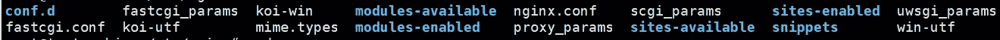
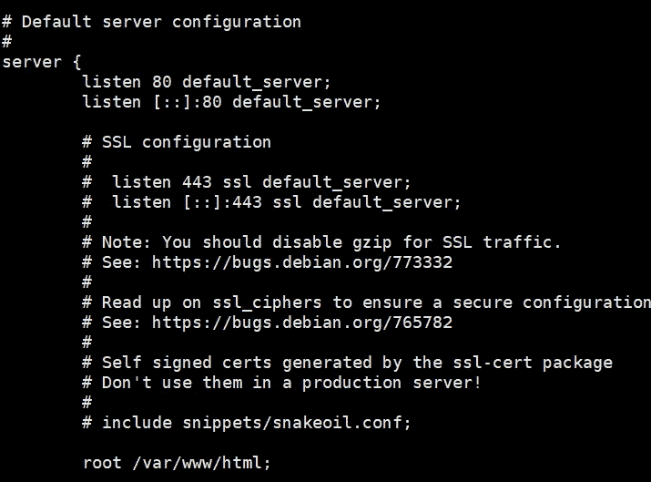
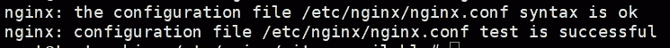
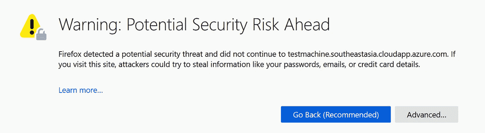
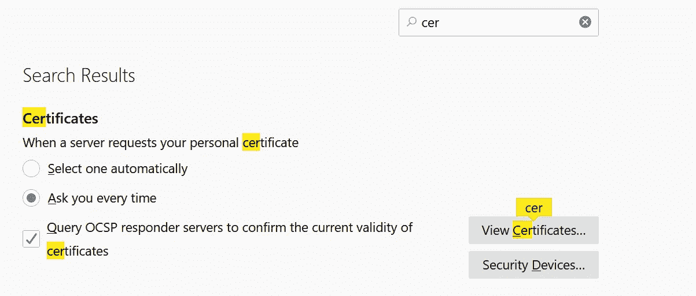
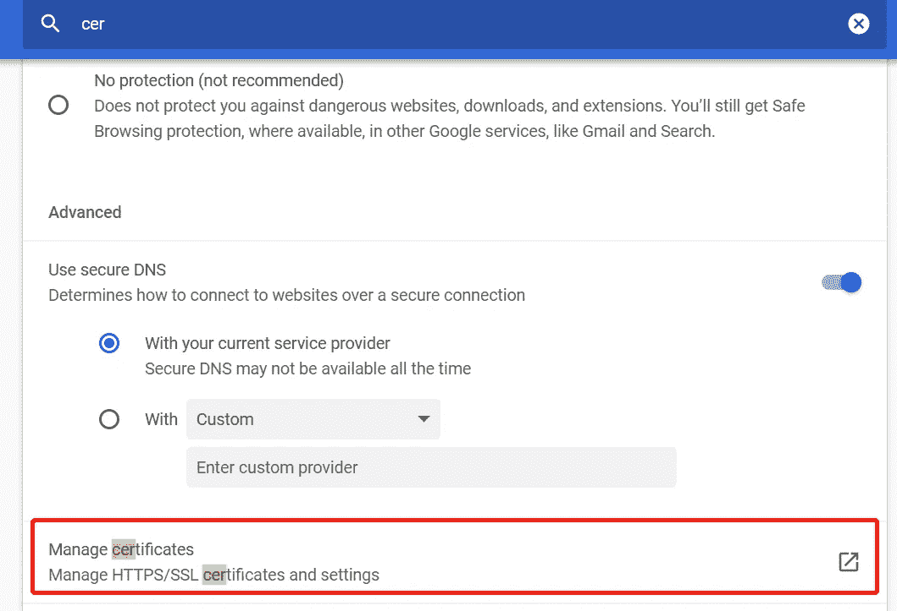
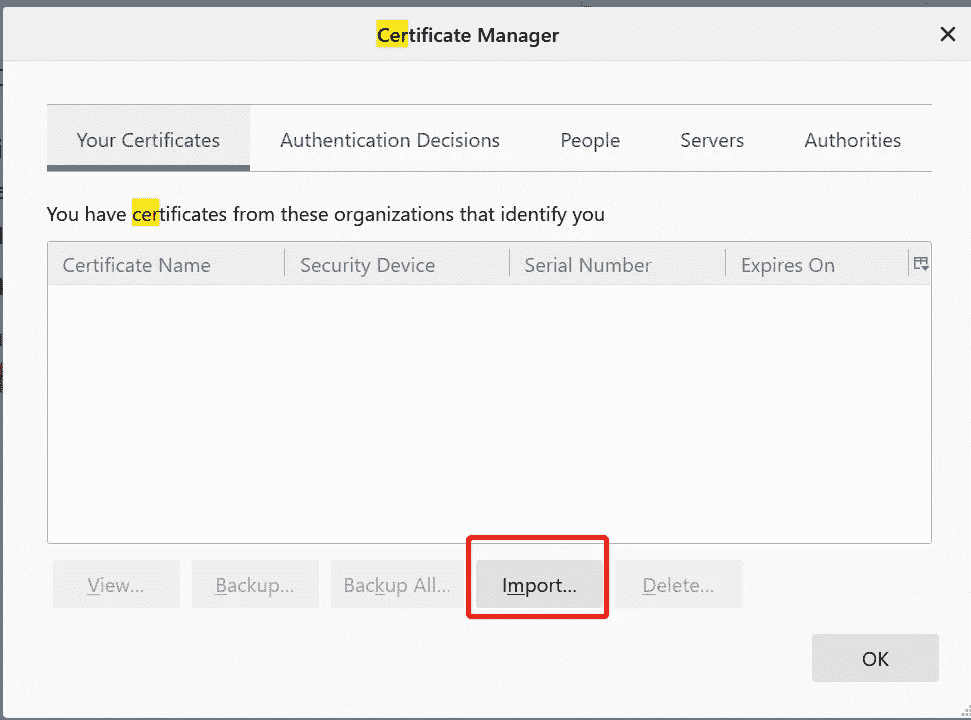

# Nginx 中基于证书的双向 TLS 认证

> 原文：<https://levelup.gitconnected.com/certificate-based-mutual-tls-authentication-with-nginx-57c7e693759d>

Flask 或 FastAPI 服务器的额外安全层


照片由[蒂埃拉·马略卡](https://unsplash.com/@tierramallorca?utm_source=unsplash&utm_medium=referral&utm_content=creditCopyText)在 [Unsplash](https://unsplash.com/s/photos/key?utm_source=unsplash&utm_medium=referral&utm_content=creditCopyText)

您将学习创建自签名服务器证书，以便作为 https 服务于您的 web 应用程序。稍后，您可以轻松地将它与您的服务器的证书颁发机构颁发的证书进行交换。

此外，本文还将介绍使用证书在服务器和客户机之间进行双向认证。用户需要在其浏览器中安装相关证书，然后才能访问您的 web 应用程序。这种方法为通常的用户名-密码身份验证提供了一种替代方法。

它主要用于工作场所或大学，在这些地方，用户只能使用安装了正确证书的公司计算机访问内部网站。一个主要优点是，在员工辞职或大学录取新生的情况下，不需要删除或创建密码。请记住，这种身份验证只是保护您的应用程序的另一种方式。事实上，您甚至可以将它与用户名-密码认证结合起来，以获得更好的安全性。这很大程度上取决于您的用例。

# 1.设置

我正在使用 Ubuntu 18.04.5 LTS(仿生海狸)为这个教程。您可以通过以下命令检查本地计算机的操作系统版本

```
cat /etc/os-release
```

在继续之前，请确保您的机器上已经安装了 Nginx 和 OpenSSL。

## Nginx

运行以下命令，检查您的机器上是否安装了 nginx。

```
nginx -v
```

## OpenSSL

至于 OpenSSL，你可以很容易地检查如下:

```
openssl version -a
```

如果没有安装，请参考以下链接进行安装。

*   [nginx](https://www.nginx.com/resources/wiki/start/topics/tutorials/install/)
*   [openssl](https://github.com/openssl/openssl)

让我们继续下一节，使用 OpenSSL 生成所需的证书和私钥。

# 2.OpenSSL

## 服务器证书和密钥

将工作目录更改为以下内容

```
/etc/ssl
```

您应该会看到以下文件和文件夹:

*   `certs` —包含标识各自证书颁发机构的所有证书。
*   `openssl.conf`—OpenSSL 的配置文件。
*   `private` —清空文件夹存储个人证书。

强烈建议将您的证书存储在这里，尽管您实际上可以将它存储在您喜欢的任何地方。在本教程中，我将创建一个名为`selfsigned`的新文件夹，并在其中生成证书。这使得我们以后可以很容易地清理它。

运行以下命令来生成服务器证书及其相应的私钥。我们将使用 X.509 证书数据管理，这是公钥证书的标准格式，其中包含与网站或组织相关的身份和信息的加密密钥对。

```
openssl req -x509 -nodes -days 365 -newkey rsa:2048 -keyout server.key -out server.crt
```

*   `req` —代表证书请求和证书生成实用程序。它将使用来自`openssl.conf`的配置。
*   `nodes` —代表`no DES`(密码术语)，而不是`nodes`(编程术语)。这意味着它将创建一个未加密的私钥。如果省略，它将提示输入密码。
*   `days 365` —确定证书有效期的天数。默认值为 30 天。在这种情况下，我指定了 365 天的有效期。
*   `newkey rsa:2048` —创建新的证书请求和新的私钥。接受`rsa:nbits`、`alg:file`、`param:file`、`algname:file`等形式的输入参数。对于本教程，我使用 2048 位的 rsa。
*   `keyout` —私钥的名称。
*   `out` —证书名称。

它会提示一些细节，只需一直按 enter 键直到结束。它将生成以下文件:

*   `server.crt` —您的服务器的证书。
*   `server.key` —服务器的私钥。

事实上，您现在可以使用这个自签名证书作为`https`来运行您的服务器。您不应将自签名证书用于生产服务器。

## 客户端证书和密钥

对于相互 TLS 身份验证，您需要客户端的证书和私钥。运行以下命令来生成它们。

```
openssl req -x509 -nodes -days 365 -newkey rsa:2048 -keyout client.key -out client.crt
```

同样，您应该获得以下证书和私钥

*   客户端. crt
*   客户端.密钥

下一步是将它们作为 PKCS12 文件组合在一起，以便您可以将它们导入到客户端的浏览器中进行相互 TLS 身份验证。它会提示您输入密码。只需单击 enter 即可创建不带密码的 PKCS12 文件。

```
openssl pkcs12 -export -out client.pfx -inkey client.key -in client.crt
```

## 用于检查和验证的额外 OpenSSL 命令

您可以使用以下命令来检查私钥

```
openssl rsa -in server.key -check
```

至于证书，可以按如下方式检查:

```
openssl x509 -in server.crt -text -noout
```

如果您创建了 PKCS12 文件，该文件通常以。pfx 或. p12，您可以通过以下命令检查内容

```
openssl pkcs12 -info -in client.pfx
```

# 3.Nginx

在本节中，我们将修改 nginx 中的配置，以支持 https 和相互 TLS 认证。一旦在中安装了 nginx，请转到下面的目录。

```
/etc/nginx
```

当您运行`ls`命令时，您应该会看到以下文件和目录。



我们将改变`sites-available`文件夹中的配置文件，而不是直接修改`nginx.conf`文件。将工作目录更改为文件夹

```
cd sites-available
```

您应该会看到一个名为`default`的文件。在您继续之前，让我们复制它，并将新的副本作为备份文件，以防出现任何问题。

```
cp default backup.conf
```

## https

当你打开`default`时，你应该会看到下面几行代码。



要为您的服务器启用 https，只需取消对以下行的注释

```
listen 443 ssl default_server;
listen [::]:443 ssl default_server;
```

并在它下面附加以下配置(相应地修改路径)

```
ssl_certificate         /etc/ssl/selfsigned/server.crt;
ssl_certificate_key     /etc/ssl/selfsigned/server.key;
```

如果您提供任何静态文件，也应该修改 root 设置。例如，我的 Flask 服务器位于以下位置

```
root /home/tester/wfng;
```

假设您的 Flask 服务器可以通过以下 URL 访问，

```
http://localhost:5000/
```

您可以通过 nginx 添加下面几行代码，轻松地为它创建一个反向代理

```
location / {
    proxy_pass [http://localhost:5000/](http://localhost:5000/);
 }
```

## 相互 TLS 身份验证

添加以下代码行，启用与 nginx 的相互 TLS 身份验证

```
ssl_client_certificate  /etc/ssl/selfsigned/client.crt;
ssl_verify_client       yes;
```

如果您有多个客户端证书，只需将它们连接成一个文件，如下所示:

```
cat cert1.crt cert2.crt > certs.pem
```

可能会出现这样的情况，您希望只为特定的路由启用相互 TLS 身份验证。在这种情况下，只需将`ssl_verify_client`更改为`optional`，并添加以下条件检查。

```
location /user {
    if ($ssl_client_verify != "SUCCESS") { return 403; }                           proxy_pass [http://localhost:5000/user](http://localhost:5000/user);
}
```

`$ssl_client_verify`返回以下结果:

*   `SUCCESS` —成功验证证书。
*   `FAILED:reason` —验证失败及失败原因。
*   `NONE` —如果证书不存在。

查看以下[要点](https://gist.github.com/wfng92/6d98413eddcf487f7ed077496ba93041)以获取`default`文件的示例。

完成后，下一步是通过以下命令验证您的配置文件，以确保没有错误。

```
nginx -t
```

如果测试成功，您将在终端上看到以下输出。



之后，您需要重新加载配置以使其生效。

```
nginx -s reload
```

或者，您也可以重新启动 nginx，而不是重新加载配置。

```
sudo systemctl restart nginx
```

# 4.浏览器

## https

现在，您可以通过相应的域或 IP 在浏览器中访问服务器。假设您正在访问一个不需要客户端身份验证的 URL，当您第一次访问它时，它应该会提示以下警告(根据您使用的浏览器而有所不同)。



作者图片

只需点击`Advance`和`Accept the Risk and Continue`。你应该到达你的服务器的主页。

## 相互 TLS 身份验证

至于相互 TLS 身份验证，您需要导入我们之前创建的 PKCS12。转到基于您的浏览器的选项或设置，并搜索证书。以下是 Firefox 的用户界面



作者图片

谷歌 Chrome 用户应该会看到下面的界面



作者图片

点击`View Certificate`，然后点击`Import`按钮



作者图片

它将提示输入与证书相关的密码。导入证书后，只需重新启动浏览器。当您再次访问该网址时，您的浏览器会提示您输入`User Identification Request`。接受它，你应该可以访问你的服务器。

# 结论

让我们回顾一下今天所学的内容。

我们首先简要介绍了相互 TLS 身份验证的优点。接下来，我们继续安装必要的模块，即 nginx 和 openssl。

我们还为客户机生成了一个证书和私钥，以便作为 https 服务。此外，我们还创建了另一套证书和私钥用于相互 TLS 认证。我们稍后将它组合起来，创建一个 PKCS12 文件，以便稍后导入到我们的浏览器中。

后来，我们继续根据我们的用例修改 nginx 中的配置文件。完成后，我们重启 nginx，并将适当的证书导入浏览器。现在，您应该能够直接从浏览器访问服务器了。

感谢你阅读这篇文章。希望在下一个教程中再见到你！

# 参考

1.  [Nginx 文档](http://nginx.org/en/docs/)
2.  [OpenSSL 文档](https://www.openssl.org/docs/)
3.  [OpenSSL Github](https://github.com/openssl/openssl)