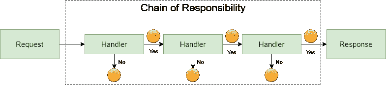
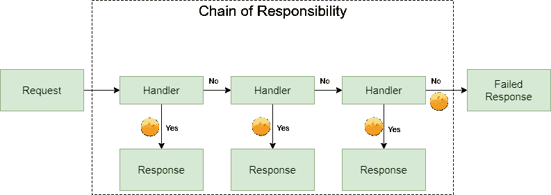
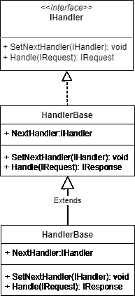
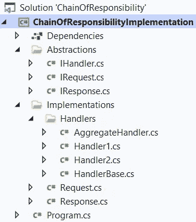
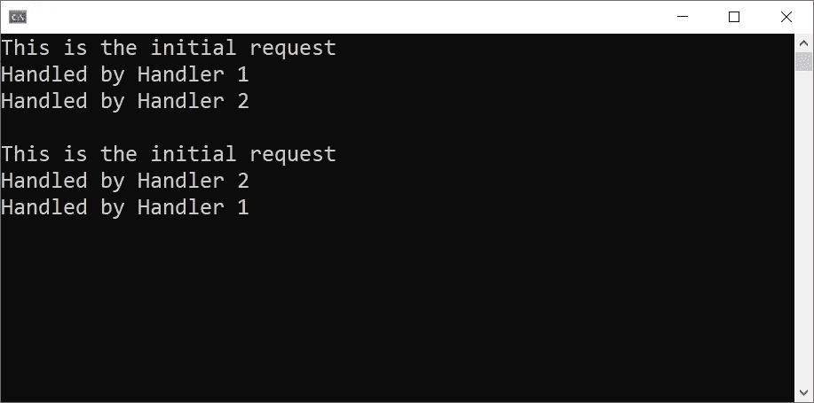
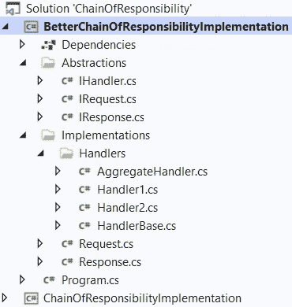

# 中的责任链设计模式。NET C#

> 原文：<https://levelup.gitconnected.com/chain-of-responsibility-design-pattern-in-net-c-666bb4dc2816>

## 设计模式

## 学习中的责任链设计模式。带有增强功能的. NET C#。

由 [Unsplash](https://unsplash.com/?utm_source=unsplash&utm_medium=referral&utm_content=creditCopyText) 上的 [Edge2Edge Media](https://unsplash.com/@edge2edgemedia?utm_source=unsplash&utm_medium=referral&utm_content=creditCopyText) 拍摄，由 [Ahmed Tarek](https://medium.com/@eng_ahmed.tarek) 调整

# 责任链设计模式定义

**责任链**设计模式是行为设计模式之一。

它允许通过处理程序链传递请求或对象。

一旦一个处理程序接收到一个请求，它就决定是处理这个请求还是把它传递给链中的下一个处理程序。

如果你已经有了一些 Web 开发的经验，很可能你听说过一个叫做**中间件**的东西。处理**中间件**部件的整个系统使用**责任链设计模式**。

 [## 🔥订阅艾哈迈德的时事通讯🔥

### 订阅艾哈迈德的时事通讯📰直接获得最佳实践、教程、提示、技巧和许多其他很酷的东西…

medium.com](https://medium.com/subscribe/@eng_ahmed.tarek) 

照片由[艾米丽·莫特](https://unsplash.com/@emilymorter?utm_source=unsplash&utm_medium=referral&utm_content=creditCopyText)在 [Unsplash](https://unsplash.com/?utm_source=unsplash&utm_medium=referral&utm_content=creditCopyText) 拍摄，由[艾哈迈德·塔雷克](https://medium.com/@eng_ahmed.tarek)调整

# 责任链设计模式的优势

好的，假设您有一个系统，需要对一个对象或一个传入的请求应用一系列步骤。您可能会想到将所有这些步骤应用到单个模块中，就像拥有一个庞大的方法，该方法通过所有步骤逐一运行对象或请求，并最终返回结果。

是的，这是可行的，但是，你知道在软件中，不仅仅是拥有可工作的代码，还有可维护和可扩展的代码。

如果你遵循这种方法，你最终会得到一个巨大的方法或模块，它做了太多的事情。此外，每次您需要扩展步骤时，您都必须重新访问这个模块或方法，并应用进一步的修改。所有这些最终会导致一个脆弱的系统。

然而，如果你实现了**责任链设计模式**，你将会得到一个模块化系统，在这个系统中你可以控制每一个已经尽可能做到最少的模块。

有人可能会争辩说，即使我们将这些步骤分成更小的模块，主模块最终也会使用和运行所有这些更小的模块，所以最终是一样的。

实际上，没有。是的，主模块将使用并运行所有较小的模块，因为最终这是我们需要实现的业务，然而，这不是关于是否执行某些逻辑，而是关于哪个模块负责执行哪个逻辑。

将整个大的业务规则和逻辑分割成较小的模块有助于控制，能够容易地维护、扩展、测试…

照片由 [Goh Rhy Yan](https://unsplash.com/@gohrhyyan?utm_source=unsplash&utm_medium=referral&utm_content=creditCopyText) 在 [Unsplash](https://unsplash.com/?utm_source=unsplash&utm_medium=referral&utm_content=creditCopyText) 上拍摄，由 [Ahmed Tarek](https://medium.com/@eng_ahmed.tarek) 调整

# 重要说明

我对**责任链设计模式**有一些担忧，我将在本文后面与您分享。然而，首先让我们了解一下基础知识。

# 责任链设计模式是如何工作的？

假设您希望处理程序按顺序处理您的请求，但是如果其中任何一个处理程序失败，您希望停止这个链并立即获得描述性的响应。

在这种情况下，图表如下所示:

失败快速责任链，图片由[艾哈迈德·塔里克](https://medium.com/@eng_ahmed.tarek)

这个过程如下:

1.  请求被传递给第一个处理程序。
2.  处理程序验证它是否能够处理请求。如果是，它处理请求并将其传递给下一个处理程序。如果没有，它将失败，并向调用者提供一些描述性的消息或响应。

然而，这并不是唯一的方法。可能您的需求有点不同，您只需要在第一个成功的处理程序之后有一个响应，不管它在链中的顺序是什么。

在这种情况下，图表如下所示:

最后一个责任链失败，图片由 [Ahmed Tarek](https://medium.com/@eng_ahmed.tarek) 拍摄

这个过程如下:

1.  请求被传递给第一个处理程序。
2.  处理程序验证它是否能够处理请求。如果是，它处理请求并向调用者返回一个成功的响应。如果没有，它将请求传递给下一个处理者。

然而，即使有不同的工作方式，我们也会有相同的类图，因为不同之处在于实现，而不是抽象。

责任链，图片由 [Ahmed Tarek](https://medium.com/@eng_ahmed.tarek) 提供

话虽如此，现在让我们继续使用一个简单的例子来实现**责任链设计模式**。

由 [Arnold Francisca](https://unsplash.com/@clark_fransa?utm_source=unsplash&utm_medium=referral&utm_content=creditCopyText) 在 [Unsplash](https://unsplash.com/?utm_source=unsplash&utm_medium=referral&utm_content=creditCopyText) 上拍摄，由 [Ahmed Tarek](https://medium.com/@eng_ahmed.tarek) 调整

# 实施**责任链设计模式**

在这个例子中，我们不打算为要实现的业务费心。

我们只是假设我们有一个通过一系列处理程序传递的请求，这样最终我们只有一个响应。

为了能够检查我们的实现是否工作正常，我们将使用一个字符串列表，每个处理程序都会扩展这个列表。

因此，我们将创建一个名为**" chain of responsibility "**的新解决方案，其中包含一个名为**" chain of responsibility implementation "**的**控制台应用程序项目**。

如果您按照本文接下来的部分中的步骤操作，您应该会得到这样的结果:

责任实施链，图片由 [Ahmed Tarek](https://medium.com/@eng_ahmed.tarek) 提供

## IHandler

我们在这里可以注意到:

1.  它是一个简单的接口，表示任何处理程序。
2.  我们定义了`void SetNextHandler(IHandler next)`来设置链中的下一个处理程序。
3.  我们定义了`IResponse Handle(IRequest request)`来实际处理请求。

## 我的请求

我们在这里可以注意到:

1.  这是一个代表任何请求的简单接口。
2.  我们定义了`int Id { get; }`。
3.  我们将`IReadOnlyCollection<string> Messages { get; }`定义为用于验证我们的解决方案的字符串列表。

## 我的回应

我们在这里可以注意到:

1.  这是一个表示任何响应的简单接口。
2.  我们将`IReadOnlyCollection<string> Messages { get; }`定义为用于验证我们的解决方案的字符串列表。

## 请求

我们在这里可以注意到:

1.  这是`IRequest`的一个简单实现。
2.  它是不可改变的。

## 反应

我们在这里可以注意到:

1.  这是`IResponse`的一个简单实现。
2.  它是不可改变的。

## 手柄底座

我们在这里可以注意到:

1.  它正在实现`IHandler`。
2.  我们定义了`protected IHandler NextHandler`来表示链中的下一个处理程序。

## 手柄 1

我们在这里可以注意到:

1.  它在延伸`HandlerBase`。
2.  它通过复制传入请求中的消息列表来准备新的消息列表，并通过消息“由处理程序 1 处理”来扩展它。
3.  如果设置了下一个处理程序，它调用它的`Handle`方法，用新的消息列表传递一个新创建的请求。
4.  否则，它只返回一个响应。
5.  注意，为了简单起见，我们没有在这里添加任何验证或处理失败的情况。然而，在现实世界中，这应该已经被处理了。

## 手柄 2

与`Handler1`相同，只是将消息“由处理者 **1** 处理”替换为“由处理者 **2** 处理”。

## AggregateHandler

我们在这里可以注意到:

1.  这是一个包装处理程序，它将由所有处理程序组成，然后负责通过正确调用每个处理程序的`SetNextHandler`方法来设置链。
2.  这比将这项工作留给或委托给主模块要好。
3.  它还扩展了`HandlerBase`,这样它就可以被用作一个标准的处理程序。

## 程序

我们在这里可以注意到:

1.  我们创建了一个初始请求。
2.  我们创建了一个`AggregateHandler`，依次传入`Handler1`和`Handler2`。
3.  然后将连接的消息列表写入控制台。
4.  然后，我们创建了一个`AggregateHandler`，依次传入`Handler2`和`Handler1`。
5.  然后将连接的消息列表写入控制台。

运行这个程序，您将得到以下结果:

运行 ResponsibilityImplementation 链的结果，图像由 [Ahmed Tarek](https://medium.com/@eng_ahmed.tarek) 拍摄

太好了，它正常工作了。

由 [Mikael Seegen](https://unsplash.com/@mikael_seegen?utm_source=unsplash&utm_medium=referral&utm_content=creditCopyText) 在 [Unsplash](https://unsplash.com/?utm_source=unsplash&utm_medium=referral&utm_content=creditCopyText) 上拍摄，由 [Ahmed Tarek](https://medium.com/@eng_ahmed.tarek) 调整

# 我对责任链设计模式的关注

如果您还记得，我已经在本文的前一部分告诉过您我有一个顾虑。我担心的是，按照这种设计，我们会有不止一个问题。

在我看来，我们会有以下问题:

1.  **经手人**做的事情太多。
2.  处理程序不仅提供它们自己的实现，还控制整个序列。
3.  每个**处理者**都可以决定用不同的方式做事。
4.  主模块完全不知道处理程序之间的跳跃中发生了什么。
5.  如果某个处理程序决定不调用下一个处理程序呢？可能是由于编码中的一个 bug？还是有猫腻？

此外，让我们假设处理程序实际上是第三方插件，最终用户可以根据自己的意愿添加和删除。在这种情况下，将完全控制权留在插件手中并不好。

因此，我实际上更喜欢在设计上应用一些修改来解决这些问题。

然而，我不确定在应用了这些修改之后，我们是否还能称之为责任链设计模式🤷‍♂️

由[沃尔坎·奥尔梅斯](https://unsplash.com/@volkanolmez?utm_source=unsplash&utm_medium=referral&utm_content=creditCopyText)在 [Unsplash](https://unsplash.com/?utm_source=unsplash&utm_medium=referral&utm_content=creditCopyText) 上拍摄，由[艾哈迈德·塔雷克](https://medium.com/@eng_ahmed.tarek)调整

# 更好地实现责任链设计模式

在这个实现中，我们要做的主要是将序列控制从**处理程序**中移除。

因此，我们将创建一个新的**控制台应用程序项目**，名为**“betterchainofrsibilityimplementation”**。

如果您按照本文接下来的部分中的步骤操作，您应该会得到这样的结果:

更好的责任链实施，图片作者 [Ahmed Tarek](https://medium.com/@eng_ahmed.tarek)

## IRequest 和 IResponse

和以前一样。

## IHandler

我们在这里可以注意到:

1.  移除了`void SetNextHandler(IHandler next)`。
2.  通过添加`IResponse accumulatedResponse = null`参数并将**请求**参数重命名为**原始请求**来更改`Handle`方法签名。
3.  如果处理程序需要检查应用于响应的先前累积的更改，新添加的`accumulatedResponse`参数可能会很有用。

## 请求和响应

和以前一样。

## 手柄底座

我们在这里可以注意到:

1.  移除了`protected IHandler NextHandler`。
2.  事实上，现在整个类都可以被移除，除非你在所有的处理程序之间有一些共同的实现。
3.  我们把它放在这里是为了演示。

## 手柄 1

我们在这里可以注意到:

1.  我们改变了处理程序处理请求的方式。
2.  现在它只是创建一个新的消息列表并返回一个新的响应。
3.  它不知道上一个或下一个处理程序的任何信息。
4.  注意，为了简单起见，我们没有在这里添加任何验证或处理失败的情况。然而，在现实世界中，这应该已经被处理了。

## 手柄 2

与`Handler1`相同，只是将消息“由处理者 **1** 处理”替换为“由处理者 **2** 处理”。

## AggregateHandler

我们在这里可以注意到:

1.  这里的处理程序仍然充当包装处理程序，它将由所有处理程序组成，然后负责正确设置链。
2.  这里改变的是它调用和使用处理程序的方式。
3.  注意，为了简单起见，我们没有在这里添加任何验证或处理失败的情况。然而，在现实世界中，这应该已经被处理了。

## 程序

和以前一样。

运行这个程序，您将得到以下结果:

运行 betterchainofresponsibility implementation 的结果，图片由 [Ahmed Tarek](https://medium.com/@eng_ahmed.tarek) 提供

太好了，它正常工作了。

由 [Grégoire Bertaud](https://unsplash.com/@sirtook?utm_source=unsplash&utm_medium=referral&utm_content=creditCopyText) 在 [Unsplash](https://unsplash.com/?utm_source=unsplash&utm_medium=referral&utm_content=creditCopyText) 上拍摄，由 [Ahmed Tarek](https://medium.com/@eng_ahmed.tarek) 调整

# 最后的话

现在你理解了**责任链设计模式**并且你知道如何增强设计。现在该由你决定走哪条路了。

我给你的建议是仍然搜索关于**责任链设计模式**的其他资源。这将有助于你更好地理解它，也许你会遇到别人提到的一些有用的提示或技巧。

# 希望这些内容对你有用。如果您想支持:

如果你还不是**中介**会员，你可以使用 [**我的推荐链接**](https://medium.com/@eng_ahmed.tarek/membership) ，这样我可以从**中介**那里得到你的一部分费用，你不需要支付任何额外费用。订阅 [**我的简讯**](https://medium.com/subscribe/@eng_ahmed.tarek) 将最佳实践、教程、提示、技巧和许多其他很酷的东西直接发送到您的收件箱。

# 其他资源

这些是你可能会发现有用的其他资源。

 [## 中的分层树形数据。NET C#

### 为分层树形数据及其相关操作设计一个数据结构。NET C#

levelup.gitconnected.com](/hierarchical-tree-form-data-in-net-c-d2a868fcb756)  [## 将参数传递给. NET C#方法

### 向. NET C#方法传递参数的不同方式。

levelup.gitconnected.com](/passing-parameters-to-a-net-c-method-388badb7c095)  [## 中的生成器设计模式。NET C#

### 一步一步的指南，从零开始开发一个流畅的 API。NET C#使用生成器设计模式。

levelup.gitconnected.com](/builder-design-pattern-in-net-c-bbf11c891548)  [## 当实现影响抽象时

### 关于实现的知识会影响抽象设计吗？

levelup.gitconnected.com](/when-implementations-affect-abstractions-1bb2adc808d1) 