# 挑战 003 —只有一个介绍部分的 Huddle 登录页面🚀。

> 原文：<https://levelup.gitconnected.com/challenge-003-huddle-landing-page-with-a-single-introductory-section-6301c1bf30c3>

如果你是第一次访客，欢迎！🤩首先，让我们从今天文章的一个小介绍开始。👇

你们中的一些人可能知道，两周前，我转向了 UI 开发，并开始使用 [HTML](https://uxplanet.org/beginners-guide-to-html-and-css-letss-start-off-with-html-3d7ffd035182) **和** [CSS](https://bootcamp.uxdesign.cc/beginners-guide-to-css-9bc8298985c0) 进行挑战。因此，我们开始了挑战 001，挑战名为 [NFT 卡组件](/lets-take-a-pivot-to-ui-dev-challenge-no-01-2459e9e0527c)，至于挑战 002，我们做了一个挑战名为[单一价格网格组件](https://uxplanet.org/lets-move-to-the-next-challenge-challenge-002-ad33b79cd544)。话虽如此，我们还是在第三天进行了接触。🤩

至于今天的挑战，我们将做另一个来自[前端导师](https://www.frontendmentor.io/challenges/huddle-landing-page-with-a-single-introductory-section-B_2Wvxgi0)的简单挑战。👉 **Challenge 003** — **只有一个介绍部分的 Huddle 登录页面。**

***预注***🧿***:-****我们做这个挑战，是利用前两次挑战中所学的成分来刷新我们的记忆。*

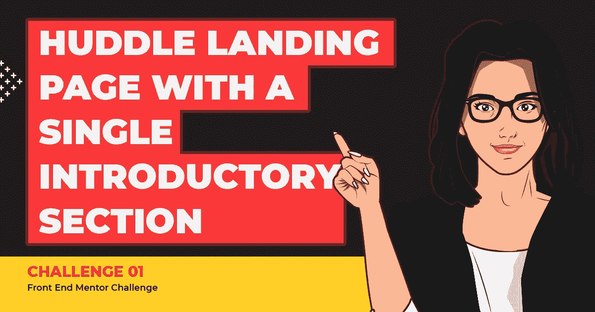

像往常一样，让我们用一句激励性的话来开始这个挑战。👇*(这是帮助我继续前进的名言之一，我与你分享它，希望它也能帮助你们继续前进)*

> 在末尾休息，而不是在中间
> 
> —科比·布莱恩特

有了这个良好的开端，与其中途放弃或休息，不如让我们进入下一个挑战(挑战 03)，继续我们已经开始的工作，带着学习新东西的信念和目的，好吗？？💪

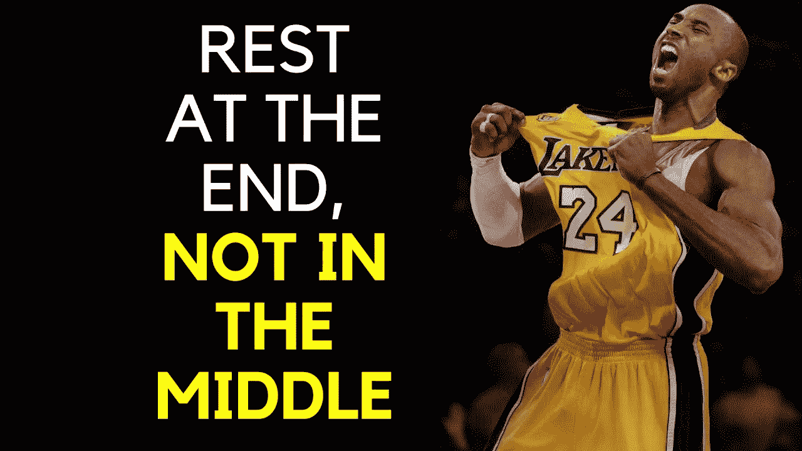

*在开始之前，让我强调一个小注意:* -
对你们中的一些人来说，这可能是一个闭着眼睛也能完成的挑战，对你们中的一些人来说，这可能是一个学习新事物的挑战，对你们中的一些人来说，这可能是 UI 开发的初级步骤。因此，这篇文章是写给任何喜欢学习和提高技能的人，从专业人士到初学者。🤓有了那个…..

# 让挑战开始💣


## 🔸挑战名称:-

[只有一个介绍部分的 Huddle 登录页面](https://www.frontendmentor.io/challenges/huddle-landing-page-with-a-single-introductory-section-B_2Wvxgi0)

## 🔸描述:-

您的挑战是根据起始代码中提供的设计来构建这个登录页面。您的用户应该能够:

*   根据设备的屏幕大小查看页面的最佳布局

## 🔸工具:-

HTML、CSS 和 Figma

# 步骤 01 —从蓝图(HTML)开始🚀

首先，我们将使用 HTML 绘制卡片组件的草图/蓝图。之后，我们将根据设计制作 Huddle 登录页面的外观和感觉，其中包含一个介绍性部分。

## 🔴步骤 1.1➡html 的基本结构

```
<!DOCTYPE *html*>
<html *lang*="en"> **<!-- Head Section-->**
    <head>
      <meta *charset*="UTF-8">
      <meta *http-equiv*="X-UA-Compatible" *content*="IE=edge">
      <meta *name*="viewport" *content*="width=device-width, initial-
       scale=1.0">
      <title> NFT Preview Card Component </title>
    </head> **<!-- Body Section-->**
    <body>
    </body>
</html>
```

## 🔴步骤 1.2 ➡创建 Huddle 登录页面的主要结构，其中包含一个介绍性部分

让我们从把**的主要结构分成四个部分开始，**，正如下面的快照中提到的。

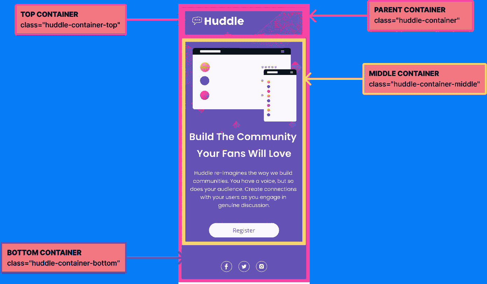

```
<body>
  ***<!-- parent container -->***<div *class*="huddle-container">

     ***<!-- top container -->***<div *class*="huddle-container-top">
     </div>***<!-- middle container -->***<div *class*="huddle-container-middle">
    </div>***<!-- bottom section -->***<footer *class*="huddle-container-bottom">
    </footer> </div>
</body>
```

嗯。你能从上面的代码片段中看出什么特别的地方吗？如果没有，让我为你强调一下👆。正如你在上面的代码片段中看到的，我们在底部使用了一个

标签，而不是标签。

```
 ***<!-- bottom section -->***<**footer** *class*="huddle-container-bottom">
    </**footer**>
```

## 所以现在你可能会问**为什么我们使用<页脚>而不是< div >标签？**🤔

让我给你解释一下，➡，这只是因为在 HTML 中，我们有一些语义元素，可以用来定义网页的不同部分。**所以在这里，为了方便使用，我们使用了<页脚>标签。因此，当你一看到<页脚>，你就知道那些元素会在页面的底部。**

*如果你想了解更多关于 HTML 语义元素的知识，可以查看我的文章*[***HTML 初学者指南***](https://uxplanet.org/beginners-guide-to-html-and-css-letss-start-off-with-html-3d7ffd035182) *。它将帮助你深入挖掘 HTML 元素和概念。*

[](https://uxplanet.org/beginners-guide-to-html-and-css-letss-start-off-with-html-3d7ffd035182) [## HTML 初学者指南

### 欢迎学习 HTML✨的基础知识

uxplanet.org](https://uxplanet.org/beginners-guide-to-html-and-css-letss-start-off-with-html-3d7ffd035182) 

## 🔴步骤 1.3➡让我们深入研究创建页面的蓝图。

现在我们完成了基本的结构。现在我们应该深入研究每个容器，为我们的开端做好每个部分的布局。

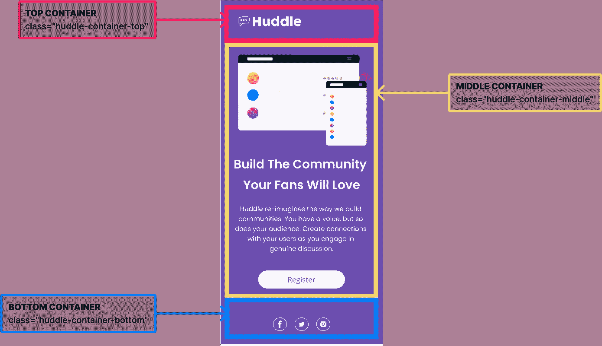

## 01)布置顶部容器

正如你在[D](https://www.figma.com/file/A4a79rJKPkpTNDpUK3s9D7/%F0%9F%94%B4-Single-Introductory-Page-%F0%9F%94%B4?node-id=2%3A225)design，**中看到的，所有设备的页面左上角都有一个标志**。

```
***<!-- top container -->***<div *class*="huddle-container-top">
    
  </div
```

## 02)布置中间容器

因此，当我们回到 [D](https://www.figma.com/file/A4a79rJKPkpTNDpUK3s9D7/%F0%9F%94%B4-Single-Introductory-Page-%F0%9F%94%B4?node-id=2%3A225) 设计时，你可以看到在移动视图中，你在顶部和下方看到的是英雄形象，描述。但是在桌面上，你可以看到英雄的形象和描述并行。因此，让我们以描述性的格式浏览一下中间部分的布局。

(2.1)至于第一步，我们将主要的中间容器类作为中间部分的父类，并在该父类中为英雄图像和描述再添加两个子类。


```
***<!-- middle container - parent -->*** <div *class*="huddle-container-middle"> ***<!-- middle container - child 01 -->***
  <div *class*="huddle-hero-image">
  </div> ***<!-- middle container - child 02 -->*** <div *class*="huddle-hero-description">
  </div></div>
```

(2.2)现在我们完成了中间部分的基本布局。是时候深入研究每一部分了。先说英雄形象。

```
***<!-- middle container - child 01 -->***<div *class*="huddle-hero-image"> 
    
  </div>
```

(2.3)完成后，让我们转到中间容器的描述部分。这里你可以看到主标题，一个段落和一个按钮。所以我们要做的是

*   首先，我们用一个

    # 来定义主标题

*   然后，我们用

    来定义段落

*   最后，我们使用一个
*   注意，每个标签都被包装在一个单独的标签中，该标签用作类= " huddle-hero-description ">的子类

```
***<!-- middle container - child 02-->
<!-- Here we use as the parent class for description section-->*** <div *class*="huddle-hero-description"> ***<!-- Child 01 - Main Heading -->***
  <div *class*="main-heading">
    <h1>
      Build The Community Your Fans Will Love
    </h1>
  </div> ***<!-- Child 02 - Paragraph -->*** <div *class*="para-desc">
    <p>
     Huddle re-imagines the way we build
     communities. You have a voice, but so
     does your audience. Create connections
     with your users as you engage in
     genuine discussion.
   </p>
  </div>

  ***<!-- Child 03 - Button-->***
  <button *class*="register-btn">
     <p>
       Register
     </p>
  </button></div>
```

## 03)布置底部容器

我们在底部添加了社交媒体链接和图片。

*   首先，我们使用来包含每个社交媒体网站的链接。
*   然后，在中，我们使用来包含社交媒体图像
*   之后，我们将和包装在一个标签中。
*   最后，我们将这三个类包装在底部的父 div 类中。

```
***<!-- bottom section - parent -->* <footer** *class*="huddle-container-bottom">***<!-- Child 01 -->*** <div *class*="facebook">
     <a *href*="#">
     
     </a>
  </div>

  ***<!-- Child 02 -->*** <div *class*="twitter">
     <a *href*="#">
     
     </a>
  </div> ***<!-- Child 02 -->***
  <div *class*="instagram">
     <a *href*="#">
     
     </a>
  </div>**</footer>**
```

## — —就这样，我们完成了蓝图。该是我们检查蓝图输出的时候了。👀👇 — —

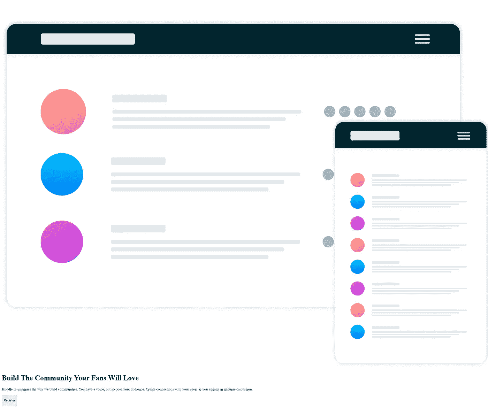

## ———HMMM，我不喜欢这个。看起来又丑又乱。🤮但是，与其抱怨，不如让我们开始工作，让它更有吸引力———

# 第二步——是时候让它更吸引人了(CSS)🚀

好吧。现在我们已经到了最好的部分。是时候通过做造型来弄脏我们的手了。因此，正如我们在 002 号 挑战中所做的 [**一样，我们正在以**](https://uxplanet.org/lets-move-to-the-next-challenge-challenge-002-ad33b79cd544) **[**移动优先方式**](https://bootcamp.uxdesign.cc/beginners-guide-to-css-9bc8298985c0) 进行这项挑战。这意味着我们首先开始移动视图的样式，然后我们将使用媒体查询来调整大屏幕的样式。**

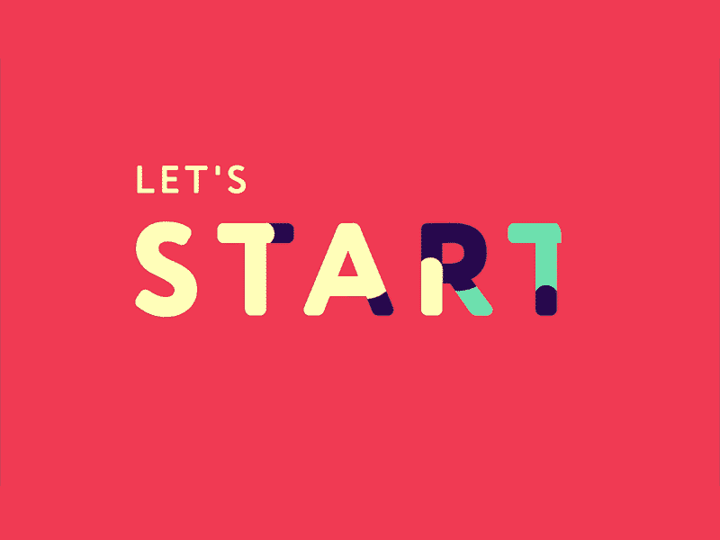

## 🔴**步骤 2.1** ➡首先，也是最重要的，正如我们在[挑战赛 001](/lets-take-a-pivot-to-ui-dev-challenge-no-01-2459e9e0527c) 中所做的那样，**将** **外部样式表链接到 HTML 文件**

```
<head> <meta *charset*="UTF-8">
  <meta *http-equiv*="X-UA-Compatible" *content*="IE=edge">
  <meta *name*="viewport" *content*="width=device-width, initial
  scale=1.0">

  **<link *rel*="stylesheet" *href*="styles.css">** <link *href*="https://fonts.googleapis.com/css2?
family=Poppins:wght@100;200;300;400;500;600;700;800;900&display=swap" *rel*="stylesheet"> <title>Single Introductory Page</title></head>
```

## 🔴**步骤 2.2** ➡包括通用选择器的**样式**

现在让我从一个小纸条开始🔊:-因为我已经在挑战 [001](/lets-take-a-pivot-to-ui-dev-challenge-no-01-2459e9e0527c) 、 [002](https://uxplanet.org/lets-move-to-the-next-challenge-challenge-002-ad33b79cd544) 和[CSS](https://bootcamp.uxdesign.cc/beginners-guide-to-css-9bc8298985c0)文章中描述性地向你介绍了通用选择器，所以我不会解释通用选择器，以及我们为什么再次使用它。

但是…..，我们正在做一些新的事情🤩正如您在下面的代码片段中看到的👇。

```
***,a,p**{ 
 color:#ffffff;
 font-family: 'Poppins', sans-serif;
 font-size: 15*px*;
 font-weight: 400;
 text-decoration: none;
 margin: 0*px*;
}
```

正如上面的代码片段所提到的，我们不仅仅使用星号，还使用了‘a & p ’,嗯，这是什么意思呢？🤔

这意味着我们包含的样式将作为页面中所有字体、所有标签和 p 标签的默认样式。因此，不需要单独的 stying。

```
**<!-- eg:- Remove the underline in the links -->**
***,a,p**{ 
 color:#ffffff;
 font-family: 'Poppins', sans-serif;
 font-size: 15*px*;
 font-weight: 400;
 **text-decoration: none;**
 margin: 0*px*;
}
***<!--*** 👆***Since we have put text-decoration as none we do not have to call a style seperately for <a> tag, Since we have include the style in the universal selector it will affect in all the <a> tags throughout the page -->***
```

## 🔴**步骤 2.3** ➡包括**普通造型**

好吧好吧，深呼吸！！你可能会感到困惑，因为我是。不过不用担心，我会给你解释清楚是什么意思。但首先，让我们包括造型，好吗？？？

```
**h1** {
  line-height: 48*px*;
  font-size: 28*px*;
  font-weight: 600;
}
```

正如我所承诺的，让我解释一下:-所以在步骤 2.1 中，我们已经包含了* a p { }的样式，我已经解释过这些样式将包含在整个页面中。如果我是正确的，你的问题应该是为什么我们单独为

# 添加样式。

这就是为什么，

*   我们包含在通用选择器中的样式将作为整个页面的默认样式。
*   但是我们在< h1 >标签中特别提到了**字体大小和字体粗细的两个不同值。**
*   因此，

    # 标签中的样式将覆盖我们在通用选择器中使用的样式

*   例如:-让我们把**字体大小**在通用选择器中，我们已经包括字体大小:15px，但在< h1 >标签中，我们使用字体大小:28px。因此，我们在< h1 >中使用的 ***样式将被覆盖，并为整个页面中的所有< h1 >标签包含 28px 的字体大小。***

[](https://bootcamp.uxdesign.cc/beginners-guide-to-css-9bc8298985c0) [## 在几分钟内学习 CSS 的基础知识⏰

### 欢迎学习 CSS✨的基础知识

bootcamp.uxdesign.cc](https://bootcamp.uxdesign.cc/beginners-guide-to-css-9bc8298985c0) 

## 🔴**步骤 2.4** ➡包括**背景色**

正如你在[D](https://www.figma.com/file/A4a79rJKPkpTNDpUK3s9D7/%F0%9F%94%B4-Single-Introductory-Page-%F0%9F%94%B4?node-id=2%3A225)design 中看到的，我们为登陆页面设置了紫色背景。

```
body {
  background-color: #674BAF;
}
```

# **现在我们完成了页面的通用样式**🎯**。最精彩的部分来了…**

小公告🔊:-我们上面包括的款式👆适用于所有尺寸的屏幕。现在是时候在移动优先的方法中包含每个部分的样式了。

## 🔴**步骤 2.5** ➡将**样式包含到**页面的父容器中

我们将为页面的主容器/

添加背景图像和填充。

```
*.****huddle-container***{
  background-image: url("./images/bg-mobile.png");
  background-position: top center;
  background-repeat: no-repeat;
  background-size: contain;
  padding-left: 30*px*;
  padding-right: 30*px*;
}
```

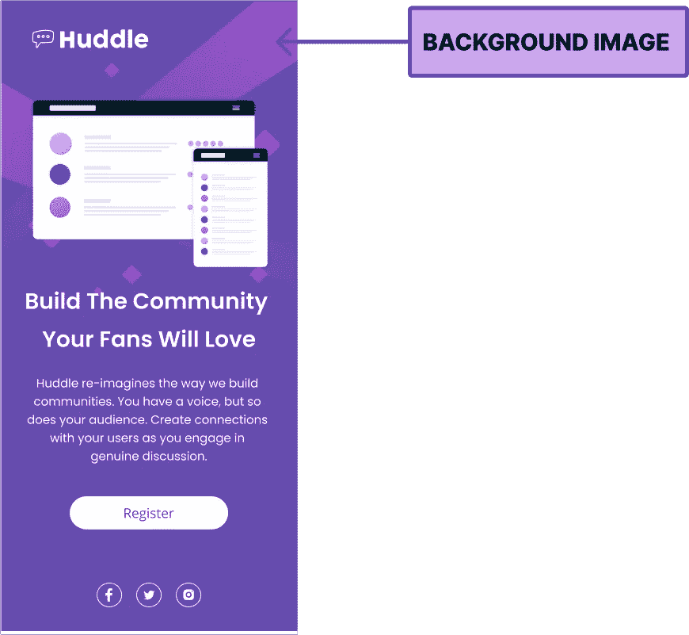

让我们深入研究一下上面的代码片段。让我们首先从定义背景属性开始。

*   CSS 属性允许你把图片放在任何你想要的 HTML 元素后面。
*   **背景重复:-** 防止图像完全重复。
*   **背景-位置:-** 包括水平位置和垂直位置。让我们进入更多的细节🤜在背景位置中，第一个是水平位置或 x 方向(横跨标签多远)。第二个是垂直位置或 y 方向(标签下多远)。
*   **背景尺寸:-** 控制背景图像的尺寸。

现在你知道了背景属性的简单解释。让我们进入上面的代码片段👇。

```
*.****huddle-container***{
  **/* Include the bacground image */**
  background-image: url("./images/bg-mobile.png"); **/* position the image to the top and then move into center - mobile 
    view */**
  background-position: top center; **/* Make sure the image is not repeat*/**
  background-repeat: no-repeat; **/* Make sure the whole iage is shown*/**
  background-size: contain; padding-left: 30*px*;
  padding-right: 30*px*;
}
```

[](https://www.freecodecamp.org/news/css-background-image-with-html-example-code/) [## 了解有关背景图像的更多信息

### 用户在网站上看到的内容会影响他们的用户体验。这也将影响他们能够……

www.freecodecamp.org](https://www.freecodecamp.org/news/css-background-image-with-html-example-code/) 

## 🔴**步骤 2.6** ➡包括顶部容器的**造型**

让我们为徽标部分添加样式。

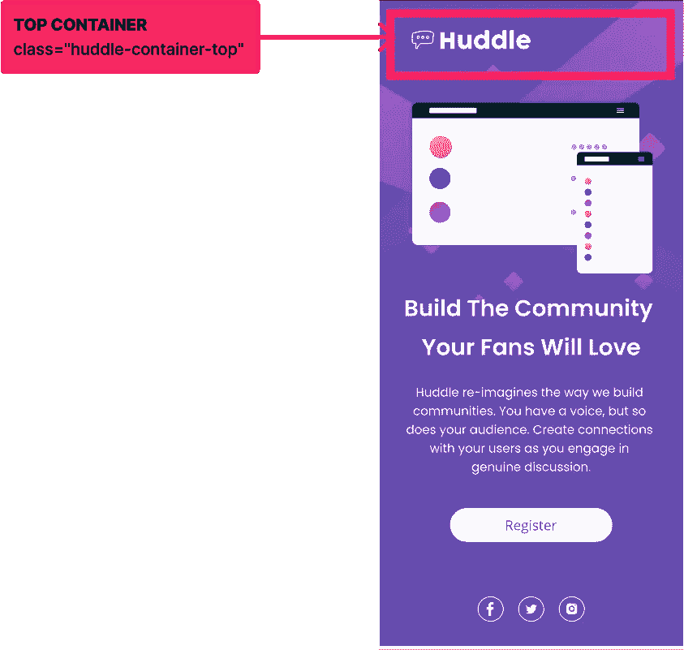

```
*.huddle-container* *.huddle-container-top* {
  padding-top: 30*px*;
}*.huddle-container* *.huddle-container-top* img {
  height: 24*px*;
  width: 147*px*;
}
```

## 🔴**步骤 2.7** ➡包括中间容器的**造型**

所以我们有了 HTML 部分的布局。我们将中间的容器分成三个部分。让我们描述一下每一个。


01)让我们从中间部分的**常用样式和父类**的样式开始。

```
*.huddle-container-middle* {
  display: flex;
  flex-direction: column;
}*.huddle-container-middle* *.huddle-hero-image*,
*.huddle-container-middle* *.huddle-hero-description* {
  align-items: center;
  display: flex;
  flex-direction: column;
  margin-left: auto;
  margin-right: auto;
}
```

02)现在我们完成了父类的样式化。是时候为英雄形象添加造型了。

```
*.huddle-container-middle* *.huddle-hero-image* {
  margin-top: 66*px* }*.huddle-container-middle* *.huddle-hero-image* img {
  height: 210*px*;
  width: 297*px*;
}
```

03)为了完成中间部分，让我们为**描述部分添加样式。**

当我们浏览 HTML 布局部分时，您可能记得我们已经将主描述部分作为父类，并将

# 、

& 

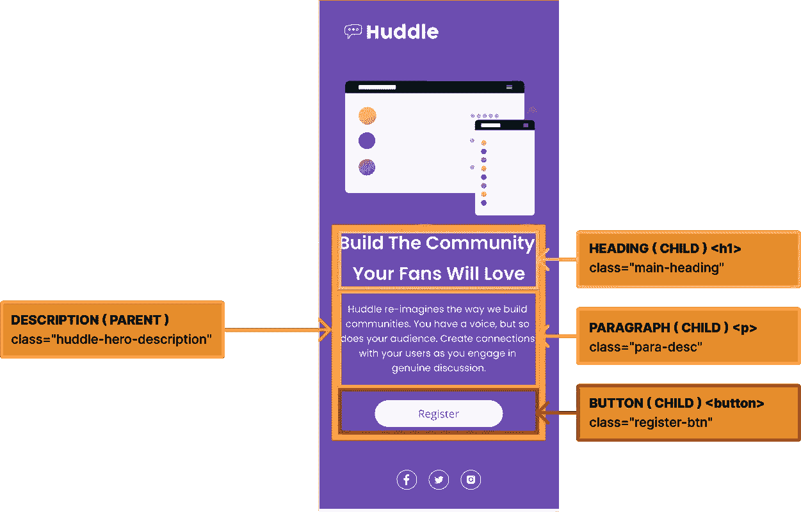

3.1)让我们为父容器**<div*class*= " huddle-container-middle ">**添加样式

```
*.huddle-container-middle* *.huddle-hero-description* {
   margin-top: 20*px*;
}
```

3.2)然后，包括标题和段落部分的样式

```
*.huddle-container-middle* *.huddle-hero-description* {
  margin-top: 20*px*;
}*.huddle-container-middle* *.main-heading* h1,
*.huddle-container-middle* *.para-desc* p{
  text-align: center;
}*.huddle-container-middle* *.para-desc* p {
  margin-top: 15*px*;
  width: 308*px*;
}
```

3.3)最后，包括按钮(注册按钮)的样式

```
*.huddle-container-middle* *.register-btn* {
  background-color: #ffffff;
  border-color: transparent;
  border-radius: 20*px*;
  width: 200*px*;
  margin-top: 40*px*;
  height: 40*px*;
}*.huddle-container-middle* *.register-btn* p {
  font-size: 17*px*;
  color:#674BAF
}
```

## 🔴**步骤 2.8** ➡为了完成我们页面的基本样式，让我们加入底部容器的**样式**

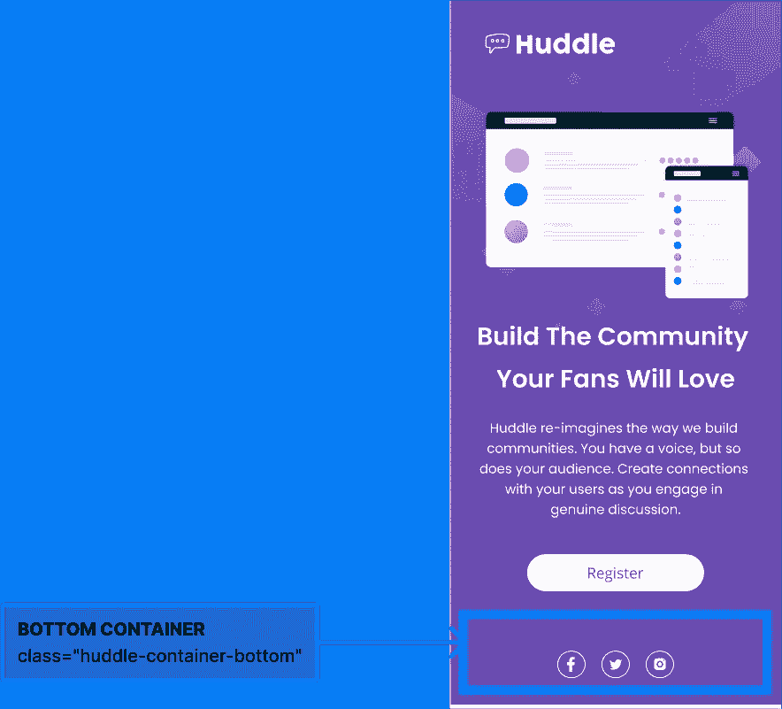

```
*.huddle-container-bottom* {
  display: flex;
  flex-direction: row;
  align-items: center;
  justify-content: center;
  margin-top: 70*px*;
}*.huddle-container-bottom* *.facebook*,
*.huddle-container-bottom* *.twitter*,
*.huddle-container* *.instagram* {
  align-items: flex-end;
  background-color: transparent;
  border: 2*px* solid #ffffff;
  border-radius: 50*%*;
  display: flex;
  height: 31*px*;
  justify-content: center;
  width: 32*px*;
  margin-left: 9*px*;
  margin-right: 9*px*;
}*.huddle-container-bottom* *.facebook* img,
*.huddle-container-bottom* *.twitter* img{
  height: 21*px*;
  width: 25*px*;
}*.huddle-container-bottom* *.instagram* img{
  height: 18*px*;
  width: 18*px*;
}
```

## ———现在让我们来看看我们基本造型的结果———

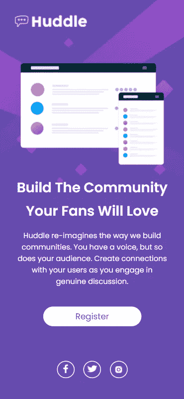

## ——令人惊讶的是，因为我们已经完成了移动视图的基本样式。结局看起来很惊人，不是吗？🤩— —

# 但是有一个问题😐

很抱歉让你不高兴，但是因为我们只关心移动视图，所以我们的桌面视图没有像预期的那样出现*(查看下面的快照)*😩。

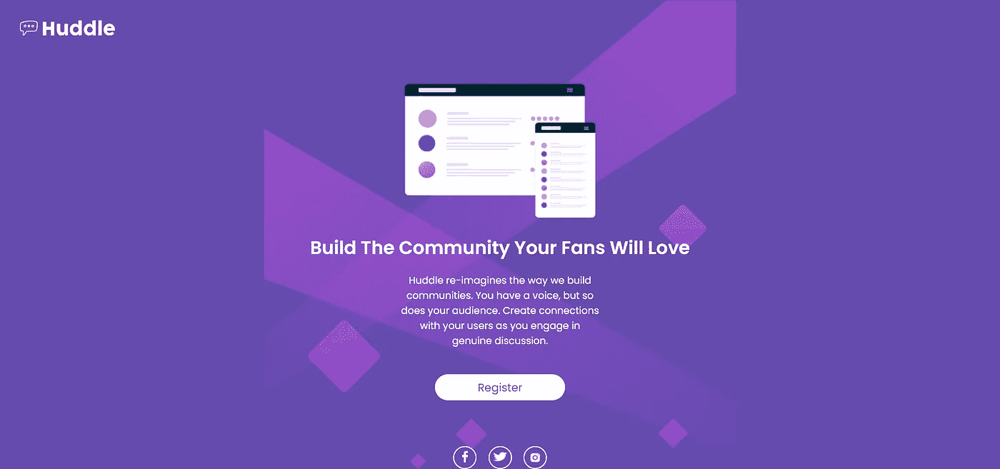

抱歉让你难过了。由于我们只关心移动视图，我们的桌面视图没有像预期的那样出现*(查看下面的快照)*😩。

# 步骤 03 —对所有屏幕做出响应的时间(媒体查询)🚀

因为我们已经采用了移动优先的方法，所以我们已经完成了移动视图的基本样式。现在是时候使用媒体查询并使其具有响应性了。

一旦包含了媒体查询的样式，这些样式将会覆盖较大屏幕的基本样式。

这里我们将对两个媒体查询使用样式。因为我们将对平板电脑应用相同的设计，一旦屏幕尺寸达到 1044 像素，我们将改变设计中所示的更大屏幕的设计。

## 🟡Step 3.1 ➡让我们改变大于 768 像素小于 1024 像素的屏幕样式

```
*/* tablet potrait */* ***@media* screen *and* (min-width:768*px*) *and* (max-width:1024*px*){** h1 {
   line-height: 60*px*;
   font-size: 45*px*;
   width: 505*px*;
 } *.huddle-container*{
   background-image: url("./images/bg-desktop.png");
   background-position: top ;
   background-repeat: no-repeat;
   background-size: contain;
   padding-left: 80*px*;
   padding-right: 80*px*;
 } *.huddle-container-middle* *.huddle-hero-image* img {
  height: 346*px*;
  width: 448*px*;
 } *.huddle-container-middle* *.huddle-hero-description* {
  align-items: center;
  margin-left: auto;
  margin-right: auto;
 }**}**
```

## ———让我们看看结果。🤩 — —

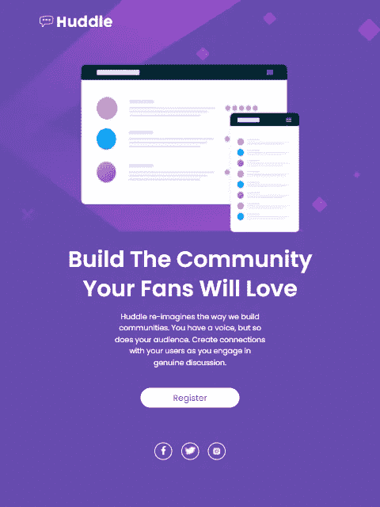

## 🟡Step 3.1 ➡让我们通过为超过 1024 像素的屏幕添加样式来完成挑战

```
***@media* screen *and* (min-width: 1024*px*){
**  h1 {
   line-height: 60*px*;
   font-size: 45*px*; 
   width: 505*px*;
 } *.huddle-container*{
   background-image: url("./images/bg-desktop.png");
   background-position: top center;
   background-repeat: no-repeat;
   background-size: contain;
   padding-left: 80*px*;
   padding-right: 80*px*;
 } *.huddle-container-middle* {
   display: flex;
   flex-direction: row;
 } *.huddle-container-middle* *.huddle-hero-image* img {
   height: 493*px*;
   width: 696*px*;
 } *.huddle-container-middle* *.huddle-hero-description* {
   display: flex;
   justify-content: center;
   margin-left: 70*px*;
   max-width: 526*px*;
   flex-wrap: wrap;
 } *.huddle-container-middle* *.main-heading* h1,
 *.huddle-container-middle* *.para-desc* p {
   text-align: left;
 } *.huddle-container-middle* *.para-desc* p {
   width: 526*px*;
   font-size: 17*px*;
 } *.huddle-container-middle* *.register-btn* {
   height: 60*px*;
   border-radius: 30*px*;
 } *.huddle-container-bottom* {
   justify-content: flex-end;
   margin-top: 40*px*;
   padding-right: 80*px*;
 }**}**
```

正如设计所示，对于较大的屏幕，中间部分保持相互平行，而在移动屏幕上和小于 1024 像素的屏幕上。中间部分一个接一个。因此，我们将弯曲方向设为“行”,以显示两个部分相互平行👆。

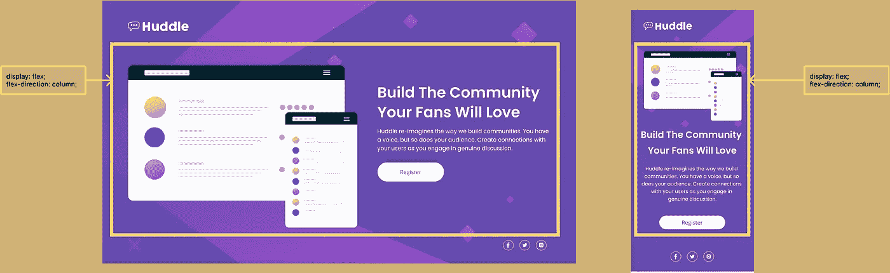

```
*/* FOR LARGER SCREENS*/* ***.huddle-container-middle* {
   display: flex;
   flex-direction: row;
 }***/* FOR MOBILE*/* ***.huddle-container-middle* {
   display: flex;
   flex-direction: column;
 }*****/**** 👆***You can find this styling on the above code snippets*/***
```

# — —让我们看看最终结果，完成我们的挑战💣。TADAAA..🤩 — —


# 最终想法

正如我们已经完成的挑战，我将带着你已经获得和学到一些东西的希望结束这篇文章。谢谢你检查这个。现在是你尝试这一挑战的时候了。相信我，你会喜欢这个过程的。

如果你有兴趣获得更多的知识，磨练你的技能，或者需要一个小小的提醒，看看下面的文章。👇🧠

**了解 flexbox 让事情变得简单:-**[https://level up . git connected . com/Understanding-flexbox-to-make-things-easy-ADF 90891 ff 25](/understanding-flexbox-to-make-things-easy-adf90891ff25)

**几分钟内学会 CSS 的基础:-**[https://boot camp . uxdesign . cc/beginners-guide-to-CSS-9bc 8298985 c0](https://bootcamp.uxdesign.cc/beginners-guide-to-css-9bc8298985c0)

**HTML 入门指南:-**[https://UX planet . org/beginners-guide-to-HTML-and-CSS-letss-start-off-with-HTML-3d 7 ffd 035182](https://uxplanet.org/beginners-guide-to-html-and-css-letss-start-off-with-html-3d7ffd035182)

**最后，请不要犹豫，检查挑战号 001 和 002**👇:-

[](/lets-take-a-pivot-to-ui-dev-challenge-no-01-2459e9e0527c) [## 让我们以 UI 开发为中心🚀第 01 号挑战

### 欢迎👋，你准备好了吗？让我们从一个简单的挑战 01 开始-> NFT 预览 Cad 组件使用 HTML 和…

levelup.gitconnected.com](/lets-take-a-pivot-to-ui-dev-challenge-no-01-2459e9e0527c) [](https://uxplanet.org/lets-move-to-the-next-challenge-challenge-002-ad33b79cd544) [## 让我们进入下一个挑战🚀—挑战 002

### 单一价格网格

uxplanet.org](https://uxplanet.org/lets-move-to-the-next-challenge-challenge-002-ad33b79cd544) 

> 如果你喜欢这个，请给一个或多个掌声，并在评论区留下你的想法和反馈。
> 
> *感谢您查看这篇文章，也可以点击下面的链接查看我的其他文章👇*
> 
> [***查一下***](https://medium.com/@nknuranathunga)

🔸在推特上关注我👀:[**@ nathasar 97**](https://twitter.com/NathashaR97)🔸

**参考以下代码库链接**

01)代码仓库:-[https://github . com/nathas har 97/Huddle-landing-page-with-a-single-introductive-section . git](https://github.com/NathashaR97/Huddle-landing-page-with-a-single-introductory-section.git)

[](https://github.com/NathashaR97/Huddle-landing-page-with-a-single-introductory-section.git) [## GitHub-nathas har 97/Huddle-landing-page-with-single-introductive-section

### Figma 文件链接] (…

github.com](https://github.com/NathashaR97/Huddle-landing-page-with-a-single-introductory-section.git) 

03)挑战链接:-[https://www . frontend mentor . io/challenges/single-price-grid-component-5ce 41129 d0ff 452 FEC 5 abbbbc](https://www.frontendmentor.io/challenges/huddle-landing-page-with-a-single-introductory-section-B_2Wvxgi0)

[](https://www.frontendmentor.io/challenges/huddle-landing-page-with-a-single-introductory-section-B_2Wvxgi0) [## 前端导师| Huddle 登录页面，包含一个介绍性的编码挑战部分

### 对于初学者来说是一个完美的挑战，这个项目将让你用两列布局工作。素描和 Figma 设计…

www.frontendmentor.io](https://www.frontendmentor.io/challenges/huddle-landing-page-with-a-single-introductory-section-B_2Wvxgi0)