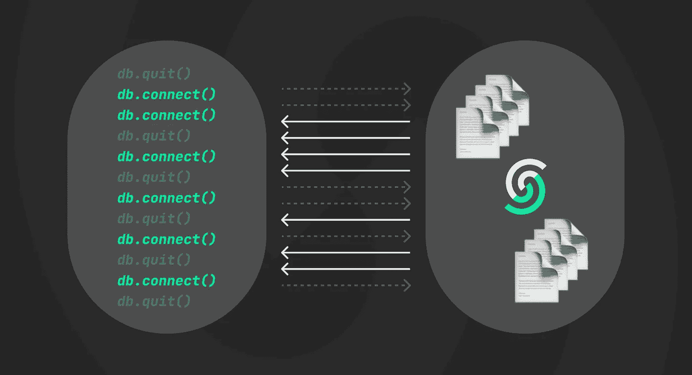

# 无服务器的挑战:数据库连接

> 原文：<https://levelup.gitconnected.com/challenge-of-serverless-database-connections-97fde014b75d>



为无服务器设计数据库，我们认为最大的挑战是建立一个基础设施，以盈利的方式支持按请求定价。我们相信 [Upstash](https://upstash.com) 已经做到了这一点。在我们发布产品之后，我们看到了另一个主要挑战:数据库连接！

众所周知，无服务器功能的范围从 0 到无穷大。这意味着当你的函数获得大量流量时，云提供商会并行创建新的容器(lambda 函数)并扩展你的后端。如果您在函数中创建新的数据库连接，那么您可以很快达到数据库的连接限制。

如果你试图在 lambda 函数之外缓存连接，就会出现另一个问题。当 AWS 冻结你的 Lambda 函数时，它不会关闭连接。因此，你可能会以许多闲置/僵尸连接而告终，这些连接仍然会造成威胁。

这个问题不是 Redis 特有的，它适用于所有依赖 TCP 连接的数据库(Mysql、Postgre、MongoDB 等)。你可以看到无服务器社区正在创建像[无服务器-mysql](https://github.com/jeremydaly/serverless-mysql) 这样的解决方案。这些是客户端解决方案。作为 Upstash，我们有实现和维护服务器端的优势。所以我们决定通过监控连接和驱逐空闲的连接来缓解这个问题。算法如下:作为最大并发连接数，我们对数据库有两个限制，软限制和硬限制。当数据库达到软限制时，我们开始终止空闲连接。我们继续接受新的连接请求，直到达到硬限制。如果数据库达到硬限制，那么我们开始拒绝新的连接。

# 连接驱逐算法

```
if( current_connection_count < SOFT_LIMIT ) {
    ACCEPT_NEW_CONNECTIONS
}if( current_connection_count > SOFT_LIMIT && current_connection_count < HARD_LIMIT ) {
    ACCEPT_NEW_CONNECTIONS
    START_EVICTING_IDLE_CONNECTIONS
}if( current_connection_count > HARD_LIMIT ) {
    REJECT_NEW_CONNECTIONS
}
```

请注意，[上传文件](https://docs.upstash.com/overall/databasetypes)中列出的最大并发连接限制是软限制。

# 短暂的联系

部署上述算法后，我们发现所有地区被拒绝的连接数量都大大减少了。但是如果你想安全起见，你也可以在你这边解决问题。您可以在函数内部打开 Redis 连接，但也可以在使用 Redis 时关闭它们，而不是重用连接，如下所示:

```
exports.handler = async (event) => {
    const client = new Redis(process.env.REDIS_URL);
    /*
    do stuff with redis
    */
    await client.quit();
    /*
    do other stuff
    */
    return {
        response: "response"
    };
};
```

上面的代码帮助您最小化并发连接数。人们询问新连接的延迟开销。众所周知，Redis 连接非常轻量级。

# Redis 连接真的是轻量级的吗？

我们运行了一个基准测试，看看 Redis 连接有多轻量级。在本测试中，我们比较了两种方法的延迟时间:

1-短暂的连接:我们不重用连接。相反，我们为每个命令创建一个新的连接，并立即关闭该连接。我们一起记录客户机创建、ping()和 client.quit()的延迟。参见下面代码部分的`benchEphemeral()`方法。

2-重用连接:我们创建一个连接，然后为所有命令重用同一个连接。在这里，我们记录下`ping()`操作的延迟。参见下面的`benchReuse()`方法。

```
async function benchReuse() {
    const client = new Redis(options);
    const hist = hdr.build();
    for (let index = 0; index < total; index++) {
        let start = performance.now() * 1000 // to μs
        client.ping()
        let end = performance.now() * 1000 // to μs
        hist.recordValue(end-start)
        await delay(10)
    }
    client.quit()
    console.log(hist.outputPercentileDistribution(1, 1));
}

async function benchEphemeral() {
    const hist = hdr.build();
    for (let index = 0; index < total; index++) {
        let start = performance.now() * 1000 // to μs
        const client = new Redis(options);
        client.ping()
        client.quit()
        let end = performance.now() * 1000 // to μs
        hist.recordValue(end-start)
        await delay(10)
    }
    console.log(hist.outputPercentileDistribution(1, 1));
}
```

参见[回购](https://github.com/upstash/redis-connection-benchmark)，如果你想自己运行基准。

我们在 AWS EU-WEST-1 地区以两种不同的设置运行了这个基准代码。第一种设置是相同的区域，其中客户端和数据库位于相同的可用性区域。第二种设置是 INTER ZONE，其中客户端运行在与数据库不同的可用性区域中。我们使用标准字体作为数据库服务器。

我们已经看到创建和关闭一个新连接的开销(短暂方法)只有 75 微秒(99%)。在区间设置中，开销非常相似(80 微秒)。

然后我们决定在 AWS Lambda 函数中重复同样的测试。结果是不同的。尤其是当我们把 Lambda 函数的内存设置的很低(128Mb)的时候，我们看到了 Redis 连接更大的开销。我们已经看到在 AWS Lambda 函数中延迟开销高达 6–7 毫秒。

*   Redis 连接在具有合理 CPU 能力的系统上确实是轻量级的。甚至在 t2.micro 上。
*   默认 AWS Lambda 配置的 CPU 能力非常差，这显著增加了 TCP 连接相对于 Lambda 函数总执行时间的成本。
*   如果您使用 Lambda 函数和缺省/最小内存，那么您最好在函数外部缓存 Redis 连接。

我们关于 Redis 连接的结论是:

# 冻结容器= >僵尸连接

在意识到连接在一些 AWS Lambda 设置中会有显著的开销后，我们决定在 AWS Lambda 中对`reusing connection`做进一步的测试。我们发现了另一个问题。这是一个边缘病例，还没有人报道过。

这是事情发生的时间线:

**STEP1 — timer-0sec:** 我们发送一个请求，在 lambda 函数之外缓存连接。

```
if (typeof client === 'undefined') {
    var client = new Redis("REDIS_URL");
}module.exports.hello = async(event) => {
    let response = await client.get("foo");
    return {response : response + "-" + time}
};
```

**步骤 2 —定时器-5 秒:** AWS 在短时间后冻结集装箱。

**step 3—time-60 sec:**upash 对于空闲连接有 60 秒的超时。所以它终止了连接，但是由于它被冻结了，所以不能从客户端获得 ACK。因此服务器连接进入状态 [FIN_WAIT_2](https://kb.iu.edu/d/ajmi) 。

**step 4—time-90 sec:**upsh 服务器完全断开连接，退出 FIN_WAIT_2 状态。

**STEP5 — time-95sec:** 客户端发送同样的请求，得到 ETIMEDOUT 异常。因为客户端假设连接是打开的，但事实并非如此。🤦🏻 🤦🏻 🤦🏻

**STEP6 — time-396sec:** 最后一次请求后 5 分钟，AWS 完全杀死容器。

**STEP7 — time-400sec:** 客户端发送相同的请求，这次它运行良好，因为容器是从头开始创建的，所以初始化步骤没有被跳过。将创建一个新连接。

正如您在上面看到的，AWS 解冻了一个容器并重用了连接。但是服务器端的连接已经关闭，由于功能被冻结，无法进行通信。所以在 Upstash 驱逐一个空闲连接和 AWS 处理一个空闲函数之间存在同步问题。因此，如果我们只在 AWS 终止一个函数后终止一个空闲连接，那么就不会有任何问题。

假设 AWS 在 300 秒内终止一个空闲函数，我们将 Upstash 连接超时更改为 310 秒。经过这一改，问题消失了。这里的问题是 AWS 在终止空闲函数时是不透明的。因此，我们需要继续测试，并尝试检测问题是否再次发生。

这个问题与在无服务器 mysql 库上看到的问题非常相似。在注释中，建议在 ETIMEDOUT 异常时重试请求。但是重试有两个缺点。首先，您可以重试一个写请求，该请求可能已被处理并因实际网络问题而超时。第二个问题是失败请求的额外延迟。

# GraphQL 也有帮助

一种解决连接问题的方法是使用无连接 API。除了 Redis 协议，Upstash 还支持 [GraphQL API](https://docs.upstash.com/graphql/aboutgraphqlapi) 。GraphQL 是基于 HTTP 的，所以它没有连接限制的问题。查看文档以了解支持的命令。注意 GraphQL API 在 Redis 协议上有一个延迟开销(大约 5 毫秒)。

# 结论

我们定制 Upstash 数据库，为无服务器应用提供流畅的体验。我们新的服务器端算法删除了 AWS Lambda 大量创建的非活动连接。您可以通过在 Lambda 函数中打开/关闭 Redis 客户端来最小化连接的数量，但是如果您的函数内存小于 1GB，这可能会产生延迟开销。

*   如果您的用例对延迟敏感(例如，6 毫秒对您来说很大)，那么重用 Redis 客户端。
*   如果您遇到非常多的并发客户端(超过 1000 个)，那么可以重用 Redis 客户端。
*   如果您的用例对延迟不敏感，那么在函数中打开/关闭 Redis 客户端。
*   如果您的函数至少有 1GB 内存，那么打开/关闭函数中的 Redis 客户端。

总之，我们对无服务器用例的建议是:

请在 [Twitter](https://twitter.com/upstash) 或 [Discord](https://discord.com/invite/w9SenAtbme) 上告诉我们您的反馈。

*原载于 2021 年 4 月 1 日 https://blog.upstash.com*[](https://blog.upstash.com/serverless-database-connections)**。**