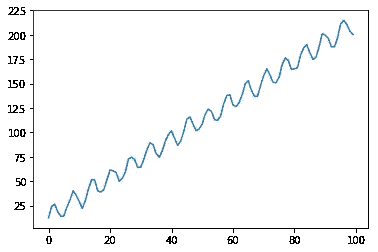
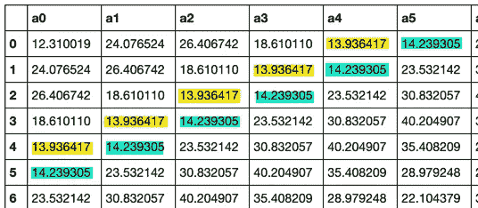
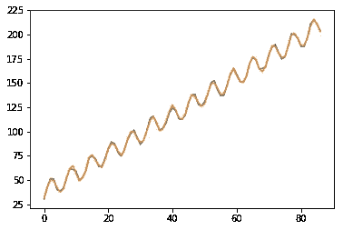
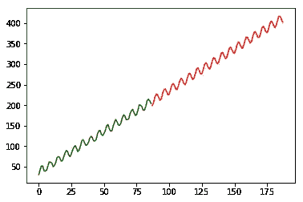

# 挑战:用线性回归预测正弦函数

> 原文：<https://levelup.gitconnected.com/challenge-predict-a-sine-function-with-linear-regression-8186e46a7313>

你能用线性回归预测正弦函数吗？

## 动机

我总是说 90%的机器学习可以用线性回归来完成。当处理一个巨大的领域，比如图像、声音等时，你只需要神经网络或其他东西。

在向学生讲授线性回归时，我们决定尝试预测一个正弦函数，如下图所示，只使用线性回归。



该功能是:

```
y = (np.sin(x)+1)*10+2*x+np.random.rand(100)*5
```

很可能，几乎所有人都会说这是不可能的，人们可能会想出一条正好在中间穿过这个函数的线，但永远不会想出一个精确的模型来重复这些波。

感兴趣吗？

## 滚动窗

我们在这里做的是使用滚动窗口为线性回归准备数据集:

```
x = np.arange(0,100)
y = (np.sin(x)+1)*10+2*x+np.random.rand(100)*5

points = 12
names = []
**for** i **in** range(points):
  names.append("a"+str(i))
ds = []
target = []
**for** i **in** range(points,len(x)-1):
  ds.append(y[i-points:i])
  target.append(y[i]) 
df = pd.DataFrame(np.array(ds),columns=names) 
dfy = df 
dfy["target"] = target
```

我们得到一个包含字段的数据集:

`a0,a1,a2,...,a11,target`

其中`a0,...,a11`是前 12 个点，目标是下一个点:



你可能会看到这是一个滚动窗口

每下一行都是通过左移和添加函数的下一个值来重复上一行。

## 线性回归(拟合-预测)

长话短说，我们现在符合我们的模型:

```
model = LinearRegression()
model.fit(dfy[names],dfy["target"])
plt.plot(np.arange(len(df)),df["target"])
plt.plot(np.arange(len(df)),model.predict(dfy[names]))
```

我们得到了想要的图像:



你看多准啊！

但是我们真的能预测未来吗？

让我们试试:

```
last = dfy.iloc[-1]
prediction = []
n = []
**for** i **in** range(points-1):
  n.append(last["a"+str(i+1)])
n.append(last["target"])
n.append(model.predict(np.array(n).reshape(1,-1))[0])
prediction.append(n[-1])
**for** i **in** range(100):
  n = n[1:]
  n.append(model.predict(np.array(n).reshape(1,-1))[0])
  prediction.append(n[-1])
```

还有…剧情！

```
plt.plot(np.arange(len(dfy)),dfy["target"],c="green")
plt.plot(np.arange(len(dfy),len(dfy)+len(prediction)),prediction,c="red")
```



是的，我们可以！

这只是线性回归有多强大的另一个例子！

有好看的代码！