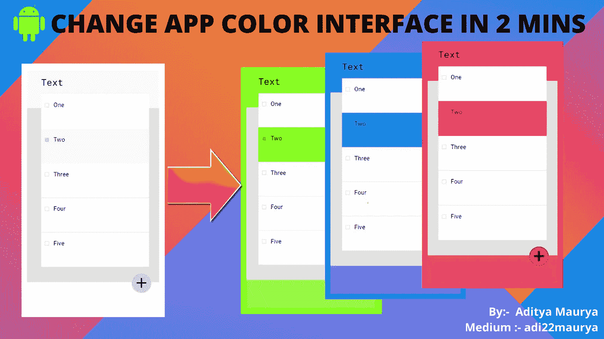
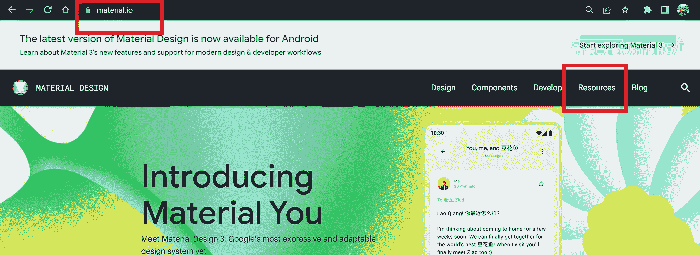
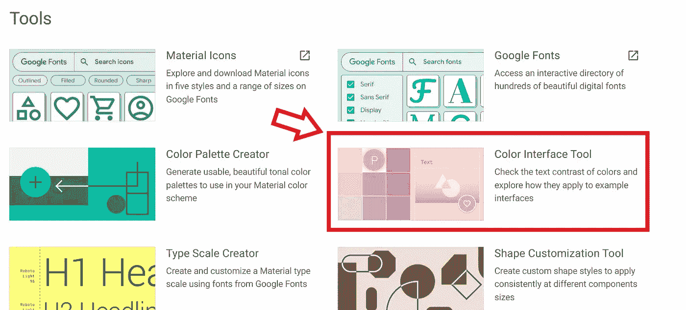
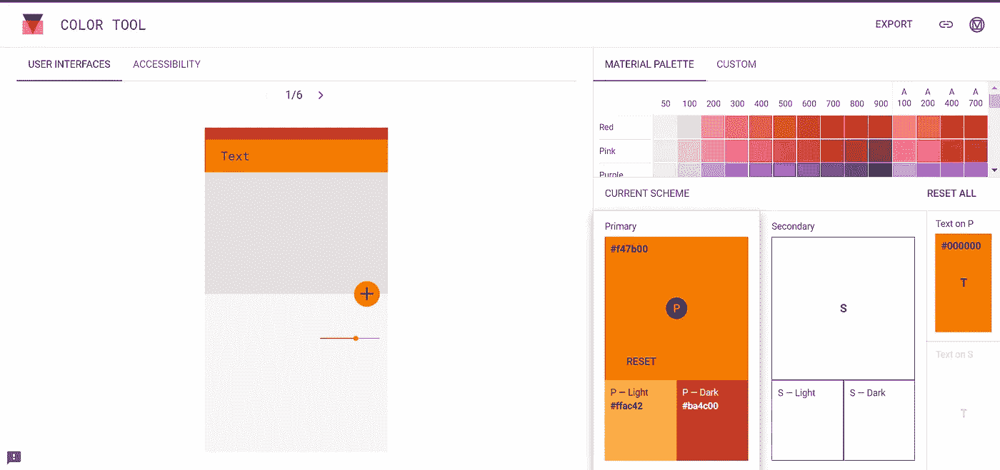
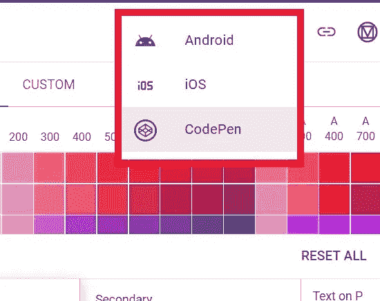
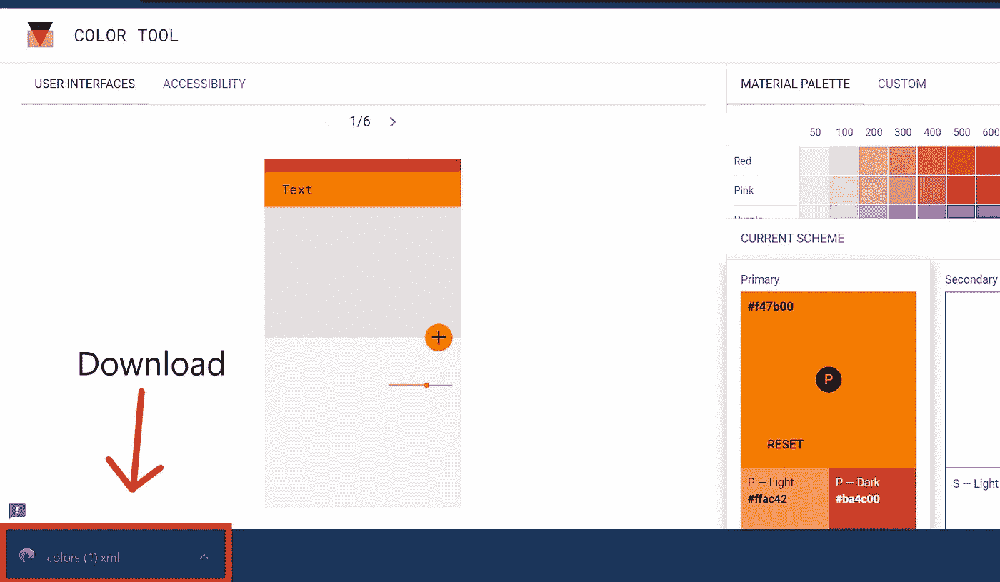
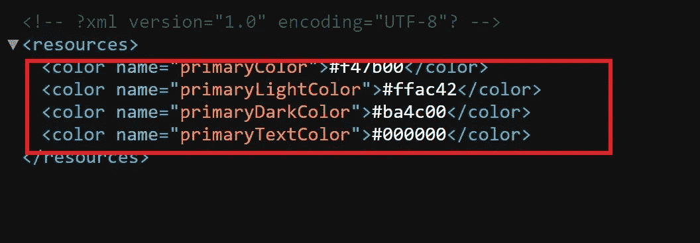
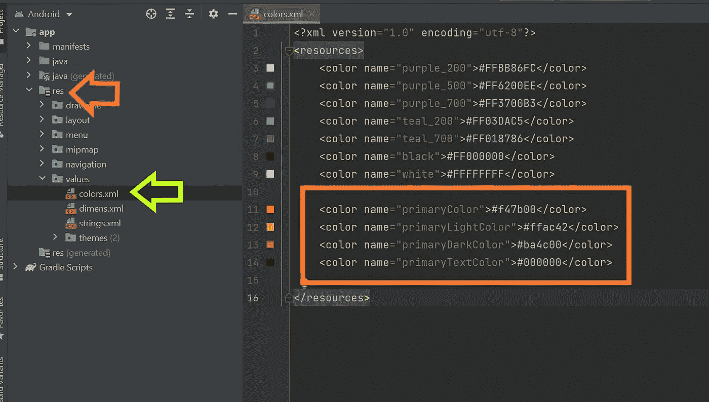
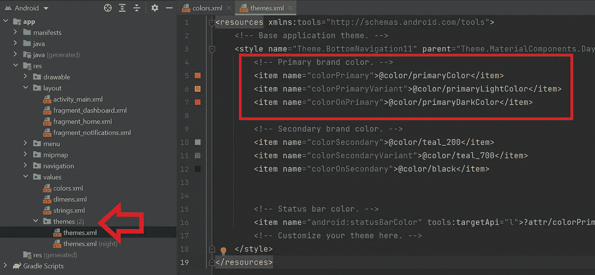
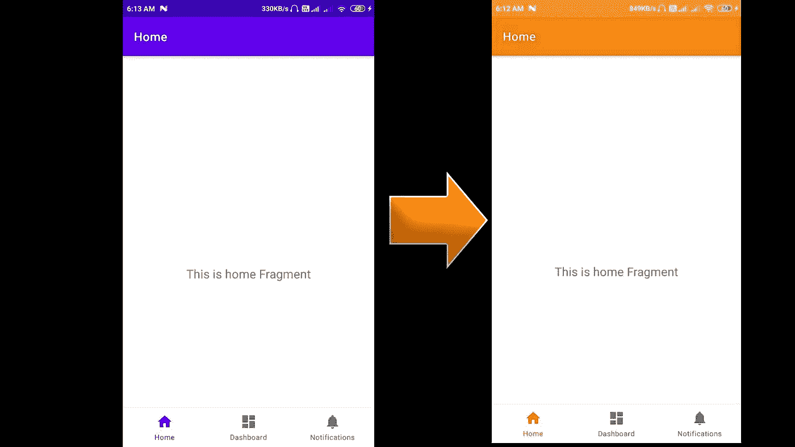

# 在 2 分钟内更改应用程序颜色界面

> 原文：<https://levelup.gitconnected.com/change-app-color-interface-in-2-mins-8d688929c0f7>

改变 app 颜色界面，我们用 [Material.io](https://material.io/) 网站。

第一步。前往 https://material.io/[的](https://material.io/)，签到或报名。

第二步。转到参考资料。

第三步。转到颜色界面工具。

第四步。为你的应用程序选择主色和副色。

第五步。点击导出并下载。xml 文件。

New Colors.xml 是:-

第六步。复制 ***<颜色>……</颜色>*** 现在转到 Android Studio 的 **colors.xml** 文件，粘贴你的颜色标签。

第七步。现在转到 theme.xml 并更改颜色名称:-

同样，对于二次色也是如此。

所以在变化之后:-

感谢阅读…

继续编码探索…:)