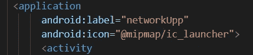
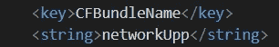
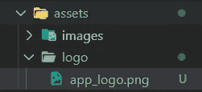
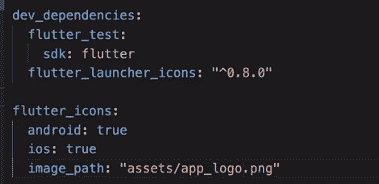

# 在 Flutter 中更改应用程序启动器图标和名称(Android 和 iOS)

> 原文：<https://levelup.gitconnected.com/change-app-launcher-icon-and-name-in-flutter-android-ios-f245455293c5>

## 使用 flutter 更改应用程序启动器图标和名称的完整指导


照片由[哈帕尔·辛格](https://unsplash.com/@aquatium?utm_source=unsplash&utm_medium=referral&utm_content=creditCopyText)在 [Unsplash](https://unsplash.com/s/photos/app-icon?utm_source=unsplash&utm_medium=referral&utm_content=creditCopyText) 上拍摄

> 当我们在 **android** 或 **ios** 平台中构建移动应用程序时，我们必须将默认的**应用程序名称**和**启动器图标**更改为首选名称和图标。这在将应用程序发布到 play store 或 app store 时最有用。本文将重点介绍如何在 flutter 框架中从头开始更改应用程序名称和图标。

## **更改应用启动器名称**

当更改 *app launcher name* 时，您可以遵循两种方法，这些方法将描述如下。

*   ***使用*重命名包**

你可以通过访问这个 [***重命名***](https://pub.dev/packages/rename)*包找到更多信息*

*使用重命名包，你必须按照下面的简单步骤。*

1.  *到你的终端使用*****pub 全局激活重命名*** 命令***

```
***pub global activate rename***
```

***然后你可以看到***【重命名包】*** 被激活。***

***2.使用命令 `**pub global run rename --appname “yourappname”**`***

```
***pub global run rename --appname "Network Upp"***
```

***您可以看到应用程序名称已成功更改为首选名称***

***3.`**pub global run rename --bundleId com.example.android.app**`***

***运行此命令将为应用程序生成一个唯一的应用程序 id[`bundleId`]。***

******com . onatcipli***= = =>***反转域******

******network UPP***= = = =>***您的项目名称******

```
***pub global run rename --bundleId com.onatcipli.networkUpp***
```

***按照上述步骤，您将成功地为您的移动应用程序添加一个首选名称。***

*   ******手动方法******

*****针对安卓平台**；***

***为了改变你的 bundleId 编辑下面提到了你的颤振项目中的五个位置。***

*****bundleId** = ***com。<贵公司名称>。<您的项目名称>******

1.  ****android\app\build.gradle****
2.  ****Android \ app \ src \ debug \ Android manifest . XML****
3.  ****Android \ app \ src \ main \ Android manifest . XML****
4.  ****Android \ app \ src \ profile \ Android manifest . XML****
5.  ****Android \ app \ src \ main \ kot Lin \ com \ example \<您的项目名称> \MainActivity.kt****

***要更改 appname，请导航至***Android \ app \ src \ main \ androidmanifest . XML***并将***Android:label***更改为 ***您的应用名称*** *。****

******

***作者图片***

*****针对 iOS 平台；*****

***在***IOs \ Runner \ info . plist***内，导航到 ***CFBundleName*** 键，在字符串标签内更改为首选应用名称。***

******

***作者图片***

***要在 iOS 平台中更改 ***bundleId*** ，请导航至***iOS \ runner . xcode proj \ project . PBX proj***文件，并在中更改“***PRODUCT _ BUNDLE _ IDENTIFIER******

*   ****剖面图****
*   ****调试****
*   ****发布****

***好了，伙计们……***

***我们完成了 ***app launcher 名称*** 的更改，接下来，我们将重点讨论如何在 flutter 框架中更改 app launcher 图标。***

## *****更改应用启动器图标*****

***值得一提的是，在更改应用程序启动器图标时，最好选择高分辨率图标。您可以通过 [***Android 图标生成器***](https://romannurik.github.io/AndroidAssetStudio/icons-launcher.html#foreground.type=clipart&foreground.clipart=android&foreground.space.trim=1&foreground.space.pad=0.25&foreColor=rgba(96%2C%20125%2C%20139%2C%200)&backColor=rgb(68%2C%20138%2C%20255)&crop=0&backgroundShape=circle&effects=none&name=ic_launcher) 生成一个 Android 应用程序启动器图标，也可以使用另一个第三方应用程序设计一个适合您的应用程序的启动器图标。然后按照以下步骤将你的启动器图标添加到你的应用程序中。***

1.  ***将创建的应用程序启动器图标添加到项目的资产文件夹中，并根据需要重命名***

******

***作者图片***

***2.导航到 ***pubspec.yaml*** 文件，在***dev _ dependencies***下，添加以下代码快照。点击[此处](https://pub.dev/packages/flutter_launcher_icons)获取更多关于 flutter 启动器图标的信息。***

*****值得一提的是，确保以正确的方式保持间距。*****

```
***flutter_launcher_icons: "^0.8.0"flutter_icons:android: trueios: trueimage_path: "assets/logo/app_logo.png"***
```

******

***作者图片***

***3.保存您所做的所有更改***

***4.转到终端，导航到 flutter 项目位置，粘贴并运行以下命令***

```
***flutter pub cleanflutter pub getflutter pub run flutter_launcher_icons:main***
```

***完成了伙计们…***

***如果你按照上面的步骤操作，你最终会得到一个成功改变的 ***app launcher 图标******名称*** 。***

***希望你喜欢这篇文章，并能收集一些重要的事实。感谢您的阅读，如果文章对您有用，请鼓掌。😎🙌***