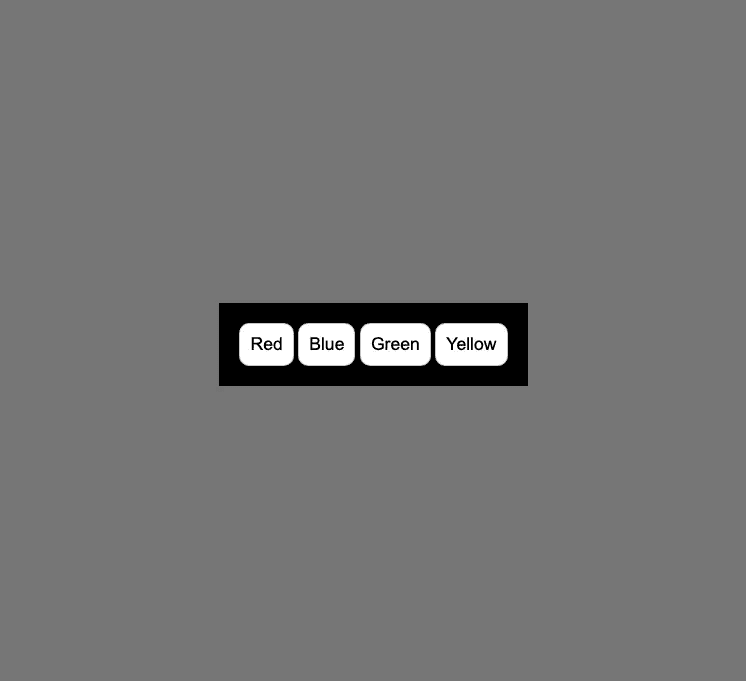
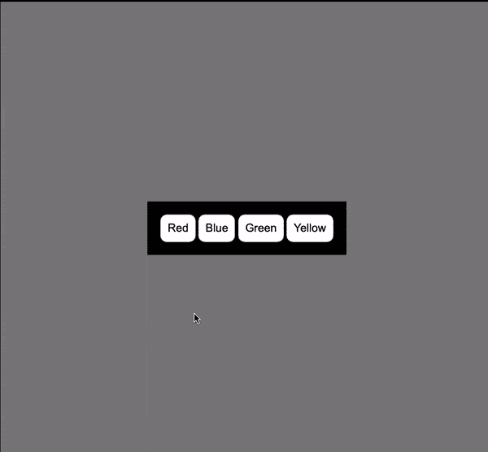

# 使用 JavaScript 更改背景颜色

> 原文：<https://levelup.gitconnected.com/change-background-color-using-javascript-e60d172e9124>

有几种方法可以在 JavaScript 中动态改变 HTML 元素的背景颜色。

1.  [使用 style.backgroundColor 属性](https://softauthor.com/change-background-color-javascript/#using-style-backgroundcolor-property)
2.  [使用 ClassList.add()](https://softauthor.com/change-background-color-javascript/#using-classlist-add-method)
3.  [使用 setAttribute()](https://softauthor.com/change-background-color-javascript/#using-setattribute-method)
4.  [改变一个 div 的背景颜色](https://softauthor.com/change-background-color-javascript/#change-background-color-div)
5.  [点击按钮时动态改变背景颜色](https://softauthor.com/change-background-color-javascript/#change-background-color-button-click)

# 1.使用 style.backgroundColor 属性

您可以在 JavaScript 中直接使用 **style.backgroundColor** 属性来更改 HTML 元素的背景颜色。

一旦 HTML 文档加载到浏览器上，下面的示例会将 body 元素的**背景颜色更改为**红色**。**

这会将整个页面的背景色更改为红色。

```
window.addEventListener('load', () => {
  document.body.style.backgroundColor = 'red';
});
```

# 2.使用 ClassList.add()方法

您还可以通过添加外部 **CSS** 规则来更改 HTML 元素的**背景颜色，该规则可以在样式标签或单独的 CSS 文件中指定。**

在这种情况下**。bg-color{}** 单一属性**背景色:红色；**

```
.bg-color {
  background-color:red;
}
```

然后，**加上**到**。使用 **classList.add()** 方法加载页面时，将 bg-color** 类添加到 **body HTML 元素**中。

```
window.addEventListener("load", () => {
  document.body.classList.add("bg-color");
});
```

这种方法**比第一种更干净**，因为……现在你可以通过简单的**添加**或**移除**和**来**切换元素的背景颜色**。bg-color** CSS 类。

# 3.使用 setAttribute()方法

或者，您也可以使用 **setAttribute()** 方法来更改元素的背景颜色，而不是使用 **classList.add()** 方法。

**setAttribute()** 方法有两个参数:

1.  属性名称:**类**
2.  属性值:**背景色**

```
window.addEventListener("load", () => {
  document.body.setAttribute("class" , "bg-color");
});
```

# 4.更改 Div 的背景颜色

让我们改变一个 div 背景色，而不是改变整个页面的背景色。

下面是一个简单的 HTML 标记。

index.html

```
<div id="box">
</div>
```

下面是 box 元素的 CSS 样式。

style.css

```
html, body {
  height:100%;
  display:flex;
  justify-content:center;
  align-items:center;
} #box {
  width:100px;
  height:100px;
  background:#32bacf;
}.bg-color {
  background-color:red;
}
```


现在将 box div 元素的背景色从我在#box CSS 类中设置的**蓝**色(#32bacf)改为**红**色。JavaScript 中的 CSS 类。

在页面加载事件中，使用 div 元素的 id **box** 获取 div 元素的 DOM 引用。

`const box = document.getElementById("box"); window.addEventListener("load", () => { box.setAttribute("class", "bg-color"); // DON'T WORK });`

*不幸的是，上面的代码不起作用* …

这是因为当您向附加到同一 HTML 元素的 **id** CSS 选择器和类 CSS 选择器添加不同的背景色时，在 **id** CSS 选择器内指定的背景色优先。

这就是为什么即使在添加。元素的颜色类。

在这种情况下，您需要使用 **style.backgroundColor** 属性来覆盖在#box CSS 选择器中指定的背景颜色。

`window.addEventListener("load", () => { box.style.backgroundColor = "red"; // IT WORKS });`


# 5.单击按钮时更改背景颜色

让我们创建 4 个按钮，每个按钮在一个带有 id 按钮组的 div 中代表不同的颜色。

使用 JavaScript 根据点击的按钮动态改变页面的背景颜色。

`<div id="button-group"> <button value="red">Red</button> <button value="blue">Blue</button> <button value="green">Green</button> <button value="yellow">Yellow</button> </div>`

如您所见，每个按钮都有一个带有颜色名称的值属性。

使用 value 属性更改按钮单击时页面的背景颜色。

`* { margin: 0; padding: 0; font-family: Arial, Helvetica, sans-serif; box-sizing: border-box; } body { height: 100vh; display: flex; align-items: center; justify-content: center; background-color:grey; } #button-group { background: black; padding: 20px; } button { padding: 10px; font-size: 1.1em; background: white; color: black; border: none; border-radius: 10px; border: 1px solid rgba(0, 0, 0, 0.2); cursor: pointer; } button:hover { background: rgba(255, 255, 255, 0.9); }`



接下来，将 click 事件附加到按钮组 div 元素。

检查单击的元素是否是按钮。

如果它是一个按钮，根据它的 value 属性，将 body 标记的背景色更改为被单击的按钮的颜色。

您可以从事件对象中获取值属性—例如，target.value。

`const buttonGroup = document.getElementById("button-group"); const buttonGroupPressed = (e) => { const isButton = e.target.nodeName === 'BUTTON'; if(!isButton) { return } document.body.style.backgroundColor = e.target.value; e.target.style.backgroundColor = e.target.value; } buttonGroup.addEventListener('click', buttonGroupPressed);`

最后，再次基于按钮的 value 属性，将被单击按钮的背景色更改为按钮所代表的颜色。



# 分级编码

感谢您成为我们社区的一员！在你离开之前:

*   👏为故事鼓掌，跟着作者走👉
*   📰查看[升级编码出版物](https://levelup.gitconnected.com/?utm_source=pub&utm_medium=post)中的更多内容
*   🔔关注我们:[Twitter](https://twitter.com/gitconnected)|[LinkedIn](https://www.linkedin.com/company/gitconnected)|[时事通讯](https://newsletter.levelup.dev)

🚀👉 [**加入升级人才集体，找到一份惊艳的工作**](https://jobs.levelup.dev/talent/welcome?referral=true)