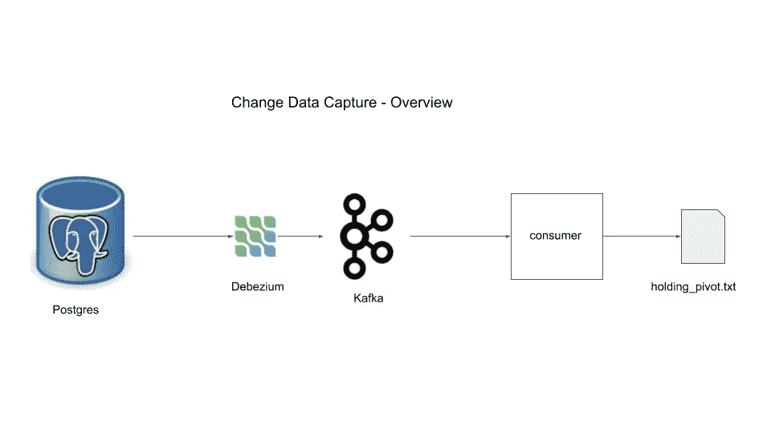
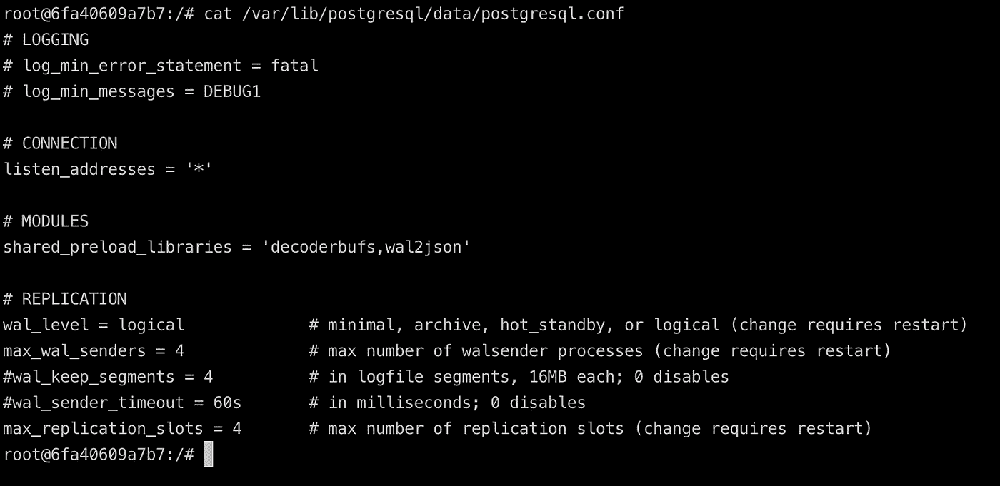
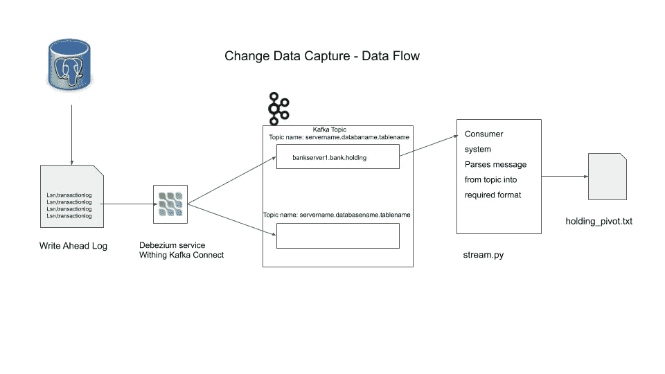

# 用 Debezium Kafka 和 MySQL 改变数据捕获

> 原文：<https://levelup.gitconnected.com/change-data-capture-with-debezium-kafka-and-mysql-359f7bc6b29a>

# 什么是变更数据捕获？

将数据从应用程序数据库移动到另一个数据库，而对应用程序功能的影响可以忽略不计，这是使用移位数据捕获架构模式的主要灵感。

## 使用

1.  跟踪数据的变化，以馈入弹性搜索索引。
2.  将数据更改从 OLTP 实时移动到 OLAP
3.  创建审计日志等

# 项目概述

我们将使用 Mysql 作为我们的数据库



‍

# 成分

# 先决条件安装

为了跟进，你需要以下指定的工具

1.  [停靠](https://docs.docker.com/get-docker/)(首选)运行`postgres, debezium and kafka`
2.  [pgcli](https://github.com/dbcli/pgcli) 连接到我们的`postgres`实例

# 1.Postgres

这将作为我们的应用程序数据库。为了理解 CDC(与`debezium`一起)是如何工作的，我们需要理解当一个交易发生时会发生什么。当一个事务发生时，该事务被记录在磁盘中一个称为预写日志(WAL)的地方，然后处理数据更改、更新或删除。事务通常保存在缓存中，并批量刷新到磁盘，以保持较低的延迟。在数据库崩溃的情况下，我们可能会丢失缓存，但数据库可以使用磁盘中的日志进行恢复。使用 WAL，只有日志被写入磁盘，这比将所有数据更改写入磁盘的成本更低，这是`postgres`的开发人员不得不做出的折衷，以保持较低的事务延迟，并在崩溃时具有恢复能力(使用`WAL`)。

您可以将 WAL 看作是一个仅附加的日志，它包含了所有操作的顺序信息，时间戳表示事务的记录时间。WAL 文件会被定期删除或存档，以便保持数据库较小。

我们将使用 docker 运行一个`postgres`实例

```
docker run -d --name postgres -p 5432:5432 -e POSTGRES_USER=start_data_engineer \
-e POSTGRES_PASSWORD=password debezium/postgres:12
```

上面的 docker 命令启动了一个名为`postgres`的`postgres` docker 容器。用户名设为`start_data_engineer`，密码设为`password`。如果你注意到你会看到我们已经使用了`debezium/postgres:12`图像，使用 debezium 的 docker of postgres 的原因是为了启用 postgres 需要的设置来操作 debezium。让我们来看看这些设置

```
docker exec -ti postgres /bin/bash
```

使用上面的命令以交互模式-it 在 postgres 容器上执行/bin/bash 命令。你现在在你的 docker 容器里面。输入

```
cat /var/lib/postgresql/data/postgresql.conf
```

查看 postgres 的配置设置。

## postgresql.conf



‍

复制部分是我们设置数据库写入 WAL 的配置的地方。这

1.  `wal_level`具有最少的选项:从数据库崩溃中重启所需的最少信息，存档:使数据库引擎能够执行 WAL 存档，hot_standby:使数据库引擎能够创建我们的服务器的只读副本，逻辑:是我们的目的所需要的，它添加了所有必要的信息，使这个(WAL)数据可供其他系统使用。
2.  `max_wal_senders`WAL 发送者是在数据库上运行的进程，用于将 WAL 发送给接收者(其他副本或系统)。此配置表示允许的最大 WAL 发送方进程数。

让我们在 postgres 中创建数据。我们使用 pgcli 与 postgres 实例进行交互

```
pgcli -h localhost -p 5432 -U start_data_engineer
#password is passwordCREATE SCHEMA bank;
SET search_path TO bank,public;
CREATE TABLE bank.holding (
    holding_id int,
    user_id int,
    holding_stock varchar(8),
    holding_quantity int,
    datetime_created timestamp,
    datetime_updated timestamp,
    primary key(holding_id)
);
ALTER TABLE bank.holding replica identity FULL;
insert into bank.holding values (1000, 1, 'VFIAX', 10, now(), now());
\q
```

以上是标准 sql，加上了`replica identity`。该字段可选择设置为`DEFAULT, NOTHING, FULL and INDEX`之一，决定写入 WAL 的详细信息量。我们选择 full 来获取我们的 WAL 中 CRUD 变更事件的所有前后数据，`INDEX`选项与 FULL 相同，但它也包括对 WAL 中的索引所做的变更，这是我们的项目目标所不需要的。我们还在保存表中插入一行。

# 2.卡夫卡

Kafka 是一个至少有一次保证的消息队列系统。卡夫卡一些关键概念的快速概述

1.  卡夫卡是一个`distributed message queue`系统。分布式集群管理由 zookeeper 提供。
2.  `broker`处理消费者写、生产者请求和元数据配置。kafka 集群中的一个服务器是一个 kafka 代理，一个 kafka 集群中可以有多个代理
3.  `Topic`是一个特定的队列，生产者可以将数据推入其中，消费者可以从中读取数据。
4.  `Partitions`是在集群上分发主题内容的方式。
5.  您可以将`offset`(特定于一个分区)看作是一个指针，当从那个主题分区读取消息时，它指向您所在的消息。

在我们的项目中，kafka broker 将用于将 postgres 数据库中的数据更改存储为消息。我们将在后面的小节中设置一个消费者来从代理读取数据。

让我们开始`zookeeper`和一个卡夫卡式的经纪人

```
docker run -d --name zookeeper -p 2181:2181 -p 2888:2888 -p 3888:3888 debezium/zookeeper:1.1
docker run -d --name kafka -p 9092:9092 --link zookeeper:zookeeper debezium/kafka:1.1
```

为了方便起见，我们再次使用 debezium 图像。您可以看到，对于动物园管理员，我们保持端口 21821、2888、3888 打开，这些是动物园管理员操作所必需的。同样，我们让 9092 对卡夫卡开放，我们可以通过这个端口与卡夫卡交流。

# 3.Debezium

我们使用一个叫做 Connect 的 kafka 工具来运行 debezium。顾名思义，connect 提供了一个框架，将输入数据源连接到 kafka，并将 kafka 连接到输出接收器。它作为单独的服务运行。

Debezium 负责从源数据系统(在我们的例子中是 postgres)中读取数据，并以合适的格式将其推送到 kafka 主题(根据表自动命名)中。

让我们开始一个 kafka 连接容器

```
docker run -d --name connect -p 8083:8083 --link kafka:kafka \
--link postgres:postgres -e BOOTSTRAP_SERVERS=kafka:9092 \
-e GROUP_ID=sde_group -e CONFIG_STORAGE_TOPIC=sde_storage_topic \
-e OFFSET_STORAGE_TOPIC=sde_offset_topic debezium/connect:1.1
```

注意，我们用 BOOTSTRAP_SERVERS env 变量指定了 kafka 主机和端点。这里的 GROUP_ID 表示这个连接服务所属的组。我们可以使用 curl 来检查已注册的连接服务。注意:在运行下面的 curl 命令之前，请等待几秒钟(至少 10 秒钟)

```
curl -H "Accept:application/json" localhost:8083/connectors/
[]
```

我们可以使用 curl 命令在端口 8083 上注册一个 debezium connect 服务

```
curl -i -X POST -H "Accept:application/json" -H "Content-Type:application/json" \
localhost:8083/connectors/ -d '{"name": "sde-connector", "config": {"connector.class": "io.debezium.connector.postgresql.PostgresConnector", "database.hostname": "postgres", "database.port": "5432", "database.user": "start_data_engineer", "database.password": "password", "database.dbname" : "start_data_engineer", "database.server.name": "bankserver1", "table.whitelist": "bank.holding"}}'
```

让我们看看上面 api 调用的配置部分

```
{
  "name": "sde-connector",
  "config": {
    "connector.class": "io.debezium.connector.postgresql.PostgresConnector",
    "database.hostname": "postgres",
    "database.port": "5432",
    "database.user": "start_data_engineer",
    "database.password": "password",
    "database.dbname": "start_data_engineer",
    "database.server.name": "bankserver1",
    "table.whitelist": "bank.holding"
  }
}
```

1.  `The database.*`配置是我们 postgres 数据库的连接参数
2.  `database.server.name`是我们为数据库指定的名称
3.  `table.whitelist`是一个字段，通知 debezium 连接器只从那个表中读取数据变更。同样，您可以将表或模式列入白名单或黑名单。默认情况下，debezium 从模式中的所有表中读取数据。
4.  `connector.class`连接器是否用于连接我们的 postgres 数据库
5.  `name`我们为连接器指定的名称

让我们检查连接器是否存在

```
curl -H "Accept:application/json" localhost:8083/connectors/
["sde-connector"]%
```

我们可以看到 sde 连接器已注册。

# 4.消费者

既然我们已经有了将消息推入 kafka 代理的连接器，我们就可以使用消费者来消费消息了。让我们使用下面的命令，只看一下 kafka 主题 bankserver1.bank.holding 中的第一条消息

```
docker run -it --rm --name consumer --link zookeeper:zookeeper --link kafka:kafka debezium/kafka:1.1 watch-topic -a bankserver1.bank.holding --max-messages 1 | grep '^{' | jq
```

在上面的例子中，我们启动了一个消费者容器来观察遵循格式`{database.server.name}.{schema}.{table_name}`的主题`bankserver1.bank.holding`，并且我们已经将这个消费者要读取的最大消息数设置为 1。grep 将过滤掉非 JSON 行，因为 docker 容器将打印出一些配置。 [jq](https://stedolan.github.io/jq/download/) (可选下载)是对 json 进行格式化。输出应该类似于下面所示的结构

```
{
  "schema": {
    "type": "struct",
    "fields": [
      {
        "type": "struct",
        "fields": [
          {
            "type": "int32",
            "optional": false,
            "field": "holding_id"
          },
          {
            "type": "int32",
            "optional": true,
            "field": "user_id"
          },
          {
            "type": "string",
            "optional": true,
            "field": "holding_stock"
          },
          {
            "type": "int32",
            "optional": true,
            "field": "holding_quantity"
          },
          {
            "type": "int64",
            "optional": true,
            "name": "io.debezium.time.MicroTimestamp",
            "version": 1,
            "field": "datetime_created"
          },
          {
            "type": "int64",
            "optional": true,
            "name": "io.debezium.time.MicroTimestamp",
            "version": 1,
            "field": "datetime_updated"
          }
        ],
        "optional": true,
        "name": "bankserver1.bank.holding.Value",
        "field": "before"
      },
      {
        "type": "struct",
        "fields": [
          {
            "type": "int32",
            "optional": false,
            "field": "holding_id"
          },
          {
            "type": "int32",
            "optional": true,
            "field": "user_id"
          },
          {
            "type": "string",
            "optional": true,
            "field": "holding_stock"
          },
          {
            "type": "int32",
            "optional": true,
            "field": "holding_quantity"
          },
          {
            "type": "int64",
            "optional": true,
            "name": "io.debezium.time.MicroTimestamp",
            "version": 1,
            "field": "datetime_created"
          },
          {
            "type": "int64",
            "optional": true,
            "name": "io.debezium.time.MicroTimestamp",
            "version": 1,
            "field": "datetime_updated"
          }
        ],
        "optional": true,
        "name": "bankserver1.bank.holding.Value",
        "field": "after"
      },
      {
        "type": "struct",
        "fields": [
          {
            "type": "string",
            "optional": false,
            "field": "version"
          },
          {
            "type": "string",
            "optional": false,
            "field": "connector"
          },
          {
            "type": "string",
            "optional": false,
            "field": "name"
          },
          {
            "type": "int64",
            "optional": false,
            "field": "ts_ms"
          },
          {
            "type": "string",
            "optional": true,
            "name": "io.debezium.data.Enum",
            "version": 1,
            "parameters": {
              "allowed": "true,last,false"
            },
            "default": "false",
            "field": "snapshot"
          },
          {
            "type": "string",
            "optional": false,
            "field": "db"
          },
          {
            "type": "string",
            "optional": false,
            "field": "schema"
          },
          {
            "type": "string",
            "optional": false,
            "field": "table"
          },
          {
            "type": "int64",
            "optional": true,
            "field": "txId"
          },
          {
            "type": "int64",
            "optional": true,
            "field": "lsn"
          },
          {
            "type": "int64",
            "optional": true,
            "field": "xmin"
          }
        ],
        "optional": false,
        "name": "io.debezium.connector.postgresql.Source",
        "field": "source"
      },
      {
        "type": "string",
        "optional": false,
        "field": "op"
      },
      {
        "type": "int64",
        "optional": true,
        "field": "ts_ms"
      },
      {
        "type": "struct",
        "fields": [
          {
            "type": "string",
            "optional": false,
            "field": "id"
          },
          {
            "type": "int64",
            "optional": false,
            "field": "total_order"
          },
          {
            "type": "int64",
            "optional": false,
            "field": "data_collection_order"
          }
        ],
        "optional": true,
        "field": "transaction"
      }
    ],
    "optional": false,
    "name": "bankserver1.bank.holding.Envelope"
  },
  "payload": {
    "before": null,
    "after": {
      "holding_id": 1000,
      "user_id": 1,
      "holding_stock": "VFIAX",
      "holding_quantity": 10,
      "datetime_created": 1589121006547486,
      "datetime_updated": 1589121006547486
    },
    "source": {
      "version": "1.1.1.Final",
      "connector": "postgresql",
      "name": "bankserver1",
      "ts_ms": 1589121006548,
      "snapshot": "false",
      "db": "start_data_engineer",
      "schema": "bank",
      "table": "holding",
      "txId": 492,
      "lsn": 24563232,
      "xmin": null
    },
    "op": "c",
    "ts_ms": 1589121006813,
    "transaction": null
  }
}
```

基本上有两个主要部分

1.  `schema`:schema 定义了`before`、`after`、`source`、`op`、`ts_ms`和`transaction`段的有效载荷的模式。消费者客户端程序可以使用这些数据来解析输入。
2.  `payload`:包含实际数据，有前后两部分，分别显示持有、数据变更前后的栏目。数据更改由`op`表示，它是 c create (insert)、update、delete 和 r read(在快照时)之一。source 部分显示了 WAL 配置，其中`tx_id`表示事务 id 和`lsn`日志序列号，用于存储每个 WAL 记录的日志文件的字节偏移量。

我们关心之前和之后的部分。我们将使用 python 将其格式化为我们在开始时定义的枢纽结构。

```
#!/usr/bin/env python3 -u
# Note: the -u denotes unbuffered (i.e output straing to stdout without buffering data and then writing to stdout)import json
import os
import sys
from datetime import datetimeFIELDS_TO_PARSE = ['holding_stock', 'holding_quantity']def parse_create(payload_after, op_type):
    current_ts = datetime.now().strftime('%Y-%m-%d-%H-%M-%S')
    out_tuples = []
    for field_to_parse in FIELDS_TO_PARSE:
        out_tuples.append(
            (
                payload_after.get('holding_id'),
                payload_after.get('user_id'),
                field_to_parse,
                None,
                payload_after.get(field_to_parse),
                payload_after.get('datetime_created'),
                None,
                None,
                current_ts,
                op_type
            )
        )return out_tuplesdef parse_delete(payload_before, ts_ms, op_type):
    current_ts = datetime.now().strftime('%Y-%m-%d-%H-%M-%S')
    out_tuples = []
    for field_to_parse in FIELDS_TO_PARSE:
        out_tuples.append(
            (
                payload_before.get('holding_id'),
                payload_before.get('user_id'),
                field_to_parse,
                payload_before.get(field_to_parse),
                None,
                None,
                ts_ms,
                current_ts,
                op_type
            )
        )return out_tuplesdef parse_update(payload, op_type):
    current_ts = datetime.now().strftime('%Y-%m-%d-%H-%M-%S')
    out_tuples = []
    for field_to_parse in FIELDS_TO_PARSE:
        out_tuples.append(
            (
                payload.get('after', {}).get('holding_id'),
                payload.get('after', {}).get('user_id'),
                field_to_parse,
                payload.get('before', {}).get(field_to_parse),
                payload.get('after', {}).get(field_to_parse),
                None,
                payload.get('ts_ms'),
                None,
                current_ts,
                op_type
            )
        )return out_tuplesdef parse_payload(input_raw_json):
    input_json = json.loads(input_raw_json)
    op_type = input_json.get('payload', {}).get('op')
    if op_type == 'c':
        return parse_create(
            input_json.get('payload', {}).get('after', {}),
            op_type
        )
    elif op_type == 'd':
        return parse_delete(
            input_json.get('payload', {}).get('before', {}),
            input_json.get('payload', {}).get('ts_ms', None),
            op_type
        )
    elif op_type == 'u':
        return parse_update(
            input_json.get('payload', {}),
            op_type
        )
    # no need to log read events
    return []for line in sys.stdin:
    # 1\. reads line from unix pipe, assume only valid json come through
    # 2\. parse the payload into a format we can use
    # 3\. prints out the formatted data as a string to stdout
    # 4\. the string is of format
    #    holding_id, user_id, change_field, old_value, new_value, datetime_created, datetime_updated, datetime_deleted, datetime_inserted
    data = parse_payload(line)
    for log in data:
        log_str = ','.join([str(elt) for elt in log])
        print(log_str, flush=True)
```

**注**:使用 [tmux](https://github.com/tmux/tmux/wiki) 方便多终端查看。

```
docker run -it --rm --name consumer --link zookeeper:zookeeper \
--link kafka:kafka debezium/kafka:1.1 watch-topic \
-a bankserver1.bank.holding | grep --line-buffered '^{' \
| <your-file-path>/stream.py > <your-output-path>/holding_pivot.txt
```

上面的命令启动一个消费者容器，`grep`只允许以{表示一个 json，line-buffered 选项告诉 grep 一次输出一行而不进行缓冲(缓冲区大小取决于您的操作系统)，然后使用 python 脚本将消息转换成我们想要的格式，并将输出写入一个名为`holding_pivot.txt`的文件。

在另一个终端中，执行以下操作

```
tail -f <your-output-path>/holding_pivot.txt
```

上面的命令打开 holding_pivot.txt 文件，然后继续执行，这样您就可以看到是否有新的行添加到文件中。在另一个终端中，使用

```
pgcli -h localhost -p 5432 -U start_data_engineer
# the password is password
```

尝试以下 sql 脚本，并确保您在 holding_pivot.txt 中看到的输出是准确的

```
-- C
insert into bank.holding values (1001, 2, 'SP500', 1, now(), now());
insert into bank.holding values (1002, 3, 'SP500', 1, now(), now());-- U
update bank.holding set holding_quantity = 100 where holding_id=1000;-- d
delete from bank.holding where user_id = 3;
delete from bank.holding where user_id = 2;-- c
insert into bank.holding values (1003, 3, 'VTSAX', 100, now(), now());-- u
update bank.holding set holding_quantity = 10 where holding_id=1003;
```

您的输出应该是

```
1000,1,holding_stock,None,VFIAX,1589121006547486,None,None,2020-05-10-10-31-23,c
1000,1,holding_quantity,None,10,1589121006547486,None,None,2020-05-10-10-31-23,c
1001,2,holding_stock,None,SP500,1589121109691459,None,None,2020-05-10-10-31-50,c
1001,2,holding_quantity,None,1,1589121109691459,None,None,2020-05-10-10-31-50,c
1002,3,holding_stock,None,SP500,1589121109695248,None,None,2020-05-10-10-31-50,c
1002,3,holding_quantity,None,1,1589121109695248,None,None,2020-05-10-10-31-50,c
1000,1,holding_stock,VFIAX,VFIAX,None,1589121112732,None,2020-05-10-10-31-53,u
1000,1,holding_quantity,10,100,None,1589121112732,None,2020-05-10-10-31-53,u
1002,3,holding_stock,SP500,None,None,1589121116301,2020-05-10-10-31-56,d
1002,3,holding_quantity,1,None,None,1589121116301,2020-05-10-10-31-56,d
1001,2,holding_stock,SP500,None,None,1589121116303,2020-05-10-10-31-56,d
1001,2,holding_quantity,1,None,None,1589121116303,2020-05-10-10-31-56,d
1003,3,holding_stock,None,VTSAX,1589121119075024,None,None,2020-05-10-10-31-59,c
1003,3,holding_quantity,None,100,1589121119075024,None,None,2020-05-10-10-31-59,c
1003,3,holding_stock,VTSAX,VTSAX,None,1589121121916,None,2020-05-10-10-32-02,u
1003,3,holding_quantity,100,10,None,1589121121916,None,2020-05-10-10-32-02,u
```

# 数据流

这代表了我们如何使用 CDC 模式从应用程序数据库中捕获更改，将其转换为不同的格式，而不会影响应用程序性能或内存。

## 设计数据流



‍

## Docker 命令

```
# starting a pg instance
docker run -d --name postgres -p 5432:5432 -e POSTGRES_USER=start_data_engineer -e POSTGRES_PASSWORD=password debezium/postgres:12# bash into postgres instance
docker exec -ti postgres /bin/bash# zookeeper and kafka broker
docker run -d --name zookeeper -p 2181:2181 -p 2888:2888 -p 3888:3888 debezium/zookeeper:1.1
docker run -d --name kafka -p 9092:9092 --link zookeeper:zookeeper debezium/kafka:1.1# Kafka connect
docker run -d --name connect -p 8083:8083 --link kafka:kafka --link postgres:postgres -e BOOTSTRAP_SERVERS=kafka:9092 -e GROUP_ID=sde_group -e CONFIG_STORAGE_TOPIC=sde_storage_topic -e OFFSET_STORAGE_TOPIC=sde_offset_topic debezium/connect:1.1# register debezium connector
curl -i -X POST -H "Accept:application/json" -H "Content-Type:application/json" localhost:8083/connectors/ -d '{"name": "sde-connector", "config": {"connector.class": "io.debezium.connector.postgresql.PostgresConnector", "database.hostname": "postgres", "database.port": "5432", "database.user": "start_data_engineer", "database.password": "password", "database.dbname" : "start_data_engineer", "database.server.name": "bankserver1", "table.whitelist": "bank.holding"}}'# sample consumer
docker run -it --rm --name consumer --link zookeeper:zookeeper --link kafka:kafka debezium/kafka:1.1 watch-topic -a bankserver1.bank.holding --max-messages 1 | grep '^{'# stream consumer, parse it and write to file
docker run -it --rm --name consumer --link zookeeper:zookeeper --link kafka:kafka debezium/kafka:1.1 watch-topic -a bankserver1.bank.holding | grep --line-buffered '^{' | <your-file-path>/stream.py > <your-output-path>/holding_pivot.txt
```

# 停靠码头集装箱

您可以使用以下命令停止并删除 docker 容器

```
docker stop $(docker ps -aq)
docker rm $(docker ps -aq)docker stop <your-container-name> # to stop and remove specific container
docker rm <your-container-name>
```

# 需要注意的事项

1.  我们看到数据发生了变化，但没有看到数据模式的变化，这取决于您的用例，这可能会变得非常棘手。
2.  你需要 postgres 或更高版本。
3.  WAL 配置需要仔细设置，以防止数据库过载。
4.  与大多数分布式系统一样，存在多个故障点，例如，数据库可能崩溃，kafka 集群可能崩溃，您的用户可能崩溃，等等。始终为故障做好计划，并拥有处理这些问题的恢复机制。
5.  kafka 和 debezium 都提供至少一次事件交付保证。这很好，但是您的消费者或用户必须被设计为处理重复。一个好的方法是在消费者端使用基于 upsert 的数据摄取。

# 结论

希望这篇文章能让你了解什么是变更数据捕获，什么时候使用它，如何使用 debezium 实现它，以及需要注意的常见陷阱。如果你有任何问题，请在下面的评论区告诉我。