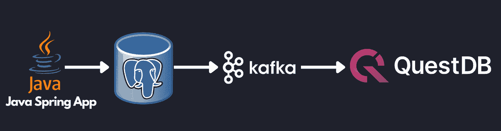
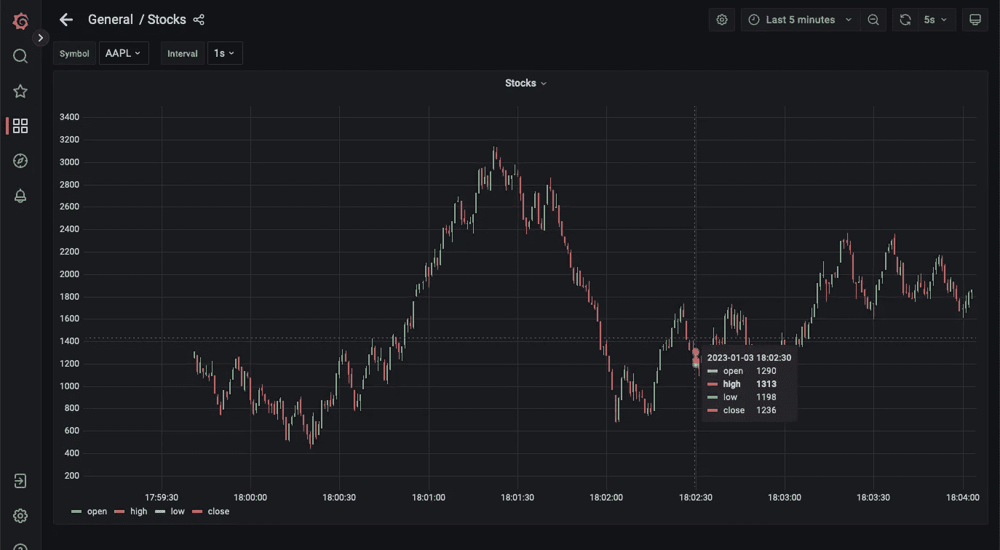
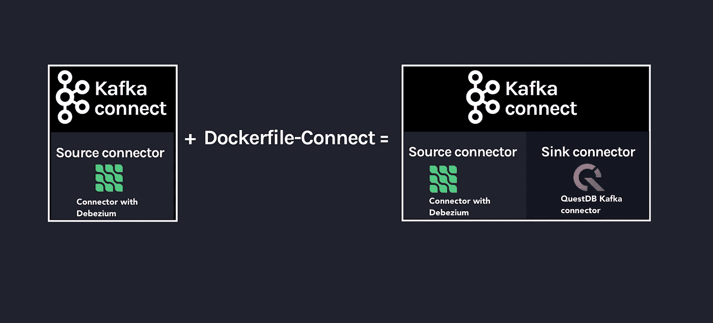
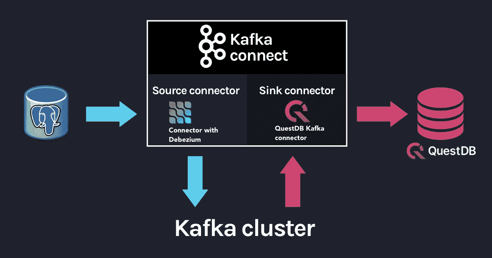

# 用 QuestDB & Debezium 改变数据捕获

> 原文：<https://levelup.gitconnected.com/change-data-capture-with-questdb-debezium-534bef199d74>

通过 Debezium 和 Kafka Connect 使用变更数据捕获将数据流式传输到 QuestDB。


尼古拉斯·卡佩罗在 [Unsplash](https://unsplash.com?utm_source=medium&utm_medium=referral) 上拍摄的照片

现代数据架构已经在很大程度上从 **ETL** (提取-转换-加载)范式转移到 **ELT** (提取-加载-转换)，其中原始数据首先加载到数据湖中，然后再应用转换(例如聚合、连接)进行进一步分析。传统的 ETL 管道很难维护，并且随着业务需求的变化相对不灵活。随着新的云技术承诺更便宜的存储和更好的可扩展性，数据管道可以从预先构建的提取和批量上传转移到更流媒体的架构。

[变更数据捕获](https://en.wikipedia.org/wiki/Change_data_capture) (CDC)非常适合这种范式转变，来自一个源的数据变更可以传输到其他目的地。顾名思义，CDC 跟踪数据(通常是数据库)的变化，并提供插件来处理这些变化。对于事件驱动的架构，CDC 作为服务边界之间一致的数据交付机制特别有用(例如[发件箱模式](https://microservices.io/patterns/data/transactional-outbox.html))。在复杂的微服务环境中，CDC 通过减轻 CDC 系统的负担，帮助简化数据交付逻辑。

为了说明这一点，让我们用一个参考架构将股票更新从 PostgreSQL 流式传输到 QuestDB。一个简单的 Java Spring 应用程序通过股票代码查询股票价格，并将当前价格更新到 PostgreSQL 数据库。然后，这些更新被 Debezium(一个流行的 CDC 系统)检测到，并被发送到 Kafka 主题。最后，Kafka Connect QuestDB 连接器监听该主题，并将更改传输到 QuestDB 进行分析。



以这种方式构建数据管道可以使应用程序变得简单。Java Spring 应用程序只需要获取最新的股票数据并提交给 PostgreSQL。由于 PostgreSQL 是一个优秀的 OLTP(事务性)数据库，该应用程序可以依靠 ACID 合规性来确保下游服务只能看到提交的数据。应用程序开发人员无需担心复杂的重试逻辑或不同步的数据集。从数据库的角度来看，PostgreSQL 可以被优化来做它最擅长的事情——事务查询。Kafka 可用于可靠地向其他端点提供数据，QuestDB 可用于存储历史数据以运行分析查询和可视化。

所以，事不宜迟，让我们来看看这个例子:

# 先决条件

*   饭桶
*   Docker 引擎:20.10 以上

# 设置

要在本地运行该示例，首先克隆 repo: `git clone [https://github.com/questdb/kafka-questdb-connector.git](https://github.com/questdb/kafka-questdb-connector.git)`

然后，导航到`stocks`示例来构建并运行 Docker 合成文件:

```
$ cd kafka-questdb-connector/kafka-questdb-connector-samples/stocks/
$ docker compose build
$ docker compose up
```

这将为 QuestDB 构建 Java Spring App/Kafka 连接器的 Dockerfile，并下拉 PostgreSQL(预先配置了 Debezium)、Kafka/Zookeeper、QuestDB 和 Grafana 容器。Kafka 和 Kafka Connect 需要一点时间来初始化。检查`connect`集装箱，等待原木停止。

## 启动 Debezium 连接器

此时，Java 应用程序正在持续更新 PostgreSQL 中的股票表，但是连接尚未建立。通过执行以下命令创建 Debezium 连接器(即 PostgreSQL → Debezium → Kafka ):

```
curl -X POST -H "Content-Type: application/json" -d  '{"name":"debezium_source","config":{"tasks.max":1,"database.hostname":"postgres","database.port":5432,"database.user":"postgres","database.password":"postgres","connector.class":"io.debezium.connector.postgresql.PostgresConnector","database.dbname":"postgres","database.server.name":"dbserver1"}} ' localhost:8083/connectors
```

## 启动 QuestDB Kafka 连接接收器

通过创建 Kafka 连接端(即 Kafka → QuestDB sink)来完成管道工程:

```
curl -X POST -H "Content-Type: application/json" -d '{"name":"questdb-connect","config":{"topics":"dbserver1.public.stock","table":"stock", "connector.class":"io.questdb.kafka.QuestDBSinkConnector","tasks.max":"1","key.converter":"org.apache.kafka.connect.storage.StringConverter","value.converter":"org.apache.kafka.connect.json.JsonConverter","host":"questdb", "transforms":"unwrap", "transforms.unwrap.type":"io.debezium.transforms.ExtractNewRecordState", "include.key": "false", "symbols": "symbol", "timestamp.field.name": "last_update"}}' localhost:8083/connectors
```

# 决赛成绩

现在，写入 PostgreSQL 表的所有更新也将反映在 QuestDB 中。要进行验证，导航至`localhost:19000`并从`stock`表中选择:

```
select * from stock;
```

您还可以运行聚合来进行更复杂的分析:

```
SELECT
  timestamp,
  symbol,
  avg(price),
  min(price),
  max(price)
FROM stock
  where symbol = 'IBM'
SAMPLE by 1m align to calendar;
```

最后，您可以在`[http://localhost:3000/d/stocks/stocks?orgId=1&refresh=5s&viewPanel=2](http://localhost:3000/d/stocks/stocks?orgId=1&refresh=5s&viewPanel=2)`与 Grafana 仪表盘进行交互，实现可视化

可视化是由 Debezium 捕获的变化组成的蜡烛图；每根蜡烛线显示在给定的时间间隔内的开盘价、收盘价、最高价和最低价。可以通过选择左上角的“间隔”选项来更改时间间隔:



# 深潜

现在我们已经启动并运行了示例应用程序，让我们更深入地研究一下[股票](https://github.com/questdb/kafka-questdb-connector/tree/main/kafka-questdb-connector-samples/stocks)示例中的每个组件。

我们将查看以下文件:

```
├── kafka-questdb-connector/kafka-questdb-connector-samples/stocks/
│   ├── Dockerfile-App
|   |    -- The Dockerfile to package our Java App
|   ├── Dockerfile-Connect
|   |    -- The Dockerfile to combine the Debezium container
|   |    -- image the with QuestDB Kafka connector
│   ├── src/main/resources/schema.sql
|   |    -- The SQL which creates the stock table in PostgreSQL
|   |    -- and populates it with initial data
│   ├── src/main/java/com/questdb/kafka/connector/samples/StocksApplication.java
|   |    -- The Java Spring App which updates the stock table in PostgreSQL
|   |    -- in regular intervals
...
```

## 生产者(Java 应用程序)

生成器是一个简单的 Java Spring Boot 应用程序。它有两个组成部分:

1.  `[schema.sql](https://github.com/questdb/kafka-questdb-connector/blob/main/kafka-questdb-connector-samples/stocks/src/main/resources/schema.sql)`文件。该文件用于在 PostgreSQL 中创建股票表，并用初始数据填充它。它由 Spring Boot 应用程序获取，并在启动时执行。

```
create table if not exists stock (
    id serial primary key,
    symbol varchar(10) unique,
    price float8,
    last_update timestamp
);
insert into stock (symbol, price, last_update) values ('AAPL', 500.0, now()) ON CONFLICT DO NOTHING;
insert into stock (symbol, price, last_update) values ('IBM', 50.0, now()) ON CONFLICT DO NOTHING;
insert into stock (symbol, price, last_update) values ('MSFT', 100.0, now()) ON CONFLICT DO NOTHING;
insert into stock (symbol, price, last_update) values ('GOOG', 1000.0, now()) ON CONFLICT DO NOTHING;
insert into stock (symbol, price, last_update) values ('FB', 200.0, now()) ON CONFLICT DO NOTHING;
insert into stock (symbol, price, last_update) values ('AMZN', 1000.0, now()) ON CONFLICT DO NOTHING;
insert into stock (symbol, price, last_update) values ('TSLA', 500.0, now()) ON CONFLICT DO NOTHING;
insert into stock (symbol, price, last_update) values ('NFLX', 500.0, now()) ON CONFLICT DO NOTHING;
insert into stock (symbol, price, last_update) values ('TWTR', 50.0, now()) ON CONFLICT DO NOTHING;
insert into stock (symbol, price, last_update) values ('SNAP', 10.0, now()) ON CONFLICT DO NOTHING;
```

`ON CONFLICT DO NOTHING`子句用于在应用程序重启时避免表中出现重复条目。

2. [Java 代码](https://github.com/questdb/kafka-questdb-connector/blob/main/kafka-questdb-connector-samples/stocks/src/main/java/io/questdb/kafka/samples/StockService.java)用随机值更新价格和时间戳。更新并不是完全随机的，该应用程序使用一个非常简单的算法来生成非常类似于股票价格运动的更新。在现实生活中，应用程序将从一些外部来源获取价格。

生产者被打包成一个最小的 docker 文件，`[Dockerfile-App](https://github.com/questdb/kafka-questdb-connector/blob/main/kafka-questdb-connector-samples/stocks/Dockerfile-App)`，并链接到 PostgreSQL:

```
FROM maven:3.8-jdk-11-slim AS builder
COPY ./pom.xml /opt/stocks/pom.xml
COPY ./src ./opt/stocks/src
WORKDIR /opt/stocks
RUN mvn clean install -DskipTests

FROM azul/zulu-openjdk:11-latest
COPY --from=builder /opt/stocks/target/kafka-samples-stocks-*.jar /stocks.jar
CMD ["java", "-jar", "/stocks.jar"]
```

## Kafka Connect、Debezium 和 QuestDB Kafka 连接器

在我们深入研究 Kafka Connect、Debezium 和 QuestDB Kafka 连接器配置之前，让我们看一下它们之间的关系。

Kafka Connect 是一个框架，用于构建在 Kafka 和其他系统之间移动数据的连接器。它支持两类连接器:

1.  源连接器—从源系统读取数据并将其写入 Kafka
2.  接收器连接器—从 Kafka 读取数据并将其写入接收器系统

Debezium 是 Kafka Connect 的一个源连接器，可以监视和捕获数据库中行级别的变化。这是什么意思？每当在数据库中插入、更新或删除一行时，Debezium 都会捕捉到这一变化，并将其作为一个事件写入 Kafka。

在技术层面上，Debezium 是一个运行在 Kafka Connect 框架内部的 Kafka Connect 连接器。这反映在 [Debezium 容器映像](https://hub.docker.com/r/debezium/connect)中，它打包了 Kafka Connect 和预安装的 Debezium 连接器。

QuestDB Kafka 连接器也是 Kafka Connect 连接器。它是一个 Sink 连接器，从 Kafka 读取数据并将其写入 QuestDB。我们将 QuestDB Kafka 连接器添加到 Debezium 容器映像中，然后我们得到一个安装了 Debezium 和 QuestDB Kafka 连接器的 Kafka Connect 映像！

这是我们用来构建图像的 Dockerfile 文件:

```
FROM ubuntu:latest AS builder
WORKDIR /opt
RUN apt-get update && apt-get install -y curl wget unzip jq
RUN curl -s https://api.github.com/repos/questdb/kafka-questdb-connector/releases/latest | jq -r '.assets[]|select(.content_type == "application/zip")|.browser_download_url'| wget -qi -
RUN unzip kafka-questdb-connector-*-bin.zip

FROM debezium/connect:1.9.6.Final
COPY --from=builder /opt/kafka-questdb-connector/*.jar /kafka/connect/questdb-connector/
```

Dockerfile 下载 QuestDB Kafka 连接器的最新版本，将其解压缩并复制到 Debezium 容器映像中。生成的映像安装了 Debezium 和 QuestDB Kafka 连接器:



整个 Kafka 连接器包括一个源连接器和一个接收器连接器:



## Debezium 连接器

我们已经知道 Debezium 是一个 Kafka Connect 连接器，它可以监视和捕获数据库中行级别的变化。我们还有一个 Docker 映像，它安装了 Debezium 和 QuestDB Kafka 连接器。但是，此时两个连接器都没有运行。我们需要配置并启动它们。这是通过 CURL 命令完成的，该命令向 Kafka Connect REST API 发送 POST 请求。

```
curl -X POST -H "Content-Type: application/json" -d  '{"name":"debezium_source","config":{"tasks.max":1,"database.hostname":"postgres","database.port":5432,"database.user":"postgres","database.password":"postgres","connector.class":"io.debezium.connector.postgresql.PostgresConnector","database.dbname":"postgres","database.server.name":"dbserver1"}} ' localhost:8083/connectors
```

请求体包含 Debezium 连接器的配置，让我们来分解一下:

```
{
  "name": "debezium_source",
  "config": {
    "tasks.max": 1,
    "database.hostname": "postgres",
    "database.port": 5432,
    "database.user": "postgres",
    "database.password": "postgres",
    "connector.class": "io.debezium.connector.postgresql.PostgresConnector",
    "database.dbname": "postgres",
    "database.server.name": "dbserver1"
  }
}
```

它监听 PostgreSQL 数据库中的更改，并使用上述配置发布到 Kafka。在我们的例子中，主题名称默认为`<server-name>.<schema>.<table>.`，它是`dbserver1.public.stock`。为什么？因为数据库服务器名是`dbserver1`，模式是`public`，我们仅有的表是`stock`。

所以在我们发送请求后，Debezium 将开始监听`stock`表中的变化，并将它们发布到`dbserver1.public.stock`主题。

## QuestDB Kafka 连接器 [#](https://questdb.io/blog/2023/01/03/change-data-capture-with-questdb-and-debezium#questdb-kafka-connector)

此时，我们有一个用随机股票价格填充的 PostgreSQL 表`stock`和一个包含变化的 Kafka 主题`dbserver1.public.stock`。下一步是配置 QuestDB Kafka 连接器从`dbserver1.public.stock`主题中读取数据，并将数据写入 QuestDB。

让我们更深入地看看[start the QuestDB Kafka Connect sink](https://questdb.io/blog/2023/01/03/change-data-capture-with-questdb-and-debezium#start-the-questdb-kafka-connect-sink)中的配置:

```
{
  "name": "questdb-connect",
  "config": {
    "topics": "dbserver1.public.stock",
    "table": "stock",
    "connector.class": "io.questdb.kafka.QuestDBSinkConnector",
    "tasks.max": "1",
    "key.converter": "org.apache.kafka.connect.storage.StringConverter",
    "value.converter": "org.apache.kafka.connect.json.JsonConverter",
    "host": "questdb",
    "transforms": "unwrap",
    "transforms.unwrap.type": "io.debezium.transforms.ExtractNewRecordState",
    "include.key": "false",
    "symbols": "symbol",
    "timestamp.field.name": "last_update"
  }
}
```

这里需要注意的重要事项是:

*   `table`和`topics`:QuestDB Kafka 连接器将创建一个名为`stock`的 quest db 表，并将来自`dbserver1.public.stock`主题的数据写入其中。
*   `host`:QuestDB Kafka 连接器将连接到运行在`questdb`主机上的 quest db。这是 QuestDB 容器的名称。
*   `connector.class`:QuestDB Kafka 连接器类名。这告诉 Kafka Connect 使用 QuestDB Kafka 连接器。
*   `value.converter`:Debezium 连接器产生 JSON 格式的数据。这就是为什么我们需要配置 QuestDB 连接器来使用 JSON 转换器读取数据:`org.apache.kafka.connect.json.JsonConverter`。
*   `symbols`:股票符号被翻译成 [QuestDB 符号类型](https://questdb.io/docs/concept/symbol/)，用于基数较低的字符串值(如枚举)。
*   `timestamp.field.name`:由于 QuestDB 对时间戳和基于时间戳的分区有很好的支持，我们可以指定指定的时间戳列。
*   `transforms` : unwrap 字段使用`io.debezium.transforms.ExtractNewRecordState`类型来提取新数据，而不是 Debezium 发出的元数据。换句话说，这是一个过滤器，主要用来过滤关于 Kafka 主题的 Debezium 数据的`payload.after`部分。更多详情见其[文档](https://debezium.io/documentation/reference/1.9/transformations/event-flattening.html)。

`ExtractNewRecordState`转换可能是配置中最不直观的部分。让我们仔细看看:简而言之，对于 PostgreSQL 表中的每次更改，Debezium 都会向 Kafka 主题发出一条 JSON 消息，如下所示:

```
{
  "schema": {
    "comment": "this contains Debezium message schema, it's not very relevant for this sample"
  },
  "payload": {
    "before": null,
    "after": {
      "id": 8,
      "symbol": "NFLX",
      "price": 1544.3357414199545,
      "last_update": 1666172978269856
    },
    "source": {
      "version": "1.9.6.Final",
      "connector": "postgresql",
      "name": "dbserver1",
      "ts_ms": 1666172978272,
      "snapshot": "false",
      "db": "postgres",
      "sequence": "[\"87397208\",\"87397208\"]",
      "schema": "public",
      "table": "stock",
      "txId": 402087,
      "lsn": 87397208,
      "xmin": null
    },
    "op": "u",
    "ts_ms": 1666172978637,
    "transaction": null
  }
}
```

如果你被这条信息的庞大规模所淹没，不要害怕。大多数字段都是元数据，它们与本示例无关。参见 [Debezium 文档](https://debezium.io/documentation/reference/1.9/connectors/postgresql.html#postgresql-events)，了解更多详情。重要的一点是，我们不能将整个 JSON 消息推送到 QuestDB，我们也不想要 QuestDB 中的所有元数据。我们需要提取消息的`payload.after`部分，然后将其推送到 QuestDB。这正是`ExtractNewRecordState`转换所做的:它将大消息转换成一个更小的消息，其中只包含消息的`payload.after`部分。因此，消息看起来好像是这样的:

```
{
  "id": 8,
  "symbol": "NFLX",
  "price": 1544.3357414199545,
  "last_update": 1666172978269856
}
```

这是我们可以推送给 QuestDB 的消息。QuestDB Kafka 连接器将读取该消息，并将其写入 QuestDB 表。如果 QuestDB Kafka 连接器不存在，它也会创建 QuestDB 表。QuestDB 表将具有与 JSON 消息相同的模式——其中每个 JSON 字段都是 QuestDB 表中的一列。

## QuestDB 和 Grafana

一旦数据被写入 QuestDB 表，我们就可以更容易地处理时序数据。由于 QuestDB 与 PostgreSQL wire 协议兼容，我们可以使用 Grafana 上的 PostgreSQL 数据源来可视化数据。预配置仪表板正在使用以下查询:

```
SELECT
  $__time(timestamp),
  min(price) as low,
  max(price) as high,
  first(price) as open,
  last(price) as close
FROM
  stock
WHERE
  $__timeFilter(timestamp)
  and symbol = '$Symbol'
SAMPLE BY $Interval ALIGN TO CALENDAR;
```

我们已经创建了一个系统，可以在 PostgreSQL 表中持续跟踪和存储多只股票的最新价格。然后这些价格通过 Debezium 作为事件反馈给 Kafka，Debezium 捕捉每一个价格变化。QuestDB Kafka 连接器从 Kafka 读取这些事件，并将每个变化作为一个新行存储在 QuestDB 中，使我们能够保留股票价格的全面历史记录。然后可以使用 Grafana 等工具分析和可视化这一历史，如蜡烛图所示。

# 后续步骤

这个示例项目是一个基本的参考架构，用于将数据从关系数据库传输到优化的时序数据库。对于使用 PostgreSQL 的现有项目，可以将 Debezium 配置为开始将数据流式传输到 QuestDB，并利用时序查询和分区。对于存储原始历史数据的数据库，采用 Debezium 可能需要一些架构上的改变。然而，这是有益的，因为这是提高性能和在事务性数据库和分析性时序数据库之间建立服务边界的机会。

该参考架构还可以扩展到配置 Kafka Connect，使其也可以传输到其他数据仓库进行长期存储。在检查完数据后，QuestDB 还可以配置为对数据进行下采样，以便长期存储，甚至[分离分区以节省空间](https://questdb.io/blog/2022/11/02/data-lifecycle-questdb/)。

试试这个[示例应用程序](https://github.com/questdb/kafka-questdb-connector/issues/new)，如果有任何问题，请加入 [QuestDB Slack 社区](https://slack.questdb.io/)。

感谢您成为我们社区的一员！在你离开之前:

*   👏为故事鼓掌，跟着作者走👉
*   📰查看[升级编码出版物](https://levelup.gitconnected.com/?utm_source=pub&utm_medium=post)中的更多内容
*   🔔关注我们:[Twitter](https://twitter.com/gitconnected)|[LinkedIn](https://www.linkedin.com/company/gitconnected)|[时事通讯](https://newsletter.levelup.dev)

🚀👉 [**加入升级人才集体，找到一份神奇的工作**](https://jobs.levelup.dev/talent/welcome?referral=true)