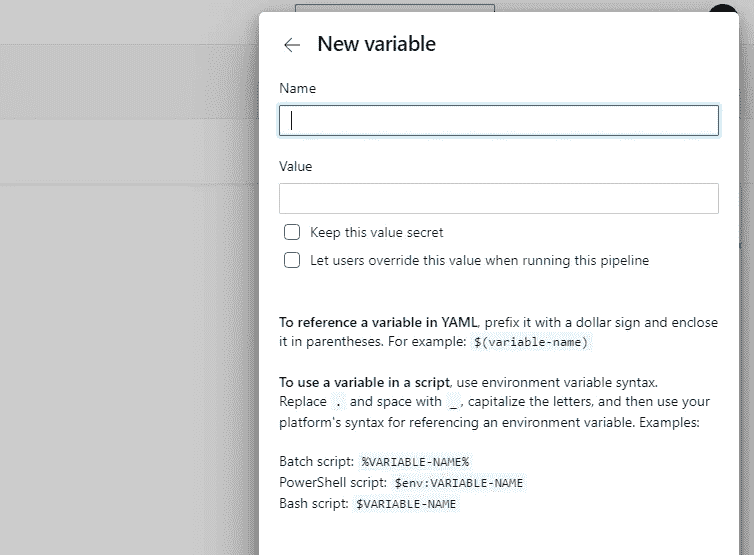

# 从内部版本中更改 Azure DevOps 变量

> 原文：<https://levelup.gitconnected.com/change-devops-variables-from-within-the-build-fb22b06eab62>

## 在这篇博客中，我将解释如何从管道内部调整 Azure DevOps 管道变量。


昆腾·德格拉夫在 [Unsplash](https://unsplash.com?utm_source=medium&utm_medium=referral) 上的照片

# 介绍

在我的[个人博客](https://www.koenvanzeijl.nl)上工作时，我发现获取你的 feed 的 Instagram API 被改变了。真扫兴！所以我找到了一种方法来获取你的 Instagram feed(我下一篇博客的主题)。不幸的是，这要求您使用有效期仅为 60 天的令牌。您可以在脸书门户网站申请新令牌，但这也有另一个缺点。您需要每 60 天提交一次，以保持您的订阅源正常工作。这让我很好奇，是否有可能在构建期间自动获取一个新的令牌，以便您的提要保持活动状态。

这种方法的缺点是必须保存从脸书门户返回的令牌，因为必须再次使用它来检索下一个(新的)令牌。毕竟，当前有效的令牌在 60 天后不能用于生成新令牌。我将通过向我的 [Azure DevOps](https://azure.microsoft.com/en-us/services/devops/) 管道添加一个变量来实现这一点，我将在每次构建被触发时更新这个变量。

在这篇博客中，我将解释如何从管道内部调整 Azure DevOps 管道变量。为了阐明我的方法，我将使用 Instagram 示例。

# 我们需要什么？

要关注这个博客，你只需要一个 Azure DevOps 管道。在这个管道中，我们将使用[‘dot net-json’](https://github.com/sleeuwen/dotnet-json)工具来读写 JSON。

# 管道变量

您是否已经有了要在管道中更改的变量？那么你可以跳过这一步，进入下一章。

如果没有，可以边调整管道边这样做。按右上方的变量按钮打开变量概述。然后单击添加变量以添加新变量。您将看到以下表单:



记住你的变量的名字，你以后会用到它。

# 编辑管道

在管道中，我们将使用 bash 任务。Azure DevOps 托管代理将默认安装此任务。你自己有代理吗？那么你可能需要先安装 bash。

以下管道调整将更新令牌变量:

```
- task: Bash@3
  inputs:
    targetType: 'inline'
    script: |
      dotnet tool update -g dotnet-json access_token=$(curl -s "https://graph.instagram.com/refresh_access_token?grant_type=ig_refresh_token&access_token=$(instatoken)" | dotnet json get - access_token) pipeline=$(curl -H "Authorization: Bearer $(System.AccessToken)" "$(System.TeamFoundationCollectionUri)/$(System.TeamProject)/_apis/build/definitions/$(System.DefinitionId)?api-version=5.0" | dotnet json set - variables:instatoken:value $access_token) curl -X PUT -H "Authorization: Bearer $(System.AccessToken)" -H "Content-Type: application/json" --data "$pipeline" "$(System.TeamFoundationCollectionUri)/$(System.TeamProject)/_apis/build/definitions/$(System.DefinitionId)?api-version=5.0" sed -i "s/placeholder_token/$access_token/" '$(Build.SourcesDirectory)/nuxt.config.js'
```

# 解释

但是它到底是做什么的呢？下面我解释每一步。

**设置**

前 4 行表示需要运行一个 bash 脚本，管道`|`后面的代码表示需要运行哪个脚本。

**安装 dotnet-json**

`dotnet tool update -g dotnet-json`:确保安装了最新版本的 dotnet-json。这是读取和更新 JSON 对象所需要的。

**获取变量**

下一行用于从 Instagram API 获取新的令牌。

向 Instagram API 发出 curl 请求的命令如下所示，`curl -s “https://graph.instagram.com/refresh_access_token?grant_type=ig_refresh_token&access_token=$(instatoken)`
旧的管道变量`$(instatoken)`用于获取新的令牌。

从 API 收到结果后，我使用`dotnet json get`从这个结果中提取我的令牌。通过在 get 之后放置一个`-`，默认输入被用作 dotnet-json 的输入。curl 请求后的`|`确保 API 结果被视为默认输入。最后，您需要指出想要获得 JSON 结果的哪个值，在我的例子中是`access_token`。

为了使代码更容易阅读，我将把`access_token`的值存储在一个 bash 变量中。这可以很容易地通过将 curl 请求和结果解析放在`$(...)`中并将其分配给变量`access_token`来完成。

## 获取当前管道

当前的管道可以很容易地通过 URL 检索，其中管道的令牌(`$ (System.AccessToken)`，这是一个默认的 DevOps 变量)用于授权。以下字符串中的所有其他令牌也是每个 Azure DevOps 管道中的默认令牌，因此您可以将其复制并粘贴到您的管道中。`curl -H “Authorization: Bearer $(System.AccessToken)” “$(System.TeamFoundationCollectionUri)/$(System.TeamProject)/_apis/build/definitions/$(System.DefinitionId)?api-version=5.0”`。

收到来自 API 的结果后，我通过用新令牌替换当前变量来调整这个管道。这又是在 dotnet-json 的帮助下完成的。为此，我使用了下面的字符串:`dotnet json set -variables:instatoken:value $access_token`。在我的例子中,`instatoken`是所选变量的名称。我将再次使用 bash 变量保存我的新管道。

## 更新管道

现在我们只需要更新 Azure DevOps 中存储的管道。这次我们需要做一个 curl PUT 请求，将它发送回 Azure DevOps。`curl -X PUT -H “Authorization: Bearer $(System.AccessToken)” -H “Content-Type: application/json” --data “$pipeline” “$(System.TeamFoundationCollectionUri)/$(System.TeamProject)/_apis/build/definitions/$(System.DefinitionId)?api-version=5.0”`。

变量`$(System.AccessToken)`作为头部提供，以授权请求。第二个头`Content-Type: application/json`表示 JSON 将作为数据类型发送。`$pipeline`变量被提供给`--data`参数来发送新的管道 JSON。最后，URL 用于定义将 PUT 请求发送到哪里。

## 使用您的变量

在我的脚本的最后一行，我通过用令牌修改文件来利用新获得的令牌，以便它可以在管道的发布步骤中使用。当然，这不是每个人的目标，所以用您的管道需要的脚本替换那一行。

# 结论

所以绝对有可能从管道本身内部调整你的管道。如果你试图自己调整管道，并且遇到了问题，请让我知道，也许我可以帮你解决。

换管道成功了吗？超级酷，在评论里让我知道你用它做什么。


[https://ko-fi.com/koenvanzeijl](https://ko-fi.com/koenvanzeijl)

*原贴于*[*www . koenvanzeijl . nl*](https://www.koenvanzeijl.nl/blog/devops-variables)*。*