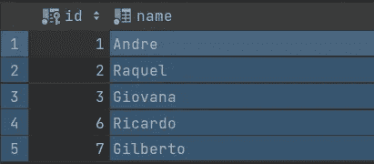
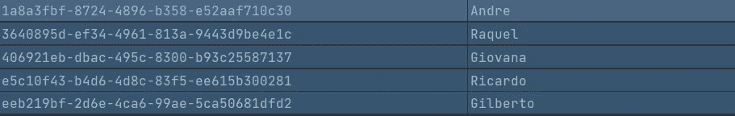
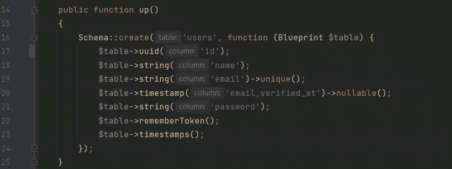
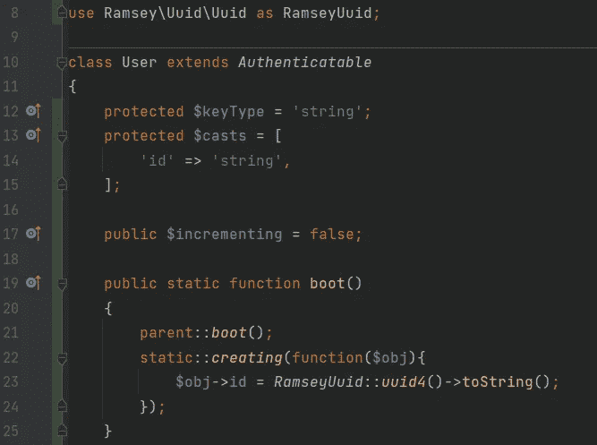
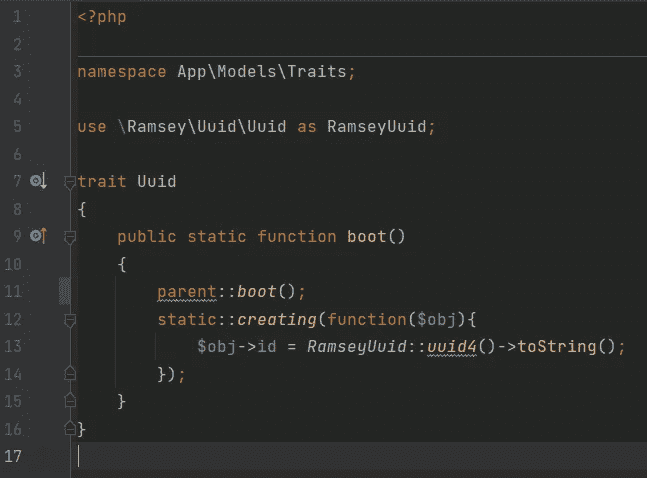
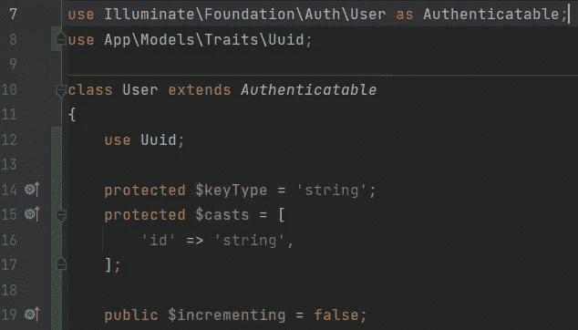

# 在 Laravel 应用程序上将 ID 更改为 UUID

> 原文：<https://levelup.gitconnected.com/change-id-to-uuid-on-laravel-applications-c7904071f769>

如何用 PHP/Laravel 应用添加对微服务和多租户应用的支持？

## 首先，ID 和 UUID 有什么区别？

ID 和 UUID 都被用作某些数据的标识符。

通常，为了改进数据库索引，ID 被类型化为 Int 或大整数数据，并被配置为主键、唯一和自动递增。



作为名称标识符的 ID 示例

通用唯一标识符(UUID)是一个 128 位标签，用于标识唯一数据。UUID 有五个版本:

> 版本 1 UUIDs 由时间和节点 ID(通常是 MAC 地址)生成；版本 2 UUIDs 由标识符(通常是组或用户 ID)、时间和节点 ID 生成；第 3 版和第 5 版通过散列一个[名称空间](https://en.wikipedia.org/wiki/Namespace)标识符和名称产生确定性 uuid，第 4 版 uuid 使用一个[随机数](https://en.wikipedia.org/wiki/Randomness)或[伪随机数](https://en.wikipedia.org/wiki/Pseudorandomness)产生。



作为名称标识符的 UUID 示例

如果你想更多地了解 UUID，我推荐你阅读维基百科的概述:[通用唯一标识符——维基百科](https://en.wikipedia.org/wiki/Universally_unique_identifier)。

## 但是，为什么要把 ID 改成 UUID 呢？

在微服务和多租户应用中，我们有许多数据库连接到每个微服务。数据来自多个来源，我们需要确保特定数据的标识符是唯一的。

如果您的数据库使用 id 作为表的主键(PK )( Int 或 Big Int 自动递增),当您从其他来源收集数据时，您将面临从数据库中的不同数据获取相同 id 的风险，因此您的 ID 不再是唯一的，这是一个问题。另一个例子:如果您想要合并来自不同数据库的行，那么您与 INT ID 发生冲突的几率非常高。

解决方案是将主键 ID (Int 自动递增)改为 UUID。

# 我们来编码吧！

对于这个例子，我将认为您已经从头开始创建了一个新的 laravel 应用程序。我将把用户表 ID 改为 UUID(在概念上)，但主键保持不变(“ID”)。我们想做 3 个简单的步骤:

1.  添加将为我们生成 UUID 的编写器包；
2.  通过迁移改变数据库结构；
3.  更改模型以支持、创建和标识 UUID 作为 PK。

## 1.如何添加一个作曲家包来支持 UUID？

打开项目路径上的终端并键入

```
composer require ramsey/uuid-doctrine
```

## 2.怎么在数据库上改？

使用您可爱的 IDE，打开项目并转到“数据库/迁移”路径。


如果您还没有运行迁移，只需修改用户迁移文件。或者，创建另一个迁移文件。

将“id”类型更改为 UUID。Laravel up 5.1 开始支持这种类型的数据。



## 3.怎么在应用上改？

现在，我们想在我们的用户模型上指定我们将使用 UUID 作为一个字符串，并禁用主键自动增量。然后我们实现“boot”方法来监听每个用户创建事件，创建一个新的 UUID 作为用户的 ID。



循序渐进:

*   第 8 行—我导入了 Ramsey 库来创建我们的 UUID；
*   第 10 行—注意:用户扩展了 authenticatable 类，authenticatable 类扩展了 Model 类。因此，用户扩展了模型，我们可以使用模型元素和函数；
*   第 12 行—将该类的主键定义为一个字符串；
*   第 13 行—重要的是通知类，ID 的任何转换必须被认为是一个字符串。这对于隐式数据转换很有用，比如将类对象转换成 JSON。没有这个，你会注意到 ID 可能会归零；
*   第 17 行—禁用主键的自动增量；
*   第 19–25 行—我实现了 boot 方法，保留父设置(parent::boot，在第 21 行)，监听所有创建事件，为 ID 分配一个 UUID 值。

越来越好…

最后一步(第 19–25 行)我们可以在其他类中重用，因此，我创建了一个 Trait 类(称为 Uuid)来吸收这一点。



所以，回到我们的用户类，我将 Uuid Trait 导入到用户类(第 8 行)，删除了 boot 方法，并添加了“使用 Uuid”(第 12 行)。



仅此而已。一开始可能看起来很难，但是很简单。

# 一些考虑

对于多租户应用程序来说，使用 UUID 是一个很好的解决方案，但是 ID 自动递增比 UUID 这样的随机主键更快。如果你想更深入，我建议你了解更多关于如何改进数据库搜索的知识。

本教程展示了如何在新的 laravel 应用程序中将 ID 更改为 UUID。

如果您有任何建议或者您喜欢这个主题，并且想知道如何在已经运行的 laravel 应用程序上将 ID 更改为 UUID，我可以创建另一个关于架构更改和遗留兼容性的教程。喜欢就告诉我！

祝你有美好的一天，好代码！

# 分级编码

感谢您成为我们社区的一员！更多内容见[级编码出版物](https://levelup.gitconnected.com/)。
跟随: [Twitter](https://twitter.com/gitconnected) ， [LinkedIn](https://www.linkedin.com/company/gitconnected) ，[迅](https://newsletter.levelup.dev/)
升一级就是转型科技招聘👉 [**加入我们的人才集体**](https://jobs.levelup.dev/talent/welcome?referral=true)