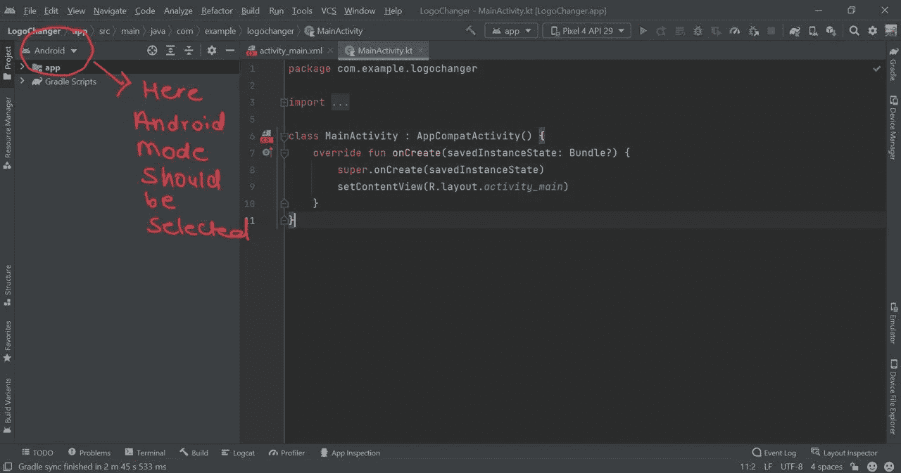
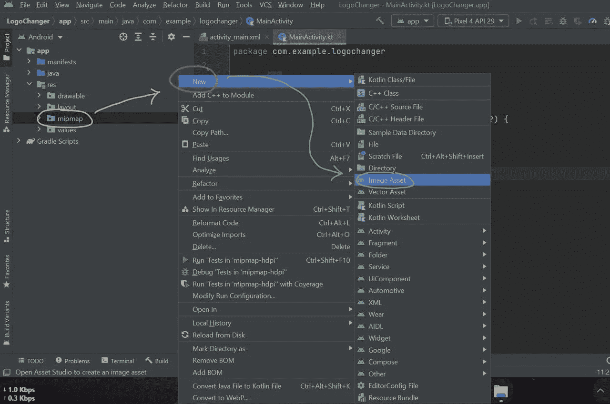
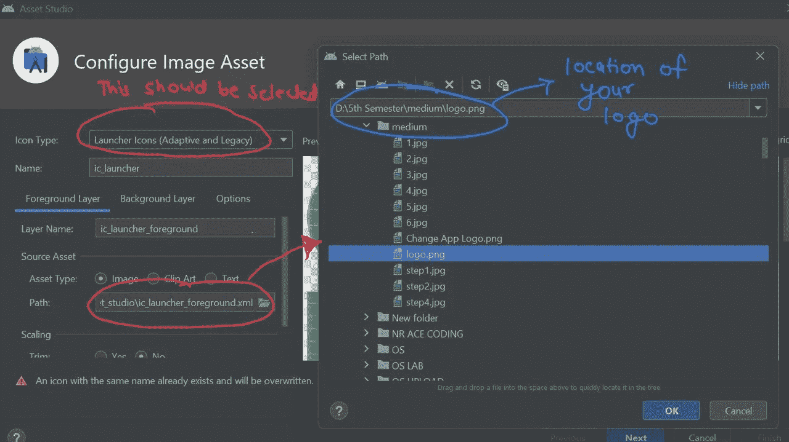

# 在 Android Studio 中更改您的应用徽标

> 原文：<https://levelup.gitconnected.com/change-your-app-logo-in-android-studio-289ad8139a95>

[Aditya Maurya](https://medium.com/u/a8cb6790e461?source=post_page-----289ad8139a95--------------------------------)

> 按照以下步骤更改您的应用程序徽标:-

**第一步** →打开 Android Studio，确保你的项目处于“ ***Android*** ”模式。

**步骤 2** →下拉到达“mipmap”文件夹***app→RES→MIP map***。

**第 3 步** →确保您有了新的徽标位置。

**第四步** →右击 ***mipmap →新建→图像资产*** 。

**第五步** →会弹出一个窗口，确认:
***a*** 。图标类型→启动器。
***b*** 。路径→新徽标的位置。

**第六步** →根据需要调整图像，点击 ***下一步→完成*** 。

**第 7 步** →重新运行你的应用程序，你会得到你想要的结果。

***注意:如果出现错误链接“重复资源”，则删除所有 webp 图像:***

感谢阅读…

继续编码…:)