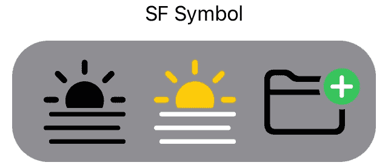
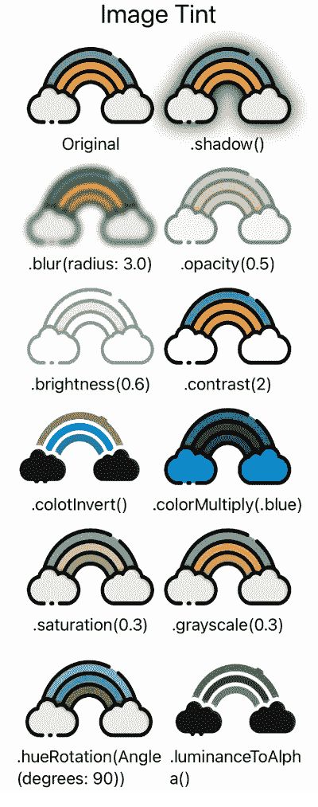
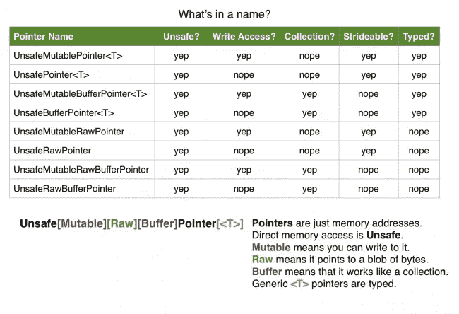
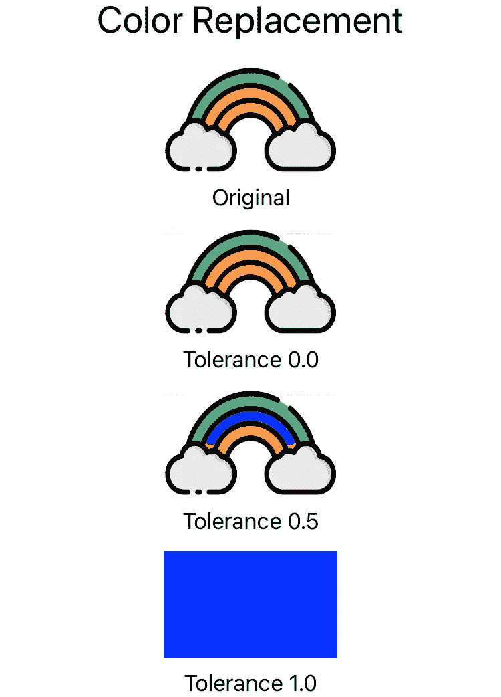

# 使用 Swift 更改和替换图像中的颜色

> 原文：<https://levelup.gitconnected.com/changing-and-replacing-colors-in-images-using-swift-d338ba79bd04>

## 如何使用多种不同的技术，使用 Swift 更改或替换图像中的颜色。

照片由[斯蒂芬·克拉克莫](https://unsplash.com/@srkraakmo?utm_source=unsplash&utm_medium=referral&utm_content=creditCopyText)在 [Unsplash](https://unsplash.com/s/photos/filter?utm_source=unsplash&utm_medium=referral&utm_content=creditCopyText) 拍摄

在本文中，我将介绍多种改变(或替换)图像颜色的技术。这里显示的所有代码都是 SwiftUI 代码。如果你在执行代码时有困难，请留下评论，我(或其他比我更快的人)会帮你解决。

# SF 符号

改变图像(或图标)颜色的最简单的方法是在适当的地方使用 [SF 符号](https://developer.apple.com/design/human-interface-guidelines/sf-symbols/overview/)。这是 Apple 提供的一组符号，可以轻松地在您自己的应用程序中使用。你可以在这里下载一个应用程序，帮助你找到你需要的[符号。](https://developer.apple.com/sf-symbols/)

使用三个 SF 符号设置视图，一个使用单色，一个使用静态颜色的多色符号，一个使用可自定义颜色的多色符号，如下所示:

代码

你看到了什么

如你所见，这里有三种不同的符号。我们有一个单色符号，一个静态颜色的符号，和一个可以改变颜色的多色符号。如果我们将`.foregroundColor(.red)`添加到父视图，图标将如下所示:

使用前景颜色()

如您所见，单色符号的行为与您预期的一样，具有静态颜色的多色 SF 符号没有改变，而可自定义的多色符号改变了它的一种颜色。

## 自定义图像

如果我们想要改变颜色的图像是一个定制的透明背景图标，我们仍然可以使用`.foregroundColor()`。我们只需要明确地对 Xcode 说，我们的图像是一个模板。我们可以通过给图像添加`.renderingMode(.template)`修改器来实现。

代码

这是它看起来的样子:

自定义图标

## 视图修改器

在 SwiftUI 中，图像只是另一种视图，这意味着我们可以对图像使用所有基本的视图修改器。这些都是不言自明的，所以我不会对它们中的任何一个进行详细说明。这里有一个截图来展示它们的样子。

例子

在大多数情况下，SF 符号和视图修饰符足以获得所需的结果。只要它们足以完成工作，你就应该使用它们，因为它们使代码易于理解。

# 替换图像中的颜色

所以你有一个图像(就像我们在这里使用的彩虹),出于某种原因，你需要用另一种颜色替换其中一种颜色。这将要求您遍历给定图像中的每个像素，获取该像素的颜色，检查它是否与您想要替换的颜色匹配，然后重写该像素的颜色信息。

## 不安全的 Swift

默认情况下，Swift 是一种内存安全的语言。这意味着 Swift 阻止我们直接访问内存。在我们使用它们之前，所有的东西都需要初始化，内存是自动分配和释放的。这是默认的。如果你想，你仍然可以访问这些东西，这种工作方式被称为*不安全迅捷*。

不安全的 Swift 并不一定是坏事。它需要你手动完成普通 *safe Swift* 会自动完成的事情，比如分配和释放内存。当你做错事的时候，编译器不会保护你或者警告你。如果你不释放你的内存，你会有内存泄漏，在某些时候你的应用程序会崩溃或冻结，因为设备耗尽内存。这类错误可能很难调试。我们将使用不安全的可变指针来访问内存中图像的特定像素，并改变其中的一些像素(这就是为什么它被称为可变的)。 [*这篇在 raywenderlich.com*](https://www.raywenderlich.com/7181017-unsafe-swift-using-pointers-and-interacting-with-c)*发表的文章提供了一些关于不安全 Swift 的重要基础信息，包括这张关于不同类型指针的便捷表格。*

raywenderlich.com 表

## 不安全可变指针

为了替换图像中的特定颜色，我创建了一个名为`replaceColor()`的函数。该函数接受一种我们想要替换的颜色，一种我们用来替换原始颜色的颜色，以及一个容差。容差用于定义颜色需要多接近要被替换的已定义颜色。代码如下:

不安全的可变指针

当我们设置我们的`Image()`时，我们需要使用 UIKit 来使用 UIImage。我们可以直接从 SwiftUI 映像到 CGImage，但是这需要更多的参数来初始化。将 SwiftUI 图像转换为 UI Image，然后转换为 CGImage，这样代码更清晰。我的第一要务总是易读的代码。通过第 26–39 行，我们正在创建变量，我们将在函数的后面使用。我们将颜色分为红色、绿色、蓝色和 alpha 值。然后我们计算位图中有多少字节。当我们为这个方法分配正确的内存量时，字节数是我们需要的。

因为我们正在分配内存，这意味着我们需要释放内存以避免内存泄漏。我发现最好的方法是使用 defer 语句。我们可以手动释放内存使用的每一个地方，我们可以逃离范围。如果您正在编写复杂的函数，这可能很难做到。有了 defer 语句，您就不必考虑这些了。当程序退出定义 defer 语句的作用域时，defer 语句会自动执行。我喜欢在 allocate 方法之后使用 deallocate 方法的 defer 块，这样很容易看到分配的内存也被释放了。**如果你手动分配内存，你也需要释放它。**这是不安全 Swift 最重要的规则。

实际的颜色变化从第 66 行开始。从这里开始，我们遍历图像的每个像素，检查颜色是否与要替换的颜色匹配(或者根据我们定义的容差足够接近)，如果匹配，就用新的颜色替换那个颜色。迭代完所有像素后，我们绘制一个新的 UIImage 并返回它。这是你可以看到的:

不安全的可变指针结果

可以在没有容差参数的情况下编写该函数，但这只会替换完全匹配的像素。大多数情况下，图像中的颜色会从一种褪色到另一种，这使得精确匹配变得困难。

改进这个功能的一个很好的方法是不要使用 RGBA 颜色，而是使用类似 HSL 的颜色。通过这种方式，我们可以改变匹配的色调，保持饱和度和亮度不变，得到一个更接近原始图像阴影的图像。

# 结论

在 Swift 中处理图像有许多方法，这些只是其中的一些基本方法。如果你想了解更多，我建议深入到[核心显卡](https://developer.apple.com/documentation/coregraphics)。如果这还不能满足你的需求，金属也在那里。如果有任何问题，请在 [Twitter](https://twitter.com/iiroalhonen) 上留言或给我发消息。

所有的源代码都可以在[这个资源库](https://github.com/Iikeli/color-replacement-examples/tree/main)中找到。

 [## Swift Watch -时事通讯

### Swift 和 iOS 开发新闻、文章、播客和视频的每周来源。

www.iiroalhonen.com](https://www.iiroalhonen.com/newsletter) 

你喜欢这篇文章吗？注册订阅我的时事通讯，以便在我下一次发布时得到通知。