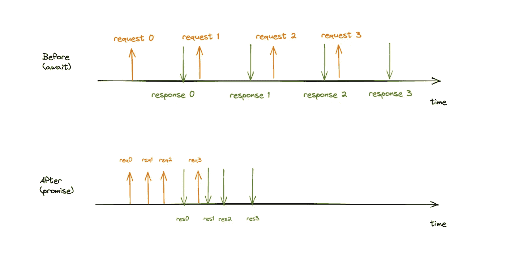
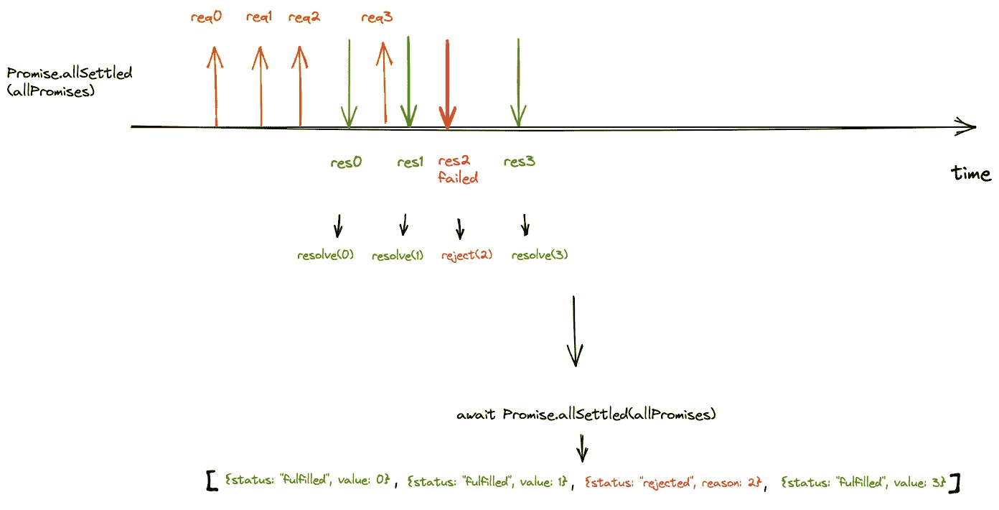

# 将 Async/Await 更改为 Promises.allSettled()以加速节点中的 API 调用。射流研究…

> 原文：<https://levelup.gitconnected.com/changing-async-await-to-promises-all-to-speed-up-api-calls-in-node-js-348ea70592fd>

## 问题是

有一个批量编辑功能，用户可以多选一些记录，同时编辑所有记录。

但是，当一次更新 50+条记录时，可能需要 50 秒，页面会冻结。用户在等待过程中会感到困惑，经常会提前离开页面。我们想让它更快。

## 为什么这么慢

代码是这样写的:

```
for (r in records) {
  await update(r);
}
```

更新一条记录会产生一个 API 调用，耗时 500 毫秒到 1 秒。

因为它遍历记录并逐个更新它们，所以随着有更多的记录需要更新，时间会线性增加。

## 用承诺来加速

幸运的是，在处理下一个更新之前，我们不必等待一个更新完成。允许我们在上一个更新请求完成之前发出下一个更新请求。

这是我们所做的:

```
const allPromises = [];for (r in records) {
  const promise = update(r);
  allPromises.push(promise);
};await Promise.allSettled(allPromises);
```

视觉上，这是使用`async/await` v.s .使用`promises`时发生的情况:



异步/等待 v.s .承诺

正如我们所看到的，由于我们在发出下一个更新请求之前没有等待每个更新请求的返回，因此节省了大量时间。

## 得到承诺的结果

可惜`update(r)`偶尔会出现故障。

如果有些更新失败了，我想知道是哪些更新。

`[Promise.allSettled()](https://developer.mozilla.org/en-US/docs/Web/JavaScript/Reference/Global_Objects/Promise/allSettled)`的解析值可以告诉我们这一点。`[Promise.allSettled()](https://developer.mozilla.org/en-US/docs/Web/JavaScript/Reference/Global_Objects/Promise/allSettled)`给我一个对象数组，每个对象描述一个承诺的结果。

如果一个承诺实现了，我就得到`{status: “fulfilled”, value: xxx }`。

如果一个承诺被拒绝，我会得到`{status: “rejected”, reason: xxx }`。

举个例子，

```
const values = await Promise.allSettled([
  Promise.resolve(33),
  Promise.reject(new Error('an error'))
])
console.log(values)// [
//   {status: "fulfilled", value: 33},
//   {status: "rejected",  reason: Error: an error}
// ]
```

在我的例子中，我想知道成功更新和没有更新的记录的`id`。这就是我们所做的:

```
const allPromises = [];
for (r in records) {
    const promise = new Promise((res, rej) => {
        update(t)
            .then(() => { res(r.id) }); # succeeded
            .catch(() => { rej(r.id) }); # failed
    });
    allPromises.push(promise);
};const outcomes = await Promise.allSettled(allPromises);const succeeded = outcomes.filter(o => o.status === "fulfilled");
const succeededIds = succeeded.map(s => s.value);const failed = outcomes.filter(o => o.status === "rejected");
const failedIds = failed.map(f => f.reason);
```

从视觉上看，这就是一些承诺失败时的情况:



返回的数组告诉我们哪些成功了，哪些失败了。

就是这样！通过这一更改，我们能够将 50 多条记录的批量编辑操作从 50 多秒减少到不到 5 秒。💪

## 感谢阅读！

注意，这篇文章被更新为使用`[Promise.allSettled()](https://developer.mozilla.org/en-US/docs/Web/JavaScript/Reference/Global_Objects/Promise/allSettled)`。

之前的版本用的是`[Promise.all()](https://developer.mozilla.org/en-US/docs/Web/JavaScript/Reference/Global_Objects/Promise/all)`。`[Promise.all()](https://developer.mozilla.org/en-US/docs/Web/JavaScript/Reference/Global_Objects/Promise/all)`仅当所有承诺都解决时才解决，否则拒绝。

因为我们想知道每个承诺的结果，一些读者建议`[Promise.allSettled()](https://developer.mozilla.org/en-US/docs/Web/JavaScript/Reference/Global_Objects/Promise/allSettled)`更适合这个任务。文章已相应更新。

非常感谢那些提出建议的人，我真的很感激。🙏

我希望这是明确的和有帮助的。如果您有任何问题，请不要犹豫留下评论。

感谢您的宝贵时间！

# 分级编码

感谢您成为我们社区的一员！升级正在改变技术招聘。 [**在最好的公司**找到你的完美工作](https://jobs.levelup.dev/talent/welcome?referral=true) **。**

[](https://jobs.levelup.dev/talent/welcome?referral=true) [## 升级—转变技术招聘

### 升级—转变技术招聘🔥使软件工程师能够找到完美的角色…

作业. levelup.dev](https://jobs.levelup.dev/talent/welcome?referral=true)