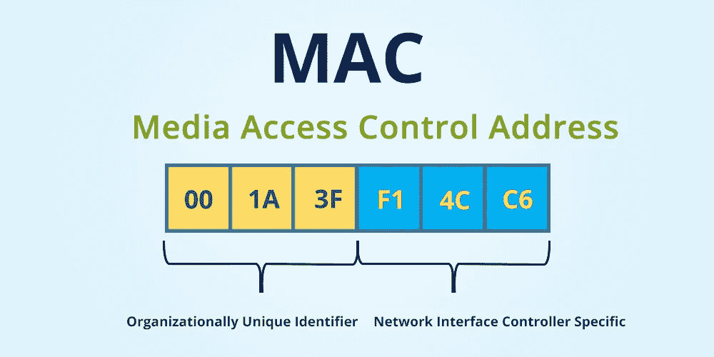
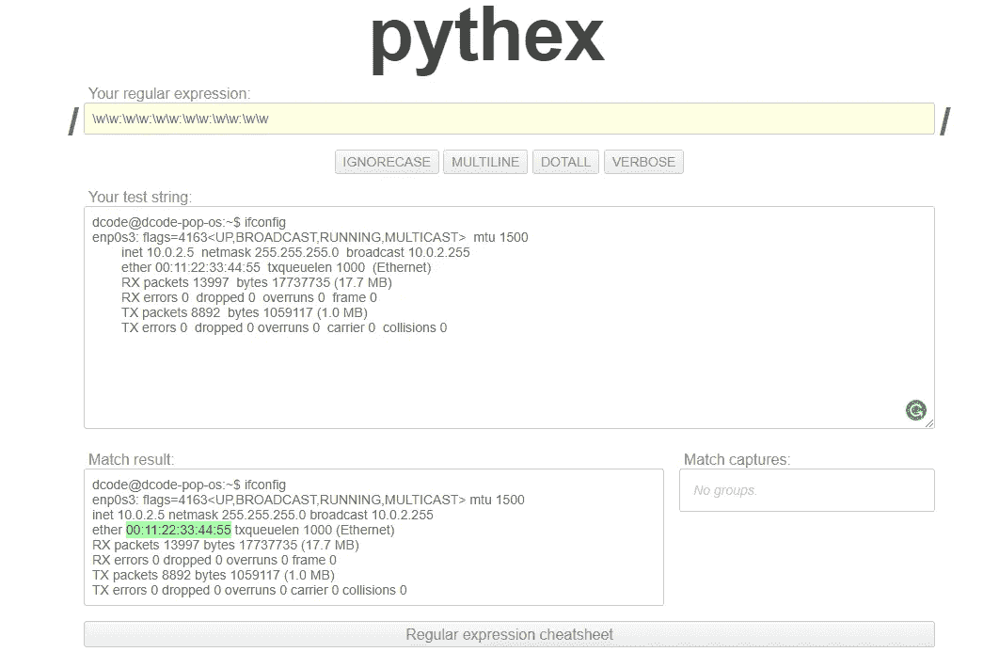

# 使用 Python 更改 MAC 地址

> 原文：<https://levelup.gitconnected.com/changing-mac-address-using-python-8a16fc4a3563>



媒体访问控制(MAC)地址

> **注意:**下面的教程适用于任何 Linux 发行版，但是您需要 root 权限来执行必要的系统命令，以便成功地更改 MAC 地址。

## 什么是 MAC 地址？

要了解如何更改 MAC 地址，有必要了解什么是 MAC 地址。我们都使用各种电子设备，如智能手机、台式机、笔记本电脑、平板电脑等来浏览互联网、娱乐以及完成其他任务。这些电子设备都有自己的 MAC 地址。 **MAC** 代表**媒体访问控制**地址。每台设备都需要一个 MAC 地址，以便被网络上的其他设备唯一识别。例如，当你在 Youtube 上观看一个视频时，你通过你的设备发送一个视频请求，这个请求通过你的默认网关传输(通常通过一个私人家庭网络的路由器)。然后，路由器将这个请求发送到万维网，并接收响应。现在，**万维网(它是公共的)**不知道你是谁，因为你的设备有一个**私有 IP 地址**，它只被你的路由器识别，所以路由器收到的响应然后给你，因为路由器知道你的 MAC 地址与你的设备的私有 IP 地址相关联。

MAC 地址是一个 48 位硬件地址，在制造时硬编码在**网络接口卡(NIC)** 上。MAC 地址也称为设备的**物理地址**。MAC 地址用于在网络中传输数据包。

例如， **00:1A:3F:F1:4C:C6** 是一个 MAC 地址。地址的前三个八位字节(00:1A:3F)标识制造商，称为 **OUI(组织唯一标识符)。**最后三个八位字节是**网络接口控制器专用的**。

点击阅读更多关于**NIC**T22。

## 为什么我们需要更改 MAC 地址？

您想要更改设备的 MAC 地址有几个原因。让我们一个一个来看:

*   **增加匿名性:**在公共网络上，你可能希望更改 MAC 地址以保持匿名，如果你不这样做，那么你所在的网络可能会记录你的 MAC 地址，从而留下痕迹。
*   **模拟其他设备:**当您想要实施攻击(出于测试目的)时，更改 MAC 地址对于模拟任何合法设备都很有用。
*   **绕过过滤器:**如果一个 MAC 地址被列入黑名单使用网络，要克服这一点就是改变 MAC 地址，骗过过滤器。

## 如何更改 MAC 地址？

要更改 MAC 地址，我们需要执行一些系统命令。第一步是确定您想要更改其 MAC 地址的接口，您可以在 Linux 中使用以下命令来完成。

```
dcode@dcode-pop-os:~$ ifconfig
```

上述命令产生以下输出。

```
**enp0s3:** flags=4163<UP,BROADCAST,RUNNING,MULTICAST>  mtu 1500
        inet 10.0.2.5  netmask 255.255.255.0  broadcast 10.0.2.255
        **ether 08:00:27:35:21:ff**  txqueuelen 1000  (Ethernet)
        RX packets 13962  bytes 17732985 (17.7 MB)
        RX errors 0  dropped 0  overruns 0  frame 0
        TX packets 7969  bytes 975852 (975.8 KB)
        TX errors 0  dropped 0 overruns 0  carrier 0  collisions 0
```

首先，要改变 MAC 地址我们需要知道**接口名称**和现有的 **MAC 地址。**该信息可通过执行 **ifconfig** 命令获得。我们可以从 **ifconfig** 产生的输出中获得接口名称和现有的 MAC 地址。例如，从上面的输出来看， **enp0s3** 是**接口**的名称，第三行的 **ether** 字段具有 MAC 地址(在我们的例子中是 **08:00:27:35:21:ff** )。

现在我们知道了要更改其 MAC 地址的接口名称，我们可以转到下一个命令。

```
dcode@dcode-pop-os:~$ sudo ifconfig enp0s3 down
```

上面的命令在执行时会关闭接口。这意味着您将无法再连接到互联网。如果我们需要更改 MAC 地址，我们需要首先关闭接口**(禁用)**。在此之后，下一个要执行的命令将更改 MAC 地址。

```
dcode@dcode-pop-os:~$ sudo ifconfig enps03 hw ether 00:11:22:33:44:55
```

上述命令将现有的 MAC 地址 **(08:00:27:35:21:FF)** 更改为命令本身指定的新 MAC 地址 **(00:11:22:33:44:55)** 。现在接口 enp0s3 的 MAC 地址已经更改，但要使用它，我们需要使用以下命令再次启用该接口。

```
dcode@dcode-pop-os:~$ sudo ifconfig enp0s3 up
```

执行上述命令后，再次启用接口，以便可以访问互联网。要检查 MAC 地址是否更改为我们指定的地址，请执行 **ifconfig** 命令。

```
dcode@dcode-pop-os:~$ ifconfig
**enp0s3:** flags=4163<UP,BROADCAST,RUNNING,MULTICAST>  mtu 1500
        inet 10.0.2.5  netmask 255.255.255.0  broadcast 10.0.2.255
        **ether 00:11:22:33:44:55**  txqueuelen 1000  (Ethernet)
        RX packets 13997  bytes 17737735 (17.7 MB)
        RX errors 0  dropped 0  overruns 0  frame 0
        TX packets 8892  bytes 1059117 (1.0 MB)
        TX errors 0  dropped 0 overruns 0  carrier 0  collisions 0
```

从输出中我们可以看到 MAC 地址由 **08:00:27:35:21:ff** 更改为 **00:11:22:33:44:55** 。

## 使用 Python 更改 MAC 地址

到目前为止，我们都是手动键入命令并执行它们，但是我们可以使用 Python 来自动化整个过程，因此我们只需向脚本提供接口名称和新的 MAC 地址。

**使用的模块:**

*   [子流程](https://docs.python.org/3.4/library/subprocess.html)
*   [argparse](https://docs.python.org/3/library/argparse.html)
*   [回复](https://docs.python.org/3/library/re.html)

**子流程**模块用于使用 Python 执行系统命令。它包含几个可以使用的函数。我们将重点关注一个用于执行系统命令的特定功能。它被称为 **call()** 函数。

**用法**

```
subprocess.call([‘ifconfig’])
```

此指令使用 Python 执行 ifconfig 命令。

**argparse** 模块可以方便地编写用户友好的命令行界面。程序定义了它所需要的参数，argparse 会计算出如何解析这些参数。它还生成帮助和用法消息，并在用户输入任何无效参数时发出错误。

**用途**

```
dcode@dcode-pop-os:~$ python3 programs_name.py -op1 option -op2 option
```

在 argparse 的帮助下，我们可以为用户提供使用命令行参数传递输入值的能力。即使你现在不明白，一旦我们开始编码，你就会明白了😃。

接下来， **re** 模块提供了**正则表达式**匹配操作。随着我们继续前进，你会知道我们使用 **re** 模块的目的。

## Python 脚本编码

这是我们开始用 Python 编码的地方。

**第一步:** **导入上面讨论的模块。**

导入必要的模块

**步骤 2:** **实现允许用户传递命令行参数的功能。**

要将这个特性添加到我们的脚本中，我们需要利用我们在步骤 1 中导入的 **argparse** 模块。

添加命令行参数功能

上述代码允许用户为**接口**值和**新 MAC 地址**提供如下输入:

```
dcode@dcode-pop-os:~$ python3 mac_changer.py -i interface_name -m new_mac_address
```

**或**

```
dcode@dcode-pop-os:~$ python3 mac_changer.py --interface interface_name --mac new_mac_address
```

interface_name =要更改其 MAC 地址的接口的名称。

new_mac_address =要替换旧地址的 mac 地址。

**选项**存储用户提供的值。当您打印它时，输出如下:

```
print(options)**Output:** 
Namespace(interface='enp0s3', new_mac='00:55:22:33:44:11')
```

单独访问两个参数的方法如下:

```
print(options.interface)
print(options.new_mac)**Output:** 
enp0s3
00:11:22:33:44:55
```

> 注意: **add_argument()** 方法中的 **dest** 参数提供了 **parse_args()** 在 **options** 变量中存储其对应值的名称。

第 2 步的最后一件事是我们创建了一个变量 **command_args** 并调用了函数 **get_args()** 。

```
command_args = get_args()
```

上面的语句将存储由 **get_args()** 返回的**选项**，因此我们可以访问函数范围之外的参数值。

第三步:编写一个改变 MAC 地址的函数。

现在我们有了更改 MAC 地址所需的两个值**(接口和新 MAC 地址)，**我们将编写一个使用系统命令更改 MAC 地址的函数。

写一个函数来改变 MAC 地址

看看我们刚刚写的函数，它接受**两个**参数**(接口和 new_mac)。**这两个值由 **command_args** 变量提供给 **change_mac()** 函数。它还检查所提供的 MAC 地址是否有效。之后，使用**子流程**模块，我们执行系统命令。注意:您需要 root 访问权限来执行这些命令。

现在，我们已经完成了更改 MAC 地址的 Python 脚本，但是我们仍然需要确保应用了新的 MAC 地址。为此，我们需要编写另一个函数来返回接口的当前 MAC 地址。

**第四步:编写函数获取当前 MAC 地址**

该函数将 interface 作为输入，并返回该接口的当前 MAC 地址。我们写这个函数是为了检查新的 MAC 地址是否被应用。

编写一个函数来获取 MAC 地址

因此， **get_current_mac()** 函数提取所提供接口的当前 mac 地址。现在，让我们来分解这个函数。

```
output = sub.check_output(['ifconfig', interface], universal_newllines = True)
```

上述语句类似于 **change_mac()** 函数中的**sub call()**，但有一处不同。**sub check _ output()**函数返回命令的输出，而**sub call()**不返回任何内容。返回的输出存储在变量**输出中。**

此外，使用参数**universal _ newlines = True**是因为如果该值设置为 **False** ，则返回的输出以**字节为单位。**

> Docs ->默认情况下，该函数将返回编码字节形式的数据。输出数据的实际编码可能取决于被调用的命令，因此解码成文本通常需要在应用程序级别处理。这种行为可以通过将 *universal_newlines* 设置为真来覆盖

下一句话是，

```
search_mac = re.search(r"\w\w:\w\w:\w\w:\w\w:\w\w:\w\w", output)
```

这就是使用 **re** 模块的地方。 **re** 代表正则表达式，它们经常在字符串匹配应用中使用。 **re.search()** 函数接受**正则表达式**和**字符串**，其中模式应该被匹配。在我们的例子中，字符串存储在变量**输出中。****\ w \ w:\ w \ w:\ w \ w:\ w \ w:\ w \ w:\ w \ w**表达式匹配输出变量中的 MAC 地址，该变量具有 **ifconfig** 命令的输出。看下图可以更好的理解。



正则表达式演示

如您所见，正则表达式与 MAC 地址完全匹配(在匹配结果框中以绿色突出显示)。[正则表达式备忘单](https://pythex.org/)

此外， **re.search()** 可能会找到多个与 regex(正则表达式)匹配的字符串。因此，下面的语句将确保只返回第一个匹配的元素。如果它匹配一个以上的字符串，并返回不需要的字符串呢？在由 **ifconfig，**返回的输出中，得到不是想要的字符串的可能性几乎为零。

```
search_mac.group(0)
```

这就总结了 **get_current_mac()** 函数。

现在，剩下的唯一事情就是检查用户提供的 MAC 地址是否被应用。对此，你可以看到我们调用了两次 **get_current_mac()** 函数，一次在调用 **change_mac()** 函数之前，一次在调用 **change_mac()** 函数之后。这确保了我们捕获两个 MAC 地址(更改之前和之后)。然后，我们比较 **changed_mac** 和 **command_args.new_mac** ，如果两者匹配，则 mac 地址已成功更改。

```
if changed_mac == command_args.new_mac:
    print('Successfully Changed the MAC Address')
else:
    print('Could not change the MAC Address')
```

这是脚本结束的地方，要执行脚本，请执行以下操作:这在**步骤 2 中有所介绍。**

```
dcode@dcode-pop-os:~$ python3 mac_changer.py -i interface_name -m new_mac_address**OR**dcode@dcode-pop-os:~$ python3 mac_changer.py --interface interface_name --mac new_mac_address
```

完整的代码可以在我的 [Github](https://github.com/dharmil18/MAChanger) 上找到。