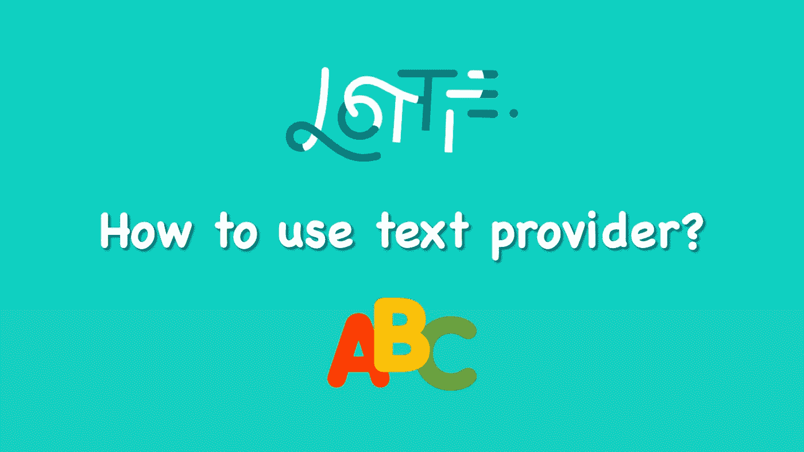
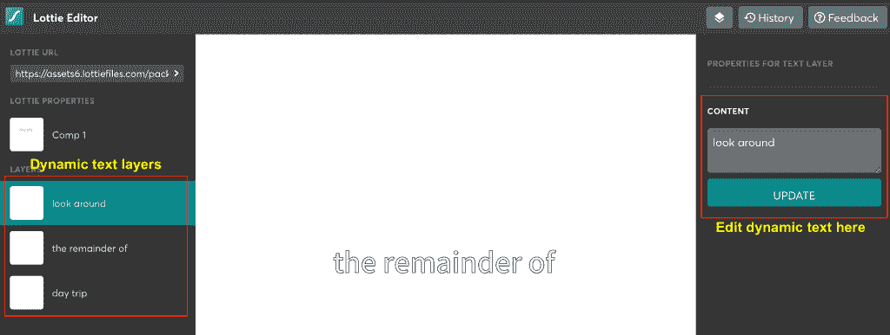
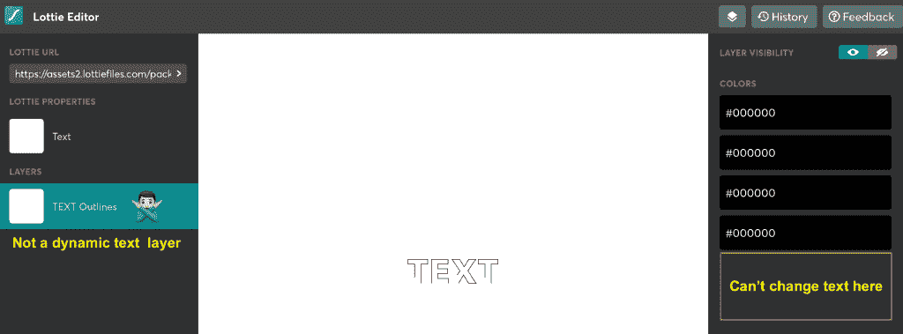
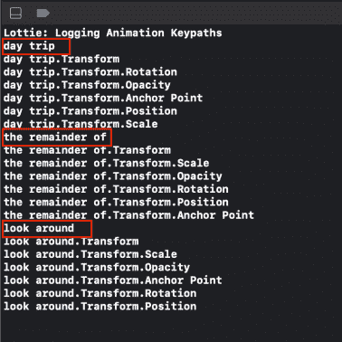

# 在 iOS Lottie 动画中更改文本

> 原文：<https://levelup.gitconnected.com/changing-text-in-ios-lottie-animation-517992d68c1f>

## 使用内置和自定义文本提供程序

***本文原载于 2020 年 11 月 15 日*******。****

*我已经有一段时间没有讨论与洛蒂动画相关的话题了。在我的上一篇文章“用值提供者修改 Lottie 动画”中，我讨论了开发人员如何利用不同类型的值提供者在运行时根据他们自己的需要操纵动画。*

*在本文中，让我们看看 Lottie SDK 中另一个鲜为人知但非常有用的价值提供者— **文本提供者**。正如您可能已经猜到的，文本提供程序允许您在运行时更改 Lottie 动画中的文本。*

*想知道更多？请继续阅读！*

> ****注:****
> 
> **要了解如何在你的 iOS 项目中设置 Lottie 动画，可以参考* [*这篇*](https://swiftsenpai.com/development/lottie-getting-started/) *文章中的“* ***Lottie for iOS 安装*** *”一节。**

# *识别洛蒂动画中的动态文本*

*在进入示例代码之前，有一个重要的方面需要注意——并非 Lottie 动画中的所有文本都是动态文本。这也意味着不是所有洛蒂动画中的文本都可以改变，它必须是一个动态文本。*

*为了识别洛蒂动画中的动态文本，我们可以利用[洛蒂编辑器](https://lottiefiles.com/editor)。假设我们有[这个](https://lottiefiles.com/23133-word)洛蒂动画，如果你将它加载到洛蒂编辑器中，你会看到 3 个动态文本层，允许你修改它的内容。*

**

*洛蒂编辑器(带有动态文本层的动画)*

*另一方面，如果你加载[这个](https://lottiefiles.com/35488-text-button)洛蒂动画，你不会看到任何动态文本层被显示。这意味着您在动画中看到的文本呈现为纯图形，而不是动态文本。*

**

*洛蒂编辑器(没有动态文本层的动画)*

# *运行中的文本提供程序*

*为了让文本替换在 Lottie 动画中工作，我们必须首先找出每个动态文本层的关键路径。为此，您可以使用`AnimationView`的`logHierarchyKeypaths()`函数打印出所有可能的关键路径。*

*让我们以下面的[洛蒂动画](https://lottiefiles.com/23133-word)为例:*

**

*原版洛蒂动画([https://lottiefiles.com/23133-word](https://lottiefiles.com/23133-word))*

**

*所有关键路径*

*从上面的截图可以看出，“*逛逛*”、“*的剩余部分”和“*一日游*”是我们正在寻找的关键路径。**

**在确定了所有的关键路径之后，我们将使用`DictionaryTextProvider`类来替换洛蒂动画文本。它是一个接受字典的类，字典的键是键路径，值是替换文本。**

**下面是示例代码:**

**上面的代码片段非常简单。首先，我们创建一个动画对象，并将其设置为动画视图。之后，我们使用前面获得的键路径填充文本提供者的字典。有了字典，我们就可以用它来初始化`DictionaryTextProvider`并将其设置为动画视图。**

**下面是最终结果:**

****

**修改过的洛蒂动画([https://lottiefiles.com/23133-word](https://lottiefiles.com/23133-word))**

# **创建自定义文本提供程序**

**假设你想提高示例代码的可用性，并在应用程序的多个地方重用修改后的动画，这就是`AnimationTextProvider`协议发挥作用的地方。**

**正如您所看到的，`AnimationTextProvider`协议有一个功能需求，它负责用想要的文本替换动画源文本。**

**`textFor(keypathName:sourceText:)`功能将为 Lottie 动画中的每个动态文本层触发。因此，我们需要在函数中做的是根据给定的键路径返回所需的替换文本。**

**记住这一点，我们可以这样实现自定义文本提供程序类:**

**下面是我们如何使用自定义文本提供程序:**

**很酷不是吗？😎**

# **进一步阅读**

*   **[iOS 中洛蒂动画入门](https://swiftsenpai.com/development/lottie-getting-started/)**
*   **[洛蒂提前播放动画](https://swiftsenpai.com/development/lottie-advance-animation-playback/)**
*   **[用标记控制洛蒂动画](https://swiftsenpai.com/development/lottie-animation-markers/)**
*   **[与价值提供者一起修改洛蒂动画](https://swiftsenpai.com/development/lottie-value-providers/)**

# **包扎**

**你有它！Lottie 文本提供程序非常容易使用，而且非常灵活。如果你能想到任何其他关于`AnimationTextProvider`协议的有趣用例，请在下面的评论区告诉我。**

**如果你喜欢这篇文章，你可以在 [Twitter](https://twitter.com/Lee_Kah_Seng) 上关注我，订阅我的每月简讯。**

**感谢阅读。👨🏻‍💻**