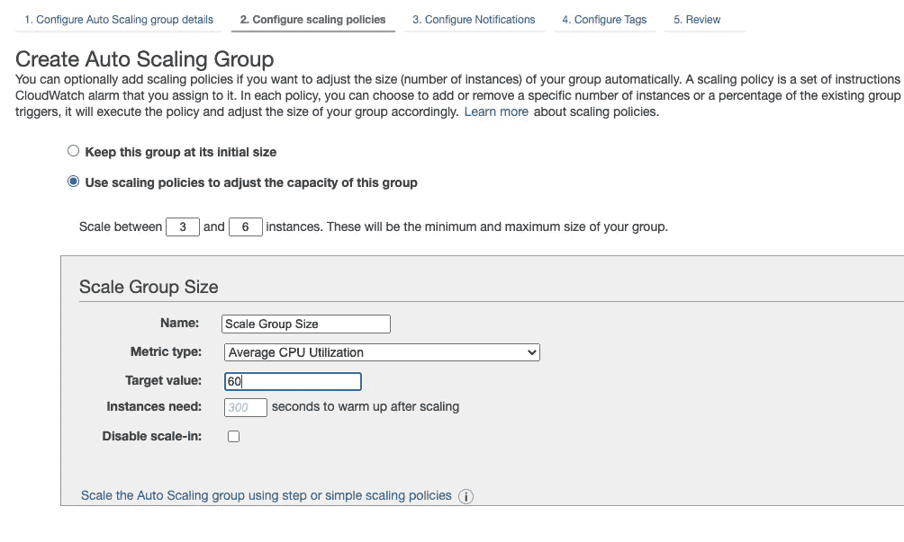
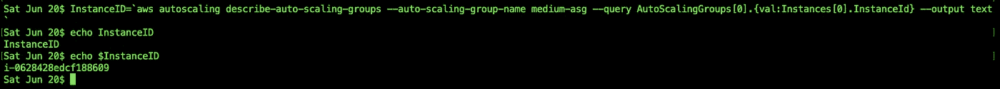
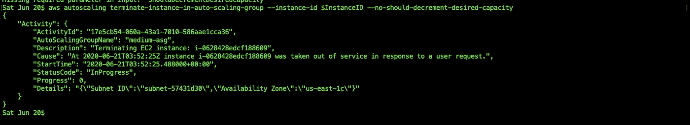

# 混沌工程——如何故意破坏您的 AWS 基础设施

> 原文：<https://levelup.gitconnected.com/chaos-engineering-how-to-break-aws-infrastructure-on-purpose-3a48ba32aa2e>

故意破坏您的系统基础设施—真的吗？为什么会有人这么做？

这可能是你想到的第一个问题。但是，这正是我们在这里努力实现的目标。

在这篇文章中，我将谈论:

1.  什么是混沌工程及其重要性。
2.  满足先决条件—设置您的 AWS 帐户、终端上的 CLI、设置基础架构(创建自动扩展组(ASG)并连接 3 个 EC2 实例)
3.  设置我们的第一个混沌实验——确定稳态假设，并使用 AWS CLI 删除一个随机 EC2 实例
4.  混沌实验观察——检查你的基础强度并完成你的混沌实验。
5.  可以实现的其他类型的混沌实验想法(一些有趣的想法..！！！).

> 1.什么是混沌工程及其重要性。

混沌工程是一种在没有人工干预的情况下测试系统的健壮性、可靠性和在灾难中生存的能力的工程。

在这个过程中，我们手动高效地中断我们的基础设施，并测试我们的应用程序和基础设施自我修复的速度和效率，以及它们在灾难或任何系统灾难期间茁壮成长的能力。

听起来很有趣，是吧？

嗯，这非常有趣，因为我们会试验、玩和破坏我们的基础设施，并敏锐地观察它如何反应，从中学习和改进。这使得我们的基础架构更加健壮、稳定，并对我们的生产堆栈更有信心(我认为这非常重要)。

我们将了解我们系统中的弱点和漏洞，并帮助我们在测试环境中提前克服这些问题。

我们可以在我们的系统上进行许多混沌实验，比如删除一个随机的 EC2 实例，删除服务等等，这些我们将在最后一节中探讨。

> 解决先决条件—在终端上设置您的 AWS 帐户和 CLI

让我们通过设置我们的基础设施来破坏。

> 先决条件:

1.  从 AWS 帐户获取访问密钥 ID 和秘密访问密钥
2.  在本地计算机上安装 AWS CLI
3.  在您的计算机上为 AWS 帐户配置 AWS 凭据
4.  设置基础架构—创建一个自动扩展组，并根据需要和最小容量将 3 个 EC2 实例连接到该组(假设其中正在运行任务/服务)。
5.  通过对照新创建的 ASG 检查实例数量来验证 AWS CLI。

> 从 AWS 帐户获取访问密钥 ID 和秘密访问密钥

前往[https://aws.amazon.com/console](https://aws.amazon.com/console/)/并登录 AWS 控制台。导航到 IAM 部分- >仪表板- >管理安全凭证→访问密钥选项卡，提取您的访问密钥 ID 和秘密访问密钥。

如果你还没有，那就继续创造吧。

AWS 访问键(出于安全考虑，被屏蔽)

> 在本地计算机上安装 AWS CLI

记下密钥后，让我们在您的系统上安装 AWS CLI v2。如果您已经进行了配置，请继续执行步骤 3，在此我们将创建 AWS 基础架构。

按照 AWS 文档中提到的命令安装 AWS CLI。

 [## 在 macOS 上安装 AWS CLI 版本 2

### 本主题介绍如何在 macOS 上安装、更新和删除 AWS CLI 版本 2。AWS CLI 版本 1 和 2 使用…

docs.aws.amazon.com](https://docs.aws.amazon.com/cli/latest/userguide/install-cliv2-mac.html) 

安装 AWS CLI 后，在你的 mac 终端输入`aws`,应该会列出类似下图的内容。这将确认并验证 AWS CLI 已成功配置。

AWS CLI 验证

> 在您的计算机上为 AWS 帐户配置 AWS 凭据

现在，是时候在本地机器上映射您的 AWS 凭证了。我们需要在您的机器上配置访问密钥 ID 和秘密访问密钥，以便您可以从您的机器连接到您的 AWS 帐户，并使用 AWS CLI 创建和中断 Infra。

`aws configure`应该做的把戏，并要求凭据，地区和输出格式。您可能希望将其配置为下图所示。

我们可以去你的`~/.aws/credentials`验证这一点

这个文件验证我们刚刚在终端中添加的凭证，并显示密钥。完成这一步后，我们现在可以通过 AWS CLI 从我们的机器访问 AWS 帐户。尤里卡…！！！

> 设置基础架构—创建一个自动扩展组，并根据需要和最小容量将 3 个 EC2 实例连接到该组(假设其中正在运行任务/服务)。

我们将使用 AWS CLI 来创建一个混沌实验并破坏实例。目前，我们将创建一个自动缩放组，并使用 AWS 控制台附加 3 个 EC2 实例。

直接进入 AWS 控制台，搜索 EC2，进入“自动缩放组”选项卡，创建一个新的自动缩放组。

a.选择适当的实例类型(最好是 t2.micro -free 层)

b.创建新的启动配置，并关联 IAM 角色(如果有)。

c.用最少 3 个、最多 6 个 EC2 实例创建 ASG，并将其添加到所需的 VPC 和子网中。对于这个示例实验，默认值就足够了。

> 通过对照新创建的 ASG 检查实例数量来验证 AWS CLI。

新的 ASG 被创建，3 个新的 EC2 实例被自动启动并进入稳定状态。我们建立了基础设施。对于这个实验，我们可以假设这就是我们后端基础设施的设置方式，现在我们将开始中断。我们可以在最后一节讨论更多的中断技术。

> 设置我们的第一个混沌实验——确定稳态假设，并使用 AWS CLI 删除一个随机 EC2 实例

> 混沌实验装置:

现在，我们将从我们的自动缩放组中有意地破坏一个随机 EC2 实例，并观察它如何自愈和重新稳定自己。我们将测试实例的可用性，并仔细观察达到稳定状态所需的时间。

转到您的终端，获取与我们的 ASG 相关联的 EC2 实例的列表。我们将获得列表和实例细节及其 id。

我们将从这个列表中选择一个随机实例，从中获取实例 ID，并提供 CLI 命令来动态终止这个随机实例，并观察自动修复是如何发生的。

> 获取 ASG 的详细信息:我创建的 ASG 名称是“中型助理秘书长”

`aws autoscaling describe-auto-scaling-groups --auto-scaling-group-name medium-asg`

“实例”部分中的上述列表确认了我们目前在 ASG 的 AWS 帐户中有 3 个 EC2 实例在运行。

> 现在，让我们提取一个 EC2 实例 ID

instance id = ` AWS auto scaling describe-auto-scaling-groups-auto-scaling-group-name medium-ASG-query auto scaling groups[0]。{val:Instances[0]。InstanceId} —输出文本` 1

我们遍历上面收到的 JSON，并在里面循环，从数组的第一个值中提取 instanceId，并将其赋给临时变量 InstanceID。我们将把这个变量传递给下一个命令，在那里终止实例。

> 从 ASG 中删除实例

aws 自动扩展 termin ate-instance-in-auto-scaling-group-instance-id＄instance id-no-should-decrement-desired-capacity

响应应该返回一个 JSON，表明实例正在被取出并正在进行中。

> 混沌实验观察——检查你的基础强度并完成你的混沌实验。

立即转到 AWS 控制台，打开 EC2 实例部分。我们必须观察到我们的 EC2 实例(我们在上面的终止命令中提供的 ID)被终止了，或者正在被终止。

新的 EC2 实例也应该立即出现。

这是本实验中最重要的一步，因为这证明了我们的基础架构是稳定的，并且一个新的实例正在同一个可用性区域中出现。请注意，这个新实例可能出现在同一个 AZ 中，也可能不出现在同一个 AZ 中。这取决于在创建 ASG 时定义了多少个 az，以确保我们获得最大的可用性。

如果旧的 EC2 实例没有终止，或者新的 EC2 实例没有出现，那么我们可能需要检查 ASG 策略配置。

如果你已经走了这么远，那么恭喜你…！！！你已经完成了你的第一个混沌实验。干得好。

> 可以实现的其他类型的混沌实验想法(一些有趣的想法..！！！).

这是我们在这里进行的一个非常小的实验，破坏了一个随机的 EC2 实例。我们可以将这种干扰扩展到许多领域，并在您的基础设施上安排各种实验，以提高您的信心水平。

1.  停止在您的群集上运行的随机 ECS 服务，并查看您的 ECS 如何启动新服务—与 EC2 实例相比，ECS 启动新服务所需的时间应该相对较快。
2.  将 ECS 服务的数量降低到期望的水平。例如，配置您的命令/实验，将 ECS 服务(任务)减少到 50%。—一旦您将这些任务提交下来，ECS 就会介入并提交这些任务。在集群级别的 AWS 控制台上观察这一点。
3.  将 ASG 中的实例数量减少到 50%或 75%。在此中断期间，继续点击您的 ELB，观察您得到的 5xx 个错误的数量。您可能希望这个数字非常低。
4.  如果您的应用程序在 us-east-1 和 us-west-1 等不同区域具有弹性，并且您在 Route 53 级别启用了自动故障转移，那么就继续中断一个区域。安排您的实验，通过删除一个区域中的所有实例来关闭整个区域，并查看您的基础架构故障转移到另一个区域的速度和效率。—这应该是快速的，否则你将会有更多的错误。确定 53 号路线是明智的，但我们仍然需要混乱的度量标准。
5.  如果您在 Apache Kafka 上有一个作为生产者或消费者运行的微服务，那么在一个区域上中断您的主题，并确保您的故障转移主题被禁用，并且故障转移是无缝的。
6.  在你的微服里，引入一个功能，一段时间后生效，随机抛出 5xx。确保您的 CloudWatch 警报启动并进行故障转移，或者按照预期采取相应的行动。

> ***请注意:在实验进行的同时，让 JMeter 脚本针对您的微服务/API 运行总是明智的，这样我们就可以跟踪应用程序在混乱期间如何响应的指标。***

我们的目标是尽量减少错误。如果错误数量更多，我们需要微调我们的基础架构、警报和故障转移技术，以获得更好的结果。

这些是实现混沌工程的一些方法。这个列表并不详尽，关于如何制造混乱有很多想法。请尽可能地探索。

我希望我的这篇文章已经帮助你更好地理解了混沌工程的概念。快乐编码..！！

如果你喜欢这篇文章，请尽可能多地在页面底部拍手。它鼓励我写更多。