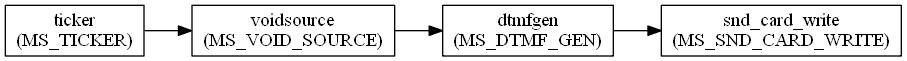
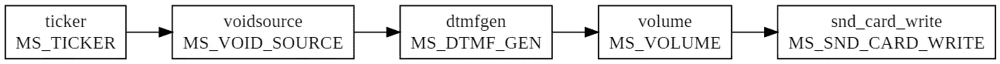
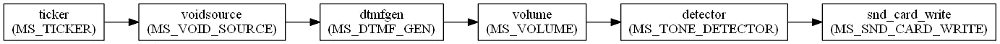
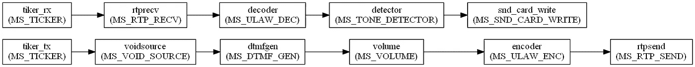
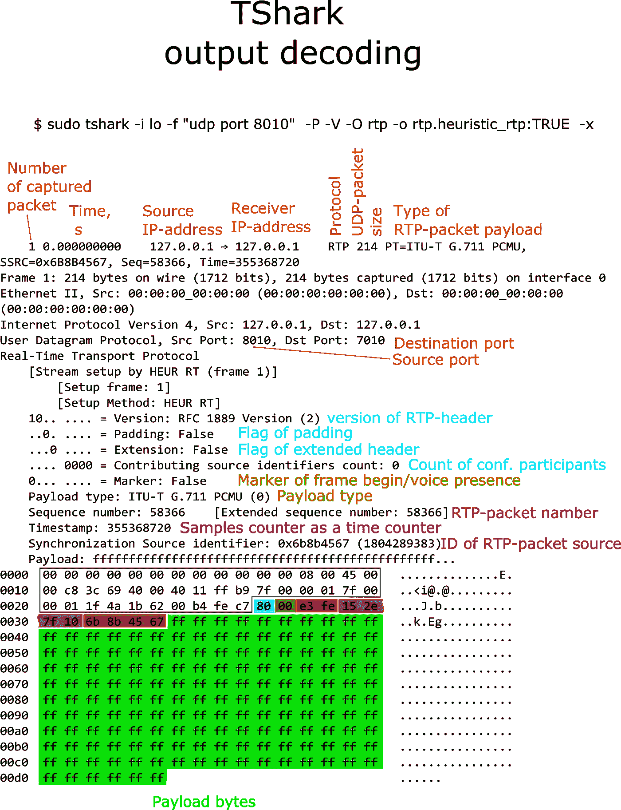
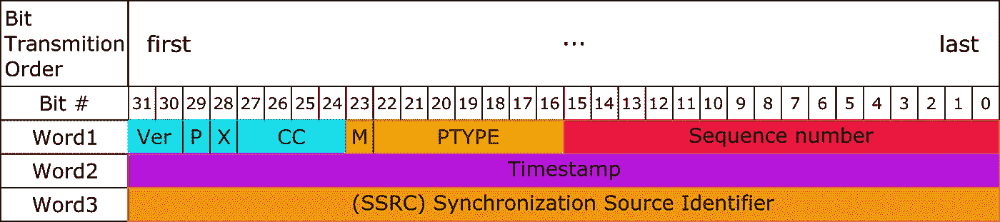
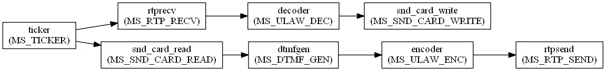

# 什么是 Mediastreamer2。使用的过滤器示例

> 原文：<https://levelup.gitconnected.com/chapter-3-examples-of-using-filters-612f2121301>


(上一篇文章[什么是 Mediastreamer2。简介](/whats-mediastreamer2-80fa1c5e617)

本文将重点介绍几个使用 mediastreamer 过滤器的例子。在这个过程中，我们将学习如何组织信号图，如何创建和销毁过滤器实例。我们将学习如何将它们连接到数据处理电路、音调检测和信号电平测量中。然后，我们将看到如何通过 RTP 流传输信号。让我们使用 *TShark* 工具来熟悉一下 RTP 包的内部字段。我们用一个双工对讲机的例子来结束这篇文章。

# 3.1 创建一个
声音生成器

在之前的[文章](/whats-mediastreamer2-80fa1c5e617)中，我们安装了 mediastreamer 库和开发工具，并通过构建一个示例应用程序测试了它们的功能。

现在我们将创建一个可以在声卡上播放声音的应用程序。为了解决这个问题，我们需要将滤波器连接到声音发生器电路，如图 3.1 所示。



图 3.1:声音发生器

我们从左到右阅读图表，数据流就是朝这个方向移动的。箭头也暗示了这一点。矩形表示处理数据块并将结果暴露给输出的过滤器。其作用显示在矩形内，过滤器类型显示在正下方的括号内。连接矩形的箭头是在过滤器之间传输数据块的数据队列。一般来说，一个过滤器可以有许多输入和输出。

这一切都始于时钟源，它设置滤波器中数据的计算速度。根据其时钟，每个过滤器处理输入端队列中的所有数据块。它将结果块放在输出队列中。首先，它计算离时钟源最近的滤波器，然后计算连接到其输出端的滤波器(可能有多个输出端)，依此类推。在链中的最后一个滤波器处理完计算之后，执行停止，直到接收到新的时钟。默认情况下，时钟每 10 毫秒滴答一次。

让我们回到我们的图表。时钟到达静音源的输入端，该滤波器忙于为每个时钟在其输出端生成一个包含零的数据块。如果我们把这个区块看作一组声音样本，那么这只不过是寂静。乍一看，生成无声的数据块似乎很奇怪——毕竟它是听不到的，但它们是声音信号发生器运行所必需的。发生器像一张白纸一样使用这些块，在其中记录声音样本。在正常状态下，发生器关闭，只是将输入模块转发到输出。因此，无声块不变地从左到右通过整个电路，落入声卡。它静默地从连接到其输入的队列中取出块。

但是一切都会改变，如果发生器收到播放声音的命令，它就会开始生成声音样本，并用它们替换输入块中的样本，将改变的块暴露给输出。声卡收到它们后，开始播放声音。清单 3.1 显示了一个实现上述工作模式的程序。

清单 3.1:声音生成器

```
/* Файл mstest2.c Sound Generator. */#include <Mediastreamer2/msfilter.h>
#include <Mediastreamer2/msticker.h>
#include <Mediastreamer2/dtmfgen.h>
#include <Mediastreamer2/mssndcard.h>
int main()
{
    ms_init(); /* Instantiating filters. */
    MSFilter  *voidsource = ms_filter_new(MS_VOID_SOURCE_ID);
    MSFilter  *dtmfgen = ms_filter_new(MS_DTMF_GEN_ID);
    MSSndCard *card_playback = ms_snd_card_manager_get_default_card(ms_snd_card_manager_get());
    MSFilter  *snd_card_write = ms_snd_card_create_writer(card_playback); /* Instantiating ticker. */
    MSTicker *ticker = ms_ticker_new(); /* We connect filters in a chain. */
    ms_filter_link(voidsource, 0, dtmfgen, 0);
    ms_filter_link(dtmfgen, 0, snd_card_write, 0); /* We connect the clock source. */
   ms_ticker_attach(ticker, voidsource); /* We turn on the sound generator. */
   char key='1';
   ms_filter_call_method(dtmfgen, MS_DTMF_GEN_PLAY, (void*)&key); /* We give time for all data blocks to be received by the sound card.*/
   ms_sleep(2);   
}
```

在初始化 mediastreamer 之后，创建了三个过滤器: *voidsource，dtmfgen，snd_card_write* 。创建了时钟源。

然后，根据我们的电路建立滤波器连接，最后连接时钟源，此时电路已经组装好，因为此后电路将立即开始工作。如果将时钟源连接到非法电路，如果 mediastreamer 检测到链中至少有一个滤波器的所有输入或所有输出都“悬在空中”(未连接)，它可能会崩溃。

使用 *ms_filter_link()* 函数连接过滤器:

```
int ms_filter_link (MSFilter *f1, int pin1, MSFilter *f2, int pin2)
```

在哪里

**f1** -指向源过滤器的指针；

**pin 1**-是源滤波器的输出号(注意输入和输出从零开始编号)；

**F2**-指向滤波器-接收器的指针；

**pin 2**-滤波接收机的输入号。

连接所有滤波器，最后连接时钟源(以下简称为跑马灯)。在那之后，我们的声音电路启动，但是在计算机扬声器中什么也听不到——声音发生器被关闭，并且简单地通过它自己无声地转发输入数据块。要开始生成音调，您必须执行生成器过滤器方法。

我们将启用与按下电话上的“1”按钮相对应的双音(DTMF)信号的生成。要做到这一点，使用*MS _ filter _ call _ method()*函数，我们调用 MS_DTMF_GEN_PLAY 方法，将它作为一个指向字符(清单中的 *key* 变量)的指针的参数传递，正在播放的信号必须与该指针相对应。

剩下的就是编译程序了:

```
$ gcc mstest2.c -o mstest2 `pkg-config Mediastreamer2 --libs --cflags`
```

并运行:

```
$ ./mstest2
```

启动该程序后，您将在电脑扬声器中听到由两种声音组成的短促蜂鸣声。

我们编写并推出了我们的第一个声音电路。我们看到了如何创建过滤器的实例，如何连接以及如何调用它们的方法。在为第一次成功欢欣鼓舞之后，我们仍然需要注意这样一个事实，我们的程序在退出之前并没有释放分配给它的内存。在下一节中，我们将关注程序的正确终止。

# 3.2 改善音调
发生器示例

在上一节中，我们编写了一个音调发生器应用程序，并使用它从计算机扬声器中提取声音。现在我们会注意到，我们的程序在退出时，并没有将内存返回到堆中。是时候澄清这个问题了。

当我们不再需要模式时，释放内存必须从停止数据管道开始。要做到这一点，你需要把跑马灯从电路上断开。这个 *ms_ticker_detach()* 在这方面有所帮助。在我们的例子中，我们必须断开 ticker 与 *voidsource* 过滤器输入的连接:

```
ms_ticker_detach(ticker, voidsource)
```

顺便说一句，在停止输送机后，我们可以改变它的方案，通过重新连接跑马灯使其恢复运行。

现在我们可以使用 *ms_ticker_destroy()* 函数来删除它:

```
ms_ticker_destroy(ticker)
```

传送带停下来，我们可以开始把它拆成零件，断开过滤器。为此，使用函数 *ms_filter_unlink()* :

```
ms_filter_unlink(voidsource, 0, dtmfgen, 0);
ms_filter_unlink(dtmfgen, 0, snd_card_write, 0);
```

参数的作用与 *ms_filter_link()* 函数相同。

用 *ms_filter_destroy()* 移除现在断开的过滤器:

```
ms_filter_destroy(voidsource); 
ms_filter_destroy(dtmfgen);
ms_filter_destroy(snd_card_write);
```

通过在我们的例子中添加这几行，从内存管理的角度来看，我们得到了一个正确的程序终止。

正如我们所看到的，正确完成程序需要我们添加与开始组装电路时相同数量的代码行，平均每个滤波器四行代码。原来，程序代码的大小将与项目中使用的过滤器数量成比例增长。如果我们谈论一个模式中的一千个过滤器，那么创建和销毁它们的四千行例行操作将被添加到您的代码中。

现在你知道如何正确地终止一个基于 mediastreamer 的程序了。在下面的例子中，为了简洁起见，我将“忘记”这样做。但你不会忘记？

mediastreamer 的开发者没有提供软件工具来在组装/拆卸电路时便于操作滤波器。但是，有一个 *MSConnectionHelper* 允许您快速地在模式中插入/删除过滤器。当项目中的过滤器数量超过几十个时，您会觉得有必要使用它。

# 3.3 创建信号
液位计

在本节中，我们将组装一个信号电平计电路，并学习如何从滤波器读取测量结果。我们来估算一下测量精度。mediastreamer 提供的一组滤波器包括一个滤波器 MS_VOLUME，它能够测量通过它的信号的均方根电平，衰减信号并执行许多有用和意想不到的功能。但是现在我们将把它作为一个仪表。

我们将使用音调发生器作为信号源，来自它的信号将被发送到 MS_VOLUME 过滤器，声卡连接到它的输出。

在本例中，我们将以稍微不同的模式使用发生器滤波器，它将为我们生成一个单音信号，即只包含一个正弦波的信号。

除了频率和振幅，我们需要设置信号持续时间，它必须足以让测量所需的样本数量通过 MS_VOLUME 过滤器。用于传输生成器设置的结构是 *MSDtmfGenCustomTone* :

清单 3.2:结构 MSDtmfGenCustomTone

```
struct _MSDtmfGenCustomTone{
    char tone_name[8];   /* 8-letter signal text name.*/
    int duration;        /* Signal duration in milliseconds.*/
    int frequencies[2];  /* The pair of frequencies that the output
                            signal should consist of. */
    float amplitude;     /* Tone amplitude, 1.0 corresponds to
                            0 dB mW into 600 ohm load.*/
    int interval;        /* Pause in milliseconds before starting
                            signal replay.*/
    int repeat_count;    /* Number of repetitions.*/
};
typedef struct _MSDtmfGenCustomTone MSDtmfGenCustomTone;
```

为了启动生成器，我们将使用它的 MS_DTMF_GEN_PLAY_CUSTOM 方法。

信号处理的框图如图所示。3.2.



图 3.2:信号电平指示器

清单 3.3 显示了实现这个方案的程序代码。

清单 3.3:信号电平指示器

```
/* Файл mstest3.c Signal level meter. */#include <Mediastreamer2/msfilter.h>
#include <Mediastreamer2/msticker.h>
#include <Mediastreamer2/dtmfgen.h>
#include <Mediastreamer2/mssndcard.h>
#include <Mediastreamer2/msvolume.h>int main()
{
    ms_init();
    /* Instantiating filters. */
    MSFilter  *voidsource=ms_filter_new(MS_VOID_SOURCE_ID);
    MSFilter  *dtmfgen=ms_filter_new(MS_DTMF_GEN_ID);
    MSFilter  *volume=ms_filter_new(MS_VOLUME_ID);
    MSSndCard *card_playback=ms_snd_card_manager_get_default_card(ms_snd_card_manager_get());
    MSFilter  *snd_card_write=ms_snd_card_create_writer(card_playback); /* Create a ticker. */
    MSTicker *ticker=ms_ticker_new(); /* We connect filters in a chain. */
    ms_filter_link(voidsource, 0, dtmfgen, 0);
    ms_filter_link(dtmfgen, 0, volume, 0);
    ms_filter_link(volume, 0, snd_card_write, 0); /* Connect the clock source. */
    ms_ticker_attach(ticker,voidsource); MSDtmfGenCustomTone dtmf_cfg; /* We set the name of our signal, remembering that in the array we must leave room for a zero, which marks the end of the line. */
    strncpy(dtmf_cfg.tone_name, "busy", sizeof(dtmf_cfg.tone_name));
    dtmf_cfg.duration=1000;
    dtmf_cfg.frequencies[0]=440; /* We will generate one tone, set the frequency of the second tone to 0.*/
    dtmf_cfg.frequencies[1]=0;
    dtmf_cfg.amplitude=1.0; /* This sine amplitude should correspond to a measurement result of 0.707.*/
    dtmf_cfg.interval=0.;
    dtmf_cfg.repeat_count=0.; /* Turn on the sound generator. */
   ms_filter_call_method(dtmfgen, MS_DTMF_GEN_PLAY_CUSTOM, (void*)&dtmf_cfg); /* We give half a second time for the meter to accumulate data. */
   ms_usleep(500000); /* Reading the measurement result. */
  float level=0;
   ms_filter_call_method(volume, MS_VOLUME_GET_LINEAR,&level);
   printf("The amplitude of the sine %f volts corresponds to the rms value of %f volts.\n", dtmf_cfg.amplitude, level);
}
```

我们编译我们的例子，就像我们以前做的那样，只使用文件名 *mstest3.c* 运行它以执行并在控制台中获得结果:

```
The amplitude of the sine 1.000000 volts corresponds to the rms value of 0.707733 volts.
```

如您所见，测量结果精确到小数点后第三位，理论值等于二的平方根除以二:

```
sqr(2)/2=0,7071067811865475
```

结果与真实值的相对偏差为 *0.1%* 。我们估计了最大信号电平下的测量误差。因此，随着液位的降低，误差会增加。建议你自己评估一下信号水平低。

# 3.4 音调检测器

在这一节中，我们将考虑一个方案，在该方案中，除了数据转换之外，还生成事件。多亏了这一点，我们将能够编写对图中发生的任何事件都有反馈的程序。许多 mediastreamer 的过滤器能够生成事件，并且用户能够将一个或多个处理程序(回调函数)绑定到将实现应用程序的业务逻辑的事件。

在 *过去，不是每个俄罗斯家庭都有电视，一半的俄罗斯人用钳子换频道，一则有趣的新闻出现在外国技术新闻评论中，报道称一家电视制造商为他们的设备提供了无线遥控器。从细节可以看出，由于使用了一种不寻常的方法，遥控器在没有电池的情况下也能工作——遥控器是机械的，是一种乐器的混合体——钟琴和左轮手枪。“左轮手枪”的鼓里有金属圆筒，长度不同，当撞针击中其中一个时，圆筒开始以自己的频率响起来。大概是通过超声波。电视上的电子设备听到了这个信号，并且在确定了它的频率之后，执行了适当的动作——改变频道、改变音量、打开/关闭电视。*

今天，我们将利用我们对 mediastreamer 的了解，尝试重建这个命令传输系统。

为了模拟遥控器，让我们使用音调发生器示例的文本。我们将为它添加一个对键盘击键发生器频率的控制，以及一个带解码器的接收器，它将把接收到的命令输出到控制台。改变后，发生器应发出音调，6 个频率，我们将使用这些音调对命令进行编码，以增加/减少音量，改变频道，打开/关闭电视。该结构用于配置探测器*mstonetencerdef*:

清单 3.4:струкураmstonetencerdef

```
struct _MSToneDetectorDef{ 
  char tone_name[8]; 
  int frequency;       /* Frequency of tone of interest. */
  int min_duration;    /* Minimum tone duration in milliseconds. */
  float min_amplitude; /* Minimum tone amplitude, 1.0 corresponds to
                          0 dBm */
};typedef struct _MSToneDetectorDef MSToneDetectorDef;
```

10 个这样的结构可以被传输到检测器，因此一个检测器可以被配置成检测十个双音信号(DTMF)。但是我们将只使用六个单音信号。要将设置载入检测器，请使用 MS_TONE_DETECTOR_ADD_SCAN 方法。

为了让检波器通知我们具有所需频率成分的信号已经到达其输入端，我们必须为它提供一个回调函数，它将在这种情况下触发。使用函数*ms _ filter _ set _ notify _ callback()*完成回调设置。作为参数，它接收一个指向过滤器的指针，一个指向回调函数的指针，一个指向我们希望传递给回调函数的数据(用户数据)的指针。

当检测器被触发时，回调函数将接收用户数据、指向检测器过滤器的指针、事件 ID 和描述事件的结构 MSToneDetectorEvent:

清单 3.5:结构 MSToneDetectorEvent

```
struct _MSToneDetectorEvent{ 
      char tone_name[8];       /* The tone name that we assigned to 
                                  it when setting up the detector.*/
      uint64_t tone_start_time;   /* Time in milliseconds when the 
                                     tone was detected. */
};typedef struct _MSToneDetectorEvent MSToneDetectorEvent;
```

信号处理电路如图所示。3.3，在这种情况下，声卡起不到关键作用，它被留下来只是为了让你能听到电路的输入端有信号。



图 3.3:音调检测器

现在程序代码本身带有注释。

清单 3.6:远程控制和接收器模拟器

```
/* Файл mstest4.c Remote control and receiver simulator. */#include <Mediastreamer2/msfilter.h>
#include <Mediastreamer2/msticker.h>
#include <Mediastreamer2/dtmfgen.h>
#include <Mediastreamer2/mssndcard.h>
#include <Mediastreamer2/msvolume.h>
#include <Mediastreamer2/mstonedetector.h>/* We include a header file with event management functions 
 * mediastreamer. */
#include <Mediastreamer2/mseventqueue.h>/* Callback function, it will be called by the filter as soon as it
 * will detect the coincidence of the characteristics
 * of the input signal with the specified. */
static void tone_detected_cb(void *data, MSFilter *f, unsigned int event_id,
        MSToneDetectorEvent *ev)
{
    printf("                      Command accepted: %s\n",
 ev->tone_name);
}int main()
{
    ms_init(); /* Instantiating filters. */
    MSFilter  *voidsource = ms_filter_new(MS_VOID_SOURCE_ID);
    MSFilter  *dtmfgen = ms_filter_new(MS_DTMF_GEN_ID);
    MSFilter  *volume = ms_filter_new(MS_VOLUME_ID);
    MSSndCard *card_playback =
        ms_snd_card_manager_get_default_card(ms_snd_card_manager_get());
    MSFilter  *snd_card_write = ms_snd_card_create_writer(card_playback);
    MSFilter  *detector = ms_filter_new(MS_TONE_DETECTOR_ID); /* We clear the array inside the tone detector, it describes
     * special signs of wanted signals.*/
    ms_filter_call_method(detector, MS_TONE_DETECTOR_CLEAR_SCANS, 0); /* Create a ticker source. */
    MSTicker *ticker=ms_ticker_new(); /* We connect filters in a chain. */
    ms_filter_link(voidsource, 0, dtmfgen, 0);
    ms_filter_link(dtmfgen, 0, volume, 0);
    ms_filter_link(volume, 0, detector, 0);
    ms_filter_link(detector, 0, snd_card_write, 0); /* Connect a callback function to the filter. */
    ms_filter_set_notify_callback(detector,
            (MSFilterNotifyFunc)tone_detected_cb, NULL); /* Connect the clock source. */
    ms_ticker_attach(ticker,voidsource); /* We create an array, each element of which describes 
     * a characteristic of one of the tones
     * to be detected: 
     * Text name of this element,
     * Frequency in hertz,
     * Duration in milliseconds,
     * Minimum level relative to 0.775V. */  
    MSToneDetectorDef  scan[6]=
    {
        {"V+",  440, 100, 0.1}, /* “Volume Up” command. */
        {"V-",  540, 100, 0.1}, /* “Volume Down” command. */
        {"C+",  640, 100, 0.1}, /* "Increase Channel Number" command. */
        {"C-",  740, 100, 0.1}, /* “Decrease Channel Number” command. */
        {"ON",  840, 100, 0.1}, /* "Turn on the TV" command. */
        {"OFF", 940, 100, 0.1}  /* “Turn off TV” command. */
    }; /* We transfer the signs of signals to the tone detector. */
    int i;
    for (i = 0; i < 6; i++)
    {
        ms_filter_call_method(detector, MS_TONE_DETECTOR_ADD_SCAN,
                &scan[i]);
    } /* Setting up the structure that controls the generator output.*/
    MSDtmfGenCustomTone dtmf_cfg;
    dtmf_cfg.tone_name[0] = 0;
    dtmf_cfg.duration = 1000;
    dtmf_cfg.frequencies[0] = 440;
    /* We will generate one tone, set the frequency of the second tone to 0.*/
    dtmf_cfg.frequencies[1] = 0;
    dtmf_cfg.amplitude = 1.0;
    dtmf_cfg.interval = 0.;
    dtmf_cfg.repeat_count = 0.; /* We organize a cycle of scanning of pressed keys.
     * Entering zero completes
     * cycle and work of the program. */
    char key='9';
    printf("Press the command key, then Enter.\n"
        "Enter 0 to end the program.\n");
    while(key != '0')
    {
        key = getchar();
        if ((key >= 49) && (key <= 54))
        {
                printf("Command sent: %c\n", key);
            /* We set the generator frequency in accordance
             * with the code of the pressed key.*/
            dtmf_cfg.frequencies[0] = 440 + 100*(key-49); /* Turn on the sound generator with the updated frequency. */
            ms_filter_call_method(dtmfgen, MS_DTMF_GEN_PLAY_CUSTOM,
                    (void*)&dtmf_cfg);
        }
        ms_usleep(20000);
    }
}
```

我们编译并运行程序。如果一切正常，那么在启动之后，我们应该会得到类似这样的程序行为:

```
$ ./mstest4
ALSA lib conf.c:4738:(snd_config_expand) Unknown parameters 0
ALSA lib control.c:954:(snd_ctl_open_noupdate) Invalid CTL default:0
ortp-warning-Could not attach mixer to card: Invalid argument
ALSA lib conf.c:4738:(snd_config_expand) Unknown parameters 0
ALSA lib pcm.c:2266:(snd_pcm_open_noupdate) Unknown PCM default:0
ALSA lib conf.c:4738:(snd_config_expand) Unknown parameters 0
ALSA lib pcm.c:2266:(snd_pcm_open_noupdate) Unknown PCM default:0
ortp-warning-Strange, sound card Intel 82801AA-ICH does not seems to be capable of anything, retrying with plughw...
Press the command key, then Enter.
Enter 0 to end the program.
ortp-warning-alsa_set_params: periodsize:256 Using 256
ortp-warning-alsa_set_params: period:8 Using 8
```

按下从“1”到“6”的任意键，用“Enter”键确认，您应该得到类似下面的列表:

```
2
Command sent: 2
                      Command accepted: V-
1
Command sent: 1
                      Command accepted: V+
3
Command sent: 3
                      Command accepted: C+
4
Command sent: 4
                      Command accepted: C-
0
$
```

我们看到命令音已成功发送，并且检测器已检测到它们。

# 3.5 通过 RTP 流传输音频信号

在本节中，我们将学习如何使用协议 RTP ( *RFC 3550 — RTP:一种用于实时应用*的传输协议)通过*以太网*接收/传输音频信号。

协议 RTP ( *实时协议)*用于传输声音，视频，数据，任何需要实时传输的东西。以一段音频为例。该协议的灵活性使得它允许以预定质量传输音频信号。

使用 UDP 数据包进行传输，这意味着在传输过程中数据包丢失是完全可以接受的。每个分组包含一个特殊的 RTP 报头和一个传输信号的数据块。报头包含随机选择的信号源标识符、关于传输信号类型的信息、分组的唯一序列号，使得分组可以在解码期间以正确的顺序排列，而不管网络传送它们的顺序。头可以包含附加信息，即所谓的扩展，它允许您修改包以用于特定的应用程序。

数据块包含数据包的有效载荷。内容的内部组织取决于负载的类型，它可以是单声道信号、立体声信号、视频线等的样本。

负载类型由一个七位数字表示。建议 RFC3551 ( *用于具有最小控制的音频和视频会议的 RTP 规范*)在相应的表格中设置了几种类型的负载，提供了负载类型的描述以及指定这些负载的代码的含义，其中一些代码并不严格限制于任何类型的负载，它们可用于指定任意负载。

数据块的大小受到在给定网络中不分段传输的最大数据包大小的限制(参数 MTU)。一般来说，这不超过 1500 字节。因此，为了增加每秒传输的数据量，您可以将包的大小增加到某一点，然后您将需要增加发送包的频率。在媒体流 2 中，这是一个可配置的参数。默认情况下，频率为 50 赫兹，即每秒 50 个数据包。传输的 RTP 分组序列将被称为 RTP 流。

为了开始在源和接收器之间传输数据，发送器知道接收器的 IP 地址和它用于接收的端口号就足够了。那些。在没有任何预备过程的情况下，源开始传输数据，而接收器则准备好立即接收和处理数据。根据该标准，用于发送或接收 RTP 流的端口号必须是偶数。

在不可能预先知道接收者的地址的情况下，在接收者留下他们的地址的地方使用服务器，并且发送者可以参考接收者的某个唯一名称来请求它。

在通信信道的质量或接收器的能力未知的情况下，组织反馈信道，通过该反馈信道，接收器可以通知发送器其能力、其丢失的分组数量等。该通道使用 RTCP 协议( *RTP 控制协议*)。RFC 3605 中定义了在此信道中传输的数据包的格式。相对少量的数据 200..每秒 300 字节通过该信道传输，因此，一般来说，它的存在并不麻烦。RTCP 分组被发送到的端口号必须是奇数，并且比 RTP 流来自的端口号多 1。在我们的例子中，我们将不使用这个信道，因为接收机和信道的能力肯定超过了我们目前适度的需求。

在本例中，数据传输方案与前一个不同，将分为两部分:发送路径和接收路径。对于每个部分，我们将制作自己的时钟源(ticker)，如图 3.4 所示。



图 3.4:使用 RTP 字符串

它们之间的单向通信将使用 RTP 协议进行。在本例中，我们不需要外部网络，因为发送方和接收方将位于同一台计算机上，数据包将在内部传输。

为了在媒体流 2 中建立 RTP 流，使用了两个过滤器:MS_RTP_SEND 和 MS_RTP_RECV。第一个执行传输，第二个接收 RTP 流。为了让这些过滤器工作，它们需要传递一个指向 RTP-session 对象的指针，该对象既可以执行将数据块流转换为 RTP-packets 流的操作，也可以执行相反的操作。由于 mediastreamer 的内部数据格式与 RTP-packet 的数据格式不匹配，因此在将数据传输到 MS_RTP_SEND ( *编码器*)之前，必须使用一个转换器，该转换器将音频信号的 16 位样本转换为由μ-law(在标准 G.711 中描述)编码的 8 位样本。在接收侧，滤波器*解码器*执行相反的动作。

在清单 3.7 中，实现图中所示电路的程序文本在 3.4 中给出。

清单 3.7:带 RTP 的远程控制和接收器模拟器

```
/* Файл mstest6.c Simulator of remote control and receiver 
simulator with RTP. */#include <Mediastreamer2/msfilter.h>
#include <Mediastreamer2/msticker.h>
#include <Mediastreamer2/dtmfgen.h>
#include <Mediastreamer2/mssndcard.h>
#include <Mediastreamer2/msvolume.h>
#include <Mediastreamer2/mstonedetector.h>
#include <Mediastreamer2/msrtp.h>
#include <ortp/rtpsession.h>
#include <ortp/payloadtype.h>/* We include a header file with event management functions * mediastreamer.*/
include <Mediastreamer2/mseventqueue.h>#define PCMU 0/* Callback function, it will be called by the filter as soon as it detects the coincidence of the characteristics of the input signal with the specified. */
static void tone_detected_cb(void *data, MSFilter *f, unsigned int event_id,
MSToneDetectorEvent *ev)
{
  printf("Command accepted: %s\n", ev->tone_name);
}/*--------------------------------------------------------------*/
/* Payload type registration function. */
void register_payloads(void)
{
  /*We register the types of loads in the profile table. Later, by index    taken from the header of the RTP-packet from this table will be extracted    load parameters needed to decode packet data. */
  rtp_profile_set_payload (&av_profile, PCMU, &payload_type_pcm8000);
}/*--------------------------------------------------------------*/
/*This function is created from the create_duplex_rtpsession () function in audiostream.c mediastreamer 2\. */
static RtpSession *
create_rtpsession (int loc_rtp_port, int loc_rtcp_port,
bool_t ipv6, RtpSessionMode mode)
{
  RtpSession *rtpr;
  rtpr = rtp_session_new ((int) mode);
  rtp_session_set_scheduling_mode (rtpr, 0);
  rtp_session_set_blocking_mode (rtpr, 0);
  rtp_session_enable_adaptive_jitter_compensation (rtpr, TRUE);
  rtp_session_set_symmetric_rtp (rtpr, TRUE);
 rtp_session_set_local_addr (rtpr, ipv6 ? "::" : "0.0.0.0",       loc_rtp_port,
loc_rtcp_port);
  rtp_session_signal_connect (rtpr, "timestamp_jump",
  (RtpCallback) rtp_session_resync, 0);
  rtp_session_signal_connect (rtpr, "ssrc_changed",
  (RtpCallback) rtp_session_resync, 0);
  rtp_session_set_ssrc_changed_threshold (rtpr, 0);
  rtp_session_set_send_payload_type(rtpr, PCMU); /* By default, we turn off the RTCP session, since our remote control will not use it. */
  rtp_session_enable_rtcp (rtpr, FALSE);
  return rtpr;
}/*--------------------------------------------------------------*/
int main()
{
  ms_init(); /* Instantiating filters. */
  MSFilter *voidsource = ms_filter_new(MS_VOID_SOURCE_ID);
  MSFilter *dtmfgen = ms_filter_new(MS_DTMF_GEN_ID);
  MSFilter *volume = ms_filter_new(MS_VOLUME_ID);
  MSSndCard *card_playback =
  ms_snd_card_manager_get_default_card(ms_snd_card_manager_get());
  MSFilter *snd_card_write = ms_snd_card_create_writer(card_playback);
  MSFilter *detector = ms_filter_new(MS_TONE_DETECTOR_ID); /* We clear the array inside the tone detector, it describes
   * special signs of the wanted signals. */
  ms_filter_call_method(detector, MS_TONE_DETECTOR_CLEAR_SCANS, 0); /* Connect a callback function to the filter. */
  ms_filter_set_notify_callback(detector,
(MSFilterNotifyFunc)tone_detected_cb, NULL); /* We create an array, each element of which describes a characteristic    
   * one of the tones to be detected: Text name    
   * of this element, frequency in hertz, duration in milliseconds,     
   * minimum level relative to 0.775V. */
  MSToneDetectorDef scan[6]=
  {
     {"V+",  440, 100, 0.1}, /* “Volume Up” command. */
     {"V-",  540, 100, 0.1}, /* “Volume Down” command. */
     {"C+",  640, 100, 0.1}, /* "Increase Channel Number" command. */
     {"C-",  740, 100, 0.1}, /* “Decrease Channel Number” command. */
     {"ON",  840, 100, 0.1}, /* "Turn on the TV" command. */
     {"OFF", 940, 100, 0.1}  /* “Turn off TV” command. */  
  }; /* We transmit "signs" of the signals to the tone detector. */
  int i;
  for (i = 0; i < 6; i++)
  {
    ms_filter_call_method(detector, MS_TONE_DETECTOR_ADD_SCAN,
&scan[i]);
  } /* Creating encoder and decoder filters. */
  MSFilter *encoder = ms_filter_create_encoder("PCMU");
  MSFilter *decoder=ms_filter_create_decoder("PCMU");
  /* Регистрируем типы нагрузки. */
  register_payloads(); /* Create an RTP transmitter session. */
  RtpSession *tx_rtp_session = create_rtpsession (8010, 8011, FALSE,     RTP_SESSION_SENDONLY);
  rtp_session_set_remote_addr_and_port(tx_rtp_session,"127.0.0.1", 7010, 7011);
  rtp_session_set_send_payload_type(tx_rtp_session, PCMU);
  MSFilter *rtpsend = ms_filter_new(MS_RTP_SEND_ID);
  ms_filter_call_method(rtpsend, MS_RTP_SEND_SET_SESSION,      tx_rtp_session); /* Create RTP Receiver Session. */
  MSFilter *rtprecv = ms_filter_new(MS_RTP_RECV_ID);
  RtpSession *rx_rtp_session = create_rtpsession (7010, 7011, FALSE, RTP_SESSION_RECVONLY);
  ms_filter_call_method(rtprecv, MS_RTP_RECV_SET_SESSION, rx_rtp_session); /* Create tick sources - tickers. */
  MSTicker *ticker_tx = ms_ticker_new();
  MSTicker *ticker_rx = ms_ticker_new(); /* We connect the transmitter filters. */
  ms_filter_link(voidsource, 0, dtmfgen, 0);
  ms_filter_link(dtmfgen, 0, volume, 0);
  ms_filter_link(volume, 0, encoder, 0);
  ms_filter_link(encoder, 0, rtpsend, 0); /* We connect the receiver filters. */
  ms_filter_link(rtprecv, 0, decoder, 0);
  ms_filter_link(decoder, 0, detector, 0);
  ms_filter_link(detector, 0, snd_card_write, 0); /* Connect the clock source. */
  ms_ticker_attach(ticker_tx, voidsource);
  ms_ticker_attach(ticker_rx, rtprecv); /* Setting up the structure that controls the generator output. */
  MSDtmfGenCustomTone dtmf_cfg;
  dtmf_cfg.tone_name[0] = 0;
  dtmf_cfg.duration = 1000;
  dtmf_cfg.frequencies[0] = 440; /* We will generate one tone, set the frequency of the second tone to 0\. */
  dtmf_cfg.frequencies[1] = 0;
  dtmf_cfg.amplitude = 1.0;
  dtmf_cfg.interval = 0.;
  dtmf_cfg.repeat_count = 0.; /* We organize a cycle of scanning of pressed keys. Entering zero completes
   * cycle and work of the program. */
  char key='9';
  printf("Press the command key then enter.\n"
  "To end the program, enter 0.\n");
  while(key != '0')
  {
    key = getchar();
    if ((key >= 49) && (key <= 54))
    {
      printf("Command sent: %c\n", key); /* We set the generator frequency in accordance with 
       * the code of the pressed key. */
      dtmf_cfg.frequencies[0] = 440 + 100*(key-49); /* Turn on the sound generator with the updated frequency. */
      ms_filter_call_method(dtmfgen, MS_DTMF_GEN_PLAY_CUSTOM,
      (void*)&dtmf_cfg);
    } /* We put the thread into hibernation for 20ms so that other threads
     * apps got time to work. */
    ms_usleep(20000);
  }
}
```

编译，运行。从表面上看，该程序将类似于前面 3.6 节中的示例，但同时数据将通过 RTP 流传输。

# 3.6 使用 TShark
分析 RTP 数据包

在本节中，我们将继续研究使用 RTP 协议的音频信号传输。首先，让我们将清单 3.7 中的测试应用程序分成发送器和接收器两个独立的应用程序，然后我们将学习如何使用网络流量分析器来检查 RTP 流。

因此，为了更清楚地看到哪些程序元素负责 RTP 传输，哪些负责接收，我们将我们的 *mstest6.c* 文件分成发送器和接收器两个独立的程序，两者都使用的通用函数将放在第三个文件中，我们称之为 *mstest_common.c* 清单 3.8，它将通过发送器和接收器使用指令*连接，包括*:

清单 3.8:发送器和接收器的通用函数

```
/* Файл mstest_common.c RTP Control Protocol */#include <Mediastreamer2/msfilter.h>
#include <Mediastreamer2/msticker.h>
#include <Mediastreamer2/msrtp.h>
#include <ortp/rtpsession.h>
#include <ortp/payloadtype.h>define PCMU 0/*---------------------------------------------------------*/
/* The function of registering payload types. */
void register_payloads(void)
{  
 /* We register the types of loads in the profile table. Later, according to the index taken parameters will be extracted from the RTP packet header from this table loads required to decode packet data. */
  rtp_profile_set_payload (&av_profile, PCMU, &payload_type_pcm8000);
}/*---------------------------------------------------------*/
/* This function is created from the function create_duplex_rtpsession() in audiostream.c of mediastreamer2\. */
 static RtpSession *create_rtpsession (int loc_rtp_port, int loc_rtcp_port,  bool_t ipv6, RtpSessionMode mode)
{  
  RtpSession *rtpr;  rtpr = rtp_session_new ((int) mode);  
  rtp_session_set_scheduling_mode (rtpr, 0);  
  rtp_session_set_blocking_mode (rtpr, 0);
  rtp_session_enable_adaptive_jitter_compensation (rtpr, TRUE);
  rtp_session_set_symmetric_rtp (rtpr, TRUE); 
  rtp_session_set_local_addr (rtpr, ipv6 ? "::" : "0.0.0.0", loc_rtp_port,  loc_rtcp_port); 
  rtp_session_signal_connect (rtpr, "timestamp_jump",  (RtpCallback) rtp_session_resync, 0);
  rtp_session_signal_connect (rtpr, "ssrc_changed",  (RtpCallback) rtp_session_resync, 0);
  rtp_session_set_ssrc_changed_threshold (rtpr, 0);
  rtp_session_set_send_payload_type(rtpr, PCMU); /* By default, we turn off the RTCP session, since our remote control will not use it. */  
 rtp_session_enable_rtcp (rtpr, FALSE);
 return rtpr;
}
```

现在独立的变送器文件 *mstest6.c* ，清单 3.9:

清单 3.9:远程控制模拟器(发射器)

```
/* Файл mstest6.c Remote control simulator (transmitter). */#include <Mediastreamer2/dtmfgen.h>
#include <Mediastreamer2/msrtp.h>
#include "mstest_common.c"/*----------------------------------------------------------*/
int main()
{ 
  ms_init();/* We create instances of filters. */
  MSFilter *voidsource = ms_filter_new(MS_VOID_SOURCE_ID); 
  MSFilter *dtmfgen = ms_filter_new(MS_DTMF_GEN_ID);/* Create an encoder filter. */
  MSFilter *encoder = ms_filter_create_encoder("PCMU");/* Registering load types. */
  register_payloads();/* Create an RTP transmitter session. */
  RtpSession *tx_rtp_session = create_rtpsession (8010, 8011, FALSE, RTP_SESSION_SENDONLY);  
 rtp_session_set_remote_addr_and_port(tx_rtp_session,"127.0.0.1", 7010, 7011); 
 rtp_session_set_send_payload_type(tx_rtp_session, PCMU);  
 MSFilter *rtpsend = ms_filter_new(MS_RTP_SEND_ID); 
 ms_filter_call_method(rtpsend, MS_RTP_SEND_SET_SESSION, tx_rtp_session);/* Create a source of ticks - ticker. */ 
 MSTicker *ticker_tx = ms_ticker_new();/* We connect the transmitter filters. */ 
 ms_filter_link(voidsource, 0, dtmfgen, 0);  
 ms_filter_link(dtmfgen, 0, encoder, 0);
 ms_filter_link(encoder, 0, rtpsend, 0);/* Connect the clock source. */
  ms_ticker_attach(ticker_tx, voidsource);/* We set up the structure that controls the output signal of the generator. */ 
 MSDtmfGenCustomTone dtmf_cfg; 
 dtmf_cfg.tone_name[0] = 0; 
 dtmf_cfg.duration = 1000; 
 dtmf_cfg.frequencies[0] = 440;/* We will generate one tone, set the frequency of the second tone to 0\. */  
 dtmf_cfg.frequencies[1] = 0; 
 dtmf_cfg.amplitude = 1.0; 
 dtmf_cfg.interval = 0.;  
 dtmf_cfg.repeat_count = 0.;/* We organize a cycle of scanning of pressed keys. Entering zero completes  cycle and work of the program. */  
 char key='9'; 
 printf("Press the command key then enter.\n"  
"To end the program, enter 0.\n");  
while(key != '0')  
{
 key = getchar();   
 if ((key >= 49) && (key <= 54)) 
   {
      printf("Command sent: %c\n", key);
      /* We set the generator frequency in accordance with the code of the pressed key. */
      dtmf_cfg.frequencies[0] = 440 + 100*(key-49); /* We turn on the sound generator with the updated frequency. */
      ms_filter_call_method(dtmfgen, MS_DTMF_GEN_PLAY_CUSTOM,      (void*)&dtmf_cfg); 
   }
   /* We put the thread into hibernation for 20ms so that other threads     apps got time to work. */ 
  ms_usleep(20000);
  }
}
```

最后，接收方文件 *mstest7.c* ，清单 3.10:

清单 3.10:接收器模拟器

```
/* Файл mstest7.c Receiver simulator. */
include <Mediastreamer2/mssndcard.h>
include <Mediastreamer2/mstonedetector.h>
include <Mediastreamer2/msrtp.h>/* We include a header file with functions for managing events of the mediastreamer.*/
include <Mediastreamer2/mseventqueue.h>/* We include the file of common functions. */
include "mstest_common.c"/* Callback function, it will be called by the filter as soon as it detects that the characteristics of the input signal match the specified ones. */
static void tone_detected_cb(void *data, MSFilter *f, unsigned int event_id, MSToneDetectorEvent *ev)
{ 
 printf("Command accepted: %s\n", ev->tone_name);
}/*----------------------------------------------------------*/
int main()
{ 
 ms_init();/* We create instances of filters. */  
 MSSndCard *card_playback =  ms_snd_card_manager_get_default_card(ms_snd_card_manager_get()); 
 MSFilter *snd_card_write = ms_snd_card_create_writer(card_playback); 
 MSFilter *detector = ms_filter_new(MS_TONE_DETECTOR_ID);/* We clear the array inside the tone detector, it describes special signs of the wanted signals. */
  ms_filter_call_method(detector, MS_TONE_DETECTOR_CLEAR_SCANS, 0);/* We connect the callback function to the filter. */  
ms_filter_set_notify_callback(detector,  (MSFilterNotifyFunc)tone_detected_cb, NULL);/* We create an array, each element of which describes a characteristic one of the tones to be detected:
The text name of this element,
frequency in hertz,
duration in milliseconds,
minimum level relative to 0.775V. */
  MSToneDetectorDef scan[6]= 
 {   
    {"V+", 440, 100, 0.1}, /* “Volume Up” command. */
    {"V-", 540, 100, 0.1}, /* “Volume Down” command. */
    {"C+", 640, 100, 0.1}, /* "Increase Channel Number" command. */
    {"C-", 740, 100, 0.1}, /* “Decrease Channel Number” command. */
    {"ON", 840, 100, 0.1}, /* “Switch on TV” command. */
    {"OFF", 940, 100, 0.1} /* “Turn off TV” command. */
  };/* We transmit "signs" of the signals to the tone detector. */
  int i; 
 for (i = 0; i < 6; i++) 
 { 
   ms_filter_call_method(detector, MS_TONE_DETECTOR_ADD_SCAN,    &scan[i]); 
 }/* We create a decoder filter. */
  MSFilter *decoder=ms_filter_create_decoder("PCMU");/* We register load types. */
  register_payloads();/* Create receiver's RTP-session. */
  MSFilter *rtprecv = ms_filter_new(MS_RTP_RECV_ID);
  RtpSession *rx_rtp_session = create_rtpsession (7010, 7011, FALSE, RTP_SESSION_RECVONLY);
  ms_filter_call_method(rtprecv, MS_RTP_RECV_SET_SESSION, rx_rtp_session);/* Create a source of ticks - ticker. */ 
 MSTicker *ticker_rx = ms_ticker_new();/* We connect the receiver filters. */
  ms_filter_link(rtprecv, 0, decoder, 0);
  ms_filter_link(decoder, 0, detector, 0);
  ms_filter_link(detector, 0, snd_card_write, 0);/* We connect the ticker. */
  ms_ticker_attach(ticker_rx, rtprecv);
  char key='9';
  printf( "Enter 0 to end the program.\n");
  while(key != '0') 
 {
    key = getchar();
   /* We put the thread into hibernation for 20ms so that other threads      apps got time to work. */
   ms_usleep(20000); 
 }
}
```

我们编译发送器和接收器，然后在各自的控制台上运行它们。然后，它应该像以前一样工作——在发送器控制台中应该只输入 1 到 6 的数字，对它们的响应应该出现在接收器控制台中。应该可以从扬声器中听到音调。如果一切正常，那么我们已经在接收器和发送器之间建立了连接——从发送器到接收器存在 RTP 包的连续传输。

现在是安装流量分析器的时候了，为此我们将安装控制台版本的优秀的 *Wireshark* 程序—它被称为 *TShark* 。为了便于描述项目管理，我选择了 *TShark* 来进一步展示。有了 *Wireshark* ，我将需要大量的截图，随着 *Wireshark* 新版本的发布，这些截图很快就会过时。

如果你知道如何使用 *Wireshark* ，你可以用它来探索我们的例子。但是在这种情况下，我建议您学习 *TShark* ，因为它将帮助您自动测试您的 VoIP 应用程序，以及远程执行数据包捕获。

使用命令安装*t 摇锤*:

```
$ sudo apt-get install tshark
```

传统上，我们通过请求程序的版本来检查安装结果:

```
$ tshark --version
```

如果得到了满意的答案，我们就继续。

由于我们的包目前只进入计算机内部，我们可以要求 TShark 只显示这样的包。为此，您需要通过传递*t shark**-I*lo 选项来从环回接口(本地环路)选择捕获数据包:

```
$ sudo tshark -i lo
```

关于由我们的发射器发送的包的消息将立即开始涌入控制台(连续地，不管我们是否按下遥控器上的按钮)。也许你的计算机上有一些程序也通过本地环路发送数据包，在这种情况下，我们会收到我们和其他人的混合数据包。为了确保我们只在列表中看到我们的遥控器的数据包，我们将通过端口号启用数据包过滤。按下 *Ctrl-C* 停止分析仪并添加按端口号过滤的选项，该选项使用我们的控制台作为其传输的目的端口(8010):

*-f "udp 端口 8010"* 。

现在，我们的命令行将如下所示:

```
$ sudo tshark -i lo -f "udp port 8010"
```

控制台显示以下输出(前 10 行):

```
1 0.000000000    127.0.0.1 -> 127.0.0.1    UDP 214 8010 -> 7010 Len=172 
 2 0.020059705    127.0.0.1 -> 127.0.0.1    UDP 214 8010 -> 7010 Len=172
 3 0.040044409    127.0.0.1 -> 127.0.0.1    UDP 214 8010 -> 7010 Len=172 
 4 0.060057104    127.0.0.1 -> 127.0.0.1    UDP 214 8010 -> 7010 Len=172
 5 0.080082311    127.0.0.1 -> 127.0.0.1    UDP 214 8010 -> 7010 Len=172  
 6 0.100597153    127.0.0.1 -> 127.0.0.1    UDP 214 8010 -> 7010 Len=172 
 7 0.120122668    127.0.0.1 -> 127.0.0.1    UDP 214 8010 -> 7010 Len=172
 8 0.140204789    127.0.0.1 -> 127.0.0.1    UDP 214 8010 -> 7010 Len=172
 9 0.160719008    127.0.0.1 -> 127.0.0.1    UDP 214 8010 -> 7010 Len=172
10 0.180673685    127.0.0.1 -> 127.0.0.1    UDP 214 8010 -> 7010 Len=172
```

到目前为止，这些不是包，而是事件的编号列表，其中每一行都是关于在界面上看到的下一个包的消息。因为我们负责包过滤，所以我们在列表中只能看到关于我们的发送器的信息包的消息。接下来，让我们通过列号来破译这个表:

*   事件编号；
*   发生的时间；
*   分组的源的 IP 地址和分组的接收者的 IP 地址；
*   分组协议，显示为 UDP，因为 RTP 分组作为 UDP 分组内的有效载荷发送；
*   以字节为单位的数据包大小，214；
*   数据包源的端口号；
*   数据包接收器的端口号；
*   数据包有效负载的大小，从中我们可以得出结论，我们的发送器形成了 172 字节的 RTP 数据包，就像箱子里的鸭子一样，它位于 214 字节的 UDP 数据包中。

现在是时候查看 UDP 包内部了，为此我们将使用一组额外的密钥运行 *TShark* :

```
$ sudo tshark -i lo -f "udp port 8010" -P -V -O rtp -o rtp.heuristic_rtp:TRUE -x
```

因此，程序的输出将被丰富——生成它的包的内部内容的解密将被添加到每个事件中。为了更好地查看输出，您可以通过按下 *Ctrl-C* 来停止 *TShark* ，或者通过在 run 命令中向 *tee* 添加管道，指定输出文件名 *tee < filename >* ，将其输出复制到一个文件中。如果我们想将输出保存到 *log.txt* 文件，该命令将如下所示:

```
$ sudo tshark -i lo -f "udp port 8010" -P -V -O rtp -o rtp.heuristic_rtp:TRUE -x | tee log.txt
```

现在让我们看看文件中的内容，这是第一个数据包:

```
1 0.000000000    127.0.0.1 -> 127.0.0.1    RTP 214 PT=ITU-T G.711 PCMU, SSRC=0x6B8B4567, Seq=58366, Time=355368720
Frame 1: 214 bytes on wire (1712 bits), 214 bytes captured (1712 bits) on interface 0
Ethernet II, Src: 00:00:00_00:00:00 (00:00:00:00:00:00), Dst: 00:00:00_00:00:00 (00:00:00:00:00:00)
Internet Protocol Version 4, Src: 127.0.0.1, Dst: 127.0.0.1User Datagram Protocol, Src Port: 8010, Dst Port: 7010
Real-Time Transport Protocol    [Stream setup by HEUR RT (frame 1)]
        [Setup frame: 1] 
       [Setup Method: HEUR RT]
    10.. .... = Version: RFC 1889 Version (2)
    ..0\. .... = Padding: False
    ...0 .... = Extension: False
    .... 0000 = Contributing source identifiers count: 0   
   0... .... = Marker: False
    Payload type: ITU-T G.711 PCMU (0)
    Sequence number: 58366    [Extended sequence number: 58366]
    Timestamp: 355368720
    Synchronization Source identifier: 0x6b8b4567 (1804289383)
    Payload: ffffffffffffffffffffffffffffffffffffffffffffffff...0000  00 00 00 00 00 00 00 00 00 00 00 00 08 00 45 00   ..............E.
0010  00 c8 3c 69 40 00 40 11 ff b9 7f 00 00 01 7f 00   ..<i@.@.........
0020  00 01 1f 4a 1b 62 00 b4 fe c7 80 00 e3 fe 15 2e   ...J.b..........
0030  7f 10 6b 8b 45 67 ff ff ff ff ff ff ff ff ff ff   ..k.Eg..........
0040  ff ff ff ff ff ff ff ff ff ff ff ff ff ff ff ff   ................
0050  ff ff ff ff ff ff ff ff ff ff ff ff ff ff ff ff   ................
0060  ff ff ff ff ff ff ff ff ff ff ff ff ff ff ff ff   ................
0070  ff ff ff ff ff ff ff ff ff ff ff ff ff ff ff ff   ................
0080  ff ff ff ff ff ff ff ff ff ff ff ff ff ff ff ff   ................
0090  ff ff ff ff ff ff ff ff ff ff ff ff ff ff ff ff   ................
00a0  ff ff ff ff ff ff ff ff ff ff ff ff ff ff ff ff   ................
00b0  ff ff ff ff ff ff ff ff ff ff ff ff ff ff ff ff   ................
00c0  ff ff ff ff ff ff ff ff ff ff ff ff ff ff ff ff   ................
00d0  ff ff ff ff ff ff
```

我们将在下一节分析这个清单中包含的信息，并且不可避免地讨论 RTP 包的内部结构。

# 3.7 RTP 数据包
字段

在本节中，我们将为包装的元素涂上不同的颜色，并讨论它们的用途。

让我们看一下同样的包装，但是有着浅色的边缘和解释性的题字，如图 3.5 所示。



图 3.5: RTP 数据包的字段

在列表的底部，突出显示了组成 RTP 数据包的字节，这些字节又是 UDP 数据包的有效负载(其标头用黑色圈出)。彩色背景表示 RTP 标头字节，包含 RTP 数据包有效负载的数据块以绿色突出显示。数据以十六进制格式显示。在我们的例子中，这是一个μ律压缩的音频信号，即一个样本的大小为 1 字节。由于我们使用默认采样速率(8000 Hz)，在 50 Hz 的数据包速率下，每个 RTP 数据包必须包含 160 字节的有效负载。我们会看到这个，算上绿色区域的字节，应该有 10 行。

根据该标准，有效载荷中的数据量必须是 4 的倍数，换句话说，必须包含整数个四字节的字。如果你的有效载荷不符合这个规则，那么在有效载荷的末尾，你需要添加带有零值的字节，并设置位*填充*。该位位于 RTP 报头的第一个字节，颜色为蓝绿色。请注意，所有有效负载字节都是有意义的

```
0xFF
```

——这就是 *μ律*中沉默的样子。

RTP 数据包报头由 12 个必需的字节组成，但在两种情况下可能会更长:

*   当分组携带通过混合来自多个源(RTP 流)的信号而接收的音频信号时，则在报头的第一个 12 字节之后是列出源标识符的表格，其有效载荷被用于创建该分组的有效载荷。在这种情况下，第一个报头字节(起作用的源标识符计数字段)的最低四位指示源的数量。字段大小为 4 位，因此该表最多可以包含 15 个源标识符。每个都是 4 个字节。组织电话会议时使用此表；
*   当标题有扩展名时。在这种情况下， *X* 位被设置在报头的第一个字节中。在扩展头中，在成员表(如果有的话)之后，有一个单词的扩展头，后面是扩展单词。扩展名是可以用来传递附加数据的单词序列。该标准没有规定这种数据的格式，可以是任何格式。例如，它可以是接收 RTP 数据包的设备的一些附加设置。对于某些应用，已经开发了扩展的报头标准。例如，这是在用于通信的 ED-137 标准中完成的(【VoIP ATM 组件的互操作性标准)。

现在让我们更详细地看看标题字段。下面的图片 3.6 描绘了一个具有 RTP 头结构的典型图片，我也无法抗拒并涂上了相同的颜色。



图 3.6: RTP 数据包报头

**VER** —协议版本号(当前版本 2)；

**P** —在 RTP 包末尾用空字节填充的情况下设置的标志；X —标志标头已扩展；

**CC** —包含永久报头之后的证监会标识符的数量(在字 1 之后..3)、图中未显示表格；

**M** —帧开始或通道中存在语音的标记(如果使用了语音停顿检测器)。如果接收器不包括语音暂停检测器，则该位应该永久设置；

**PTYPE** —表示有效载荷的格式；

**序列号** —数据包编号用于恢复播放数据包的顺序，因为实际情况是数据包可能以错误的发送顺序到达接收方。初始值应该是随机的，这样做是为了使 RTP 流加密后难以被破解。此字段还允许您检测丢失的数据包；

**时间戳** —时间以信号样本计量，即如果数据包包含 160 个样本，则下一个数据包的时间戳将多 160 个样本。时间戳的初始值必须是随机的；

**SSRC** —包来源标识，必须唯一。最好在启动 RTP 流之前随机生成它。

如果您开发了自己的 RTP 数据包发送器或接收器，您将不得不多次检查您的数据包，为了提高这一过程的效率，我建议您在 *TShark* 中掌握数据包过滤的使用，它允许您仅捕获您感兴趣的数据包。在一个有几十个 RTP 设备在网络上工作的环境中，这是非常有价值的。在 *TShark* 命令行上，过滤参数由“-f”选项指定。当我们想从端口 8010 捕获数据包时，我们使用了这个选项:

```
-f "udp port 8010"
```

过滤参数本质上是“捕获”的数据包必须满足的一组标准。该条件可以检查数据包中某个字节的地址、端口、值。条件可以通过逻辑运算“与”、“或”等进行组合。一个非常强大的工具。

如果您想查看批量更改字段的动态，您需要将 *TShark 的*输出复制到一个文件中，如上一节所示，方法是将 *TShark 的*输出传递给 tee 的输入。然后，通过使用 less、vim 或其他可以快速处理大型文本文件并搜索字符串的工具打开日志文件，您可以找出 RTP 流中数据包字段行为的所有细微差别。

# 3.8 提取有效载荷

如果您需要收听 RTP 流传输的信号，那么您需要使用带有可视化界面的 *TShark* 版本，即 *Wireshark* 。通过简单的鼠标操作，你可以听到那里，看到信号的波形。但有一个条件——如果它以格式 *μ-law* 或 *α-low* 编码。

如果有效载荷用 16 位样本表示，那么 *Wireshark* 不会帮你播放。那么你可以使用下面的方法。

使用 *TShark* ，我们将数据包捕获到一个文件中，同时指定一个过滤器，由 *TShark* 选择数据包。在这种情况下， *-f "src port 8010"* 过滤器用于接收从端口 8010 发送的数据包。*-a "*选项设置执行捕获的时间。如果没有这个选项，可以像往常一样用 *Ctrl + C* 停止捕捉。

```
$ sudo tshark -i any -f "udp port 8010" -a duration:60 -w ~/out
```

然后，我们提取并归档有效载荷:

```
tshark -r ~/out -T fields -e rtp.payload
```

，删除有效负载字符流中的换行符和冒号:

```
tr -d '\n',':'
```

之后，我们将以文本形式(十六进制数)表示的读数转换为二进制形式:

```
xxd -r -ps
```

在一行中，是这样完成的:

```
$ tshark -r ~/out -T fields -e rtp.payload | tr -d '\n',':' | xxd -r -ps > ~/out.raw
```

我们得到输出*raw*file*out . raw*，这是一个没有头文件的 *wav* 文件。要在计算机扬声器上再现它，我们必须明确指出类型、数据格式和声道数:

```
$ aplay -t raw --format s16_be --channels 1 ~/out.raw
```

样本中的字节顺序是网络化的，所以使用 bigendian 格式( *s16_be* )。

# 3.9 双工对讲机

在本节中，我们将制作一个双工对讲机。该图如图 3.7 所示。



图 3.7:双工对讲机

较低的滤波器链形成传输路径，从声卡开始。它提供来自麦克风的信号样本。默认情况下，这以每秒 8000 个样本的速率发生。mediastreamer 的音频过滤器使用的数据位是 16 位(应该注意，这并不重要，如果您愿意，您可以编写具有更高位深度的过滤器)。数据被分组为 160 个样本的块。因此，每个块的大小为 320 字节。接下来，我们将数据输入到发生器输入端，对于处于关闭状态的数据来说，它是“透明”的。我添加它是为了防止您在调试期间厌倦了对着麦克风说话——您可以使用发生器用音调信号“拍摄”路径。

发生器之后，信号进入编码器，编码器将我们的 16 位样本转换为 8 位法则(标准 G.711)。在编码器的输出端，我们已经有了一半大小的数据块。一般来说，如果我们不需要节省流量，我们可以不压缩传输数据。但是这里使用编码器是有用的，因为只有当 RTP 流被按定律或α定律压缩时，Wireshark 才能播放音频。

在编码器之后，改进的数据块被发送到 *rtpsend* 过滤器，该过滤器将它们放入 RTP 包中，设置必要的标志，并将其提供给 mediastreamer，以便以 UDP 包的形式通过网络传输。

上面的过滤器链形成接收路径，媒体流从网络接收的 RTP 包进入 *rtprecv* 过滤器，在过滤器的输出端，它们已经以数据块的形式出现，每个数据块对应于一个接收的包。该数据块仅包含有效载荷数据，在图示的上一部分中，它们以绿色显示。

然后，数据块进入解码器滤波器，将其中包含的单字节样本转换为 16 位线性样本。其已经可以被媒体流过滤器处理。在我们的例子中，我们只是将它们发送到声卡，以便在耳机的扬声器上播放。

现在让我们转到软件实现。为了做到这一点，我们将合并接收器和发送器文件，这在前面是分隔的。以前，我们使用固定的端口和 IP 地址设置，但现在我们需要程序能够使用我们在启动时指定的设置。为此，我们将添加处理命令行参数的功能，然后我们可以设置我们希望与之建立通信的同一对讲机的 IP 地址和端口。

首先，让我们将该结构添加到程序 *app_vars* 中，该程序将存储其设置:

```
struct _app_vars
{
  int  local_port;              /* Local port. */
  int  remote_port;             /* Intercom port on remote computer. */
  char remote_addr[128];        /* IP-address of remote computer. */
  MSDtmfGenCustomTone dtmf_cfg; /* Test signal generator settings. */
};typedef struct _app_vars app_vars;
```

在程序中，它将被声明为一个名为 vars 的变量。然后添加一个函数来解析命令行参数:

清单 3.11:解析命令行参数的函数

```
/* Function to convert command line arguments to program settings. */
void  scan_args(int argc, char *argv[], app_vars *v)
{
    char i;
    for (i=0; i<argc; i++)
    {
        if (!strcmp(argv[i], "--help"))
        {
            char *p=argv[0]; p=p + 2;
            printf("  %s walkie talkie\n\n", p);
            printf("--help      List of options.\n");
            printf("--version   Version of application.\n");
            printf("--addr      Remote abonent IP address string.\n");
            printf("--port      Remote abonent port number.\n");
            printf("--lport     Local port number.\n");
            printf("--gen       Generator frequency.\n");
            exit(0);
        } if (!strcmp(argv[i], "--version"))
        {
            printf("0.1\n");
            exit(0);
        } if (!strcmp(argv[i], "--addr"))
        {
            strncpy(v->remote_addr, argv[i+1], 16);
            v->remote_addr[16]=0;
            printf("remote addr: %s\n", v->remote_addr);
        } if (!strcmp(argv[i], "--port"))
        {
            v->remote_port=atoi(argv[i+1]);
            printf("remote port: %i\n", v->remote_port);
        } if (!strcmp(argv[i], "--lport"))
        {
            v->local_port=atoi(argv[i+1]);
            printf("local port : %i\n", v->local_port);
        } if (!strcmp(argv[i], "--gen"))
        {
            v -> dtmf_cfg.frequencies[0] = atoi(argv[i+1]);
                printf("gen freq : %i\n", v -> dtmf_cfg.frequencies[0]);
        }
    }
}
```

作为解析的结果，命令行参数将放在 vars 结构的字段中。应用程序的主要功能将从过滤器收集发送和接收路径，在连接跑马灯后，控制将被转移到一个无限循环，如果发生器频率被设置为非零，将重新启动测试发生器，使其不停止工作。由于其结构特点，发电机将需要这些重启，由于某种原因，它不能产生超过 16 秒的信号。应当注意，其持续时间由 32 位数字设置。

整个程序如清单 3.12 所示。

清单 3.12:内部通信模拟器

```
/* Файл mstest8.c Intercom simulator. */#include <Mediastreamer2/mssndcard.h>
#include <Mediastreamer2/dtmfgen.h>
#include <Mediastreamer2/msrtp.h>/* We include the file of common functions. */
#include "mstest_common.c"/*----------------------------------------------------------*/
struct _app_vars
{
    int  local_port;              /* Local port. */
    int  remote_port;             /* Intercom port on remote computer. */
    char remote_addr[128];        /* IP-address of remote computer. */
    MSDtmfGenCustomTone dtmf_cfg; /* Test signal generator settings. */
};typedef struct _app_vars app_vars;/*----------------------------------------------------------*/
/* We create a duplex RTP session. */
RtpSession* create_duplex_rtp_session(app_vars v)
{
    RtpSession *session = create_rtpsession (v.local_port, v.local_port + 1, FALSE, RTP_SESSION_SENDRECV);
    rtp_session_set_remote_addr_and_port(session, v.remote_addr, v.remote_port, v.remote_port + 1);
    rtp_session_set_send_payload_type(session, PCMU);
    return session;
}/*----------------------------------------------------------*/
/* Function to convert command line arguments to program settings. */
void  scan_args(int argc, char *argv[], app_vars *v)
{
    char i;
    for (i=0; i<argc; i++)
    {
        if (!strcmp(argv[i], "--help"))
        {
            char *p=argv[0]; p=p + 2;
            printf("  %s walkie talkie\n\n", p);
            printf("--help      List of options.\n");
            printf("--version   Version of application.\n");
            printf("--addr      Remote abonent IP address string.\n");
            printf("--port      Remote abonent port number.\n");
            printf("--lport     Local port number.\n");
            printf("--gen       Generator frequency.\n");
            exit(0);
        } if (!strcmp(argv[i], "--version"))
        {
            printf("0.1\n");
            exit(0);
        } if (!strcmp(argv[i], "--addr"))
        {
            strncpy(v->remote_addr, argv[i+1], 16);
            v->remote_addr[16]=0;
            printf("remote addr: %s\n", v->remote_addr);
        } if (!strcmp(argv[i], "--port"))
        {
            v->remote_port=atoi(argv[i+1]);
            printf("remote port: %i\n", v->remote_port);
        } if (!strcmp(argv[i], "--lport"))
        {
            v->local_port=atoi(argv[i+1]);
            printf("local port : %i\n", v->local_port);
        } if (!strcmp(argv[i], "--gen"))
        {
            v -> dtmf_cfg.frequencies[0] = atoi(argv[i+1]);
                printf("gen freq : %i\n", v -> dtmf_cfg.frequencies[0]);
        }
    }
}/*----------------------------------------------------------*/
int main(int argc, char *argv[])
{
    /* We set the default settings. */
    app_vars vars={5004, 7010, "127.0.0.1", {0}}; /* We set the program settings to according to the command line arguments. */
    scan_args(argc, argv, &vars); ms_init(); /* We create instances of transmitting path filters. */
    MSSndCard *snd_card =
        ms_snd_card_manager_get_default_card(ms_snd_card_manager_get());
    MSFilter *snd_card_read = ms_snd_card_create_reader(snd_card);
    MSFilter *dtmfgen = ms_filter_new(MS_DTMF_GEN_ID);
    MSFilter *rtpsend = ms_filter_new(MS_RTP_SEND_ID); /* We create an encoder filter. */
    MSFilter *encoder = ms_filter_create_encoder("PCMU"); /* Registering load types. */
    register_payloads(); /* Create a duplex RTP-session. */
    RtpSession* rtp_session= create_duplex_rtp_session(vars);
    ms_filter_call_method(rtpsend, MS_RTP_SEND_SET_SESSION, rtp_session); /* We connect the transmitter filters. */
    ms_filter_link(snd_card_read, 0, dtmfgen, 0);
    ms_filter_link(dtmfgen, 0, encoder, 0);
    ms_filter_link(encoder, 0, rtpsend, 0); /* We create filters for the receiving path. */
    MSFilter *rtprecv = ms_filter_new(MS_RTP_RECV_ID);
    ms_filter_call_method(rtprecv, MS_RTP_RECV_SET_SESSION, rtp_session); /* We create a decoder filter. */
    MSFilter *decoder=ms_filter_create_decoder("PCMU"); /* Create a sound card filter. */
    MSFilter *snd_card_write = ms_snd_card_create_writer(snd_card); /* We connect the filters of the receiving path. */
    ms_filter_link(rtprecv, 0, decoder, 0);
    ms_filter_link(decoder, 0,  snd_card_write, 0); /* Create a source of ticks - ticker. */
    MSTicker *ticker = ms_ticker_new(); /* We connect the tickrer to filters. */
    ms_ticker_attach(ticker, snd_card_read);
    ms_ticker_attach(ticker, rtprecv); /* If the generator frequency setting is different from zero, then we start the generator. */   
    if (vars.dtmf_cfg.frequencies[0])
    {
        /* Setting up the structure that controls the output signal of the generator. */
        vars.dtmf_cfg.duration = 10000;
        vars.dtmf_cfg.amplitude = 1.0;
    } /* We organize a generator restart cycle. */
    while(TRUE)
    {
        if(vars.dtmf_cfg.frequencies[0])
        {
            /* We turn on the sound generator. */
            ms_filter_call_method(dtmfgen, MS_DTMF_GEN_PLAY_CUSTOM,
                    (void*)&vars.dtmf_cfg);
        }
        /* We put the thread into hibernation for 20ms so that other threads apps got time to work. */
        ms_usleep(20000);
    }
}
```

编译。然后程序可以在两台计算机上运行。或者就像我现在要做的那样。使用以下参数启动 *TShark* :

```
$ sudo tshark -i lo -f "udp dst port 7010" -P -V -O RTP -o rtp.heuristic_rtp:TRUE -x
```

如果控制台中的 launch 字段只显示一条关于开始捕获的消息，那么这是一个好迹象——这意味着我们的端口很可能没有被其他程序占用。在另一个终端中，启动一个程序实例，模拟端口号为 7010 的“远程”内部通信:

```
$ ./mstest8 --port 9010 --lport 7010
```

从程序的文本中可以看出，默认值是 IP 地址

```
127.0.0.1
```

(本地循环)。

在另一个终端中，我们启动程序的第二个实例，它模拟一个本地设备。我们使用一个额外的参数来允许内置的测试生成器工作:

```
$ ./mstest8 --port 7010 --lport 9010 --gen 440
```

此时，发送到“远程”设备的数据包应该开始在带有 TShark 的控制台中闪烁，并且会从计算机扬声器中听到连续的音调。

如果一切都按照编写的那样发生，那么我们重新启动程序的第二个实例，但是没有“— gen 440”键和参数。你现在将成为发电机。之后，你可以对着麦克风制造一些噪音，在扬声器或者耳机里，你应该会听到相应的声音。甚至可能出现声学自激，调低扬声器音量，效果就会消失。

如果您已经在两台计算机上运行了这些程序，并且没有与 IP 地址混淆，那么您将看到相同的结果—数字质量双向语音通信。

在本文中，我们已经查看了 mediastreamer 过滤器的典型用例示例。在这种情况下，使用简单的方案，其中数据沿着一个过滤器链混合。应该说，使用过滤器 MS_MIXER、MS_TEE、MS_JOIN，有可能连接和分支数据块流，这使得有可能获得它们处理的更复杂的拓扑。

在下一篇文章中，我们将学习如何编写我们自己的过滤器——插件，由于这一技能，你不仅可以为声音和视频应用 mediastreamer，还可以在其他特定领域应用它。

(下一篇文章[什么是 Mediastreamer2。滤镜开发](/whats-mediastreamer2-filters-development-4b7d05e09a0f) *)*