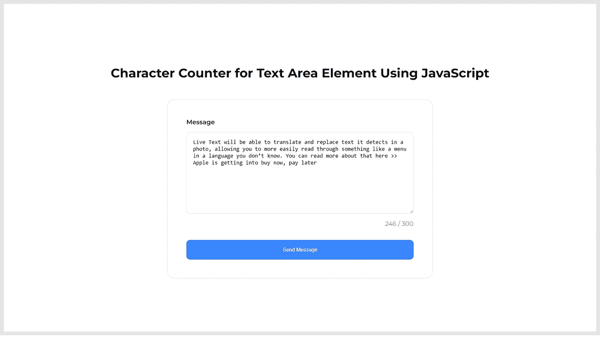

# 使用 JavaScript 的文本区域元素的字符计数器

> 原文：<https://levelup.gitconnected.com/character-counter-for-text-area-element-using-javascript-72d9a7ff5f77>

## 学习使用 JavaScript 实现计算文本区域元素中可用字符数的特性。

字符计数器是一个方便的 UI 特性，它显示用户可以在文本字段中输入的字符数。例如，如果文本字段被限制为较小的输入大小(300 个字符)，用户最多只能输入 300 个字符。该特性通常与文本区域或输入字段元素一起使用，以通知已使用和剩余的字符数。

在本文中，我将一步一步地介绍如何使用 JavaScript 从头开始实现文本区域的字符计数器。

# 用 3 个简单的步骤实现一个字符计数器

1.  创建一个包含文本区域和字符计数器元素的表单。
2.  使用 JavaScript 计算字符数并显示结果。
3.  设计表单元素和字符计数器。

# 步骤 1:创建一个包含文本区域和字符计数器元素的表单

在实现字符计数器之前，让我们设置一个基本的 HTML 表单。它将包括一个文本区域元素和一个显示字符计数器的 DIV 元素。这个 DIV 元素将显示允许的最大字符数和输入的字符数。当计数接近某个极限时，计数器文本的颜色会改变。

将下面的代码片段添加到要实现计数器功能的部分。

# 步骤 2:使用 JavaScript 计算字符数并显示结果

现在，我们需要实现计算用户在文本区域字段中输入的字符数的逻辑。向字段添加一个`keydown`事件监听器，当您开始输入时，它将触发匿名箭头功能。该函数将计算字符数，并检查字符数是否在 200 到 250 之间。如果是，那么它会将计数器文本的颜色改为橙色。如果计数超过 250，计数器文本的颜色将变为红色。您可以根据需要随时更改该范围。

在页面的`script`元素中添加以下代码片段。

# 步骤 3:设计表单元素和字符计数器

既然我们已经实现了计算字符数的特性，我们需要添加一些 CSS 片段来设计 HTML 内容的布局。

将以下代码片段添加到`style`元素或外部 CSS 文件中，并在页面上使用。

# 结果

太棒了。您已经完成了如何使用 JavaScript 实现字符计数器的学习。

> 如果你喜欢阅读这篇文章，并发现它对你有用，那么请鼓掌，与你的朋友分享，并关注我以获得我即将发布的文章的更新。你可以在 [LinkedIn](https://www.linkedin.com/in/tararoutray/) 上联系我。