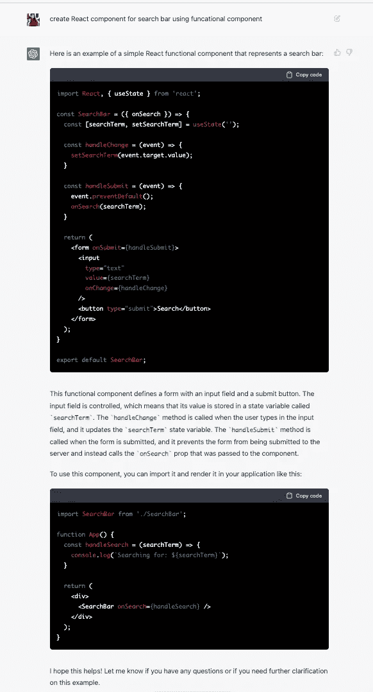
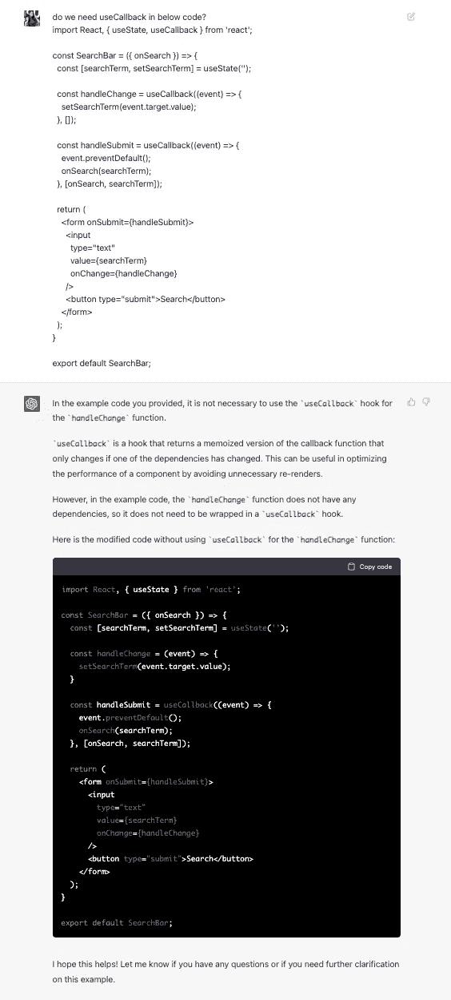

# 一个新的聊天机器人是谷歌搜索业务的“红色代码”

> 原文：<https://levelup.gitconnected.com/chatgpt-a-new-chat-bot-is-a-code-red-for-google-s-search-business-a05ef5c156c>

> 为什么我们都对 ChatGPT 着迷
> 
> 令人兴奋的人工智能聊天机器人

# 什么是 chatGPT？

*   ChatGPT 是一个人工智能聊天机器人系统， [OpenAI 于 2022 年 11 月](https://openai.com/blog/chatgpt/)发布，以展示和测试一个非常庞大、强大的人工智能系统可以完成什么。
*   ChatGPT 使用户能够提问或讲述一个故事，机器人会用相关的、听起来自然的答案和主题来回应。
*   ChatGPT 的测试版已经吸引了 100 多万用户。

## ChatGPT 是谁发明的？

*   **OpenAI 是一家总部位于旧金山的人工智能和研究公司**，于 2022 年 11 月 30 日推出 ChatGPT。

## 什么是 GPT？

*   GPT-3 是**一个语言预测模型**。
*   GPT，或生成性预训练转换器，是由 OpenAI 开发的一种人工智能模型。
*   GPT 模型经过大量数据的训练，能够生成类似人类书写的自然语言文本。

## ChatGPT 的一些用例包括:

●在聊天机器人或虚拟助手中生成响应，提供更自然、更吸引人的用户互动

●对关键词或主题的内容想法进行头脑风暴

●创建个性化沟通，如电子邮件回复或产品推荐

●创建营销内容，如博客帖子或社交媒体更新

●将文本从一种语言翻译成另一种语言

●通过提供全文并要求 ChatGPT 生成较短的摘要来概括较长的文档

●使用聊天机器人生成的答案创建自动化客户服务工具

# 如何开始使用 ChatGPT

*   通过前往[chat.openai.com](http://chat.openai.com/)。单击“注册”设置您的帐户。
*   现在，ChatGPT 是免费使用的——但该公司承认，他们可能需要在未来货币化，以处理[“令人垂涎的”计算成本](https://twitter.com/sama/status/1599669571795185665?s=46&t=UyznJxl__5HrT7tHCe1Yrg)。

# ChatGPT 的局限性

*   ChatGPT 是一个强大的基于人工智能的聊天机器人系统，它确实有一些局限性。它只能根据接受过训练的数据提供答案。
*   ChatGPT 不是搜索引擎，因此它不具备在互联网上搜索信息的能力。相反，它使用从训练数据中学到的信息来生成响应。

# 这是我想问的关于 React 功能组件的问题

**问题**:使用功能组件为搜索栏创建 React 组件？
**答案:**

下一个问题答案让我吃惊，

**问题**——在下面的代码中我们需要**使用回调**吗？
**回答**——对于`handleChange`功能，不需要使用`useCallback`挂钩。`handleChange`函数没有任何依赖关系，所以它不需要被包装在`useCallback`钩子中。

## 参考

*   [https://openai.com/blog/chatgpt/](https://openai.com/blog/chatgpt/)