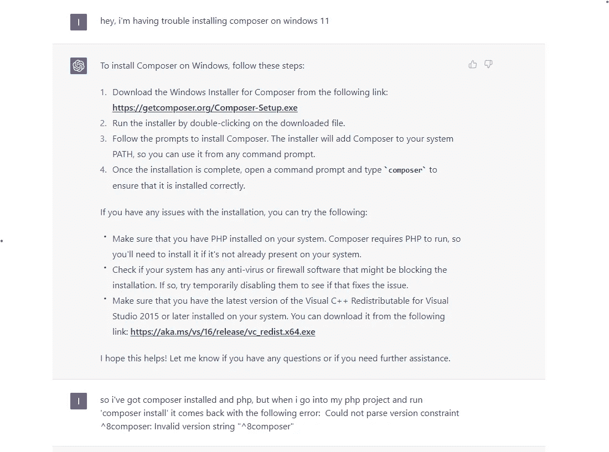
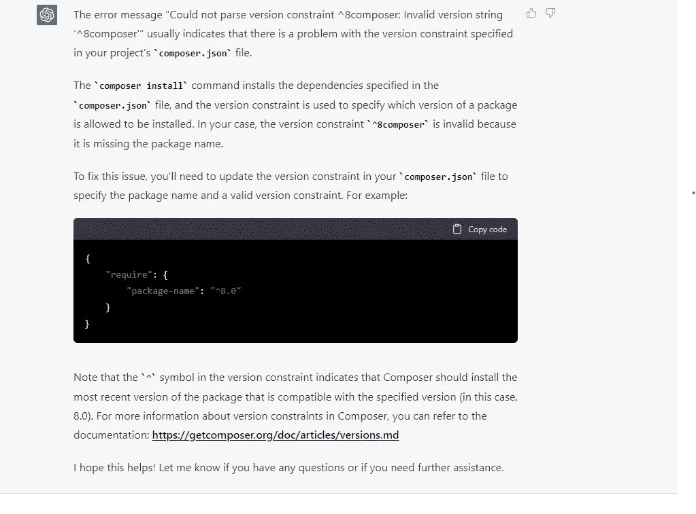
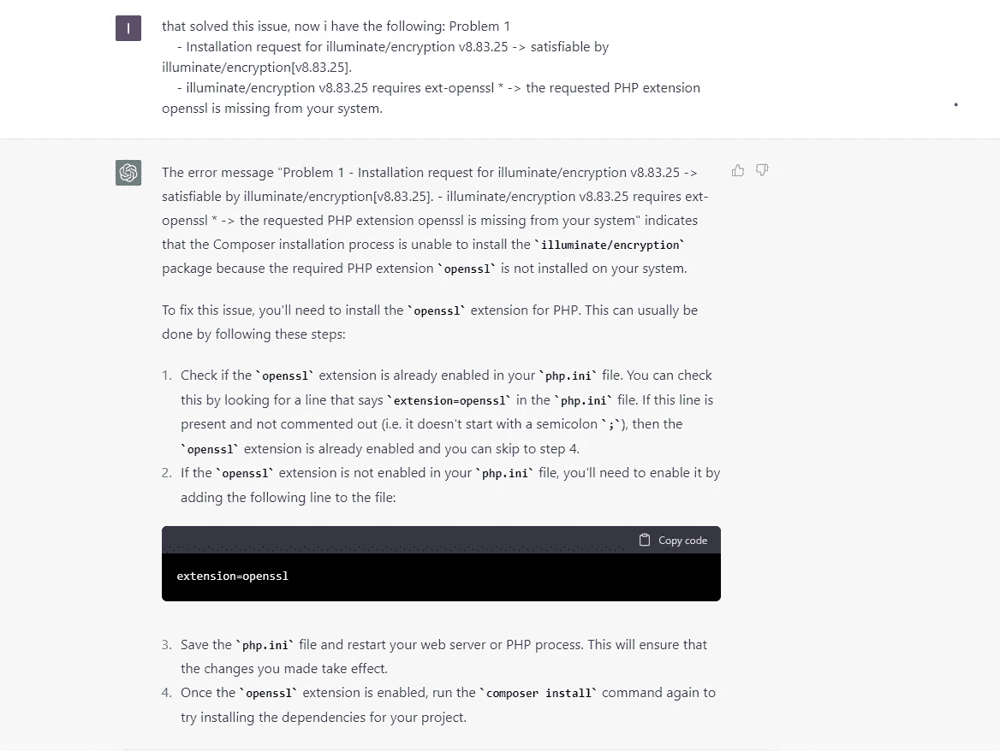
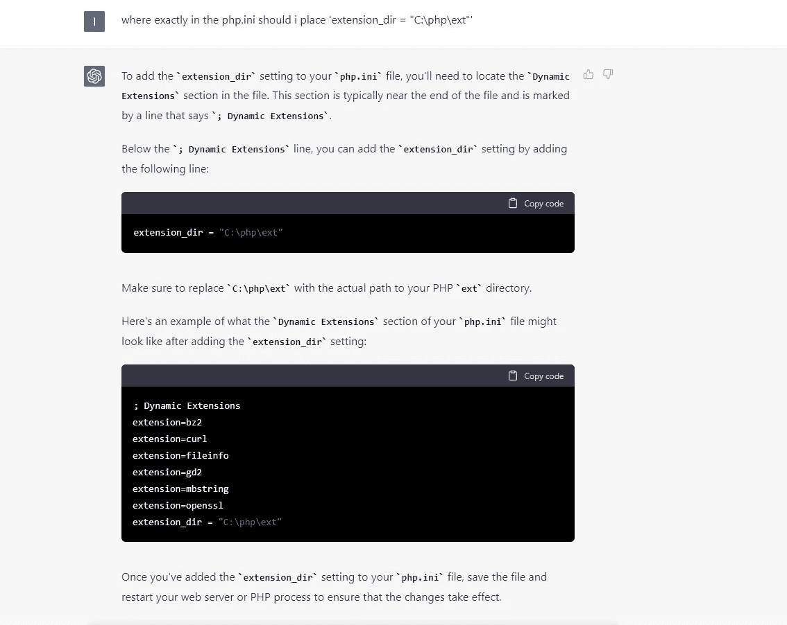
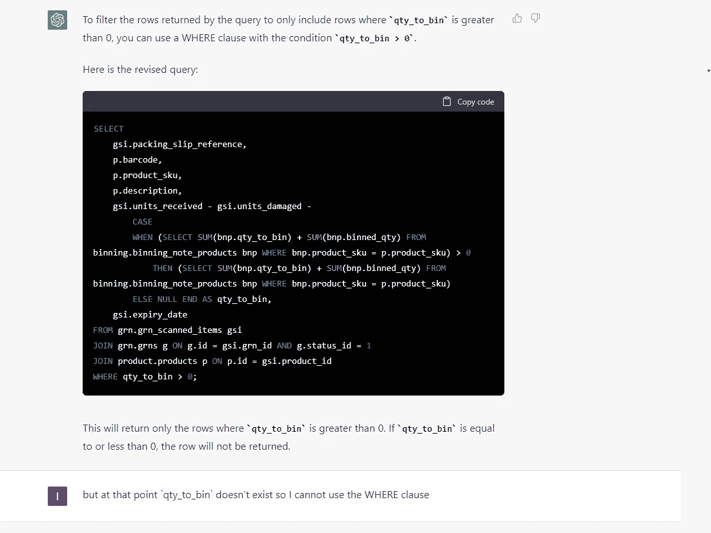
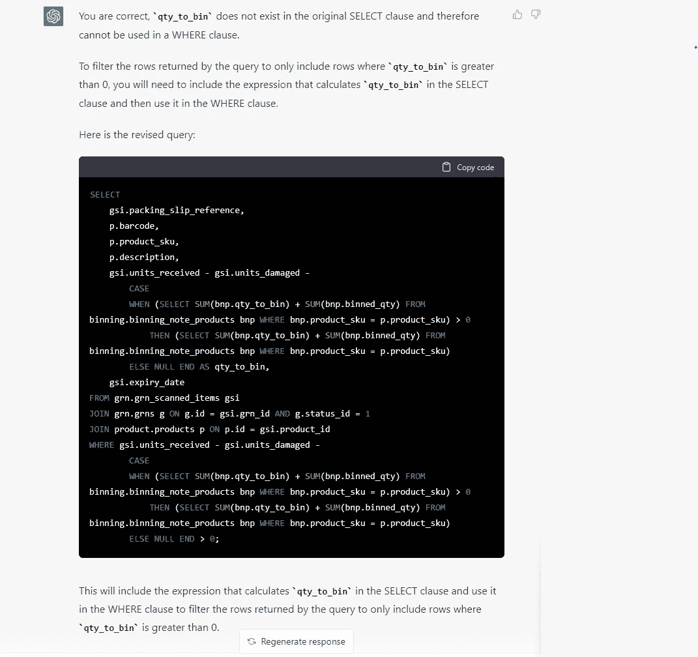

# ChatGPT 可以让你成为 10 倍的开发者

> 原文：<https://levelup.gitconnected.com/chatgpt-can-turn-you-into-a-10x-developer-710d81e3e2a6>

## 如何利用这种现象，提高自己的技能

在 [Unsplash](https://unsplash.com/photos/t1PaIbMTJIM) 上由 [Hitesh Choudhary](https://unsplash.com/@hiteshchoudhary) 拍摄的照片

ChatGPT 一定是有史以来最伟大的发明之一，因为如果你给它机会，它会让你大吃一惊。正如你可能从社交媒体上的许多例子中看到的那样，它可以在几乎任何领域改变游戏规则，使人类变得更有效率。因此，在这篇文章中，我不会去探究它可能犯的愚蠢错误(是的，它可能犯)。我更愿意把重点放在如果使用正确，你可以从聊天中得到的令人兴奋的东西，以及它如何帮助你提高技能，成为一名更好的开发人员。虽然我的例子很大程度上是与编码相关的，但我确信无论你从事什么职业，这个软件都能帮助你提高。

## 帮我写作曲

举个小例子，我给自己买了一台新电脑，想安装 PHP 和 Composer 来帮助一个朋友完成一个项目。问题是我从未真正在 Windows 上使用过 PHP，我在尝试运行“composer instal”来启动和运行我的供应商文件夹时遇到了一些问题。

这是开始，平心而论，我的问题真的很模糊，但它确实给了我从头开始的步骤。然而，我安装了 PHP 和 Composer，所以我继续。

我给出的错误当时真的很烦人(看起来是这样)，因为我的版本看起来很好，但它确实表明它可能是我的“composer.json”中的版本，并且它确实修复了一半的问题。

在那一点上，当我尝试运行“composer install”时返回的错误将完美地指导我，我并不真的需要 ChatGPT，但我决定继续使用它，以便我可以看到结果，因为为什么不呢，嗯？

好的，它告诉我必须从 php.ini 文件中启用 openssl，并给出了正确的步骤。

最后，我只是问 extension_dir 的确切位置(我有一张图片丢失了，它给了我另一个关于路径的错误)，显然用正确的路径替换“C:\php\ext”解决了这个问题。

尽管在最初的问题之后，它让我走上了一条正确的道路，在这条道路上，错误是有意义的，但它很有远见地看到它如何遵循整个过程，给出步骤并解释为什么必须做某些事情。太神奇了！

## 写一些 SQL

在这个例子中，我不得不重构一个视图，并决定给 ChatGPT 一个机会来解决这个问题。需要做的只是添加一个 WHERE 子句，并检查值是否大于 0。

很容易做到，第一个解决方案是直接放入 WHERE 子句。不幸的是，我不得不指出他的错误。

如果你有过不承认错误的同事，你会喜欢 ChatGPT，因为他和那个同事完全不同！

不幸的是，我不得不再次指出一个错误，因为如果你想将值与 0 进行比较的话,“ELSE NULL”并不能真正解决问题。

这就是你要的——快速简单的解释。

## 陷阱时间到了

虽然 ChatGPT 可以帮你很多，但重要的是要记住，它没有上下文，不能解决复杂的业务逻辑，所以它不会为你做这项工作。

比如我给它一个大函数，用 C#做了一些 foreach 循环和 asnyc 调用，问它方法能不能快一点。尽管有一些好的建议，它建议使用并行。ForEach 方法，这在理论上要快得多，但由于使用 Parallel.ForEach 进行随机处理，它无法满足业务逻辑。

所以，你知道，不要试图避免工作和依赖聊天，但我鼓励你使用它，这样你可以提高你的效率，你执行一些重复的基本任务的速度，只是为了阅读解释和理解事情实际上是如何工作的。

如果你开始一个新的项目，它可以产生很好的样板代码，你可以工作了，所以它能够节省你很多时间。

如果你喜欢这篇文章，并且想加入 Medium，请随意使用我下面的推荐链接。

 [## 通过我的推荐链接加入 Medium-Ivan Stoev

### 你好，如果你对软件开发有热情，那你来对地方了！您的会员资格将直接…

medium.com](https://medium.com/@ivan.zstoev/membership)