# 小气鬼用 Locust 实现按需负载测试之旅

> 原文：<https://levelup.gitconnected.com/cheapskates-journey-to-on-demand-load-tests-with-locust-ffe730426ad8>


我想充分利用我花在云上的每一分钱。我在 Heroku 上运行了一些 web 应用程序，并且像其他人一样，在非生产环境中对每个版本增量运行了一套冒烟测试和负载测试。负载测试很重要:它们不仅帮助我们理解我们系统的局限性，而且还提出了由于并发性而产生的问题，这些问题通常会避开单元测试和集成测试的领域。但是因为我们经常运行测试，所以我们不想每次运行测试都要花很多钱。

在本文中，我将向您展示如何建立经济高效的负载测试。我们将使用 Locust 来增强测试的健壮性，并使用 Heroku 来简化测试的运行，并降低成本。我还将展示如何使用 VS 代码和 Docker 进行开发，而无需在系统上安装 dev 依赖项。

# 蝗虫是什么？

[Locust](https://locust.io/) 是用 Python 编写的开源负载测试工具。蝗虫测试可以分布在多台机器上，同时模拟数百万用户，帮助确定您的站点或系统可以处理多少用户。

创建 Locust 是为了解决其他两个领先解决方案存在的问题— [JMeter](https://jmeter.apache.org/) 和 [Tsung](http://tsung.erlang-projects.org/) 。具体来说，它旨在解决以下限制:

*   并发性:JMeter 是线程绑定的，为每个用户创建一个新线程。这严重限制了每台机器可以模拟的用户数量。另一方面，Locust 是基于事件的，可以在一个进程上模拟成千上万的用户。
*   易于编码:JMeter 需要复杂的回调。Tsung 使用基于 XML 的 DSL 来定义用户行为。两者都很难编码。另一方面，蝗虫场景是用普通 Python 编写的，很容易编码。

# 术语

首先，一点术语。使用 Locust，您可以在一组 Locust file 中编写用户行为测试，然后在目标应用程序上并发执行 Locust file。就蝗虫而言，一群蝗虫用户(统称为虫群，单独称为蝗虫)将攻击目标应用程序并记录结果。每个蝗虫在它的沙盒进程中执行，这个沙盒进程叫做 Greenlet。

# 考虑

在继续之前，我建议您阅读 Heroku 关于负载测试的[指南，其中列出了适用的限制和后果。本文中的指导仅限于执行低级到中级测试(每秒少于 10，000 个请求)。对于执行大规模测试，您应该首先联系 Heroku 支持人员，以确保您的系统已经预热并且可以适当扩展，或者使用私有空间来托管您的测试平台(测试中的应用程序和测试平台)。对于高容量负载测试，我建议在](https://devcenter.heroku.com/articles/load-testing-guidelines)[这个样例应用程序存储库](https://github.com/sho7650/heroku-locust)上建模您的测试设置。要了解最新的定价细节和估算在 Heroku 上运行您的应用程序的成本，请访问 [Heroku 网站](https://www.heroku.com/pricing)。

# 先决条件

下面是我用来构建示例应用程序的工具和云服务列表。我的开发机器运行的是 Windows 10 Professional，不过，以下工具也可以在 Mac 上使用。

*   带有[远程开发](https://marketplace.visualstudio.com/items?itemName=ms-vscode-remote.vscode-remote-extensionpack)扩展的 VS 代码
*   [Heroku 帐户](https://www.heroku.com/)，您可以在其中创建标准层的应用
*   免费的微软 Azure 订阅服务
*   [适用于 Windows(或 Mac)的 Docker 桌面](https://www.docker.com/products/docker-desktop)
*   Heroku CLI
*   [Azcopy](https://docs.microsoft.com/en-us/azure/storage/common/storage-use-azcopy-v10)

# 应用程序

我为这个演示准备的示例应用程序，我们称之为*目标 API 应用程序*，是一个用 Go 编写的 REST API。我们还有第二个应用程序，我们称之为*负载测试应用程序*，它包含使用 [Locust](https://locust.io/) 用 Python 编写的负载测试。

*   目标 API 应用程序是我们打算测试的 REST API。因为需要 API 来处理 HTTP 请求，所以我们将它托管在 web dynos 上。
*   *负载测试应用程序*包含我们的*蝗虫测试*。根据*目标 API 应用*支持的用户类型，这些被分为两类。您可以并行或顺序执行这两个测试套件，从而改变您在*目标 API 应用程序*上应用的负载的数量和性质。因为执行测试的 dyno 只在测试执行期间需要，所以我们在 Heroku 的[一次性 dyno](https://devcenter.heroku.com/articles/one-off-dynos)中托管它们。一次性 dynos 只对它们消耗的时间和资源计费，管理员可以使用 [Heroku CLI](https://devcenter.heroku.com/articles/heroku-cli) 工具生成它们。

下面是应用程序及其组件的高级设计图。

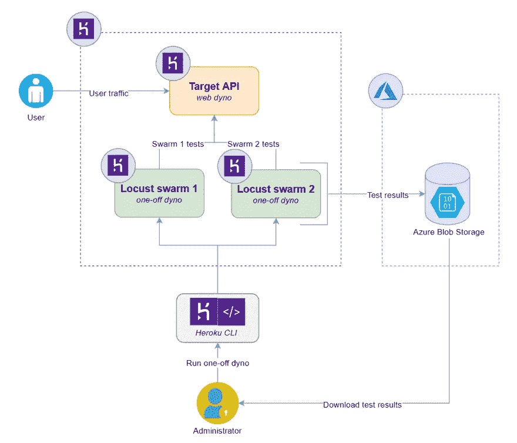

**高层设计图**

Heroku 为在 dyno 上执行的应用程序进程提供临时存储，它可能存在，也可能不存在。此外，由于存储是进程的本地存储，我们无法访问 Heroku CLI 生成的任何文件，因为它在 dyno 上创建了另一个具有自己存储的沙盒进程。由于访问限制，生成文件的过程会将它们导出到持久的云存储服务，或者在 web dynos 的情况下，通过 HTTP 端点使它们可用。通过使用标志(–csv)执行 locust，您可以指示 Locust 将测试结果保存在本地的 CSV 文件中。我们使用 [Azcopy](https://docs.microsoft.com/en-us/azure/storage/common/storage-use-azcopy-v10) ，这是一个 CLI 工具，用于将二进制数据复制到 Azure 存储中或从 Azure 存储中复制出来，以将蝗虫测试生成的结果导出到 Azure blob 存储中。

# 设置应用程序

应用程序的源代码可以在我的 [GitHub 库](https://github.com/rahulrai-in/locust-load-test-heroku)中找到。

# 目标 API 应用程序

让我们首先剖析目标 API 应用程序，我们希望用我们的负载测试套件来测试它。在 VS 代码中打开名为 *api* 的文件夹。在文件 *main.go* 中，我定义了三个 API 端点:

```
http.HandleFunc("/", func(w http.ResponseWriter, r *http.Request) {
     fmt.Println("Served home request")
     fmt.Fprintf(w, "Server OK")
})http.HandleFunc("/volatile", func(w http.ResponseWriter, r *http.Request) {
     // For every 10 requests, delay the response by 1 second, up to 5 seconds.
     currentCount := atomic.LoadInt32(&requestCount)
     atomic.AddInt32(&requestCount, 1)
     delay := currentCount / 10
     if delay > 5 {
         atomic.StoreInt32(&requestCount, 0)
         delay = 5
     } time.Sleep(time.Duration(delay) * time.Second)
     fmt.Fprintf(w, "Produced response after %d second/s", delay)
     fmt.Printf("Produced response after %d second/s \n", delay)
})http.HandleFunc("/buggy", func(w http.ResponseWriter, r *http.Request) {
     // After every 5 requests, throw error
     currentCount := atomic.LoadInt32(&requestCount)
     atomic.AddInt32(&requestCount, 1)
     if currentCount%5 == 0 {
         fmt.Printf("Returning error at %d request \n", currentCount)
         http.Error(w, http.StatusText(500), 500)
         return
     } fmt.Fprintf(w, "Ok for request %d", currentCount)
})
```

三个端点的行为如下:

*   "/":返回带有文本 OK 的 HTTP 200 响应。
*   "/ *volatile* ":返回 HTTP 200 响应，但每 10 个请求就会延迟一秒钟。
*   "/ *buggy* ":每五个请求返回一个 HTTP 500 错误消息。

# 用于调试的远程开发扩展

您可能已经注意到，我没有提到安装 Golang 或 Python 是这个应用程序的先决条件。我们将使用您安装到 VS 代码中的*远程开发*扩展来调试目标 API 应用程序。你可以在这里阅读[的细节。然而，简而言之，这个扩展允许您使用容器作为开发环境。该扩展搜索名为*的文件夹。并使用 *Dockerfile* (容器定义)和 *devcontainer.json* (用于容器设置)文件来创建一个新的容器，并将包含您的代码的文件夹作为一个卷挂载到容器中。对于调试，扩展将 VS 代码调试器附加到容器中运行的进程。我已经为你配置好了容器资源，你只需要按 F1 键调出命令窗口，选择命令: *Remote-Containers:打开容器中的文件夹*。*](https://code.visualstudio.com/docs/remote/remote-overview)

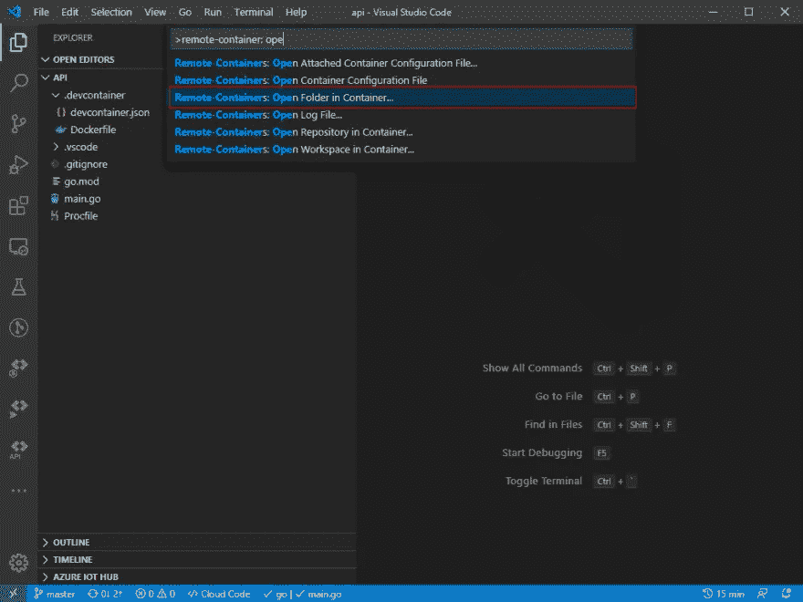

**打开容器中的文件夹**

当询问打开哪个文件夹时，选择“api”文件夹并继续。

或者，您可以通过单击 VS 代码窗口左下角的绿色图标来生成命令对话框。

容器准备就绪后，按 F5 开始调试应用程序。您会注意到 VS 代码窗口左下角的文本变成了 *Dev Container* : Go 表示应用程序当前正在远程容器中执行。现在，您可以通过导航到 [http://localhost:9000](http://localhost:9000/) 从浏览器访问应用程序端点。

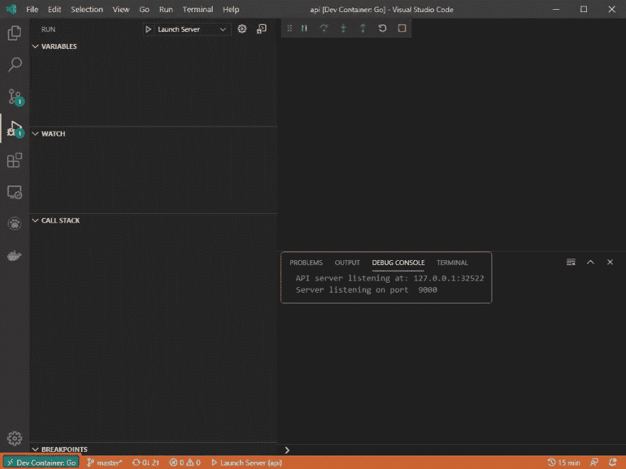

**在远程容器中执行应用**

# 负载测试应用程序

现在，我们将使用 VS 代码在一个容器中构建测试套件，并创建一个 shell 脚本来自动化测试基础设施的设置和拆除过程。您可以使用这个脚本来自动启动和关闭测试网格，并将其添加到您的 CI\CD 管道中。

## 1.启动负载测试应用程序开发容器

在另一个 VS 代码实例中，打开文件夹 loadtest 并在 dev 容器中启动它。在这个应用程序中，您会注意到我创建了两组测试来模拟目标 API 应用程序的两种用户类型的行为。

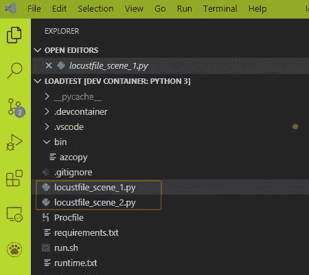

**测试用 locust files**

*   类型为 *ApiUser* 的用户行为记录在 locustfile_scene_1.py 中，根据测试，ApiUser 类型的用户在两次调用之间等待五到九秒后访问目标 API 应用程序的默认和易变端点。
*   类型为 *AdminUser* 的用户行为记录在 locustfile_scene_2.py 中。这类用户在两次调用之间等待 5 到 15 秒后访问目标 API 应用程序的默认端点和错误端点。

## 2.验证测试

为了验证测试脚本，在集成终端中执行以下命令( *Ctrl + ~* )。

`$ locust -f locustfile_scene_1.py`

导航到 [http://localhost:8089](http://localhost:8089/) 调出 locust UI。在表单中，输入目标 API 应用程序的主机名和端口以及所需的蝗虫群配置，然后单击按钮*开始群集*以启动测试。

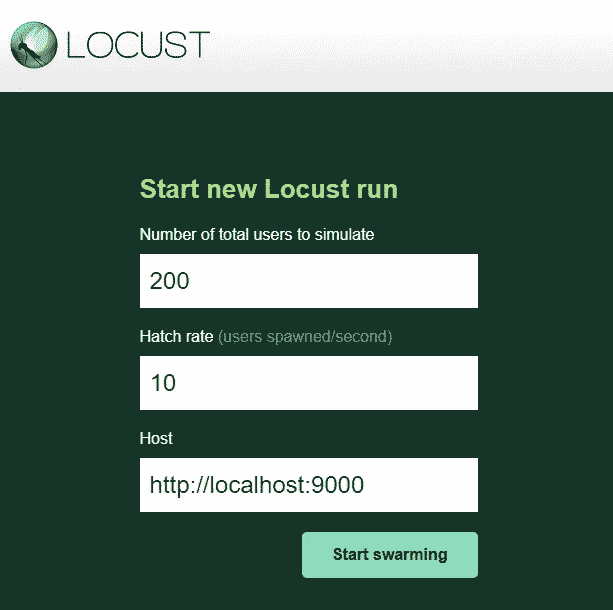

**蝗虫 UI**

## 3.运行 Shell 脚本

为了执行蝗虫测试，我们需要为每组测试定义一个小的工作流，如下所示。

*   在没有 web UI 的情况下，在单个 worker 节点上执行测试一段固定的时间，并生成测试结果的 CSV 报告。
*   使用 Azcopy 将测试结果文件复制到 Azure 存储。(当然，您可以将这部分替换为您可能使用的任何云存储提供商。您只需要修改下面的脚本来使用不同的实用程序而不是 azcopy，并且您将复制到不同的存储位置。)

负载测试项目中的 *run.sh* 脚本实现了如下工作流:

```
#!/bin/bashlocust -f $1 --headless -u 200 -r 10 --host=$TARGET_HOST --csv="$2_$(date +%F_%T)" --run-time 1h -t 2s --stop-timeout 60for filename in *.csv; do
    [ -e "$filename" ] || continue
    azcopy copy "$filename" "https://locustloadtest.blob.core.windows.net/testresult/$filename\$SAS_TOKEN"
doneexit 0
```

在前面的代码清单中，在执行产生 CSV 结果的 *locust* 命令后，我们遍历 CSV 文件并使用 Azcopy 实用程序将每个文件上传到 Azure 存储位置——在*locustloadtest.blob.core.windows.net*帐户中名为 *testresult* 的容器。您必须使用您在 Azure 订阅中创建的存储帐户来更改这些值。您可以看到，这个命令依赖于一个共享访问秘密(SAS)令牌进行身份验证，我们通过一个名为 SAS_TOKEN 的环境变量应用了这个令牌。稍后我们将把这个环境变量添加到应用程序中。如果您不熟悉 Azcopy 实用程序，请在这里阅读更多关于使用带有 SAS 令牌的 [Azcopy 的信息。](https://docs.microsoft.com/en-us/azure/storage/common/storage-use-azcopy-blobs)

# 启动目标 API 应用程序并创建 Web Dyno

在每个项目、API 和 Loadtest 的根目录中，您会发现一个名为 *Procfile* 的文件。

在 API Procfile 中，以下命令将指示 Heroku 创建一个 web dyno，并调用命令 *locust-loadtest* 来启动应用程序。

`web: locust-loadtest`

在 Loadtest 项目中，Locust 测试的 Procfile 指示 Heroku 创建两个 worker dynos，并使用适当的参数调用 Run.sh 脚本，如下所示:

`worker_scene_1: bash ./run.sh locustfile_scene_1.py scene_1`


# 在 Heroku 中创建应用程序

我们现在将在 Heroku 中创建两个必需的应用程序。

您可以通过两种方式与 Heroku 交互:用户界面和 Heroku CLI。我将指导您混合使用这两种方法，以便您对这两种方法都有一些经验。

为了创建应用程序，我们将使用 Heroku 用户界面。我们将首先创建目标 API 应用程序。

## 创建目标 API 应用程序

在浏览器中，导航至[https://dashboard.heroku.com/](https://dashboard.heroku.com/)，点击*新建/创建新应用*按钮。

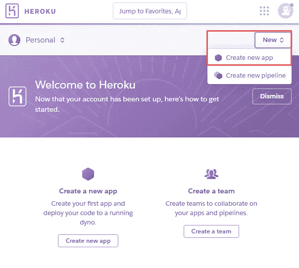

**创建新的 Heroku App**

在创建应用程序页面上，输入应用程序的名称(locust-heroku-target)，选择*公共运行时*选项，以及所需的区域。请注意，应用程序名称在所有 Heroku 应用程序中必须是唯一的，因此此名称*可能不可用。您可以为这个应用程序(以及下面的测试引擎应用程序)选择自己唯一的名称，确保在所有后续代码和命令中引用这些新名称。如果您的客户分布在多个地区，您可以在不同的位置创建一个额外的测试平台，并从该位置测试您的应用程序的性能。点击*创建应用*按钮创建应用。*

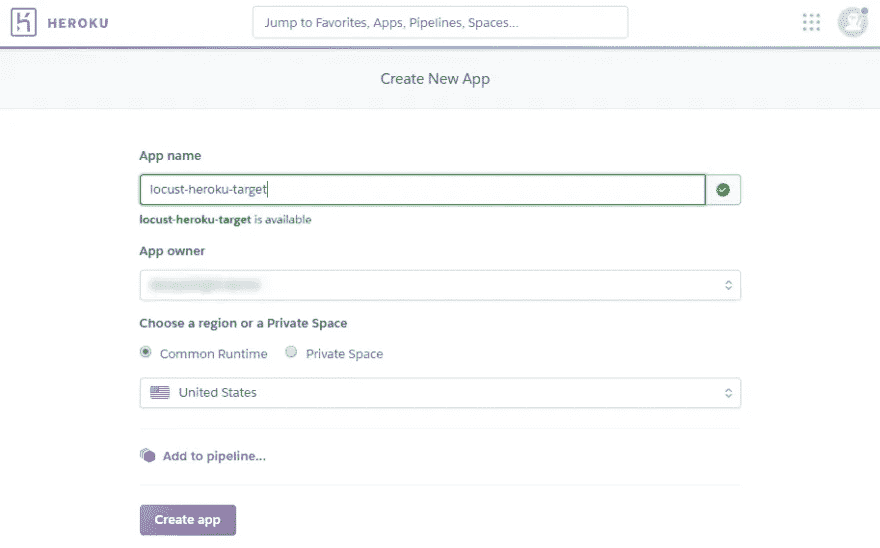

**创建蝗虫-英雄-目标**

下一个屏幕要求您指定部署方法。因为我已经在使用 GitHub 进行源代码控制，所以我可以指示 Heroku 在我对*主*分支进行更改时自动部署。我建议您不要在实际应用中遵循相同的方案。您应该从*主*分支部署到生产，并使用另一个分支，例如发布分支，来部署到测试环境(Git 流)，或者在批准后从主分支部署(GitHub 流)。


**将应用程序链接到 GitHub-locust-heroku-target**

# 创建负载测试应用程序

现在让我们为我们的蝗虫测试设置 Loadtest 应用程序。您可以为测试创建另一个应用程序(rocast-heroku-test engine ),如下所示:

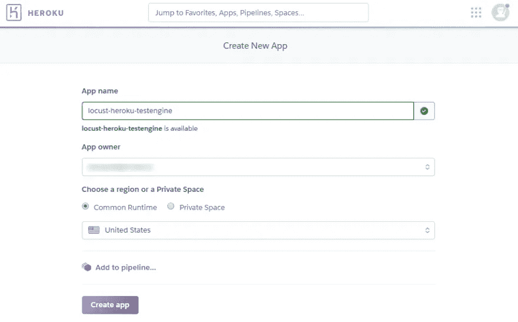

**创造蝗虫-heroku-testengine**

您可能已经注意到，我使用了 [monorepo](https://en.wikipedia.org/wiki/Monorepo) 模型将目标 API 应用程序和测试放在同一个项目中。

在下一个屏幕上，将您刚刚创建的应用程序的部署连接到同一个存储库。通过这种设置，每当您对 Loadtest 或目标 API 应用程序进行更改时，两者都将被部署到 Heroku，这有助于避免 Loadtest 和目标 API 应用程序版本之间的任何冲突。

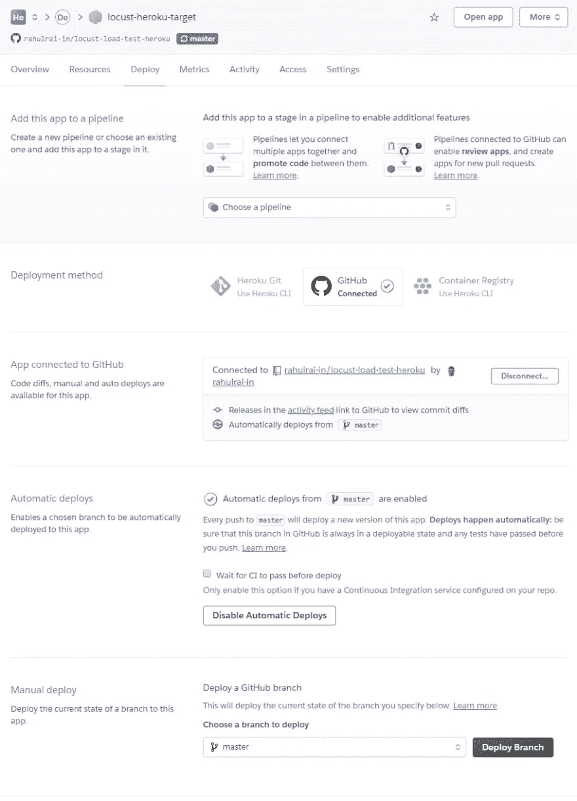

**将 App 链接到 GitHub—locust-heroku-test engine**

默认情况下，这个应用程序的 worker dynos 将使用标准的-1x dynos，对于我们的场景来说，这是成本和性能的一个很好的平衡。但是，您可以使用 Heroku CLI 或通过 UI 根据您的需求更改 dyno 类型。请参考 [Heroku 文档](https://devcenter.heroku.com/articles/dyno-types)了解 CLI 命令和您可以使用的 dynos 类型。

# 通过 Heroku CLI 添加构建包

现在让我们切换到终端，并使用 Heroku CLI 准备环境。我们将检查我们的服务需要的构建包，并一次添加一个。

## 构建包如何工作

heroku[build pack](https://devcenter.heroku.com/articles/buildpacks)负责将你的代码转换成“slug”用 Heroku 的话来说，slug 是应用程序的可部署副本。不是每个构建包都必须从您的应用程序代码生成二进制文件——构建包可以链接在一起，这样每个构建包都以某种方式转换应用程序代码，并将其提供给链中的下一个构建包。然而，在处理之后，dyno 管理器必须接收一个 slug 作为输出。

例如，由于我们的源代码被组织为由目标 API 应用程序和 Loadtest 应用程序组成的 monorepo，因此 buildpack 链中的第一个 buildpack，[heroku-build pack-monorepo](https://thecloudblog.net/post/cheapskates-journey-to-on-demand-load-tests-on-heroku-with-locust/)，从 mono repo 中提取应用程序。链中的第二个构建包构建适当的应用程序。

## 目标 API 构建包

让我们首先考虑目标 API 应用程序。使用[heroku-build pack-monorepo](https://github.com/lstoll/heroku-buildpack-monorepo)从 mono repo 中提取 locust-heroku-target 应用程序。下一个构建包， [heroku-buildpack-go](https://github.com/heroku/heroku-buildpack-go) ，构建目标 API 项目。

按照正确的顺序执行以下命令，以保持它们的执行顺序，并记住将命令中的应用程序名称更改为您之前在 Heroku 用户界面中指定的名称。

```
$ heroku buildpacks:add -a locust-heroku-target https://github.com/lstoll/heroku-buildpack-monorepo$ heroku buildpacks:add -a locust-heroku-target [https://github.com/heroku/heroku-buildpack-go](https://github.com/heroku/heroku-buildpack-go)
```

## 负载测试构建包

对于 locust-heroku-testengine 项目，我们需要两个构建包。第一个构建包是我们之前用过的，[heroku-build pack-monorepo](https://github.com/lstoll/heroku-buildpack-monorepo)。我们将修改参数，因此它将从 monorepo 中提取蝗虫测试项目( *locust-heroku-testengine* )。第二个 buildpack， [heroku-buildpack-python](https://github.com/heroku/heroku-buildpack-python) ，支持在 heroku 上执行 python 脚本。

```
$ heroku buildpacks:add -a locust-heroku-testengine https://github.com/lstoll/heroku-buildpack-monorepo$ heroku buildpacks:add -a locust-heroku-testengine [https://github.com/heroku/heroku-buildpack-python](https://github.com/heroku/heroku-buildpack-python)
```

# 配置环境变量

## Via Heroku CLI

我们的应用程序需要设置一些环境变量。

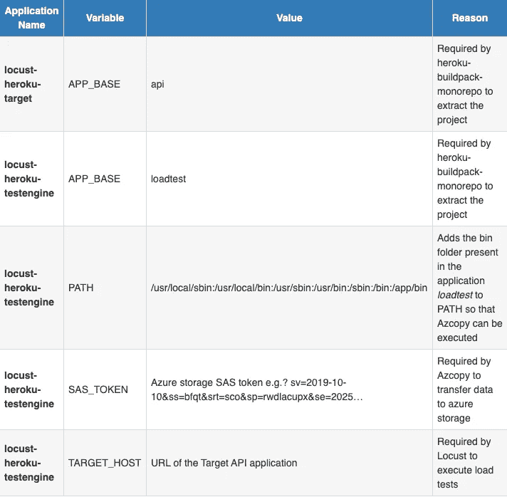

执行以下命令，将环境变量添加到应用程序中。

```
$ heroku config:set -a locust-heroku-target APP_BASE=api$ heroku config:set -a locust-heroku-target GOVERSION=go1.13$ heroku config:set -a locust-heroku-testengine APP_BASE=loadtest$ heroku config:set -a locust-heroku-testengine PATH=/usr/local/sbin:/usr/local/bin:/usr/sbin:/usr/bin:/sbin:/bin:/app/bin$ heroku config:set -a locust-heroku-testengine SAS_TOKEN="?sv=2019-10-10&ss=bfqt&srt=sco&sp=rwdlacupx&se=2025-05-16T11:41:28Z&st=2020-05-15T03:41:28Z&spr=https&sig=\<secret>"$ heroku config:set -a locust-heroku-testengine TARGET_HOST=https://locust-heroku-target.herokuapp.com/
```

## 通过 Heroku 用户界面

正如我在本文中提到的，您也可以通过用户界面配置应用程序。您可以在*设置*选项卡下找到我们应用的设置，如下面的 *locust-heroku-target* 应用程序部分的截图所示。

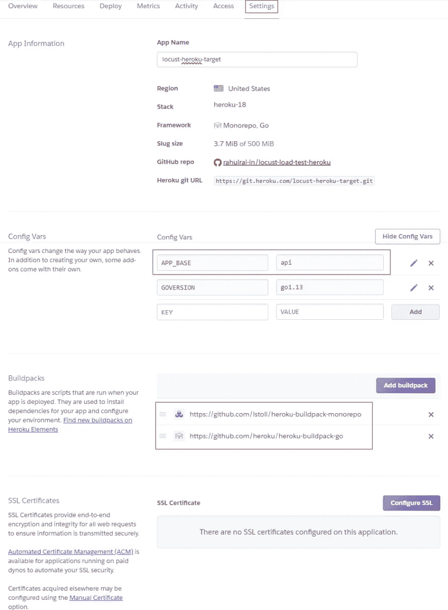

**设置—蝗虫-英雄-目标**

同样，下面的屏幕截图展示了我们应用于 locust-heroku-testengine 应用程序的设置。

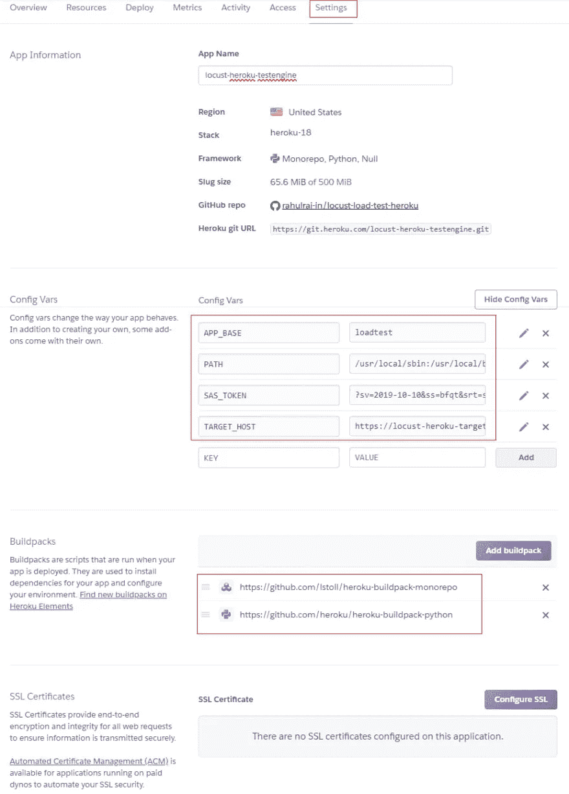

*设置— locust-heroku-testengine*

# 部署应用程序

由于现有的 GitHub 集成，Heroku 会在任何更改被推送到主分支时部署我们的应用程序。将您的应用程序或更改推送到 GitHub，并等待构建完成。您可以在应用程序的 *Activity* 选项卡下查看构建日志。

## 目标 API 应用程序

部署之后，您可以导航到 *Resources* 选项卡并查看托管应用程序的 dyno。您可以从这个 UI 向外扩展 dyno。点击*打开应用*按钮启动应用。

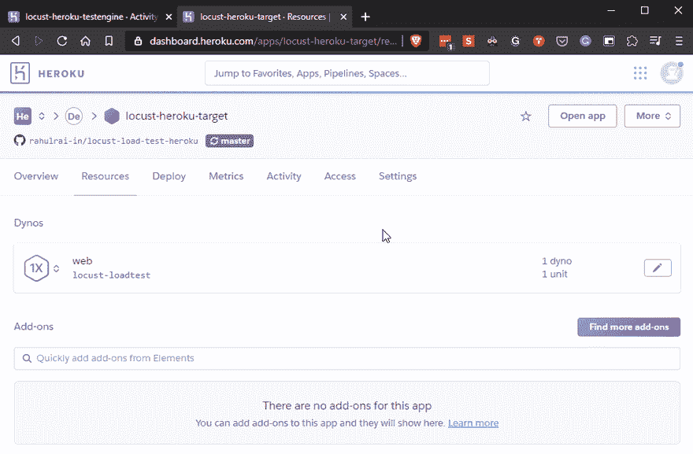

**打开 App——蝗虫英雄目标**

## 负载测试应用程序

如果你导航到 locust-heroku-testengine 应用程序，你会发现 heroku 通过读取 Loadtest 项目的 Procfile 中的指令创建了两个 worker dynos。

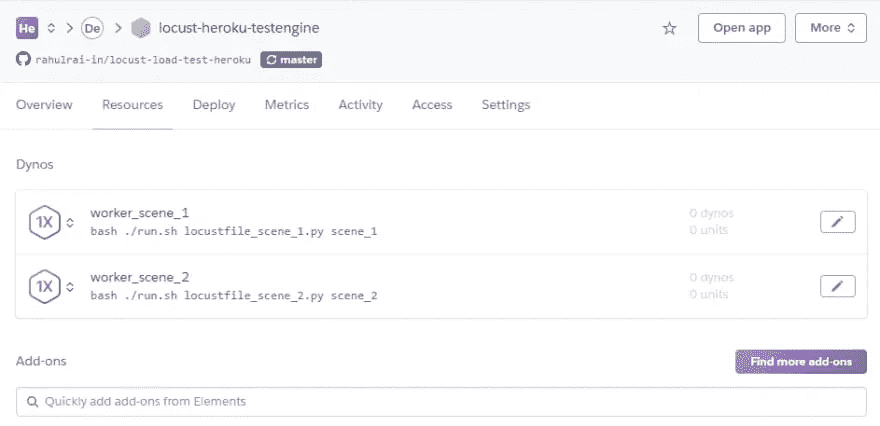

**蝗虫的工人 Dynos-heroku-test engine**

# 执行测试

为了执行托管在 dynos 中的测试，我们使用 Heroku CLI 和以下命令启动它们。这些函数启动一次性的 dynos，然后在它们完成执行后立即终止。

```
$ heroku run worker_scene_1 --app locust-heroku-testengine$ heroku run worker_scene_2 --app locust-heroku-testengine
```

执行后，Azcopy 实用程序将包含测试结果的 CSV 文件复制到 Azure 存储，您可以使用 [Azure Storage Explorer](https://azure.microsoft.com/en-us/features/storage-explorer/) 提取这些文件。下图说明了这一过程的实际操作。

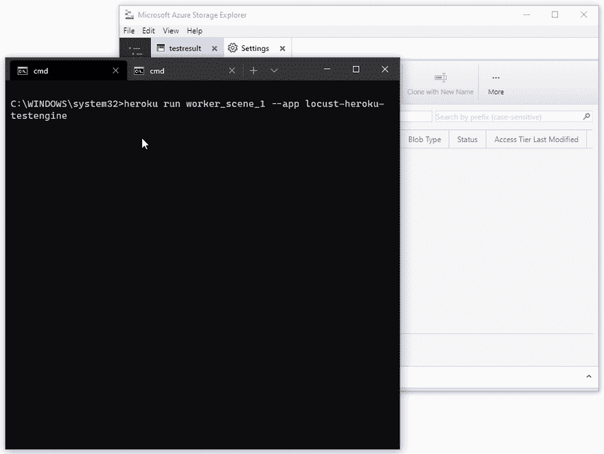

**执行负载测试**

您可以使用自定义可视化工具或在 Excel 中打开 CSV 文件来读取测试结果。下图显示了我从 worker_scene_2 dyno 的执行中收到的部分结果，该结果执行 locustfile_scene_2.py 文件中的测试。

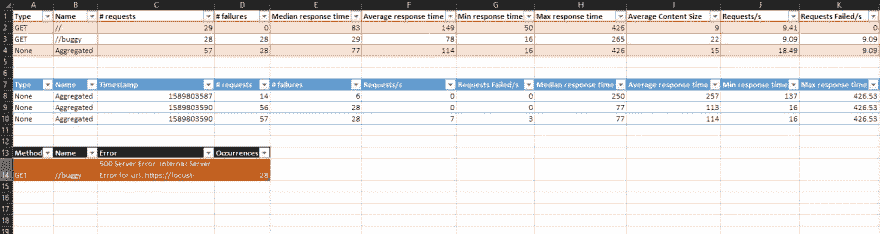

**负载测试结果**

# 结果呢

让我们分析结果，看看我们的应用程序运行得如何。每个测试运行都会生成三个文件:

1.  *失败. csv* 文件列出了遇到的失败总数。在场景 2 的结果中，我的运行从 *GET /buggy* 端点产生了 28 个错误，这是意料之中的，因为我们就是这样编程的。
2.  *stats.csv* 文件列出了测试向其发送请求的端点以及以毫秒为单位的响应时间。我对场景 2 的运行显示，swarm 分别向 *GET /* 和 *GET /buggy* 端点发送了 29 和 28 个请求。平均而言，蝗虫分别在 149 毫秒和 78 毫秒内收到来自两个端点的响应。平均响应时间的百分比分割是负载测试生成的最有价值的信息。从我的测试运行中，我可以看到我的 API 的 99%的用户将分别在 430 毫秒和 270 毫秒内收到来自 *GET /* 和 *GET /buggy* 端点的响应。
3.  第三个文件， *history.csv* ，类似于 *stats.csv* 文件，但是在测试运行的每 10 秒钟获得一个新行。通过检查该文件的结果，可以发现 API 响应时间是否降低了久而久之。

让我们看看执行这些测试需要多少成本。我在两台标准的 1X dynos 上进行测试，每月花费 25 美元。因此，如果我让测试连续执行一个月，成本是 50 美元。由于我的个人测试运行只持续了两分钟，Heroku 按秒计算处理时间的费用，我产生的费用非常少，甚至没有显示在我的仪表盘上。

这很好，但是让我们估算一下测试实际应用程序可能产生的费用。假设一个 API 平均需要大约 10 套测试，因此需要 10 个 dynos。如果这些测试每天晚上运行，并且每次运行持续五分钟，则每个 dyno 将保持活动一个 dyno x 300 秒 x 30 天= 9，000 秒；因此，每个 dyno 每月将花费 0.086 美元。整整一个月运行 10 个负载测试 dynos(一次性 dynos)的总成本大约是 0.87 美元。

# 结论

现在，您可以使用 Locust 在 Heroku 上执行负载测试了。您将能够测试每个部署的稳定性和性能。因为一次性 dynos 只对它们消耗的时间和资源收费，所以你将从你花费的每一分钱中获得最大价值。

*经* [*鲁莱*](https://thecloudblog.net/) 许可发表