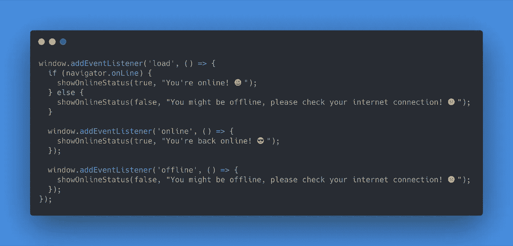
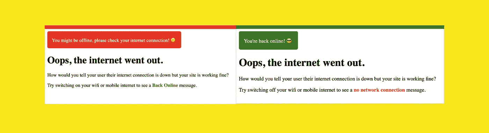

# 使用 JavaScript 检查用户的网络连接

> 原文：<https://levelup.gitconnected.com/check-a-users-network-connectivity-using-javascript-fbca496576d4>

建立一个伟大的网站，却让一个用户因为网络连接而无法浏览，这是你能做的最大的噩梦之一。用户通常没有意识到，虽然你的网站运行良好，但他们的网络连接有问题。

如果用户在浏览您的网站时与互联网断开连接，JavaScript 提供了一种简单的通信方式。

这涉及到 JavaScript `navigator` API 和`window`对象上的 *eventListener* ，这将帮助我们跟踪用户的连接性。

onLine 属性返回一个布尔值，该值指定浏览器是处于联机模式还是脱机模式。

您可能希望向用户添加一个小的弹出消息，告诉他们断开连接，一旦他们重新联机，欢迎他们回到您的网站。

您应该将这些事件侦听器添加到加载事件侦听器中，以便在用户访问(加载)您的网站时初始化它们。

`showOnlineStatus` 功能可以帮助您向您的用户显示定制的消息。例如，类似这样的事情:

根据连接状态显示自定义消息

你可以在 [CodePen](https://codepen.io/varunjoshi995/pen/MWazKjB) 上找到上面例子的完整源代码。

然而，正如在 [MDN](https://developer.mozilla.org/en-US/docs/Web/API/NavigatorOnLine/onLine) 中所解释的，该属性可能不完全可信:

> 在 Chrome 和 Safari 中，如果浏览器无法连接到局域网(LAN)或路由器，则处于离线状态；所有其他条件返回`true`。因此，虽然您可以假设浏览器在返回一个`false`值时是离线的，但是您不能假设一个真值就一定意味着浏览器可以访问互联网。

这意味着`navigator.onLine`属性会导致误报。因此，我们可能需要寻找其他方法来确定。

其中一个方法是使用 [OfflineJS](https://github.hubspot.com/offline/docs/welcome/) ，一个很酷的库来通知你的用户他们失去了与你的网站的连接。它提供了漂亮的主题，几乎不需要配置。

如果不想使用 OfflineJS，最好的解决方法是调用服务器端 API。如果客户端/用户离线，API 调用将失败并返回错误响应。如果您使用的是 [Axios](https://github.com/axios/axios) ，那么`error.response`将会丢失，这可能意味着客户端/用户离线。

上面的例子加上`navigator.onLine`属性有助于避免误报，您可以确定用户是否连接到互联网或网络。

我希望这有所帮助！现在，您可以通知您的用户他们是否连接到互联网。这意味着用户访问你的网站时会有更好的体验！

编码快乐！😄