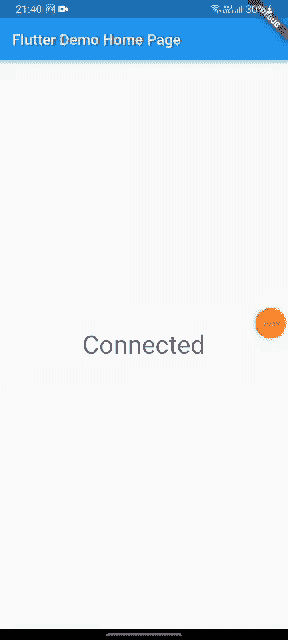

# 在抖动中检查互联网连接

> 原文：<https://levelup.gitconnected.com/check-internet-connection-in-flutter-610647fefd68>

在这里，我们将讨论如何使用 flutter 在移动应用程序中检查互联网连接。为此，我们将使用包[internet _ connection _ checker](https://pub.dev/packages/internet_connection_checker)。

这是我们最终的应用程序的工作原理:



互联网检查器抖动

在抖动中检查互联网连接

首先，在**publibsec . YAML .**中添加以下依赖项

```
internet_connection_checker: ^0.0.1+4
provider: ^6.0.3
```

**注意**:如果你的 Flutter SDK < 3，那么使用*internet _ connection _ checker*的较低版本，因为 pub get 会在代码 1 处退出，导致 Dart SDK 版本冲突。

```
internet_connection_checker: ^0.0.1+3
```

好吧，现在我们开始吃吧。

首先，我们将创建一个在没有互联网连接时呈现的小部件。我们创建一个名为*internet _ not _ connected . dart*的新文件

*internet _ not _ connected . dart*

然后我们创建 homepage.dart 文件。

*homepage.dart*

最后，我们需要用 StreamProvider 包装我们的 Material 应用程序，以获得互联网连接的流值。

StreamProvider 类似于 FutureProvider，所提供的值将在它们进来时自动神奇地传递给所提供值的新值。主要区别在于，这些值会根据需要触发多次重建。如下所示:

*主镖*

# 让我们连接起来

我们可以成为朋友。在[脸书](https://www.facebook.com/nabin.dhakal.714/)、 [Linkedin](https://www.linkedin.com/in/nabindhakal/) 、 [Github](https://github.com/nbnD) 、 [Youtube](https://www.youtube.com/channel/UCW6oYt_3QSl7J2HSHNqwXWw) 、 [BuyMeACoffee](https://www.buymeacoffee.com/nabindhakal) 和 [Instagram](https://www.instagram.com/nbn_d_/) 上查找。

拜访:[颤振结](https://flutterjunction.com/)

**投稿:** [BuyMeACoffee](https://www.buymeacoffee.com/nabindhakal)

# 结论

希望这篇文章对你有所帮助，让你学到新的东西。我在这篇文章中使用了一些对你们中的一些人来说可能是新的东西。

如果你学到了新的东西或者想提出一些建议，请在评论中告诉我。

如果你喜欢这篇文章，请点击👏图标，为你提供动力，向你传递所有的新事物。此外，关注令人兴奋的文章和项目的更新。

如果你喜欢这篇文章，可以和你的朋友分享或者发推特。

**在**获取完整代码

[](https://github.com/nbnD/internet_checker) [## GitHub - nbnD/internet_checker

### 一个新的颤振项目。该项目是颤振应用的起点。一些让您开始的资源…

github.com](https://github.com/nbnD/internet_checker)