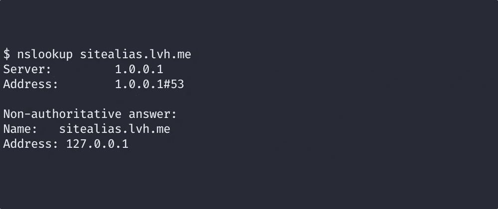

# 用 JavaScript 检查用户是否拥有一个域

> 原文：<https://levelup.gitconnected.com/checking-if-a-user-owns-a-domain-with-javascript-e5a4e7a1b15a>



我们正在使用的技术是谷歌、微软和其他公司用来验证你在某个领域拥有某种权限的技术。因此，虽然这不是万无一失的，但至少我们有一个很好的公司！

本文中的代码是 TypeScript，但是同样的方法也适用于大多数语言。

## 概观

我看到的所有验证方法都依赖于用户能够以某种方式修改网站——这是有意义的，因为你要检查他们是否对他们试图使用的网站有控制权。

他们中的大多数人似乎已经决定使用某种形式的 DNS 条目——一种他们可以检查实际存在的特殊记录。

## 快速 DNS 介绍

这是非常简短的；关于(稍微)更全面的 DNS 介绍，见[我的另一篇文章](https://www.solarwinter.net/domains/)。

域名系统由向访问互联网的计算机提供信息的记录组成。有相当多不同类型的记录。最基本的一个叫做 A 记录，A for 地址。它实际上是说“这个文本—foobar.example.com—指向这个 IP 地址”。

有许多保留地址有特殊的含义。一个有用的地址是`127.0.0.1`——它总是意味着“这台计算机”。它的符号名是`localhost`。

## 这个计划

我们希望检查用户是否可以修改该域的 DNS 条目，但不要有任何特别混乱或复杂的事情——我们把它做得越复杂，用户错误就越有可能出现。

最简单的方法——生成一个随机子域，让他们创建一个指向`127.0.0.1`的 A 记录。

## 生成别名

有许多不同的方法可以做到这一点。我选择使用 Node [uuid](https://www.npmjs.com/package/uuid) 模块，取前 8 个字符。选择 8 是因为它对于我们的目的来说足够随机，而且它是 v4 UUID 中的第一个“块”。

```
siteDetails["alias"] = uuid().substr(0, 8);
```

## 检查别名

使用节点 [dns 模块](https://nodejs.org/api/dns.html)我们可以解析我们创建的别名；我们在它后面追加用户的域，使`alias`成为一个子域。

普通的`dns`方法是基于回调的；它还提供了一组基于承诺的 API。为了方便起见，我们将使用[解析方法](https://nodejs.org/api/dns.html#dns_dnspromises_resolve_hostname_rrtype)。

```
import dns from "dns";
const dnsPromises = dns.promises;

type Site = {
  alias: string;        // Alias we'll be verifying
  domain: string;       // Domain the user gave us
  verified: boolean;    // Is it verified yet
}

async function verifySite(site: Site) {
  try {
    const res = await dnsPromises.resolve(site.alias + "." + site.domain);
    const valid = ((res.length == 1) && (res[0] == "127.0.0.1"));
    site.verified = valid;
  } catch (err) {
    console.error(`Error ${err} doing site ${site.id} verification`);
  }
}
```

我们期望查找的结果是一个单独的条目，`127.0.0.1` -如果是的话，我们称之为已验证。最后，我们确保数据反映了我们刚刚发现的内容。

## 在后台运行检查

我们现在有了一个可以用来验证域名的函数。最后一个阶段是让它在后台定期运行，而不是按需运行。

我使用的实现如下。我没有包括实用函数(比如`getAllSites`)，但是没有这些，代码应该还是可以理解的。

`startBackground`使用环境中的`DOMAIN_VERIFY_PERIOD_SECONDS`，如果它被定义了，或者如果它没有被定义，则使用 300 秒。然后它使用`setInterval`来调度`verifySites`。`setInterval`以毫秒为自变量，所以我们先转换。

`verifySites`简单地获取站点的当前列表，并在所有站点上运行`verifySite`。

最后，`stopBackground`将取消已经计划运行的间隔功能。

```
import { getAllSites } from "./queries";

let domainCheckId: NodeJS.Timeout | null = null;

export async function verifySites() {
  const sites: Site[] = await getAllSites();
  sites.forEach(site => verifySite(site));
}

export function startBackground(): void {
  const SECOND = 1000;
  const period: number = parseInt(process.env.DOMAIN_VERIFY_PERIOD_SECONDS || "300");
  console.log(`Starting domainCheck, period ${period} seconds`);

  domainCheckId = setInterval(verifySites, SECOND * period);
}

export function stopBackground(): void {
  if (domainCheckId) {
    clearInterval(domainCheckId);
    domainCheckId = null;
  }
}
```

就这样—这些函数足以开始在后台验证域。如果你使用它，让我知道！