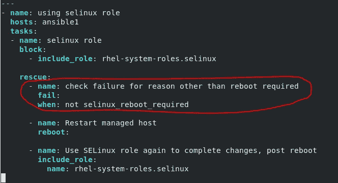

# 使用 RHEL SELinux 系统角色时检查重新启动要求

> 原文：<https://levelup.gitconnected.com/checking-reboot-requirements-when-using-the-rhel-selinux-system-role-9062727eebf0>

SELinux RHEL 系统角色可用于各种 SELinux 管理任务。一些最常见和最有用的是:

*   设置“强制”或“允许”模式
*   设置 SELinux 用户映射
*   设置 SELinux 文件上下文
*   设置 SELinux 布尔值
*   在文件系统上运行 *restorecon*

为了开始使用 RHEL 系统角色，您必须安装它们。这可以通过运行以下命令来完成—“*yum install rhel-system-roles*”。默认情况下，角色安装在“/usr/share/ansible/roles”中。selinux 系统角色可以在“/usr/share/ansi ble/roles/rhel-system-roles . selinux/”中找到。

一旦安装了 RHEL 系统角色，我们就可以创建一个剧本来利用 SELinux 系统角色。SELinux 角色有时必须重新启动受管主机才能完成其预期功能。该角色通过将名为“ **selinux_reboot_required** ”的变量设置为布尔值*真*或*假，来指示受管主机是否需要重启。*因为可能需要重新启动主机，所以使用 block 语句调用角色是个好主意。我们可以创建我们的 block 语句，这样，如果角色在执行过程中失败，可以使用 rescue 语句来继续执行该剧。在 rescue 语句中，我们可以首先使用条件来检查角色是否由于受管主机需要重新启动而失败。

在前面的例子中，如果变量**selinux _ reboot _ required**被设置为 *false，*那么我们知道该角色的执行一定是由于需要重新启动之外的原因而失败的。如果是这种情况，条件“when”检查将评估为 true，这将导致失败模块执行。从这里开始，我们的剧本执行将会停止，我们可以执行进一步的调试来找出导致我们的角色失败的确切原因。

然而，如果变量**selinux _ reboot _ required**被设置为 *true，*那么我们知道角色的执行失败是因为被管理的主机上需要重新启动。如果是这种情况，条件“when”检查将评估为 false，这将导致跳过失败模块。rescue 语句中使用的下一个模块将执行——在这种情况下，这将是 **reboot** 模块，因为我们知道，由于角色*将**selinux _ reboot _ required**变量设置为 *true* ，我们的托管主机需要重新启动。*一旦重启完成，该角色将再次被 **include_role** 语句调用。既然已经满足了重新启动的要求，我们的角色应该会成功完成—排除本演练范围之外的任何其他问题。