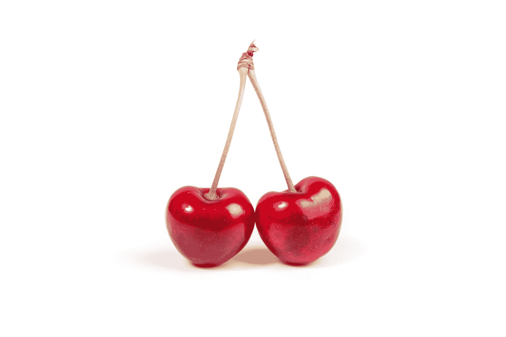
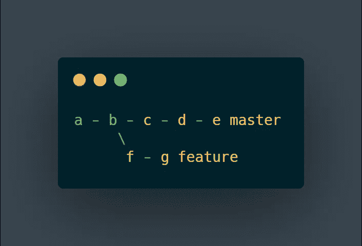
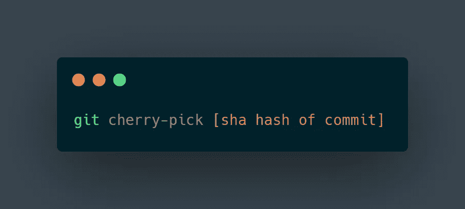
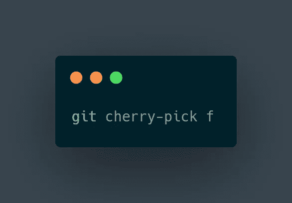
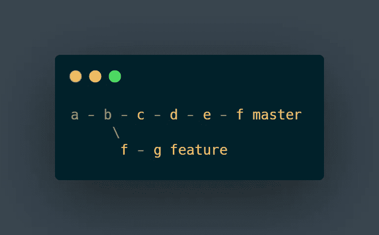

# 樱桃采摘🍒在 Git

> 原文：<https://levelup.gitconnected.com/cherry-picking-in-git-570a75cbc6f7>

[T. Q.](https://unsplash.com/@tq_photos?utm_source=medium&utm_medium=referral) 在 [Unsplash](https://unsplash.com?utm_source=medium&utm_medium=referral) 拍摄的照片

## 摘樱桃是一种艺术形式。

你用过摘樱桃这种艺术形式吗？我说的不是实际采摘樱桃的形式。我说的是从 git 提交历史中挑选的编程术语。

根据[文件](https://git-scm.com/docs/git-cherry-pick):

> git-cherry-pick —应用一些现有提交引入的更改

git 中的精选是从不同的分支获取提交并将其应用到当前分支的艺术。它获取该提交中文件的状态—该分支中发生的所有更改—并将它们应用到您当前所在的分支。

想象从一根树枝上摘下一颗樱桃，钉在另一根树枝上。

虽然这实际上并不适用于真正的 cherries，但是您可以使用这种方法将特定的更改从一个分支拖到您当前正在处理的分支。

## 设想

采摘樱桃时，你的树枝看起来会像这样:

简单特征分支。

从这里，您可以拨打:

Git 命令运行。

在这个例子中，我们称散列为`f`。假设您在主分支上，您将像这样调用命令:

因此，新的分支结构将如下所示:

现在，让我们来看一个例子，看看什么时候你更喜欢使用挑选而不是合并。

## 方案

你正在开发一个功能。您已经设置好了一切，您正在运行应用程序。生活是美好的。然后你注意到项目中有一些 bug，当上传一张图片时，应用程序会花费很长时间。

*你向团队中的另一名开发人员提及此事，他们继续在“开发”分支的* ***单次*** *提交中实现性能更新。太好了！但是，自从您开始分支以来，还添加了许多其他特性，此时合并违背了项目早期定义的分支结构。*

*您需要性能更新，因为这会影响您的测试，但是您不想要额外的特性，这需要测试方法的改变。你能做什么？*

再次运行 Git 命令。

在您的分支上运行该命令后，您就有了需要继续测试的性能升级，其他开发人员现在在创建新特性时也有了性能更新。生活是美好的；差不多了。

使用 cherry-pick 的两个缺点是:1)该命令将在您当前所在的分支上创建提交，2)更改应该在一次提交中完成。摘樱桃违反了通常的最佳实践——在项目中应该只有一个跟踪的变更——但是开发从来都不是完美的。第二，如果你正在挑选，你应该试着只在一次提交中使用它。如果你有多个你添加到你的分支，这是第一个瀑布的多重打破。

在生产中使用这种方法之前，请与项目经理、领导等沟通。尽管如此，精选确实允许你继续做你的专题，而每个人都可以继续做他们的。双赢。

如需补充阅读，请查看以下链接:【https://www.gitkraken.com/learn/git/cherry-pick】
[【https://www.atlassian.com/git/tutorials/cherry-pick】](https://www.atlassian.com/git/tutorials/cherry-pick)

感谢您花时间阅读这篇文章。我希望这给了你所有你需要的关于摘樱桃的见解。让我知道你对 git 的想法。你认为生产中的精选是在每种情况下都可以，还是只在少数情况下可以？祝一切顺利，保持安全——斯潘塞