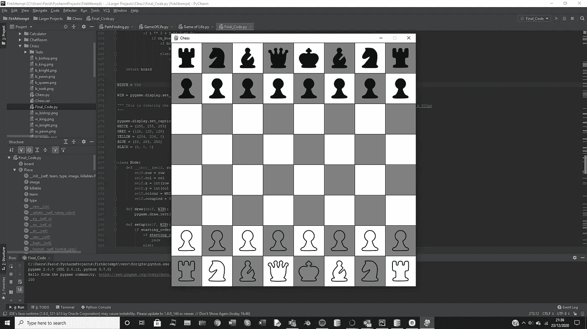

# 用 Python 制作象棋

> 原文：<https://levelup.gitconnected.com/chess-python-ca4532c7f5a4>



> 我将首先描述发生了什么，然后展示代码。

这是我和一个朋友在学校进行的一个大项目。这很有趣，因为我们已经计划了几个月，7 天后我们就完成了整个项目。我必须说，如果没有我的朋友埃德温的帮助，这是不可能的。首先，我们抽象了整个游戏，因为这是一个非常复杂的游戏编码，我们决定我将负责界面(用户可以看到的)，而埃德温负责每个部分的实际行为。他们都有自己的困难，我们确实需要协调很多，所以我们并不是没有互相帮助，例如，我确实教了他一点列表理解，以加快他的代码，而他揭露了我的相当愚蠢的错误，做列行而不是行列。

这段代码是我写的所有东西，旁边还有一些字典和上面的方法。首先我们创建一个窗口对象，它是我们运行国际象棋游戏时出现的窗口。我们将维度设置为 800x800，这是我们传递给它的元组参数。我们特别选择了 800 x 800，因为我们硬拼的国际象棋棋子的图像都是 100x100，这意味着如果棋盘是 800x800，它会非常适合。

使我的程序工作的主要东西是这些节点对象，它们只是保存棋子的容器(在这种情况下，它们被模拟为棋盘的瓷砖)。它们有自己的属性，即行、列、x、y 坐标。我们分别需要这些，因为所有这些节点都将存储在一个 8×8 的 2d 列表中，所以如果我们调用它，我们需要使用它的行号和列号来调用它，而如果我们将它绘制到屏幕上，我们需要它的 x，y 像素值(我们可以只做 row*100，但这将冒着我们忘记在整个代码中添加 1 次并看着整个东西崩溃的风险)。

draw 函数用于将图块绘制到屏幕上(因此是黑白图案)，而 setup 方法用于将任何图像绘制到屏幕上(如果我们在屏幕上的那个位置有一个图块)。你用 blit 在屏幕上绘图。

“绘制网格”绘制网格的边界(因此黑色的水平线和垂直线分隔了图块)“绘制网格”和“制作网格”正在创建 2d 列表，稍后将使用该列表来访问所有节点。更新显示用于在每次滴答时更新屏幕。我认为为了避免 CPU 过载，我们选择以 20fps 运行程序，这对于国际象棋来说是完全不合理的，但我们不想有太多的延迟。

当用户点击屏幕时，我们需要弄清楚他们点击了哪个磁贴，这就是 find_node 的功能。Display_potential_moves 是 edwin 做的一个函数，但它只需要一个潜在移动的列表，并为这些移动改变瓷砖的颜色，使其突出。

Do_move 用于 acc 在屏幕上进行交换，但是交换我的字典上的值，当屏幕更新时，这个变化将在屏幕上可见。

使用 remove_highlight 是因为很难移除特定图块的高光，所以我们决定只为所有图块重绘黑色。

主函数包含了很多标准逻辑，如果你懂 pygame 的话，我希望你能理解。我会在这里附上一个视频，以防你没有

```
import pygame

import time

import sys

board = [['  ' for i in range(8)] for i in range(8)]

## Creates a chess piece class that shows what team a piece is on, what type of piece it is and whether or not it can be killed by another selected piece.
class Piece:
    def __init__(self, team, type, image, killable=False):
        self.team = team
        self.type = type
        self.killable = killable
        self.image = image

## Creates instances of chess pieces, so far we got: pawn, king, rook and bishop
## The first parameter defines what team its on and the second, what type of piece it is
bp = Piece('b', 'p', 'b_pawn.png')
wp = Piece('w', 'p', 'w_pawn.png')
bk = Piece('b', 'k', 'b_king.png')
wk = Piece('w', 'k', 'w_king.png')
br = Piece('b', 'r', 'b_rook.png')
wr = Piece('w', 'r', 'w_rook.png')
bb = Piece('b', 'b', 'b_bishop.png')
wb = Piece('w', 'b', 'w_bishop.png')
bq = Piece('b', 'q', 'b_queen.png')
wq = Piece('w', 'q', 'w_queen.png')
bkn = Piece('b', 'kn', 'b_knight.png')
wkn = Piece('w', 'kn', 'w_knight.png')

starting_order = {(0, 0): pygame.image.load(br.image), (1, 0): pygame.image.load(bkn.image),
                  (2, 0): pygame.image.load(bb.image), (3, 0): pygame.image.load(bk.image),
                  (4, 0): pygame.image.load(bq.image), (5, 0): pygame.image.load(bb.image),
                  (6, 0): pygame.image.load(bkn.image), (7, 0): pygame.image.load(br.image),
                  (0, 1): pygame.image.load(bp.image), (1, 1): pygame.image.load(bp.image),
                  (2, 1): pygame.image.load(bp.image), (3, 1): pygame.image.load(bp.image),
                  (4, 1): pygame.image.load(bp.image), (5, 1): pygame.image.load(bp.image),
                  (6, 1): pygame.image.load(bp.image), (7, 1): pygame.image.load(bp.image),

                  (0, 2): None, (1, 2): None, (2, 2): None, (3, 2): None,
                  (4, 2): None, (5, 2): None, (6, 2): None, (7, 2): None,
                  (0, 3): None, (1, 3): None, (2, 3): None, (3, 3): None,
                  (4, 3): None, (5, 3): None, (6, 3): None, (7, 3): None,
                  (0, 4): None, (1, 4): None, (2, 4): None, (3, 4): None,
                  (4, 4): None, (5, 4): None, (6, 4): None, (7, 4): None,
                  (0, 5): None, (1, 5): None, (2, 5): None, (3, 5): None,
                  (4, 5): None, (5, 5): None, (6, 5): None, (7, 5): None,

                  (0, 6): pygame.image.load(wp.image), (1, 6): pygame.image.load(wp.image),
                  (2, 6): pygame.image.load(wp.image), (3, 6): pygame.image.load(wp.image),
                  (4, 6): pygame.image.load(wp.image), (5, 6): pygame.image.load(wp.image),
                  (6, 6): pygame.image.load(wp.image), (7, 6): pygame.image.load(wp.image),
                  (0, 7): pygame.image.load(wr.image), (1, 7): pygame.image.load(wkn.image),
                  (2, 7): pygame.image.load(wb.image), (3, 7): pygame.image.load(wk.image),
                  (4, 7): pygame.image.load(wq.image), (5, 7): pygame.image.load(wb.image),
                  (6, 7): pygame.image.load(wkn.image), (7, 7): pygame.image.load(wr.image),}

def create_board(board):
    board[0] = [Piece('b', 'r', 'b_rook.png'), Piece('b', 'kn', 'b_knight.png'), Piece('b', 'b', 'b_bishop.png'), \
               Piece('b', 'q', 'b_queen.png'), Piece('b', 'k', 'b_king.png'), Piece('b', 'b', 'b_bishop.png'), \
               Piece('b', 'kn', 'b_knight.png'), Piece('b', 'r', 'b_rook.png')]

    board[7] = [Piece('w', 'r', 'w_rook.png'), Piece('w', 'kn', 'w_knight.png'), Piece('w', 'b', 'w_bishop.png'), \
               Piece('w', 'q', 'w_queen.png'), Piece('w', 'k', 'w_king.png'), Piece('w', 'b', 'w_bishop.png'), \
               Piece('w', 'kn', 'w_knight.png'), Piece('w', 'r', 'w_rook.png')]

    for i in range(8):
        board[1][i] = Piece('b', 'p', 'b_pawn.png')
        board[6][i] = Piece('w', 'p', 'w_pawn.png')
    return board

## returns the input if the input is within the boundaries of the board
def on_board(position):
    if position[0] > -1 and position[1] > -1 and position[0] < 8 and position[1] < 8:
        return True

## returns a string that places the rows and columns of the board in a readable manner
def convert_to_readable(board):
    output = ''

    for i in board:
        for j in i:
            try:
                output += j.team + j.type + ', '
            except:
                output += j + ', '
        output += '\n'
    return output

## resets "x's" and killable pieces
def deselect():
    for row in range(len(board)):
        for column in range(len(board[0])):
            if board[row][column] == 'x ':
                board[row][column] = '  '
            else:
                try:
                    board[row][column].killable = False
                except:
                    pass
    return convert_to_readable(board)

## Takes in board as argument then returns 2d array containing positions of valid moves
def highlight(board):
    highlighted = []
    for i in range(len(board)):
        for j in range(len(board[0])):
            if board[i][j] == 'x ':
                highlighted.append((i, j))
            else:
                try:
                    if board[i][j].killable:
                        highlighted.append((i, j))
                except:
                    pass
    return highlighted

def check_team(moves, index):
    row, col = index
    if moves%2 == 0:
        if board[row][col].team == 'w':
            return True
    else:
        if board[row][col].team == 'b':
            return True

## This takes in a piece object and its index then runs then checks where that piece can move using separately defined functions for each type of piece.
def select_moves(piece, index, moves):
    if check_team(moves, index):
        if piece.type == 'p':
            if piece.team == 'b':
                return highlight(pawn_moves_b(index))
            else:
                return highlight(pawn_moves_w(index))

        if piece.type == 'k':
            return highlight(king_moves(index))

        if piece.type == 'r':
            return highlight(rook_moves(index))

        if piece.type == 'b':
            return highlight(bishop_moves(index))

        if piece.type == 'q':
            return highlight(queen_moves(index))

        if piece.type == 'kn':
            return highlight(knight_moves(index))

## Basically, check black and white pawns separately and checks the square above them. If its free that space gets an "x" and if it is occupied by a piece of the opposite team then that piece becomes killable.
def pawn_moves_b(index):
    if index[0] == 1:
        if board[index[0] + 2][index[1]] == '  ' and board[index[0] + 1][index[1]] == '  ':
            board[index[0] + 2][index[1]] = 'x '
    bottom3 = [[index[0] + 1, index[1] + i] for i in range(-1, 2)]

    for positions in bottom3:
        if on_board(positions):
            if bottom3.index(positions) % 2 == 0:
                try:
                    if board[positions[0]][positions[1]].team != 'b':
                        board[positions[0]][positions[1]].killable = True
                except:
                    pass
            else:
                if board[positions[0]][positions[1]] == '  ':
                    board[positions[0]][positions[1]] = 'x '
    return board

def pawn_moves_w(index):
    if index[0] == 6:
        if board[index[0] - 2][index[1]] == '  ' and board[index[0] - 1][index[1]] == '  ':
            board[index[0] - 2][index[1]] = 'x '
    top3 = [[index[0] - 1, index[1] + i] for i in range(-1, 2)]

    for positions in top3:
        if on_board(positions):
            if top3.index(positions) % 2 == 0:
                try:
                    if board[positions[0]][positions[1]].team != 'w':
                        board[positions[0]][positions[1]].killable = True
                except:
                    pass
            else:
                if board[positions[0]][positions[1]] == '  ':
                    board[positions[0]][positions[1]] = 'x '
    return board

## This just checks a 3x3 tile surrounding the king. Empty spots get an "x" and pieces of the opposite team become killable.
def king_moves(index):
    for y in range(3):
        for x in range(3):
            if on_board((index[0] - 1 + y, index[1] - 1 + x)):
                if board[index[0] - 1 + y][index[1] - 1 + x] == '  ':
                    board[index[0] - 1 + y][index[1] - 1 + x] = 'x '
                else:
                    if board[index[0] - 1 + y][index[1] - 1 + x].team != board[index[0]][index[1]].team:
                        board[index[0] - 1 + y][index[1] - 1 + x].killable = True
    return board

## This creates 4 lists for up, down, left and right and checks all those spaces for pieces of the opposite team. The list comprehension is pretty long so if you don't get it just msg me.
def rook_moves(index):
    cross = [[[index[0] + i, index[1]] for i in range(1, 8 - index[0])],
             [[index[0] - i, index[1]] for i in range(1, index[0] + 1)],
             [[index[0], index[1] + i] for i in range(1, 8 - index[1])],
             [[index[0], index[1] - i] for i in range(1, index[1] + 1)]]

    for direction in cross:
        for positions in direction:
            if on_board(positions):
                if board[positions[0]][positions[1]] == '  ':
                    board[positions[0]][positions[1]] = 'x '
                else:
                    if board[positions[0]][positions[1]].team != board[index[0]][index[1]].team:
                        board[positions[0]][positions[1]].killable = True
                    break
    return board

## Same as the rook but this time it creates 4 lists for the diagonal directions and so the list comprehension is a little bit trickier.
def bishop_moves(index):
    diagonals = [[[index[0] + i, index[1] + i] for i in range(1, 8)],
                 [[index[0] + i, index[1] - i] for i in range(1, 8)],
                 [[index[0] - i, index[1] + i] for i in range(1, 8)],
                 [[index[0] - i, index[1] - i] for i in range(1, 8)]]

    for direction in diagonals:
        for positions in direction:
            if on_board(positions):
                if board[positions[0]][positions[1]] == '  ':
                    board[positions[0]][positions[1]] = 'x '
                else:
                    if board[positions[0]][positions[1]].team != board[index[0]][index[1]].team:
                        board[positions[0]][positions[1]].killable = True
                    break
    return board

## applies the rook moves to the board then the bishop moves because a queen is basically a rook and bishop in the same position.
def queen_moves(index):
    board = rook_moves(index)
    board = bishop_moves(index)
    return board

## Checks a 5x5 grid around the piece and uses pythagoras to see if if a move is valid. Valid moves will be a distance of sqrt(5) from centre
def knight_moves(index):
    for i in range(-2, 3):
        for j in range(-2, 3):
            if i ** 2 + j ** 2 == 5:
                if on_board((index[0] + i, index[1] + j)):
                    if board[index[0] + i][index[1] + j] == '  ':
                        board[index[0] + i][index[1] + j] = 'x '
                    else:
                        if board[index[0] + i][index[1] + j].team != board[index[0]][index[1]].team:
                            board[index[0] + i][index[1] + j].killable = True
    return board

WIDTH = 800

WIN = pygame.display.set_mode((WIDTH, WIDTH))

""" This is creating the window that we are playing on, it takes a tuple argument which is the dimensions of the window so in this case 800 x 800px
"""

pygame.display.set_caption("Chess")
WHITE = (255, 255, 255)
GREY = (128, 128, 128)
YELLOW = (204, 204, 0)
BLUE = (50, 255, 255)
BLACK = (0, 0, 0)

class Node:
    def __init__(self, row, col, width):
        self.row = row
        self.col = col
        self.x = int(row * width)
        self.y = int(col * width)
        self.colour = WHITE
        self.occupied = None

    def draw(self, WIN):
        pygame.draw.rect(WIN, self.colour, (self.x, self.y, WIDTH / 8, WIDTH / 8))

    def setup(self, WIN):
        if starting_order[(self.row, self.col)]:
            if starting_order[(self.row, self.col)] == None:
                pass
            else:
                WIN.blit(starting_order[(self.row, self.col)], (self.x, self.y))

        """
        For now it is drawing a rectangle but eventually we are going to need it
        to use blit to draw the chess pieces instead
        """

def make_grid(rows, width):
    grid = []
    gap = WIDTH // rows
    print(gap)
    for i in range(rows):
        grid.append([])
        for j in range(rows):
            node = Node(j, i, gap)
            grid[i].append(node)
            if (i+j)%2 ==1:
                grid[i][j].colour = GREY
    return grid
"""
This is creating the nodes thats are on the board(so the chess tiles)
I've put them into a 2d array which is identical to the dimesions of the chessboard
"""

def draw_grid(win, rows, width):
    gap = width // 8
    for i in range(rows):
        pygame.draw.line(win, BLACK, (0, i * gap), (width, i * gap))
        for j in range(rows):
            pygame.draw.line(win, BLACK, (j * gap, 0), (j * gap, width))

    """
    The nodes are all white so this we need to draw the grey lines that separate all the chess tiles
    from each other and that is what this function does"""

def update_display(win, grid, rows, width):
    for row in grid:
        for spot in row:
            spot.draw(win)
            spot.setup(win)
    draw_grid(win, rows, width)
    pygame.display.update()

def Find_Node(pos, WIDTH):
    interval = WIDTH / 8
    y, x = pos
    rows = y // interval
    columns = x // interval
    return int(rows), int(columns)

def display_potential_moves(positions, grid):
    for i in positions:
        x, y = i
        grid[x][y].colour = BLUE
        """
        Displays all the potential moves
        """

def Do_Move(OriginalPos, FinalPosition, WIN):
    starting_order[FinalPosition] = starting_order[OriginalPos]
    starting_order[OriginalPos] = None

def remove_highlight(grid):
    for i in range(len(grid)):
        for j in range(len(grid[0])):
            if (i+j)%2 == 0:
                grid[i][j].colour = WHITE
            else:
                grid[i][j].colour = GREY
    return grid
"""this takes in 2 co-ordinate parameters which you can get as the position of the piece and then the position of the node it is moving to
you can get those co-ordinates using my old function for swap"""

create_board(board)

def main(WIN, WIDTH):
    moves = 0
    selected = False
    piece_to_move=[]
    grid = make_grid(8, WIDTH)
    while True:
        pygame.time.delay(50) ##stops cpu dying
        for event in pygame.event.get():
            if event.type == pygame.QUIT:
                pygame.quit()
                sys.exit()

            """This quits the program if the player closes the window"""

            if event.type == pygame.MOUSEBUTTONDOWN:
                pos = pygame.mouse.get_pos()
                y, x = Find_Node(pos, WIDTH)
                if selected == False:
                    try:
                        possible = select_moves((board[x][y]), (x,y), moves)
                        for positions in possible:
                            row, col = positions
                            grid[row][col].colour = BLUE
                        piece_to_move = x,y
                        selected = True
                    except:
                        piece_to_move = []
                        print('Can\'t select')
                    #print(piece_to_move)

                else:
                    try:
                        if board[x][y].killable == True:
                            row, col = piece_to_move ## coords of original piece
                            board[x][y] = board[row][col]
                            board[row][col] = '  '
                            deselect()
                            remove_highlight(grid)
                            Do_Move((col, row), (y, x), WIN)
                            moves += 1
                            print(convert_to_readable(board))
                        else:
                            deselect()
                            remove_highlight(grid)
                            selected = False
                            print("Deselected")
                    except:
                        if board[x][y] == 'x ':
                            row, col = piece_to_move
                            board[x][y] = board[row][col]
                            board[row][col] = '  '
                            deselect()
                            remove_highlight(grid)
                            Do_Move((col, row), (y, x), WIN)
                            moves += 1
                            print(convert_to_readable(board))
                        else:
                            deselect()
                            remove_highlight(grid)
                            selected = False
                            print("Invalid move")
                    selected = False

            update_display(WIN, grid, 8, WIDTH)

main(WIN, WIDTH)
```

如果我要解释整个代码，这将花费几个小时来编写，所以我将解释其中的功能和任何复杂的概念，并让您来解决其余的问题。

**代码解释:**

我们用 pygame 编写了这个程序，因为它可以很容易地给我们提供接口，而且我有使用 A*算法制作网格的经验，所以大部分网格都是从中回收的代码。

```
board = [['  ' for i in range(8)] for i in range(8)]

## Creates a chess piece class that shows what team a piece is on, what type of piece it is and whether or not it can be killed by another selected piece.
class Piece:
    def __init__(self, team, type, image, killable=False):
        self.team = team
        self.type = type
        self.killable = killable
        self.image = image

## Creates instances of chess pieces, so far we got: pawn, king, rook and bishop
## The first parameter defines what team its on and the second, what type of piece it is
bp = Piece('b', 'p', 'b_pawn.png')
wp = Piece('w', 'p', 'w_pawn.png')
bk = Piece('b', 'k', 'b_king.png')
wk = Piece('w', 'k', 'w_king.png')
br = Piece('b', 'r', 'b_rook.png')
wr = Piece('w', 'r', 'w_rook.png')
bb = Piece('b', 'b', 'b_bishop.png')
wb = Piece('w', 'b', 'w_bishop.png')
bq = Piece('b', 'q', 'b_queen.png')
wq = Piece('w', 'q', 'w_queen.png')
bkn = Piece('b', 'kn', 'b_knight.png')
wkn = Piece('w', 'kn', 'w_knight.png')

starting_order = {(0, 0): pygame.image.load(br.image), (1, 0): pygame.image.load(bkn.image),
                  (2, 0): pygame.image.load(bb.image), (3, 0): pygame.image.load(bk.image),
                  (4, 0): pygame.image.load(bq.image), (5, 0): pygame.image.load(bb.image),
                  (6, 0): pygame.image.load(bkn.image), (7, 0): pygame.image.load(br.image),
                  (0, 1): pygame.image.load(bp.image), (1, 1): pygame.image.load(bp.image),
                  (2, 1): pygame.image.load(bp.image), (3, 1): pygame.image.load(bp.image),
                  (4, 1): pygame.image.load(bp.image), (5, 1): pygame.image.load(bp.image),
                  (6, 1): pygame.image.load(bp.image), (7, 1): pygame.image.load(bp.image),

                  (0, 2): None, (1, 2): None, (2, 2): None, (3, 2): None,
                  (4, 2): None, (5, 2): None, (6, 2): None, (7, 2): None,
                  (0, 3): None, (1, 3): None, (2, 3): None, (3, 3): None,
                  (4, 3): None, (5, 3): None, (6, 3): None, (7, 3): None,
                  (0, 4): None, (1, 4): None, (2, 4): None, (3, 4): None,
                  (4, 4): None, (5, 4): None, (6, 4): None, (7, 4): None,
                  (0, 5): None, (1, 5): None, (2, 5): None, (3, 5): None,
                  (4, 5): None, (5, 5): None, (6, 5): None, (7, 5): None,

                  (0, 6): pygame.image.load(wp.image), (1, 6): pygame.image.load(wp.image),
                  (2, 6): pygame.image.load(wp.image), (3, 6): pygame.image.load(wp.image),
                  (4, 6): pygame.image.load(wp.image), (5, 6): pygame.image.load(wp.image),
                  (6, 6): pygame.image.load(wp.image), (7, 6): pygame.image.load(wp.image),
                  (0, 7): pygame.image.load(wr.image), (1, 7): pygame.image.load(wkn.image),
                  (2, 7): pygame.image.load(wb.image), (3, 7): pygame.image.load(wk.image),
                  (4, 7): pygame.image.load(wq.image), (5, 7): pygame.image.load(wb.image),
                  (6, 7): pygame.image.load(wkn.image), (7, 7): pygame.image.load(wr.image),}

def create_board(board):
    board[0] = [Piece('b', 'r', 'b_rook.png'), Piece('b', 'kn', 'b_knight.png'), Piece('b', 'b', 'b_bishop.png'), \
               Piece('b', 'q', 'b_queen.png'), Piece('b', 'k', 'b_king.png'), Piece('b', 'b', 'b_bishop.png'), \
               Piece('b', 'kn', 'b_knight.png'), Piece('b', 'r', 'b_rook.png')]

    board[7] = [Piece('w', 'r', 'w_rook.png'), Piece('w', 'kn', 'w_knight.png'), Piece('w', 'b', 'w_bishop.png'), \
               Piece('w', 'q', 'w_queen.png'), Piece('w', 'k', 'w_king.png'), Piece('w', 'b', 'w_bishop.png'), \
               Piece('w', 'kn', 'w_knight.png'), Piece('w', 'r', 'w_rook.png')]

    for i in range(8):
        board[1][i] = Piece('b', 'p', 'b_pawn.png')
        board[6][i] = Piece('w', 'p', 'w_pawn.png')
    return board 
```

除了从开始订单字典，所有这些都是埃德温的代码，所有这些都用于移动计算。理论上，你可以像他一样只使用字典或 2d 列表中的一个来完成这项工作，但由于我们在编码时都需要访问数组，并且我们不能共享 python 脚本，所以我们制作了自己的版本。Edwin 为棋子创建了一个类，因为它更容易管理，在底部，他正在设置他的 2d 列表，以便所有的棋子都在它们的起始位置。在我的字典中，我自动地硬写了所有的位置，因为我需要将每个单独的图像文件的名称放入加载中。pygame.image.load()将图像加载到 python 文件中，然后我们只需要将图像绘制到屏幕上。这种方式比先加载图像然后再绘图要好，因为这意味着我们只需要为整个程序加载一次图像，然后将图像转换到屏幕上的新位置。

edwins 代码的其余部分非常简单明了，只需选择每个棋子可以移动到的正确位置，然后将这些“合法”的棋子放到棋盘上，供我们在界面上使用，以突出显示棋盘。

```
WIDTH = 800

WIN = pygame.display.set_mode((WIDTH, WIDTH))

""" This is creating the window that we are playing on, it takes a tuple argument which is the dimensions of the window so in this case 800 x 800px
"""

pygame.display.set_caption("Chess")
WHITE = (255, 255, 255)
GREY = (128, 128, 128)
YELLOW = (204, 204, 0)
BLUE = (50, 255, 255)
BLACK = (0, 0, 0)

class Node:
    def __init__(self, row, col, width):
        self.row = row
        self.col = col
        self.x = int(row * width)
        self.y = int(col * width)
        self.colour = WHITE
        self.occupied = None

    def draw(self, WIN):
        pygame.draw.rect(WIN, self.colour, (self.x, self.y, WIDTH / 8, WIDTH / 8))

    def setup(self, WIN):
        if starting_order[(self.row, self.col)]:
            if starting_order[(self.row, self.col)] == None:
                pass
            else:
                WIN.blit(starting_order[(self.row, self.col)], (self.x, self.y))

        """
        For now it is drawing a rectangle but eventually we are going to need it
        to use blit to draw the chess pieces instead
        """

def make_grid(rows, width):
    grid = []
    gap = WIDTH // rows
    print(gap)
    for i in range(rows):
        grid.append([])
        for j in range(rows):
            node = Node(j, i, gap)
            grid[i].append(node)
            if (i+j)%2 ==1:
                grid[i][j].colour = GREY
    return grid
"""
This is creating the nodes thats are on the board(so the chess tiles)
I've put them into a 2d array which is identical to the dimesions of the chessboard
"""

def draw_grid(win, rows, width):
    gap = width // 8
    for i in range(rows):
        pygame.draw.line(win, BLACK, (0, i * gap), (width, i * gap))
        for j in range(rows):
            pygame.draw.line(win, BLACK, (j * gap, 0), (j * gap, width))

    """
    The nodes are all white so this we need to draw the grey lines that separate all the chess tiles
    from each other and that is what this function does"""

def update_display(win, grid, rows, width):
    for row in grid:
        for spot in row:
            spot.draw(win)
            spot.setup(win)
    draw_grid(win, rows, width)
    pygame.display.update()

def Find_Node(pos, WIDTH):
    interval = WIDTH / 8
    y, x = pos
    rows = y // interval
    columns = x // interval
    return int(rows), int(columns)

def display_potential_moves(positions, grid):
    for i in positions:
        x, y = i
        grid[x][y].colour = BLUE
        """
        Displays all the potential moves
        """

def Do_Move(OriginalPos, FinalPosition, WIN):
    starting_order[FinalPosition] = starting_order[OriginalPos]
    starting_order[OriginalPos] = None

def remove_highlight(grid):
    for i in range(len(grid)):
        for j in range(len(grid[0])):
            if (i+j)%2 == 0:
                grid[i][j].colour = WHITE
            else:
                grid[i][j].colour = GREY
    return grid
"""this takes in 2 co-ordinate parameters which you can get as the position of the piece and then the position of the node it is moving to
you can get those co-ordinates using my old function for swap"""

create_board(board)

def main(WIN, WIDTH):
    moves = 0
    selected = False
    piece_to_move=[]
    grid = make_grid(8, WIDTH)
    while True:
        pygame.time.delay(50) ##stops cpu dying
        for event in pygame.event.get():
            if event.type == pygame.QUIT:
                pygame.quit()
                sys.exit()

            """This quits the program if the player closes the window"""

            if event.type == pygame.MOUSEBUTTONDOWN:
                pos = pygame.mouse.get_pos()
                y, x = Find_Node(pos, WIDTH)
                if selected == False:
                    try:
                        possible = select_moves((board[x][y]), (x,y), moves)
                        for positions in possible:
                            row, col = positions
                            grid[row][col].colour = BLUE
                        piece_to_move = x,y
                        selected = True
                    except:
                        piece_to_move = []
                        print('Can\'t select')
                    #print(piece_to_move)

                else:
                    try:
                        if board[x][y].killable == True:
                            row, col = piece_to_move ## coords of original piece
                            board[x][y] = board[row][col]
                            board[row][col] = '  '
                            deselect()
                            remove_highlight(grid)
                            Do_Move((col, row), (y, x), WIN)
                            moves += 1
                            print(convert_to_readable(board))
                        else:
                            deselect()
                            remove_highlight(grid)
                            selected = False
                            print("Deselected")
                    except:
                        if board[x][y] == 'x ':
                            row, col = piece_to_move
                            board[x][y] = board[row][col]
                            board[row][col] = '  '
                            deselect()
                            remove_highlight(grid)
                            Do_Move((col, row), (y, x), WIN)
                            moves += 1
                            print(convert_to_readable(board))
                        else:
                            deselect()
                            remove_highlight(grid)
                            selected = False
                            print("Invalid move")
                    selected = False

            update_display(WIN, grid, 8, WIDTH)

main(WIN, WIDTH)
```

# 分级编码

感谢您成为我们社区的一员！升级正在改变技术招聘。 [**在最好的公司**找到你最完美的工作](https://jobs.levelup.dev/talent) **。**

[](https://jobs.levelup.dev/talent) [## 提升——改变招聘流程

### 🔥让软件工程师找到他们热爱的完美角色🧠寻找人才是最痛苦的部分…

作业. levelup.dev](https://jobs.levelup.dev/talent)