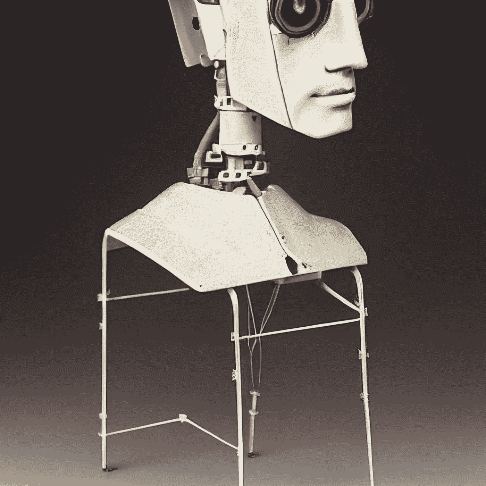

# 首席人工智能官:6 项基本职责

> 原文：<https://levelup.gitconnected.com/chief-ai-officer-6-essential-responsibilities-d1ba86c96555>

作为首席人工智能官，更重要的领导要素

来自[作者](https://medium.com/@aniltilbe)

在最近的一篇文章中，我概述了[成为首席人工智能官的四个基本方面](/chief-ai-officers-4-ways-to-get-started-cbd9d01573b9)。这一次，我将阐明这个职位的一些潜在责任。

总的来说，首席人工智能官的职责应该包括领导和管理人工智能技术的整体发展，建立人工智能应该如何使用的企业标准，制定支持负责任和道德地使用人工智能技术的政策，以及促进学术和商业研究人员之间的创造性合作，以找到人工智能最具挑战性的问题的解决方案。

# 考虑角色中的这些正式的、附加的功能:

1.评估人工智能技术的有效性:为了确保人工智能以有利于和支持用例的方式被采用，首席人工智能官需要跟踪每项新技术的表现如何，以及它是否应该被修改或取代。此外，应采取措施确保人工智能的发展与数据保护和道德考虑相平衡。因此，建立评估和衡量人工智能有效性的流程和指标将至关重要。

一些过程可能包括记录和跟踪 AI 技术在组织和团队内部和外部的使用。此外，记录评估新的人工智能工具相对于已建立的方法的有效性，以确定它们是否应该被纳入组织的工作流程。此外，考虑提高透明度，以便所有利益相关者都知道组织内部是如何使用技术的，从而对未来的发展做出明智的决策。

来自[作者](https://medium.com/@aniltilbe)

2.为了保护个人用户和组织本身的安全，组织制定关于收集和使用用户数据的具体隐私规则至关重要。一个策略可以包括多个组件，可能是以下组件:

—确保数据收集合法且符合道德规范

—指定谁有权访问用户信息

—确定其预期应用

—指定用户数据在达到目的后将存储多长时间，以及是否可以转移或匿名

—告知用户有关其个人数据的权利

3.为与人工智能相关的道德教育项目提供领导至关重要，因为这将帮助受影响的个人识别潜在的道德挑战并考虑解决方案。随着技术的发展，人工智能相关的问题比以往任何时候都多；因此，每个人都应该意识到风险以及如何适当地处理它们。假设我们可以就这些挑战对团队和组织进行充分的教育，并围绕 AI 的使用开发协议和程序。在这种情况下，我们可以确保人工智能的好处得到公平分享，而伦理问题不会妨碍它们的分配。

来自[作者](https://medium.com/@aniltilbe)

4.促进人工智能研究数据集:随着人工智能技术越来越普及，帮助研究人员获得工作所需的资源可能变得越来越具有挑战性。障碍包括找到合适的数据集和存储库，并围绕数据集的使用建立透明度，以便各方都能受益。谁将拥有和控制数据集，如何共享它们，与谁共享，以及谁应该访问它们，这些都是早期战略决策的例子。

5.为大型内部和外部数据共享项目提供领导:由于人工智能技术的快速发展，组织正在频繁地寻找交换大量信息的有效方法。为了促进这一点，首席人工智能官通常充当参与此类计划的许多利益相关者之间的联络人。例如，他们可以帮助建立和发起协作，并领导数据共享委员会或工作组。

由于人工智能技术的快速发展，组织通常会寻求有效的方法来共享特定或精选的信息。为了支持这些努力，首席人工智能官经常充当参与这些项目的许多利益相关者之间的联络人。这些关系非常重要，因为它们有助于建立信任和促进部门凝聚力。当务之急是建立有效的沟通，让每个人都保持一致，因为各方可能对如何利用数据有不同的想法。

来自[作者](https://medium.com/@aniltilbe)

6.制定和实施绩效评估策略:尽管有许多方法可以评估人工智能技术的功效，但必须牢牢掌握哪些措施可以提供可靠的结果。例如，考虑评估用户满意度。检查实现这一点的以下策略:

—利用问卷调查来确定用户对人工智能系统的满意度。

—检查用户与系统交互的频率，因为更高的交互率可能意味着更高的用户满意度。

—监控与人工智能系统相关的客户支持请求，因此较少的问题可能表明消费者是满意的。

来自[作者](https://medium.com/@aniltilbe)

# **离别的思念**

首席人工智能官负责确保以负责任和符合道德的方式使用人工智能技术，制定政策以实现这一点，指导与人工智能技术相关的道德教育工作，并支持研究活动。

关于领导和管理人工智能技术的整体发展，这需要为如何使用人工智能制定全行业标准，制定支持负责任和道德地使用人工智能技术的公共政策，促进学术界和商业实体研究人员之间的创造性合作，以找到人工智能重大问题的解决方案。

解决人工智能技术的广泛应用可能引起的分歧和冲突:因为特定的人工智能实现或应用在道德上是否合理可能会发生争论，所以这个职位需要相当大的冲突解决能力。在某些情况下，这些分歧可能会成为法律问题。

如果你对这篇文章有任何建议或拓宽主题的建议，我将非常感谢你的来信。

还有，这是我的时事通讯；我希望 [**你能考虑订阅。**](https://predictiveventures.substack.com/)

如果你喜欢阅读这样的故事，并想支持我成为一名作家，可以考虑注册成为一名 Medium 会员，并获得无限制访问 Medium 上所有故事的权利。

此外，我还写了以下帖子，你可能会感兴趣:

 [## 首席人工智能官:4 种入门方法

### 这是一个重要的角色，他们对组织战略、运营和实施策略至关重要…

levelup.gitconnected.com](/chief-ai-officers-4-ways-to-get-started-cbd9d01573b9)  [## 前 20 个机器学习算法，每个用不到 10 秒钟解释

### 对 20 个最重要的机器学习算法的简单解释，每个都在 10 秒内完成。

levelup.gitconnected.com](/top-20-machine-learning-algorithms-explained-in-less-than-10-seconds-each-8fd728f70b19) 

阿尼尔·蒂尔贝