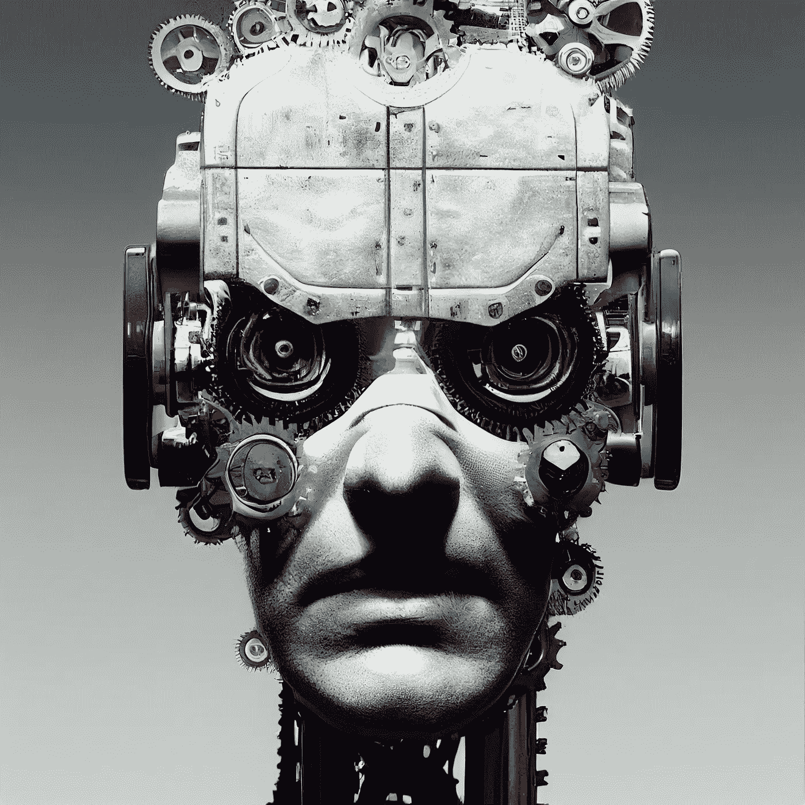

# 首席人工智能官:4 种入门方法

> 原文：<https://levelup.gitconnected.com/chief-ai-officers-4-ways-to-get-started-cbd9d01573b9>

他们是一个重要的角色，在人工智能的实施过程中，他们对于组织的战略、运作和战术都是至关重要的

来自[作者](https://medium.com/@aniltilbe)

首席人工智能官是一个组织中的高级管理人员，其职责包括监督或管理人工智能的发展。从战略上来说，他们在指导整个人工智能战略以及确保组织的算法有效实现其目标方面发挥着至关重要的作用。除了这种监督和控制，他们还应该在人工智能及其对业务运营的潜在影响方面拥有深入的专业知识。

在最基本的层面上，它们管理三个功能:

## **通过制定有效的算法来帮助组织实现他们的目标，指导这些计划的实施，并在组织的各个层面有效地交流结果。**

这是一个领导职位，因为它要求对人工智能及其可能的组织影响有深入的理解。它通常由拥有人工智能(AI)或相关学科学位以及高级管理经验的人担任。他们应该是管理层的正式成员，对人工智能有坚实的掌握，能够成功地向其他高管等传递关于所有人工智能(及其各自的生命周期)的见解。他们在战略、操作和战术层面上对人工智能项目的成败负责。他们应该有效地领导、管理、委派，并在必要时做出有效的决策。

来自[作者](https://medium.com/@aniltilbe)

## **稍微宽泛一点的角色分解**

首席人工智能官负责确保一个组织的算法在设计人工智能战略时有效地实现其目标。为了确保所有利益相关者都与组织的目标保持一致，他们还应该全面了解人工智能及其对业务运营可能产生的影响。他们对人工智能及其影响的了解对于实现组织的目标至关重要，他们应该能够成功地将这些信息传达给其他高管。此外，首席人工智能官应该具有非凡的解决问题的能力，以驾驭未知的技术领域。

首席人工智能官在组织中是一个相对较新的职位。然而，近年来，由于人工智能及其可能的商业分支的快速扩展使用，它们已经发生了演变。目前，没有一个单一的职位使个人有资格拥有这个头衔。然而，许多组织可能想要具有一般管理经验和人工智能专业知识的个人。此外，首席人工智能官需要出色的解决问题的技能和驾驭技术用例的能力，以便在这一级别有效。

在 AI 如此新奇的情况下，它们如何影响变革？当人工智能如此新的时候，彻底理解人工智能技术及其商业后果将是有利的。此外，他们应该理解组织内其他高管的运营和目标。为了穿越人工智能，他们还应该拥有出色的解决问题的技能。

简单明了:这里有一个高级策略，每个首席人工智能官都应该采用它来实现他们的目标:

来自[作者](https://medium.com/@aniltilbe)

## **确定业务含义:用例**

实现人工智能的一个用例可能是创建一个可以识别海量数据集中的模式并做出预测或建议的系统。

实施人工智能技术可能会对拥有大量预算的大型组织和缺乏该领域专业知识的初创公司产生巨大影响。因此，组织应该任命深刻理解这些含义的首席人工智能官(CAIOs)。此外，他们需要对业务有一个广阔的视角，以评估哪些领域可以通过人工智能的实施来改善。

因为 AI 技术并不局限于特定行业，所以需要识别 AI 用例。例如，CAIO 可以监督人工智能聊天机器人在客户服务和营销领域的使用，如社交媒体监控、线索捕捉和跟进；或者为产品经理监督历史销售数据的分析，以试图识别可能指示未来需求的趋势。

## **分解大数据需求**

由于人工智能的可靠结果主要依赖于大量的数据和分析，因此有效利用这项技术也需要大数据分析的知识。这需要专门的技术来从大量数据中提取洞察力，否则这些数据将无法访问或难以进行适当的检查。

当谈到大数据时，必须记住，对于如何组织或处理数据以产生有洞察力的结果，没有定义的规则或公式。相反，大数据的适当治理和管理需要技术专长、商业敏锐度和分析理解的结合。

来自[作者](https://medium.com/@aniltilbe)

## **员工培训**

**设计思维**如此重要的一个主要原因是，它使我们能够更好地理解用户并与用户沟通。设计思想家经常使用人种学、访谈和用户观察来全面掌握用户的需求；这种全面的方法使他们能够开发出有效的、用户满意的解决方案。

由于人工智能对人类输入的依赖，为新员工设计培训和入职协议至关重要。这将确保每个组织成员理解人工智能是如何工作的，并能有效地利用它的能力。此外，应该提供适当的指导材料，以便当前员工可以提高他们的技术相关技能。由于人工智能技术仍处于初级阶段，许多员工可能没有充分了解各种可能性和潜在风险。通过采取必要的步骤来培训参与人工智能实施的每个人，您可以确保您的组织和员工的长期成功。

## **将正确的技术上线**

领导者可能会在竞争中寻求优势，而人工智能在许多行业都提供了巨大的优势。对于能够充分利用人工智能技术潜力的组织来说，小企业将不再处于劣势。然而，重要的是不要忽视员工的成长，因为如果保持竞争力符合组织的利益，他们应该知道如何使用人工智能工具。在企业中实施人工智能时，领导者应该关注的一个关键问题是了解数据管理程序，并使用适当的分析技术来优化结果，同时保护机密信息。

来自[作者](https://medium.com/@aniltilbe)

# **离别的思念**

许多组织都有一名首席人工智能官作为其领导团队的一部分，以确保该组织有一个人工智能的整体战略，并能有效地与所有利益相关者沟通。

他们需要有效地领导、管理、授权，并在必要时快速决策。他们还需要对人工智能有深刻的理解，以便与其他高管就组织的人工智能计划进行有效沟通。由于所有这些职责，首席人工智能官也必须具备优秀的技术技能，才能开发和实现有效的算法。

组织还应该专注于加强他们在人工智能方面的专业知识，以利用这一新兴领域，同时最大限度地降低与实现未知算法或产品相关的风险。

如果你对这篇文章有任何建议或拓宽主题的建议，我将非常感谢你的来信。

还有，这是我的时事通讯；我希望你能考虑订阅。

如果你喜欢阅读这样的故事，并想支持我成为一名作家，考虑注册成为一名媒体会员，并获得 [**无限制访问媒体上所有故事的权利。**](https://medium.com/@AnilTilbe/membership)

此外，我还写了以下帖子，你可能会感兴趣:

 [## 前 20 个机器学习算法，每个用不到 10 秒钟解释

### 对 20 个最重要的机器学习算法的简单解释，每个都在 10 秒内完成。

levelup.gitconnected.com](/top-20-machine-learning-algorithms-explained-in-less-than-10-seconds-each-8fd728f70b19)  [## 7 大深度学习方法，每种方法用不到 10 秒钟的时间解释

### 对 7 个最重要的深度学习算法的简单解释，每个都在 10 秒内完成。

levelup.gitconnected.com](/top-7-deep-learning-methods-each-explained-in-less-than-10-seconds-3683120de455)  [## 最简单的人工智能指南:10 秒钟解释的 15 大模型

### 对 15 个最重要的 NLP、机器学习和深度学习模型的简单解释，全部在 10 秒钟内完成…

uxplanet.org](https://uxplanet.org/simplest-artificial-intelligence-guide-top-15-models-with-10-second-explanations-13325967d322) 

阿尼尔·蒂尔贝