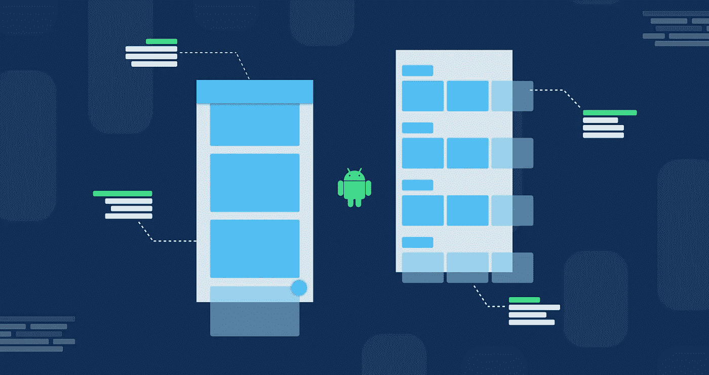
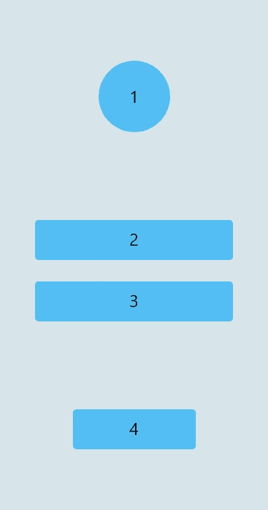
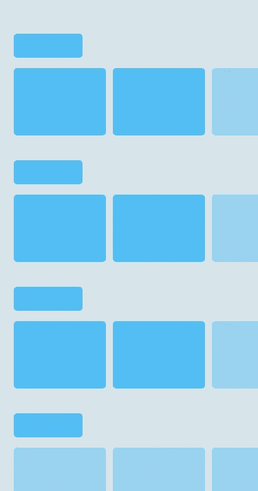
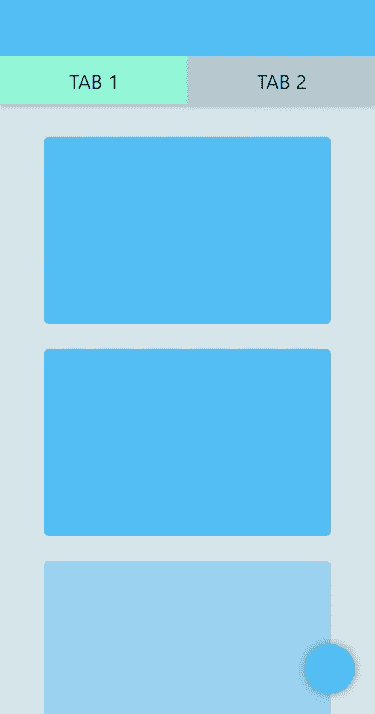
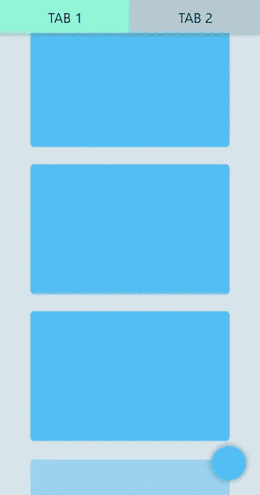
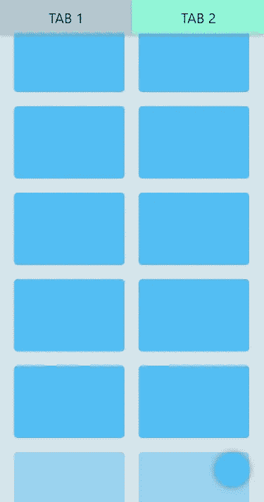

# 选择正确的 Android 布局

> 原文：<https://levelup.gitconnected.com/choosing-the-right-android-layout-8c35fe476b35>

## 三个用例来改进您选择正确布局的方法。

安杰洛·费拉的封面

为我们的应用程序 UI 选择正确的布局并不总是容易的。一个错误的*根布局*会导致一个复杂的层次结构，从而导致渲染阶段的低性能。

许多开发人员，尤其是初学者，经常会做出错误的选择，因为他们不知道不同布局的特点。

在这篇文章中，我想用一个小练习来挑战你。我们将一起分析 3 个屏幕，并想象实现它们的最佳方式。

对于每个屏幕，我会给你看一个简单的描述样机。你将提出你的假设，然后我将描述我认为的最佳解决方案。

# 注册

登录屏幕

让我们从一个简单的登录屏幕开始。一个 *ImageView* ，两个用于用户名和密码的 *EditText* ，以及一个提交*按钮*。

你会为这个*活动*选择哪种布局？花点时间思考，做出你的猜测，然后继续阅读。

几个选择。首先是用一个[*linear layout*](https://developer.android.com/reference/android/widget/LinearLayout)*搭配`android:layout_gravity="center”`。通过为视图 2、3 和 4 设置一个`margin_top`,我们将很容易得到想要的结果。*

*第二个选项是 [*相对布局*](https://developer.android.com/guide/topics/ui/layout/relative) 。视图 1 和 4 可以分别在其父视图的顶部和底部对齐。视图 2 和视图 3 应该居中，一个在另一个下面。*

*用[*constraint layout*](https://developer.android.com/training/constraint-layout)可以做同样的事情，在顶部(1)、底部(4)和中心(2 和 3)锚定视图。*

*这最后两个假设经过一些调整将会导致预期的结果。然而，在我看来，最简单、最干净的解决方案是第一种，LinearLayout。*

# *目录*

**

*目录屏幕*

*目录的典型例子。几类元素，每一类都有一个可水平滚动的列表。很像网飞和亚马逊的应用程序。*

*你会为这个活动选择哪种布局？像以前一样，花一点时间思考，做出你的假设，然后继续阅读。*

*首先要注意的是垂直滚动条。这就指引我们选择了一个[*nested scroll view*](https://developer.android.com/reference/android/support/v4/widget/NestedScrollView.html)*作为根布局。由于 NestedScrollView 只能有一个直接子视图，我们需要选择使用哪个视图组。**

**子视图在一列中垂直组织，所以最好的选择是不同类别之间留有空白的 LinearLayout。**

**使用 RelativeLayout 或 CosntrainLayout 也可以获得相同的结果，但这一次，LinearLayout 似乎是最自然、最简洁的解决方案。**

**至于列表，有必要考虑在大多数情况下元素是动态加载的。因此，正确的选择应该是使用[*recycler view*](https://developer.android.com/reference/android/support/v7/widget/RecyclerView.html)*和[*LinearLayoutManager*](https://developer.android.com/reference/kotlin/androidx/recyclerview/widget/LinearLayoutManager)*来水平显示元素。****

***RecyclerView 是旧的 *ListView* 的优化版本，默认情况下是可滚动的，所以结果正是我们想要的。***

# **饲料**

************

**馈送选项卡 1 —馈送选项卡 1，向下滚动—馈送选项卡 2，向下滚动**

**想象这是一个类似 LinkedIn 的社交网络的主页。**

**顶部有一个*工具栏*，两个选项卡，底部有一个浮动按钮。在第一个选项卡中，一列中有一个元素列表。在第二个示例中，元素分为两列。请注意*滚动行为*:当您向下滚动以给主要内容留出空间时，工具栏会消失，而两个选项卡仍然固定在顶部。**

**花点时间想一想你会在这个活动中使用什么样的布局，然后继续读下去。**

**可以指导我们的细节当然是工具栏的滚动行为。这表明文档的根可能是什么，一个[*coordinator layout*](https://developer.android.com/reference/android/support/design/widget/CoordinatorLayout.html)。CoordinatorLayout 允许您指定与其子视图的行为和交互。**

**在这种情况下，我会选择一个带有工具栏的[*appbar layout*](https://developer.android.com/reference/com/google/android/material/appbar/AppBarLayout)*和一个[*tablayut*](https://developer.android.com/reference/com/google/android/material/tabs/TabLayout)。为了获得想要的行为，你只需要为工具栏设置`app:layout_scrollFlags="scroll|enterAlways"`。这样，CoordinatorLayout 将负责在向下滚动时隐藏工具栏，在向上滚动时显示工具栏。***

**对于主要内容，我会使用一个[*viewparager*](https://developer.android.com/reference/kotlin/androidx/viewpager/widget/ViewPager)*与两个 [*片段*](https://developer.android.com/guide/components/fragments) 。第一个片段将有一个带有 LinearLayoutManager 的 RecyclerView。对于第二个片段的 RecyclerView，最好的选择是一个有两列的[*GridLayoutManager*](https://developer.android.com/reference/kotlin/androidx/recyclerview/widget/GridLayoutManager)*。****

# ***外卖食品***

*   ****LinearLayout* 非常适合在单行或单列中显示视图。如果需要指定空间分布，可以将`layout_weights`添加到子视图中。***
*   **如果需要相对于兄弟视图或父视图定位视图，使用*相对布局*，或者更好的*约束布局*。**
*   ***CoordinatorLayout* 允许您指定与其子视图的行为和交互。**
*   **使用 *RecyclerView* 创建动态内容列表，注意布局管理器的选择。**
*   **尽量保持你的布局层次结构的扁平化。*你的层级越平，布局阶段完成的时间就越少*。**

**你会如何实现这些布局？你还想分析其他人吗？请在评论中让我知道`android:below`。**

**如果您喜欢这篇文章，您可能也会喜欢:**

** [## 我在两年的 Android 开发过程中学到的 7 个教训

### 我希望在开始 Android 开发时就知道的事情

medium.com](https://medium.com/better-programming/7-lessons-i-learned-in-two-years-of-android-development-5d06ee744082)**