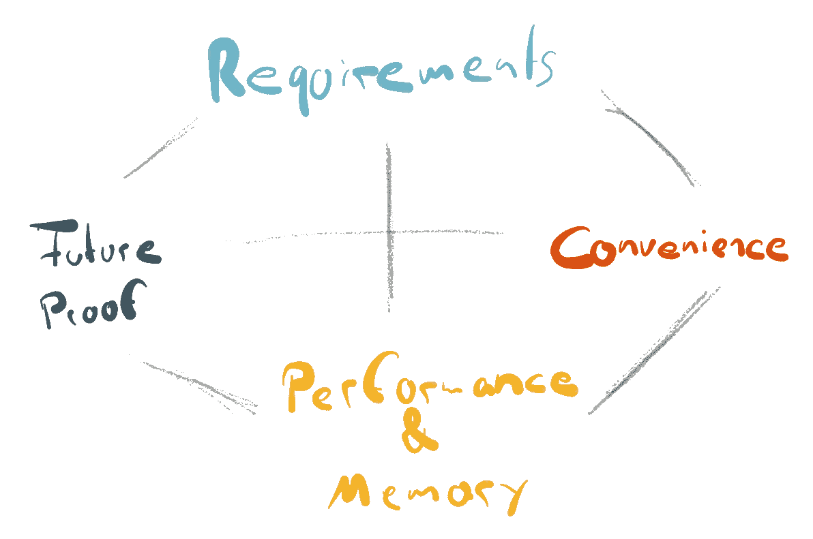

# 选择正确的数据类型

> 原文：<https://levelup.gitconnected.com/choosing-the-right-data-types-c28427e67f3b>

## 这不仅仅是关于需求的最佳匹配

照片由 [Siora 摄影](https://unsplash.com/@siora18?utm_source=unsplash&utm_medium=referral&utm_content=creditCopyText)在 [Unsplash](https://unsplash.com/s/photos/variety?utm_source=unsplash&utm_medium=referral&utm_content=creditCopyText) 上拍摄

每当我们创建一个新的数据结构时，我们必须决定使用哪种数据类型。通常，决定很简单:文本很可能会变成`String`，非浮点数会变成`int`，以此类推。

大多数时候，这些几乎是下意识做出的决定就足够了。但是为了设计经得起未来考验的数据结构，我们必须多考虑选择正确的数据类型。

# 选择正确的数据类型

尽管“ *right* 的定义非常主观，但正确的数据类型取决于 4 个不同的、相互关联的因素:

*   ***有哪些要求*** ？
*   是 ***防未来*** ？
*   提供了多少 ***便利*** ？
*   会影响 ***性能或者*** 内存消耗吗？

# “实际”需求

选择特定数据类型的主要原因始于*需求*。我们定义了自己想要什么和需要什么，并不得不做出相应的选择。

但是通常，需求太模糊，不能代表实际的需求。或者它们不符合技术现实。因此，第一步是找到“实际的”需求，并将它们转化为技术上的对应。

## 存储用户的年龄

我们想象的需求声明我们需要用户在注册时的年龄。根据目标受众的不同，我们需要 1 到 3 位数来存储这些信息。

或者我们想要实际年龄，而不仅仅是数据输入时捕获的年龄？需要一个额外的数字来保存出生年份。

或者，我们可能还想更确切地说，祝贺他们的生日？现在我们应该使用基于日期的数据类型，而不是数字类型。

如果需求太模糊，许多用例最初是看不到的。数据通常可以用不同精度的不同数据类型来表示。这就是为什么将不精确或模糊的需求转化为它们的技术对应物是至关重要的

但这并不意味着我们应该总是存储尽可能多的信息，没有一个好的理由。永远记住 [*数据回避和最小化*](https://gdpr-info.eu/art-5-gdpr/) 的原理。

## 复合值和冗余

`boolean`数据类型通常是一种非常明显的数据类型，看起来很合适，但光靠它自己是不够的。

想象一个内容管理系统(CMS)。内容可能在某一天被删除，我们希望存储删除日期。一个简单的方法是添加一个`boolean`来指示文档被删除，并添加另一个`datetime`来存储删除日期。

这就是我所说的*复合值*。它们本身就有意义，但它们是相互联系的，以代表我们想要表达的实际状态。这种设计会导致多种一致性问题:

*   `deleted == true && timeDeleted == null`
    数据明明删除了，可是什么时候？
*   `deleted == false && timeDeleted != null`
    是删除了吗？还是被还原了？删除时间代表什么？

需要额外的验证和逻辑来确保两个值之间的一致性，这可能会引入比*所需的*更多的错误。如果我们想存储所有可能的不同状态，我们需要添加更多的值，需要更多的逻辑和验证。

与其使用*复合值*来表示删除状态，为什么不选择一个单一的数据类型，比如`datetime`呢？

这样，我们就有了和以前一样的信息。而且我们还消除了`boolean`和互连导致的任何不一致问题。

如果可以，我们应该避免互连类型，因为它会导致值之间的粘连。数据本身应该是一致的，我们需要确保它的逻辑和验证越少越好。

# 经得起未来考验的

照片由 [Aron 视觉效果](https://unsplash.com/@aronvisuals?utm_source=unsplash&utm_medium=referral&utm_content=creditCopyText)在 [Unsplash](https://unsplash.com/s/photos/time?utm_source=unsplash&utm_medium=referral&utm_content=creditCopyText) 上拍摄

在找到我们的数据类型的实际技术需求后，我们应该考虑它的*持久性*。

随着时间的推移，没有多少需求会保持不变，从可扩展类型开始比以后完全替换它更容易。

## 时间的尽头

[*Unix 时间*](https://en.wikipedia.org/wiki/Unix_time) 是(至少事后看来)选择非未来数据类型的一个例子。在 2038 年，1 月 19 日星期二，03:14:07，32 位整数将溢出。时间戳将变为负值，程序可能会将下一秒解释为 1901 年 12 月 13 日星期五的 20:45:52。

虽然，在 [*Unix 时间*](https://en.wikipedia.org/wiki/Unix_time) 的情况下，这很可能不是一个疏忽。找到另一个解决方案的时间框架是未来的 68 年。在过去，位是非常珍贵的，所以更小的数据类型非常有意义，本质上也不是一个错误的决定。

## 单身状态不会持续太久

我们想象中的 CMS 现在需要管理员用户。为了满足技术需求，我们可以添加一个`boolean`来表示用户是管理员。但这在未来很可能会成为一个问题。

如果我们需要另一种类型的用户，例如一个*编辑*该怎么办？我们可以只添加另一个`boolean`字段。并更改所有处理用户类型的代码。

相反，我们应该选择一种信息密度大于 T2 的数据类型。通过使用代表不同用户类型的`enum`，我们仍然只需要处理一个值。但是它可以描述各种状态，并且如果需要的话可以很容易地扩展。如果我们同时需要多个状态，我们可以依靠一些`OptionSet` ( [Swift](https://developer.apple.com/documentation/swift/optionset) )、`EnumSet` ( [Java](https://eddmann.com/posts/using-bit-flags-and-enumsets-in-java/) )或者普通的[位操作](https://en.wikipedia.org/wiki/Bitwise_operation)来实现我们的目标。

 [## 不要使用布尔参数，使用枚举

### 在代码中避免标志值的情况

medium.com](https://medium.com/better-programming/dont-use-boolean-arguments-use-enums-c7cd7ab1876a) 

# 便利

并非所有数据类型都是平等的。有些用起来更方便，有些则不然。这可能是从技术的角度，或者仅仅是我们对不同数据类型的个人经验。

## 如何(不)保存日期

很久以前，我在做一个小项目，根据日期显示“[日本时代名称](https://en.wikipedia.org/wiki/Japanese_era_name)”。我决定将两个日期编码成一个 32 位整数，并用[位操作](https://en.wikipedia.org/wiki/Bitwise_operation)提取值，而不是将一个时代的开始和结束保存在不同的字段中。

这是一种非常有效的方法，至少在比特数方面是如此。但是我必须引入一个抽象层来处理实际值。数据库中的数据不是人类可读的，这使得调试变得复杂。

使用`date`值而不是单个`integer`值会是一个更好的决定。那会让我多花点钱。但是产生的开销引入了 bug，使得代码比实际需要的更难推理。

## 使用颜色

这样的例子几乎可以找到任何一种价值。

存储 [RGB](https://en.wikipedia.org/wiki/RGB_color_model) 值在技术上需要 256 个不同的值。它适合 8 位，或 1 字节，像`(unsigned) char`。

但是使用一个`integer`可能是一个更好的解决方案，因为将一个数值与一个`char`相关联可能不是首先想到的事情。此外，一些编程语言不会隐式转换值，这使得代码*更加嘈杂。我们无论如何都应该验证这些值，所以为什么不使用比`char`更数字的*数据类型呢。**

# *性能影响和内存消耗*

**

*照片由 [Jonas Svidras](https://unsplash.com/@jonassvidras?utm_source=unsplash&utm_medium=referral&utm_content=creditCopyText) 在 [Unsplash](https://unsplash.com/s/photos/processor?utm_source=unsplash&utm_medium=referral&utm_content=creditCopyText) 上拍摄*

*到目前为止，我忽略的一个方面是对性能和内存需求的影响。*

*今天的计算机系统有大量的内存和 CPU 周期。但它们仍然不是免费的，而且供应有限。我们通常不会花太多时间考虑特定的数据类型会对性能产生什么影响，而且大多数时候，这实际上并没有多大关系。*

*有些情况下，每一位都很重要，但并不是所有人都要处理“高频交易”或嵌入式软件开发的硬件限制等问题。*

*仅仅因为性能原因而选择数据类型实际上是[过早的优化](http://wiki.c2.com/?PrematureOptimization)，应该避免。这并不意味着我们可以忽略数据类型在内存消耗和性能需求方面的差异。但是我们需要明白什么时候重要，什么时候不重要。*

## *铅字铸造*

*Java 有 [*原语包装类型*](https://docs.oracle.com/javase/tutorial/java/data/autoboxing.html) ，所以原语可以用在只允许*对象类型*的地方，例如泛型。它们可以互换，并将隐式转换为相应的类型:*

*编译器将进行变量转换的实际工作。这确实很方便，但也给我们的代码带来了不可见的开销。*

*如果编译器由于优化而无法移除类型强制转换，则实际类型强制转换会转化为 3 个[操作码](https://en.wikipedia.org/wiki/Java_bytecode_instruction_listings)。*

**Java 虚拟机(JVM)* 有许多针对不同原语类型的优化的[操作码](https://en.wikipedia.org/wiki/Java_bytecode_instruction_listings)，以减少开销。但是并不是所有的基本类型都有相同种类的操作码。`integer`处理比`char`有更多的[操作码](https://en.wikipedia.org/wiki/Java_bytecode_instruction_listings)。而`boolean`类型在 [*JVM 规格*](https://docs.oracle.com/javase/specs/jvms/se7/html/jvms-2.html#jvms-2.3.4) 中也只是模糊定义。*

## *了解您的运行时*

*理论上，一个`boolean`只需要一个比特来表示它的当前值。但这并不是许多计算机体系结构的工作原理。实际上，在大多数情况下，`[byte](https://en.wikipedia.org/wiki/Byte)`是最小的可寻址内存量。*

*在这种行为之上的是我们的运行时如何在内部处理内存。例如， *Java 虚拟机*使用 32 位插槽，因此与`integer`相比，任何更小的数据类型都可能导致损失。不管怎样，它都会被存储在一个`[byte](https://en.wikipedia.org/wiki/Byte)`中。*

# *结论*

*要下意识地选择*右*数据类型，我们需要有知识和经验，究竟什么是*右*。这是非常主观的，但是我们仍然可以努力达到最好的结果。*

*即使所需的范围可能小到足以适合一种数据类型，我们也需要考虑如何在代码中处理它。创建值时的*右*数据类型可能不是稍后将如何使用的*右*数据类型。而且每次强制转换都会增加额外的开销。任何额外的逻辑都可能引入错误。*

*性能和内存影响是一个值得关注的问题，但如果不是绝对必要的话，不应该成为我们决策的主要驱动因素。特定的运行时如何将内存映射到不同的数据类型取决于实际的[实现](/the-jdk-ecosystem-adeaec20b3a9)、底层硬件(x86 与 x64)等。所以它总是对我们环境的记忆设计有所帮助。*