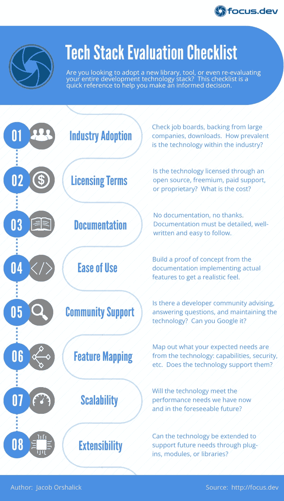

# 第一次选择正确的技术组合

> 原文：<https://levelup.gitconnected.com/choosing-the-right-tech-stack-the-first-time-281856e372db>

## 这里有一个评估清单，可以帮助您确保在更改开发技术、向堆栈中添加新工具或从头开始时做出正确的决定。

凯文·卡纳斯在 [Unsplash](https://unsplash.com/s/photos/developer?utm_source=unsplash&utm_medium=referral&utm_content=creditCopyText) 上的照片

我们每天都在阅读新技术，从工具到库，再到完整的开发栈。一项技术可能会引起我们的兴趣，但在我们考虑采用之前，需要进行真正的评估。

我曾就技术堆栈评估和最终迁移咨询过许多组织。每个组织的头号遗憾是没有花时间真正评估和审查他们选择的技术堆栈。花时间预先回答一些问题将有助于确定未来的限制。

这就是这个清单的目的。通过遵循清单，您可以对您的技术选择做出明智的决定。在本文中，我将向您展示如何使用我的清单来评估一项技术，甚至比较竞争技术。

# 介绍

技术采用清单分为 8 类。每个类别代表将要执行的评估的一个方面。您可以在下面找到每个类别的快速摘要。如果您想要一份可打印的 PDF 清单，您可以在此下载:

[技术堆栈评估清单下载](https://focus.dev/choosing-a-tech-stack-evaluation-checklist-cheatsheet-download)

一旦我们完成了对一个类别的评估，我们就给它一个评级。这个评级应该对你和你的团队有意义。这是您确定一个类别是否符合您的组织标准的方式。

评级可以是通过/失败，从 1 到 10 的数字，许多星星，实际上是你选择的任何东西。关键是确定什么对你的组织来说是可接受的，并围绕它定义你的标准。

例如，如果开发的应用程序仅供内部使用，并且我们有最低的性能要求，那么可伸缩性可能不是一个问题。您仍然应该查看性能和可伸缩性指标，以确保您理解结果，但是您可能只是对该类别有一个较低的及格线/权重。

如果您正在比较多种竞争技术，您的评级为您提供了一个衡量标准。如果您只是决定是否将新技术引入现有堆栈，您的评级可以帮助您决定是否值得。

现在，让我们看看类别和我们应该问的问题。

# 1.行业采用

确定该技术在行业中的应用有多广泛。采用利基技术会带来风险，尤其是如果您的开发团队将在未来几年使用它。行业采用的缺乏影响了列表中的所有其他类别。

例如，有限的采用可能会导致最初的开发者失去兴趣并放弃该项目。这意味着当发现错误时，您的团队可能最终不得不解决甚至修复错误。

**需要回答的关键问题:**

*   谁开发了这项技术，他们还在使用它吗？
*   有哪些财富 500 强公司采用了该技术？
*   你能获得每周/每月的下载数据吗(例如 npmjs.org[)？](http://npmjs.org)
*   你能在流行的求职网站上找到多少引用该技术的职位(例如 indeed.com)？
*   采用趋势是什么？是继续增加、停滞还是减少？
*   该技术是否会在会议上展示？

# 2.许可条款

许可条款决定了您现在和将来如何使用该技术以及成本预期。一些公司更喜欢开源，因为如果支持公司消失，风险会更小。

其他人更喜欢专有技术，因为它们可以在出现问题时确保支持。开源的付费支持模式介于两者之间。你的团队必须决定什么对你来说是重要的。

**需要回答的关键问题:**

*   产品是通过开源、带付费支持的开源、免费增值还是专有模式获得许可的？
*   使用该软件的相关成本是多少？我们付出了什么，得到了什么？
*   如果是专有的，谁是后盾公司，他们有多稳定？他们的市场份额是多少？
*   如果开源，条款是什么？许可会在哪些方面影响我们对软件的使用？

# 3.证明文件

没有文件，没有谢谢。详细和精心编写的文档是必须的。缺少文档在最好的情况下会导致更慢的开发，在最坏的情况下最终需要放弃该技术。敏捷宣言中最容易被误解的一句话是:

> *综合文档之上的工作软件。*
> 
> [*敏捷宣言*](http://agilemanifesto.org)

这句话只是说工作软件比文档更有价值。这绝不意味着文档是不必要的。事实上，它对大多数开发技术的可用性至关重要。

**需要回答的关键问题:**

*   该技术是否包含详细的用户指南？
*   用户指南是否涵盖重要主题(例如安装、核心功能、使用示例)？
*   文档的格式是否良好，是否用清晰易懂的语言编写？
*   在文档中找到您要寻找的主题容易吗？
*   文档是否包括截图和/或代码片段以及文本？

# 4.易用性

证据就在布丁里。文档可能看起来很棒，但是直到你用一种技术实际构建了一些东西，才可能真正衡量易用性。开发团队应该从实现实际功能的文档中构建概念证明。

这是获得该技术如何应用于您的特定需求的真实感受的唯一方法。特定技术的易用性完全取决于团队的经验。例如，拥有丰富 JavaScript 经验的团队会发现采用 NodeJS 这样的技术比只有 Java 经验的团队容易得多。

记住易用性会影响你的开发速度和上市时间。知道了这一点，花足够的时间来了解这项技术以及它将如何影响你的团队是很重要的。

**需要回答的关键问题:**

*   这项技术真的能帮助你解决问题吗？
*   启动并运行一个东西需要多长时间？
*   将该技术应用于您的特定用例需要多大程度的调整？
*   这项技术与您的团队过去使用的技术之间有什么知识差距？这不一定是缺点，只是需要注意的一点。
*   一路上你有没有遇到什么障碍需要克服？

# 5.社区支持

社区支持对于开源技术尤其重要。即使是专有技术也受益于大型开发人员社区，因为在网上快速找到答案要方便得多。

Google 和 StackOverflow 是开发者最好的朋友。一个开发社区在在线论坛和 StackOverflow 上回答问题。他们在 GitHub 和博客上提供了示例解决方案。对于开源项目，社区甚至提交补丁，实现新特性，并驱动产品的未来方向。

记住，开发人员花在寻找常见用例的解决方案或解决错误上的时间越长，他们开发的功能就越少。

**需要回答的关键问题:**

*   产品在 Google 和 StackOverflow 的存在感如何？
*   对该技术的搜索会返回大量高质量的结果吗？
*   开发者在博客或 GitHub 上在线提供工作实例吗？
*   有没有专门的论坛来回答关于这项技术的问题？
*   对于开源项目，是否有一大群开发人员为项目做贡献？

# 6.特征映射

您应该很清楚自己需要从这项技术中获得什么。创建一个列表，列出你现在和在可预见的将来需要的特性。您的特性需求可能是特定的功能、特定的架构、安全需求、支持的编程语言……这取决于您和您的团队来决定您计划从一项技术中获得什么样的特性。

一旦你有了这些，确定技术中的支持特性，清楚地描绘出它是否满足需求以及如何满足需求。如果找不到所需的特性，可以查看一下**可扩展性**(见下文)。也许可以找到一个插件、模块或扩展来满足需求。

**需要回答的关键问题:**

*   您希望该技术支持哪些功能？考虑功能、安全性、架构等。
*   该技术如何支持您所需的功能？
*   是否存在差距，是否可以通过可扩展性来弥补？

# 7.性能和可扩展性

我们选择的技术必须能够适应系统需求的增长和用户群的扩大。如果我们最终遇到性能障碍，我们可能会面临技术迁移。

我们只能预测不久的将来会发生什么，甚至这也是有疑问的。但是，在这里最好谨慎行事。根据经验，出于评估目的，我倾向于将我们认为的未来性能需求提高 10 倍。

**需要回答的关键问题:**

*   您的预期用户群和/或您的使用环境有多大？
*   其他人是否掌握了关于该技术的任何性能指标？
*   哪些公司正在使用该技术，它们的使用环境是什么？
*   你能开发压力测试来确认你的性能需求吗？

# 8.展开性

最后，但同样重要的是可扩展性。在选择工具或技术堆栈时，衡量扩展技术以满足您的需求的难易程度尤为重要。扩展可以通过插件、模块、库或配置来实现。

社区支持也是技术可扩展性的一个因素。强大的开发人员社区将倾向于创建公共可用的库，提供与其他技术的集成并简化开发任务。

**需要回答的关键问题:**

*   该技术如何扩展？它有插件、模块或库系统吗？
*   开发社区正在积极地为技术创建扩展吗？
*   如果需要，构建自己的扩展有多容易？

# 结论

我们不可能知道未来会发生什么，但这并不意味着我们不应该为此做计划。即使我们不得不做一些假设，在采用之前简单地花时间评估一个技术选择可以避免很多问题。通过遵循此指南，您可以做出更明智的选择，并避免以后的迁移。

了解更多信息:

*   [选择技术堆栈—评估清单下载](http://choosing-a-tech-stack-evaluation-checklist-cheatsheet-download/)
*   [推动团队采用新技术](https://focus.dev/driving-new-technology-adoption-within-your-team/)
*   [阻碍您发展的 6 个症状](https://focus.dev/6-symptoms-your-technology-stack-is-holding-you-back/)

*原载于 2022 年 12 月 7 日*[*https://focus . dev*](https://focus.dev/choosing-the-right-tech-stack-the-first-time/)*。*