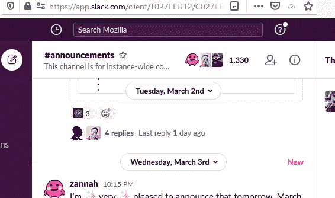
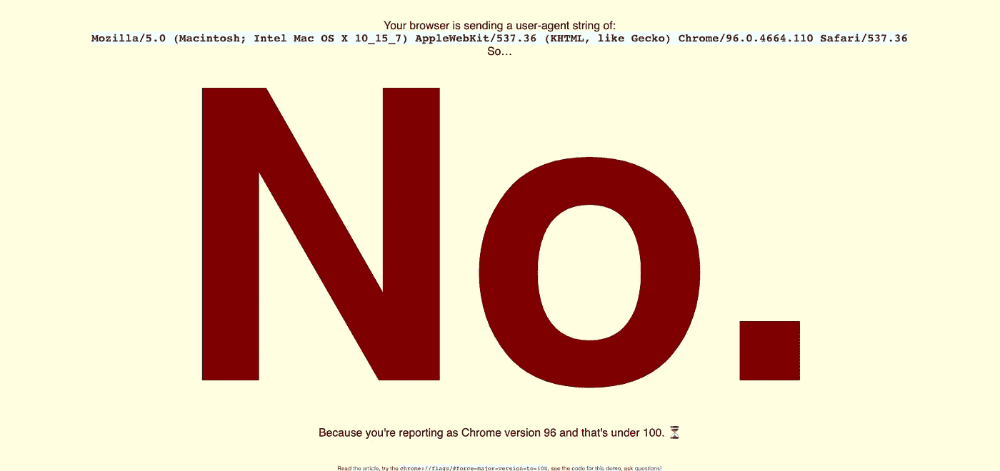
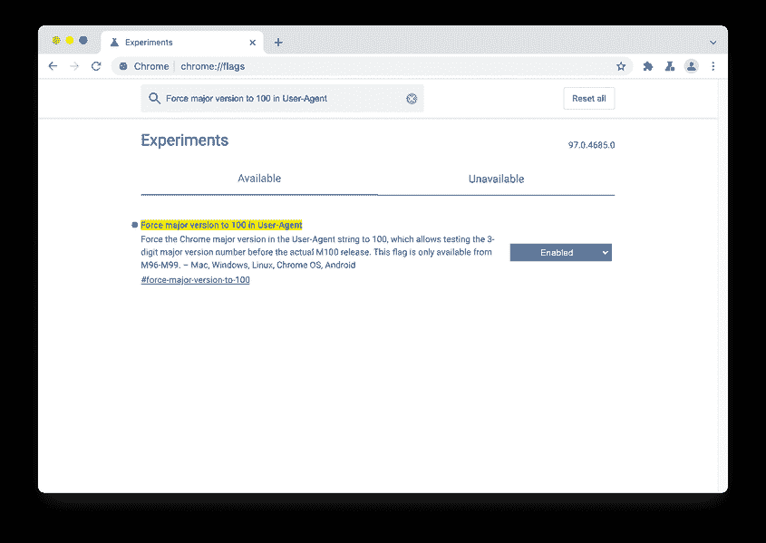

# 2022 年，用户代理字符串达到 3 位数，可能会让一些网站崩溃

> 原文：<https://levelup.gitconnected.com/chrome-100-blocks-websites-access-1e78aa4c48bd>

## [Chrome，](https://rakiabensassi.medium.com/list/software-engineering-7a179a23ebfd)Bug， [Web 开发](https://rakiabensassi.medium.com/list/software-engineering-7a179a23ebfd)

## 虽然 Chrome 100 将在几个月后发布，但并非所有网站套件都与三位数版本号兼容


原始图片来自 [pixabay](https://pixabay.com/photos/man-headache-frustration-frustrated-5531026/) 和 [ZDNet](https://www.zdnet.de/88398292/internet-browser-ist-einfallstor-fuer-cyberangriffe/) (作者编辑)

网络是一台遗留下来的机器，可能会变得一团糟。它充满了历史，注定会重演。

如果你够老，你可能还记得千年虫(2000 年错误)，它是由计算机系统没有被设计成识别 1999 年以后的日期，并且没有为过渡到新千年做好准备这一事实引起的。那个错误使得 2000 年和 1900 年无法区分。

20 年后，Chrome 即将面临类似的问题。

2021 年，谷歌将其网络浏览器的发布周期从六周缩短至四周。有了这个新日历，我们预计在 2022 年 3 月看到 Chrome 100。

然而，各种内容管理系统(CMS)和网站构建套件，如[杜达](https://www.duda.co/)，在通过**用户代理字符串**确定请求浏览器的安装版本时，并没有设置为三位数版本号。

因此，Chrome 版本可能会给相当多的网站带来问题，谷歌已经承认这是 Chromium Bug 追踪器的一部分。[火狐也将在 2022 年 4 月左右达到版本 100](https://wiki.mozilla.org/Release_Management/Calendar) 。

```
**Table of Contents**[The Difference Between a User Agent and a Browser](#0cfd)[What’s a User Agent String?](#4d55)[Why Browsers' Version 100 Is Problematic?](#7301)[An Old Drama Reissued](#3832)
[Looking for a Solution](#8a03)
```

# 用户代理和浏览器的区别

用户代理(UA)可以是 web 浏览器、电子邮件阅读器(如 Mozilla Thunderbird)、下载管理器、抓取 web 内容的[机器人](https://javascript.plainenglish.io/web-scraping-with-nodejs-and-javascript-10e6b4268be1)或其他访问 web 的计算机程序。

> 用户代理是检索、呈现和促进最终用户与 Web 内容交互的任何软件，或者其用户界面是使用 Web 技术实现的— [W3C](https://www.w3.org/WAI/UA/work/wiki/Definition_of_User_Agent)

通常，浏览器、垃圾邮件机器人和下载管理器对 UA 撒谎，并发送虚假的 UA 字符串，看起来像不同的客户端。我们把这种做法叫做 ***用户代理欺骗*** ，非常有用。

[Chris Peterson(来自 Mozilla)](https://miketaylr.com/posts/2021/03/firefox-version-520-works-in-slack.html) 举例来说，在使用一个伪造的 UA 字符串报告版本 100 上网后，发现了 bug[we b-bug 67866](https://github.com/webcompat/web-bugs/issues/67866)***菜单按钮在 Firefox 版本 100*** 中不起作用。



[来源](https://github.com/webcompat/web-bugs/issues/67866)

# 什么是用户代理字符串？

当浏览器向服务器发送一个请求时，它们包含一个被称为**用户代理字符串**的标识性`User-Agent` HTTP 头，它告诉服务器和网络对等点关于浏览器、其版本号和操作系统的信息。

web 浏览器的通用用户代理字符串格式为:

```
User-Agent: Mozilla/5.0 (<system-information>) <platform> (<platform-details>) <extensions>
```

下面是一个[用户代理字符串](https://developer.mozilla.org/en-US/docs/Web/HTTP/Headers/User-Agent)的例子，其中浏览器是 Chrome，其主要版本是`96`:

`"Mozilla/5.0 (Macintosh; Intel Mac OS X 10_15_7) AppleWebKit/537.36 (KHTML, like Gecko) **Chrome/96.0.4664.110** Safari/537.36"`。

你可以通过在 [DevTools](/how-to-use-tensorflow-js-without-memory-leaks-273ad16196be) 的控制台标签上输入`navigator.userAgent`来显示你的 Chrome 浏览器所使用的 UA 字符串，如下图所示:

从 Chrome DevTools 检查用户代理字符串

# 为什么浏览器的 100 版本有问题？

您可以通过使用`[NavigatorID.userAgent](https://developer.mozilla.org/en-US/docs/Web/API/Navigator/userAgent)`属性在 [JavaScript](https://betterprogramming.pub/javascript-history-and-future-71b0ceb737aa) 代码中访问用户代理字符串。

但是你自己写的或者从第三方库使用的检查浏览器版本的源代码可能会返回`null`或者更糟的是，`10`而不是`100`:

检查用户代理字符串中的浏览器版本

如果 JavaScript 代码将版本号作为`string`而不是`integer`进行比较，您可能会得到错误的结果，如下例所示:

将浏览器版本作为字符串而不是整数进行检查

上述 bug“***菜单按钮在 Firefox 版本 100****中不起作用的原因，其实是把版本号比作[这个巨型缩小脚本](https://a.slack-edge.com/bv1-9/client-boot-imports.326b89f.min.js)中的`string`。由于字符串`"100”`小于`"52”`，结果与预期不同:*

*在 JavaScript 中将浏览器版本作为字符串而不是数字进行比较*

# *重新发行的旧戏剧*

*很久以前，当第一批浏览器在到达版本`10`后从一位数版本号切换到两位数版本号时，网络经历了类似的困难。你可以在这里查看[戏曲](https://maqentaer.com/devopera-static-backup/http/dev.opera.com/articles/view/opera-ua-string-changes/index.html) `[10](https://maqentaer.com/devopera-static-backup/http/dev.opera.com/articles/view/opera-ua-string-changes/index.html)` [戏曲](https://maqentaer.com/devopera-static-backup/http/dev.opera.com/articles/view/opera-ua-string-changes/index.html)。*

*但好消息是，谷歌意识到了这个问题，并在早期阶段就为三位数版本号的潜在问题做好了准备，并创造了一个在 Chrome 96 预览版中测试它们的机会。*

**

*通过用户代理字符串进行浏览器版本检查的结果([源](https://is-chrome-100-yet.glitch.me/))*

*借助 Canary Release 96，web 开发人员可以通过使用一个标志来激活一个 100 用户代理。为此，您需要转到`chrome://flags`设置并启用`#force-major-version-to-100`标志:*

**

*Chrome Canary:启用`#force-major-version-to-100`标志来激活 100 用户代理([来源](https://developer.chrome.com/blog/force-major-version-to-100/))*

*然而，从那以后进行的测试和通过 Web Compat 收集的错误报告表明，Chrome 100 将会给全球许多网站带来问题，因为读取浏览器的用户代理字符串只与版本号的前两位有关。*

*如果代码未能正确解析三位数版本号，并为 Chrome 100 返回`10`而不是`100`，后果可能是网站访问受阻。杜达自动屏蔽了 2015 年发布的版本 40 以下的所有 Chrome 版本，因为它们已经过时。*

# *寻找解决方案*

*虽然 Chrome 当前的正式版本是 96，但让开发者可以提前测试新功能的金丝雀版本将在明年 1 月左右切换到版本号 100。*

*至少对于遗留网站来说，升级的概率较低，谷歌想找到解决方案。*

*根据监控谷歌生态系统的网站 [9 到 5 Google](https://9to5google.com/2021/12/22/google-chrome-100-break-websites-solutions/) 的说法，作为备份计划，Chrome 将锁定前两位数字为`99`，并将实际版本号插入用户代理字符串的第二位数字序列:*

> ***将主要版本放在次要版本位置和用户代理中***
> 
> *将用户代理字符串中的 Chrome 主版本锁定为 99，并将主版本号强制设置为次版本号。此标志是针对意外 M100 中断的备用计划。*
> 
> **#强制从主要到次要**

*用这种方法，我们会得到“Chrome/99。 **100** .1234.56”而不是“Chrome/ **100** .0.1234.56”。*

*一个最佳的解决方案是检查网络上的所有网站，并确定那些会被 Chrome 100 破坏的网站。在这种情况下，谷歌团队可以联系网站的开发者，以便他们可以在 3 月份发布日期之前解决问题。*

# *想要更多吗？*

*我为一群聪明、好奇的🧠人写关于工程、技术和领导力的文章💡。 [**加入我的免费电子邮件简讯，获得独家访问**](https://rakiabensassi.substack.com/) 或在此[注册 Medium](https://rakiabensassi.medium.com/membership)，如果你还没有这样做。*

*[](https://betterprogramming.pub/system-thinking-in-software-development-9a7828303e95) [## 为什么软件开发人员需要采用系统思考者的思维方式

### 放下原始的编码技能去理解更大的图景

better 编程. pub](https://betterprogramming.pub/system-thinking-in-software-development-9a7828303e95) [](https://betterprogramming.pub/whats-the-hype-with-log4j-2de7a64f221) [## Log4j 有什么炒作之处

### 以下是你应该知道的关于 0 天漏洞 log4shell，最严重的网络安全漏洞之一，以及如何…

better 编程. pub](https://betterprogramming.pub/whats-the-hype-with-log4j-2de7a64f221)*