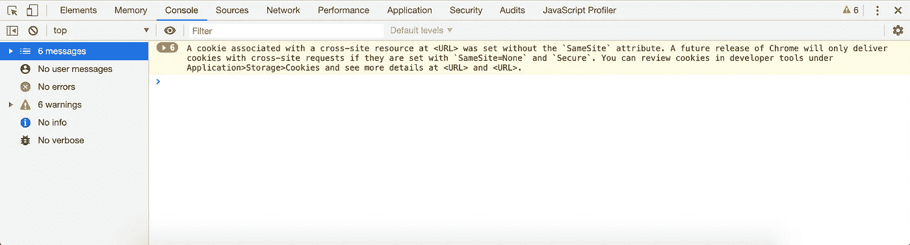
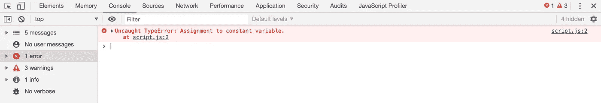
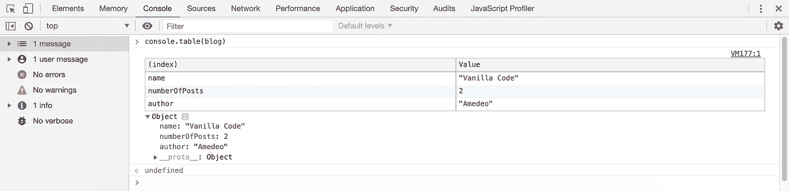
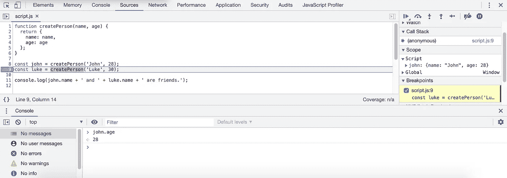

# Chrome DevTools:控制台

> 原文：<https://levelup.gitconnected.com/chrome-devtools-the-console-8c24c1cb92cb>

调试是编程最重要的事情之一。它允许开发人员一步一步地尝试他们的代码并分析应用程序的行为。通过这种方式，可以很容易地识别和修复错误。

但是它是如何工作的呢？嗯，所有的浏览器都包含针对开发者的特殊功能，它们被称为**开发者工具**。有了这个强大的工具，开发人员可以更好地控制他们的代码，最重要的是，他们有机会随时关注他们的应用程序的状态。

在这一系列文章中，我将重点介绍 Google Chrome **DevTools** 中的一些可用功能。请注意，其他浏览器也有类似的功能，甚至是 Internet Explorer。请记住，不同浏览器之间的情况可能略有不同，或者在某些情况下，甚至不存在差异。

# 访问开发人员工具

先说如何访问谷歌 Chrome 中的 DevTools。有几种方法可以做到这一点:

*   通过*查看*菜单，点击*开发者>开发者工具*
*   通过键盘快捷键，取决于您的操作系统:Mac 上的 *Options + Command + I* 或 Windows 或 Linux 上的 *F12*
*   通过上下文菜单，右击页面并选择*检查*

您应该会看到浏览器中打开了一个新区域:



Chrome DevTools 应该会在您的浏览器窗口中打开，并允许您访问保留的功能。

现在，您可以通过将光标移动到 DevTools 的边缘附近，或者单击右上角的三个垂直点并选择您喜欢的“*Dock side”*来调整该区域的大小和位置。

# 控制台选项卡

上图显示了 Chrome DevTools 的控制台标签。如您所见，它分为三个区域:

*   上面的栏中有一些有用的命令，例如过滤控制台消息的输入字段
*   您可以在左侧菜单中找到其他过滤器
*   控制台本身，神奇的事情发生了:你的网站打印的所有信息都显示在这里，你甚至可以输入代码并实时看到结果

您可能想知道这些消息是什么，答案很简单:它们可以是浏览器告诉您正在发生什么(主要是警告和错误消息)，也可以是开发人员决定打印出来的内容。由于它主要是一个调试工具，控制台中的消息应该只在开发或预生产环境中显示，除非有特殊要求。

# 消息类型

如前所述，有各种类型的控制台消息:错误、警告、信息、日志等等。错误和警告分别用红色和黄色背景和文本颜色突出显示，而所有其他的只是纯文本或更复杂结构的表示。

当相关事件发生时，浏览器本身会将消息打印到控制台。在这些错误中，您可以找到 JavaScript 执行错误和异常，但是也可以找到网络错误，比如失败的异步调用。

让我们举个例子，看看这段代码:

```
const name = "Vanilla";
name = "Vanilla Code";
```

在这两行中，我声明了一个由`name`标识的常数，我给了它一个字符串值，然后我试图改变这个值。这是一个无效操作，因为常量的值一旦设置就不能更改，这将产生一个错误:



错误消息通常有简短的描述。在这种情况下，它声明不允许为常数赋值。

如您所见，错误消息是描述性的，告诉您代码有什么问题。它还告诉您错误发生在哪个文件的哪一行:在本例中，错误发生在 *script.js* 的第 2 行。此外，单击文件名会将您重定向到 DevTools 的 *Sources* 选项卡。在这里，您还可以找到您的应用程序的所有 JavaScript。

**注意:** JavaScript 不是编译语言，它在客户端浏览器中执行。任何人都可以访问这些代码，因此极不鼓励将敏感信息放在 JavaScript 文件中。

# 自定义消息

在控制台中打印定制消息是很常见的，您可以使用`console`对象来完成。该对象提供的方法允许您记录任何类型的数据:从字符串到数字，还有数组和复杂对象。看一看:

```
const authorName = "Amedeo";
const blog = {
  name: "Vanilla Code",
  numberOfPosts: 2,
  author: authorName
};console.log(authorName);
console.info("The blog name is %s", blog.name);
```

在这段代码中，我声明了两个常量，并给它们赋值:`authorName`是一个字符串，而`blog`是一个包含三个属性的对象。然后，我用`console.log`和`console.info`的方法打印作者名和博客名。

另一种在开发和调试时非常方便的方法是`console.table`;它允许开发人员以表格形式打印结构化数据，如对象；



表格对于分析对象或数组的内容非常有用。

值得注意的是，就在桌子下面有一个`blog`对象的“打印”表示，这也是一个很好的探索其内部的功能。当使用`console.log`打印一个对象时，这种表示也是可用的。

最后，我想提一下另外两个方法:`console.error`和`console.warn`，用于定制错误和警告消息。如前所述，由于背景和文本颜色的原因，这些类型的消息会在控制台中非常突出。

您可能想使用许多其他的控制台方法。我不会在这里介绍它们，你应该已经有足够的东西可以玩了。然而，如果你的求知欲仍然存在，你可以在 [MDN 文档](https://developer.mozilla.org/docs/Web/API/Console)上阅读更多关于`console`对象的内容。

# 代码检查

控制台的另一个关键功能是，它允许开发人员在执行时检查代码并与之交互。在 DevTools *Sources* 选项卡中，您可以找到应用程序的所有源文件，并应用断点来暂停执行。通过这种方式，您将能够使用控制台来检查您的应用程序状态，打印出表达式和变量，更改这些变量的值，调用函数，等等。

这是一个非常重要的特性——没有它，调试是不可能的，并且修复 bug 会导致更多的痛苦。



您可以在第 9 行看到一个断点。当遇到断点时，代码执行暂停，允许开发人员检查代码并与之交互。

在上面的例子中，我定义了函数`createPerson`，并用它来创建两个对象，并将它们分配给变量`john`和`luke`。我在第 9 行设置了一个断点，就在`john`声明和赋值之后，然后我用控制台检查`john.age`的值。

您可以使用 DevTools 右上角的控件与代码执行进行交互:播放、暂停、单步执行等。

在网上你可以找到许多不同的 JavaScript 平台。使用它们并尝试 DevTools 控制台特性来提高您的技能。

我希望这些信息对你有用。请随时添加评论并开始讨论，我很乐意与您交谈！感谢您的阅读—下次见:)

异步调用是一种请求，用于以延迟方式获取位于服务器上的资源，这意味着当用户登录页面时，资源不可用

编译后的编程语言经过一个称为“编译”的过程，该过程输出另一种编程语言(通常是低级机器可读语言)的代码。JavaScript 是一种解释型语言，这意味着在执行过程中，它会动态地“翻译”成一种低级语言

断点是代码中用于暂停执行和分析应用程序状态的书签