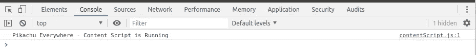
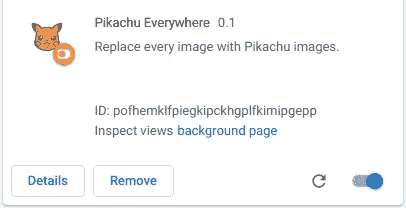

# Chrome 扩展教程—用皮卡丘替换任何网站中的图像

> 原文：<https://levelup.gitconnected.com/chrome-extension-tutorial-replace-images-in-any-website-with-pikachu-de2a6e3548bb>

有什么比用皮卡丘图片让网页更可爱更好的方法来学习如何制作 Chrome 扩展？

在本教程中，我将向您展示如何创建一个简单的 Chrome 扩展，用皮卡丘图片替换网站上的图片。我们将讨论 Chrome 扩展中的内容脚本、后台脚本和脚本间消息等主题。

本教程的代码可从[这里](https://github.com/shahednasser/pikachu-everywhere)获得。

创建任何 chrome 扩展时，你需要做的第一件事就是在扩展目录的根目录下创建一个 **manifest.json** 文件。目前，该文件将只保存关于您的扩展的以下基本信息:

以下是该文件中所有内容的含义:

1.  **名称:**分机的名称。我将这个扩展命名为“无处不在的皮卡丘”
2.  **版本**:这是扩展的版本。当你在 Chrome 网络商店发布扩展并需要更新时，你必须增加版本号，所以最好从低版本号开始。
3.  **描述:(可选)**对您的扩展的描述
4.  **manifest_version** :从 Chrome 18 开始，开发者被要求使用清单版本 2，因为清单版本 1 现在已经被弃用。
5.  **图标:(可选)**这里我们指定扩展的图标。这个图标会出现在你浏览器的工具栏，Chrome 网上商店，以及任何其他需要显示它的地方。因此，包含不同大小的图标是有好处的。我使用了[免费图标 PNG](https://www.freeiconspng.com/img/17360) 中的一个图标，并使用[https://resizeimage.net/](https://resizeimage.net/)调整了图标的大小(你可以在 [GitHub 库](https://github.com/shahednasser/pikachu-everywhere)中找到图片)。为这些图像指定的路径是相对于扩展的根的。

有了这个，我们就拥有了任何 Chrome 扩展的核心。接下来，我们将向浏览器添加扩展。

转到 chrome://extensions 。在那里，你可以在右上角切换开发者模式。一旦你这样做了，一个新的工具栏会出现，有三个按钮:“加载解包”、“打包扩展”和“更新”点击“Load unpacked ”,选择你的扩展目录。

一旦你这样做了，你会看到你的新的 chrome 扩展现在可以工作了。是的，它什么也没做，但是它在工作。

在 Chrome 扩展中，有两种类型的脚本可以使用。有后台脚本和内容脚本。后台脚本(显然)在后台运行。需要时加载，空闲时卸载。它们被用来监听你的 Chrome 扩展中的某些事件。

内容脚本是在您打开网站并将其注入网站后加载的脚本。一旦你打开一个网站，它们就会像网站上的其他脚本一样开始运行。关闭网站后，该网站上的内容脚本也将停止运行。

对于我们的扩展，我们希望用皮卡丘图像替换每个网站上的每个图像。为了做到这一点，我们需要指定一个内容脚本，它在每次打开网页时都有效。

让我们在`assets/js/contentScript.js`中创建我们的内容脚本，并包含以下脚本来测试我们的扩展是否工作:

我们需要做的另一件事是告诉 Chrome 我们需要运行哪个脚本作为内容脚本。将以下几行添加到 **manifest.json**

这里我们使用`content_scripts`作为键，值作为数组。数组中所有内容的含义如下:

1.  **匹配**:在这里你可以指定内容脚本应该在哪个 URL 上运行。在我们的例子中，我们希望我们的内容脚本在所有页面上运行。因此，我们使用占位符“< all_urls >”来指定。
2.  **all_frames** :该键用于允许扩展指定 JavaScript 和 CSS 文件是应该注入到所有符合指定 URL 要求的框架中，还是只注入到一个标签中最上面的框架中。
3.  js: 在这里，我们指定想要作为内容脚本运行的脚本。您可以指定多个脚本，因此值必须是一个数组

现在我们准备测试我们的内容脚本。

但在此之前，我们需要迈出一小步。为了通知 chrome 我们更新了 chrome 扩展，我们需要返回到 chrome://extensions，转到我们的扩展，然后按下 reload 图标。

要测试我们的内容脚本是否正常工作，请转到您想要的任何网页，重新加载该页面(如果它之前已经打开)，然后右键单击并按 Inspect。在 DevTools 中，打开控制台选项卡。您将在控制台中看到预期的内容:

网页的控制台

因此，我们可以验证我们的内容脚本正在工作。尝试重新加载页面，内容脚本将再次执行。尝试打开另一个网页，内容脚本将在该网页上独立执行。

现在，我们知道如何在任何网页上注入一个脚本，通过这个脚本我们可以完成我们的工作。

在我们的例子中，我们需要用随机的皮卡丘图片替换任何网站中的所有图片。为此，我们将使用[这个 API](https://some-random-api.ml/img/pikachu) ，它将为我们提供一个包含皮卡丘图片链接的 JSON 对象。对该 API 的每个请求看起来都像这样:

API 调用的结果

在这个 API 的帮助下，实现我们所需要的步骤如下:

1.  获取网页上的所有图像元素。
2.  对 API 执行 GET 请求以检索一个随机的皮卡丘图片链接。
3.  用我们检索的链接替换图像元素的属性。

这听起来很好也很容易，但是有一个复杂之处:Chrome 扩展中的内容脚本不能执行跨源请求。

那么我们如何从 API 中获取图片 URL 呢？我们将需要使用一个背景脚本。

正如我们之前所指出的，后台脚本在 Chrome 的后台运行。它们不依赖于任何网页。

Chrome 扩展中的脚本是相互隔离的。然而，它们通过 [Chrome API](https://developer.chrome.com/extensions/api_index) 共享一种通信方式。

我们要做的是，我们将监听从**内容**脚本发送的**背景**脚本中的消息。每当网页打开时，我们的内容脚本就会运行，向后台脚本发送一条请求图像 URL 的消息。然后，后台脚本将执行对 Pikachu API 的异步调用，检索链接并将其发送回内容脚本。

这一开始听起来可能很复杂，但实际上是以一种非常简单的方式完成的。

让我们首先从创建后台脚本开始，看看它的运行情况。用以下内容创建`assets/js/background.js`:

现在，我们需要告诉 Chrome，我们刚刚创建的文件将成为我们的后台脚本。为此，我们需要返回到我们的 **manifest.json** 并添加以下内容:

以下是一切的含义:

1.  **脚本:**一个数组，保存我们将用作后台脚本的脚本的路径。在我们的情况下，它只是一个。
2.  **persistent** :应该总是 false，除非扩展使用 Chrome 的 Web Request API 来阻止或修改网络请求。

现在，Chrome 将知道我们的后台脚本。它会在需要的时候加载，空闲的时候卸载。

为了测试我们的后台脚本，我们需要像前面一样重新加载我们的扩展。

一旦你这样做了，你会看到一个新的链接出现在你的扩展的信息框中，文本为“检查视图背景页”:

如果您单击它，将会打开一个新的 DevTool，在控制台中您会看到:

我们现在可以确认我们的后台脚本正在工作。即使您关闭任何其他网页或重新加载任何网页，后台脚本中也不会发生任何变化。

让我们再次回到我们的目标。我们现在需要在后台脚本中监听消息，并在收到新消息时从 Pikachu API 获取 URL。

为了监听消息，我们将在 Chrome 的 API 中使用以下方法:

我们需要传递一个函数给`addListener`。该功能将在收到任何新消息时执行。该函数有三个参数:

1.  **消息:**任意类型发送的消息。
2.  **发送方:[类型的](https://developer.chrome.com/extensions/runtime#type-MessageSender)**消息发送方
3.  **senderResponse:** 有响应时调用(最多一次)的回调函数。该函数由发送者在发送消息时发送。

这就是我们的 **background.js** 文件现在的样子:

现在我们的后台脚本已经准备好接收消息，但是没有消息被发送。

如前所述，每次页面打开时，我们的内容脚本将遍历网页中的图像元素，并向后台脚本发送消息以获取 Pikachu 图像链接。

为了发送消息，我们需要使用 Chrome API 中的以下方法:

正在发送的参数如下:

1.  **extensionId:(可选)**我们要向其发送消息的扩展的 Id。如果省略，消息将被发送到我们自己的分机。
2.  **消息:**我们正在发送的任何类型的消息。
3.  **选项:可选**
4.  **responseCallback:** 接收消息后调用的函数。这是我们之前看到的方法中的 **senderResponse** 参数。

因此，我们将在内容脚本中使用该方法向后台脚本发送一条消息，以从 API 获取 Pikachu URL。我们的内容脚本现在应该是这样的:

下面是我们在上面的代码中所做的事情:

1.  **第 1 行:**获取网页上的所有图片元素。
2.  **第 2–6 行:**遍历图像元素。对于每个元素，我们向后台脚本发送一条消息。正如你所看到的，我们省略了可选的 **extensionId** 和 **options** 参数。第一个参数是我们正在发送的**消息**，第二个参数是我们希望后台在获取图像链接后执行的回调函数。

我们正在将对象 **{msg: 'image '，index: i}** 发送到我们的扩展。这个对象有两个属性。第一个是指定我们的信息是关于什么的。在我们的扩展中，这可能不是很有帮助，但是当您的扩展使用不同类型的消息时，区分每条消息的用途是个好主意。第二个属性是指定链接在**图像**数组中的图像索引。这背后的原因是替换图像的回调函数将被异步调用，所以在它被执行时， **i** 可能指向另一个索引。

回调函数接收一个具有两个属性的对象。**数据**将是从 API 调用接收的数据，**索引**将是数组**图像**中图像的索引。一旦被调用，它会将**图像**中**索引**处的图像设置为**数据**的链接属性。

现在，每当内容脚本发送消息时，我们需要从后台脚本中的 API 获取数据。我们可以这样做:

事情是这样的:

1.  **线路 1:** 收听我们分机里的留言
2.  **第 2 行:**检查消息是否是获取图片 URL。这将使用我们在**内容脚本**中发送消息时传递的**消息**属性
3.  **第 3–8 行:**如果**第 2 行**中的条件为真，则从 API 中获取数据。在第一个`Promise`中，我们获取响应文本，然后在第二个`Promise`中，我们解析 JSON 对象并调用 **senderResponse** ，这是消息发送者指定的回调函数。我们用它传递一个带有参数**数据**(通过 API 调用接收的数据)和**索引**(发送者发送的图像的索引)的对象。
4.  **第 9 行:**对可能出现的任何错误的简单处理。
5.  **第 10 行**:如果发送方指定了一个回调函数，它必须在监听方停止执行之前被调用，否则将抛出一个错误。在我们的例子中，我们必须等到收到来自 API 的异步响应，所以我们返回 true 来指定它将被异步调用。

好了，我们的剧本准备好了。只剩下一件事——我们需要在我们的 **manifest.json:** 中给予 API 许可

你现在需要做的就是在 chrome://extensions 中重新加载扩展，然后打开任意页面，到处都能看到皮卡丘！

当然，这个扩展不会取代背景图片。这可以通过遍历元素，检查它们是否有背景图像，并以同样的方式替换它们来实现。