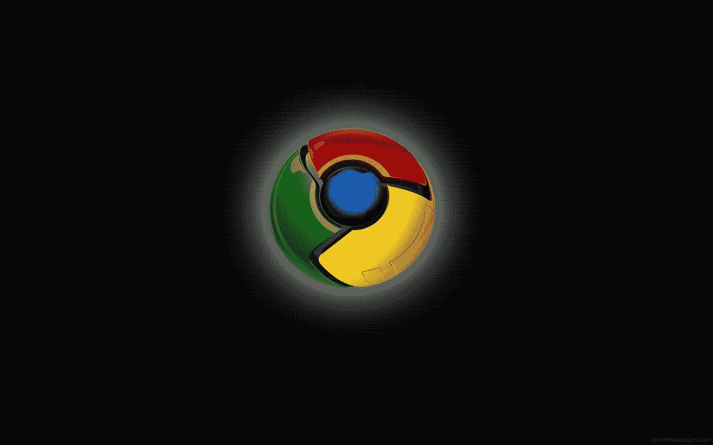
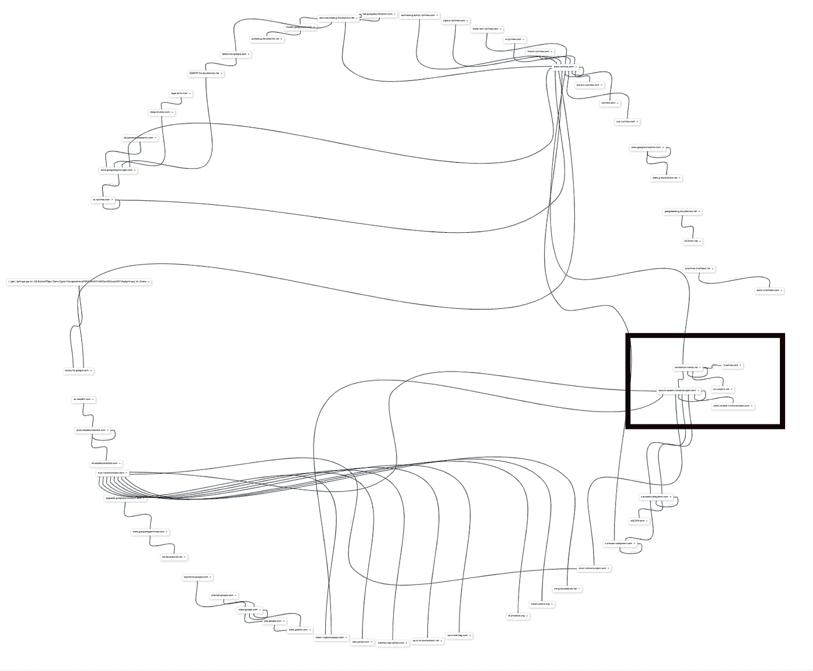
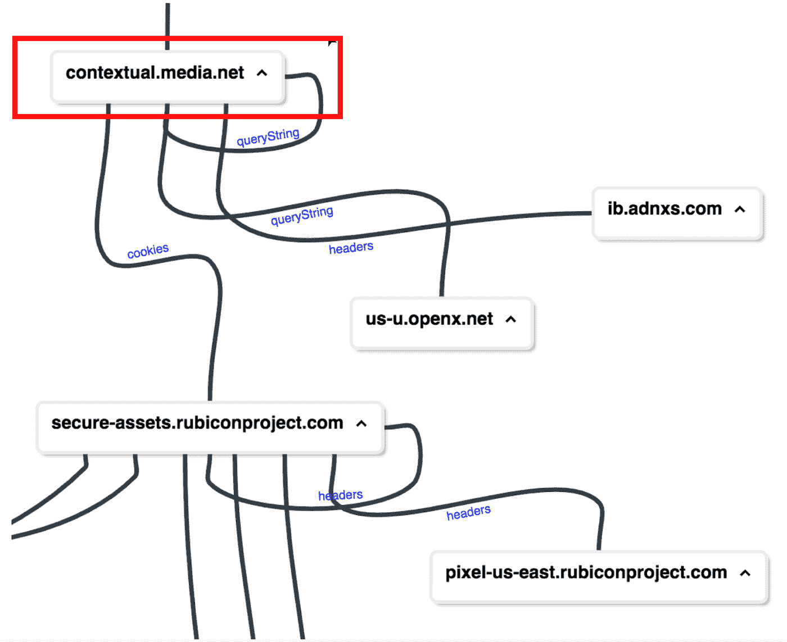
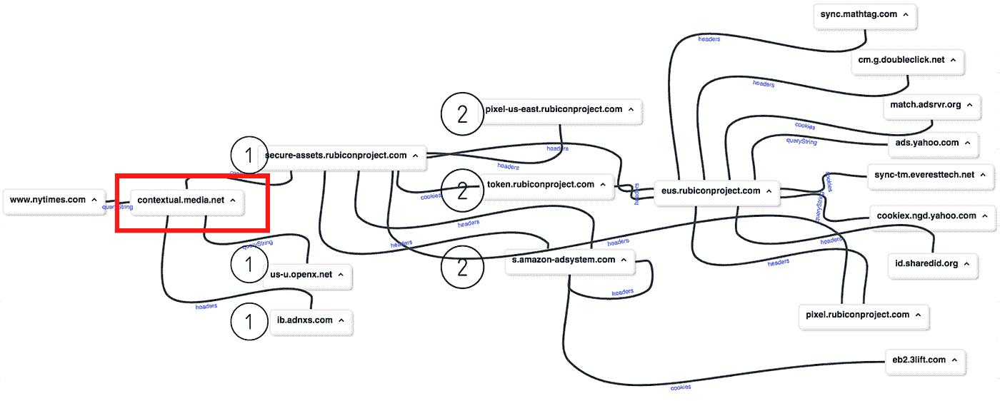
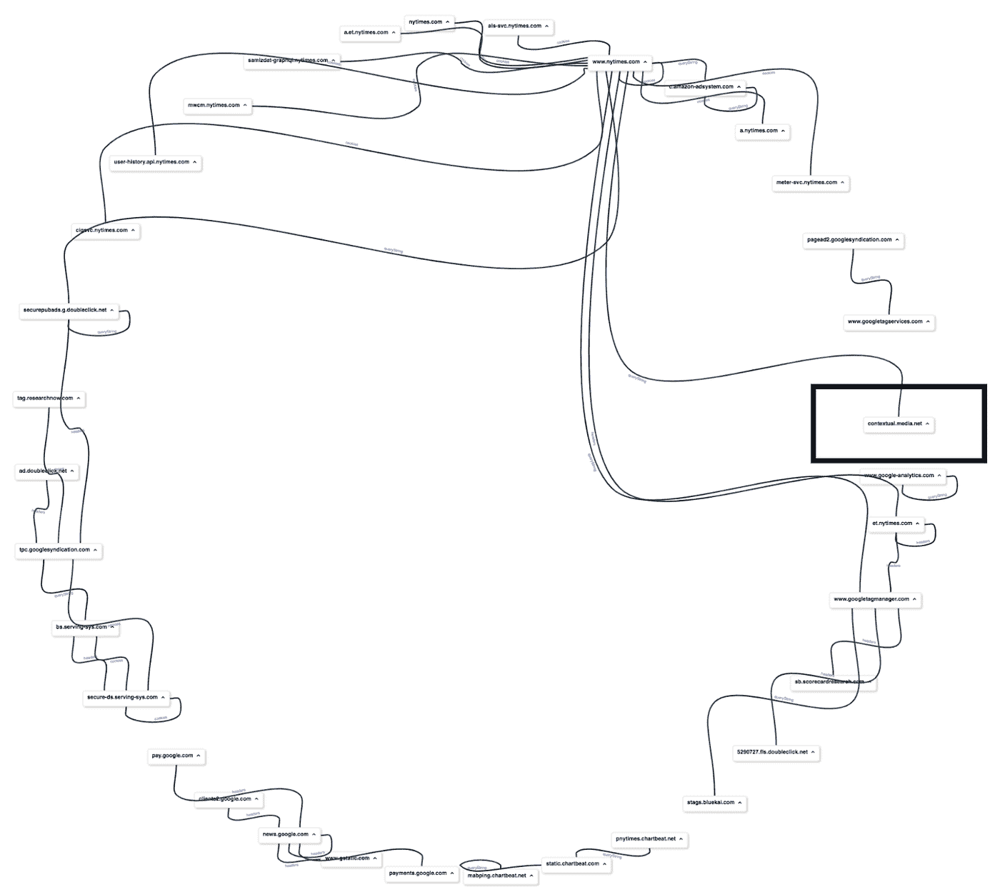
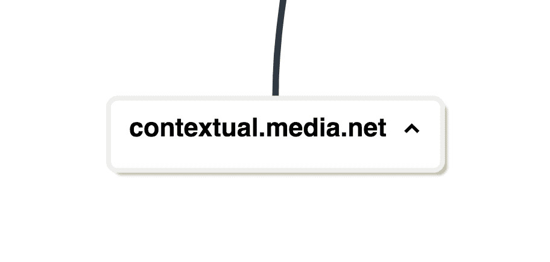

# Chrome SameSite 更新—数据流审计

> 原文：<https://levelup.gitconnected.com/chrome-samesite-update-data-loss-c0d1c47a085a>



**TLDR**；Chrome 正在对其浏览器进行更新，以加强所有第三方 cookies 的 SameSite 和安全值。依赖于没有这些值的第三方 cookies 的系统将不会在浏览器中设置，也不会随任何后续请求一起发送。下面是对[《纽约时报》](http://nytimes.com)的局部网络审计。我们强调了他们的一个广告合作伙伴和那些受影响的下游的系统数据丢失。该分析有些技术性，但鼓励至少看一看网络视觉效果。

## **同一地点**

[SameSite HTTP cookie 属性](https://tools.ietf.org/html/draft-ietf-httpbis-rfc6265bis-02#section-5.3.7)最初由 [HTTP 工作组于 2017 年 8 月 7 日](https://tools.ietf.org/html/draft-ietf-httpbis-rfc6265bis-02)提出，并计划于 2020 年 2 月由 Chrome 强制执行。浏览器更新的目的是加强 HTTP cookies 的相同站点限制和安全(TLS)属性。如果从不被视为第一方的请求 URL 发送的 cookie 没有这些属性，则该 cookie 将不会在浏览器中设置，也不会在任何将来的请求中发送。SameSite 实施也符合用户隐私保护计划，因为它防止不安全的第三方请求在页面上设置 cookies。由于 cookies 提供了在浏览器和网络中持久存储键/值的能力，所以用户信息通常被捆绑到请求数据中，并且很容易与客户机启动的任何服务器同步。

## **饼干示例**

```
**key**=value; Expires=Fri, 04 Dec 2020 19:46:10 GMT; domain=website.net; Path=/; HttpOnly; **SameSite**=None; **Secure**;
```

由于广告商提出的用户目标需求，第三方 cookie 同步在数字广告技术栈中特别普遍。在页面上显示广告之前，最终用户的个人资料首先与各种平台同步，以便广告商可以决定是否要向该用户提供广告。如果用户符合广告客户的目标要求，该广告客户将以支付其广告的投标价格来回应。这种数字广告拍卖系统被称为实时竞价(RTB)，2017 年，通过这种技术花费了 87.9 亿美元。

## **相同站点—网络分析**

下面描述的是 Chrome SameSite 审计的细节，在该审计中，由于一个错误的 cookie 而检测到大量数据丢失。审计是在**NYTIMES.com**进行的，这是一家排名前 100 的新闻网站，拥有相当现代的技术堆栈和程序化的数字广告。

在会话中，[](https://www.media.net/programmatic)**被发现是受相同站点更新影响的显著请求实体。Contextual.media.net 最初试图通过**访问者 id** cookie 同步，将其用户 ID 字符串与其他主要广告网络同步。一般来说，这是没问题的…但是 visitor-id cookie**缺少 SameSite** 属性，并且在更新生效后会有不同的行为。**

## ****审计详情****

**下面是由主机名分隔的网络请求的图像。**

****每个节点代表在会话中活动的唯一主机名，该主机名具有跨域共享的字符串值。连接节点的线表示每个主机名在会话中的启动资源。****

***网络视觉效果由 Nicholas Porter 开发的内部软件生成。***

*****注*** *:比较#1 数字(默认)和#2 数字(相同地点/安全)。***

# **— Chrome 默认会话—**

****

*****↑↑图 1a。HTTP 网络会话的可视化— Chrome 默认—NYTIMES.com—85 个唯一的共享字符串值*****

****

*****图 1b。图 1a 的部分内容——Contextual.media.net 直接将 visitor-id 与其他 3 家广告网络同步。OpenX，Rubicon，AppNexus*****

****

*****图 1c*** 。 **Chrome 默认** —连接到**contextual.media.net**的隔离请求。以下大多数请求是由 **Rubicon** 发起的。可能他们赢得了拍卖或者成功地与**访问者 id** 同步。**

*   **用**共享字符串**连接到 contextual.media.net 的 **13** 唯一主机名**
*   **涉及的公司:Rubicon，OpenX，AppNexus，Amazon，3Lift，DoubleClick，MathTag，EverestTech，Yahoo，AdServr，SharedID**

# **—启用 Chrome same site/安全更新—**

****

*****图 2a*** *。chrome same site/Secure Enabled—NYTIMES.com—41 个唯一的共享字符串值。与默认会话相比，共享数据丢失了大约 50%。***

****

***图 2b。启用 chrome same site-Contextual.media.net****与 0 方同步用户 ID。*** *默认会话中同步的唯一主机名有* ***13 个，现在有 0 个。*****

## ****数据丢失调查****

**在关于 NYTIMES.com 的会议开始时，**contextual.media.net 提出了一个请求，**由 NYTIMES.com 的一份书面材料发起。当发出请求时，响应在请求体中包含一个 **auction.js** 脚本，以及一个 **Set-Cookie** 头，带有**visitor-id**= 2910948349734483，它保存在浏览器中。auction.js 脚本使用相同的访问者 id cookie 向 contextual.media.net/**cksync.php**发出请求。然后，**cksync.php**文件读取 **visitor-id** cookie 值，并引用一个**cookieSyncConfig**JavaScript 对象，该对象包含在*图 1b* 中看到的合作伙伴的请求 URL 以及他们将用于 visitor-id 的新 cookie 名称。这些相同的请求 URL 出现在 HTTP 日志中，是由 contextual.media.net 发起的。**

## **其他可用的同步伙伴**

**在**contextual.media.net**cookieSyncConfig 中找到的广告网络列表。******

```
****["apx", "csm", "ppt", "rbcn", "son", "bdt", "con", "opx", "tlx", "mma", "c1x", "ys", "sov", "fb", "r1", "g", "pb", "dxu", "rkt", "trx", "wds", "crt", "ayl", "bs", "ui", "shr", "lvr", "yld", "msn", "zem", "dmx", "pm", "som", "adb", "tdd", "soc", "adp", "vm", "spx", "nat", "ob", "adt", "got", "mf", "emx", "sy"]****
```

# ****结论****

****一些第三方系统仍然没有更新他们的系统，以在其 cookies 中包含相同的站点/安全值。我们在上面看到，一个有问题的 cookie 影响了到 13 个其他方的数据流。这些更新将于 2020 年 2 月生效。一些公司目前正在网上复制他们所有的 cookies，以包含新的必需值。****

****如果您有任何问题，请随时联系我们。我们公司有专门的资源来进行本地网络审计。****