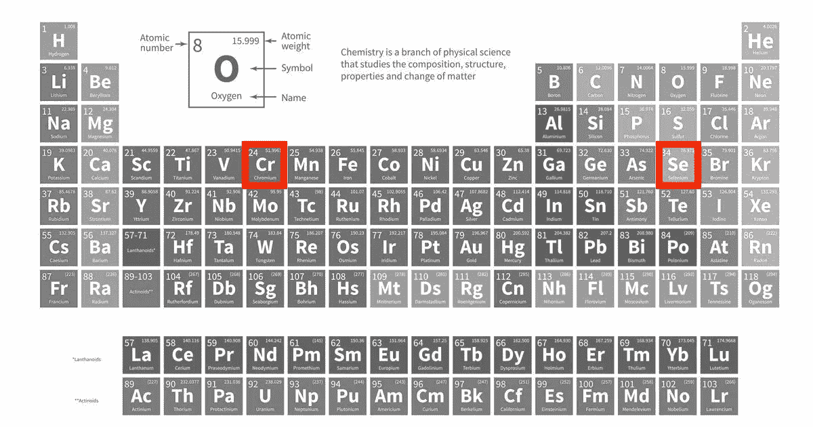
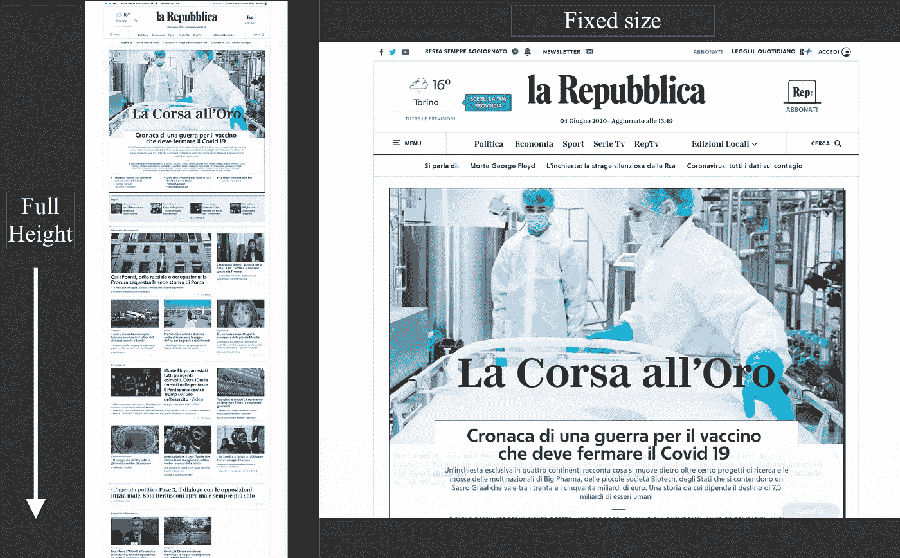

# AWS Lambda 中的铬和硒

> 原文：<https://levelup.gitconnected.com/chromium-and-selenium-in-aws-lambda-6e7476a03d80>



让我们看看如何在 AWS Lambda 函数中使用铬和硒；首先，为那些不熟悉这两个项目的人提供一些信息。

**2020.09 更新**:请到[项目库](https://github.com/vittorio-nardone/selenium-chromium-lambda)查看该项目的新版本，包括 Chromium ver。86.0.4240.0 和硒。3.14.

[Chromium](https://www.chromium.org/Home) 是谷歌 Chrome 衍生的开源浏览器。浏览器共享大部分代码和功能。然而，它们在许可证方面有所不同，Chromium 不支持 Flash，没有自动更新系统，也不收集使用和崩溃统计数据。我们将会看到，这些差异丝毫不会影响项目的潜力，而且由于 Chromium，我们可以在 Lambda 函数中执行许多有趣的任务。

Selenium 是一个众所周知的专门用于测试 web 应用程序的框架。我们对 Selenium WebDriver 特别感兴趣，这是一个允许控制当今所有主流浏览器的工具，包括 Chrome/Chromium。

# 为什么在 Lambda 函数中使用 Chrome？

在没有 GUI 的环境(AWS Lambda)中使用浏览器的目的是什么？实际上有好几个。操作浏览器可以让你自动完成一系列任务。例如，可以通过创建 CI 管道来自动测试您的 web 应用程序。或者，同样重要的是，网络抓取。

[网络搜集](https://en.wikipedia.org/wiki/Web_scraping)是一种允许我们从网站提取数据的技术，它可能的应用是无限的:监控产品价格，检查服务的可用性，通过从多个公开来源获取记录来建立数据库。

在本帖中，我们将看到如何在 Lambda 函数 Python 中使用 Chromium 和 Selenium 来呈现 URL。

# Lambda 函数示例

我们将要创建的 Lambda 函数有一个特定的目的:给定一个 URL，Chromium 用于呈现相关的 web 页面，并以 PNG 格式捕获内容的屏幕截图。我们将保存在 S3 桶的形象。通过定期运行该功能，我们将能够“历史化”任何站点的变化，例如在线信息报纸的主页。

显然，我们的 Lambda 有许多改进的可能性:目的是展示这种方法的潜力。

让我们从所需的 Python 包(requirements.txt)开始。

```
selenium==2.53.0 
chromedriver-binary==2.37.0
```

在 AWS Lambda Python 环境中，包通常是不可用的:我们需要创建一个 zipfile 来分发我们的函数，包括所有的依赖项。

我们得到了 Chromium，**的无头版本**，它能够在服务器环境中运行。我们需要相关的 Selenium 驱动程序。以下是我用过的链接。

*   [无头铬下载链接](https://github.com/adieuadieu/serverless-chrome/releases/download/v1.0.0-29/stable-headless-chromium-amazonlinux-2017-03.zip)
*   [Chrome 网络驱动下载链接](https://chromedriver.storage.googleapis.com/2.32/chromedriver_linux64.zip)

# 如何使用 Selenium Webdriver

如何在 Python 中使用 Selenium 的一个简单示例: **get** 方法允许我们将浏览器定向到指定的 URL，而 **save_screenshot** 方法允许我们保存内容的 PNG 图像。该图像将具有 Chromium 窗口的大小，使用**窗口大小**参数将其设置为 1280×1024 像素。

我决定创建一个包装类来呈现页面**的所有高度**。我们需要计算包含所有元素所需的窗口大小。我们使用一个技巧，一个我们将在页面加载后执行的脚本。Webdriver 再次公开了一个适合我们的 **execute_script** 方法。

这个解决方案不是很优雅，但是很实用:请求的 URL 必须加载两次。第一次将浏览器窗口设置为固定大小。页面加载后，JS 脚本用于确定所需窗口的大小。之后，关闭原来的浏览器窗口，打开一个大小合适的新窗口，获得完整的高度截图。使用的 JS 脚本取自这个有趣的帖子[。](https://stackoverflow.com/questions/1145850/how-to-get-height-of-entire-document-with-javascript)

包装器也是“Lambda 就绪的”:它正确地管理临时路径和指定必要的 **chrome_options** 的 **headless-chromium** 可执行文件的位置。

让我们看看我们的 Lambda 函数是什么样的:

该函数的事件处理程序只是负责实例化我们的 **WedDriverScreenshot** 对象，并使用它来生成两个屏幕截图:第一个具有固定的窗口大小(1280×1024 像素)。对于第二个，省略了**高度**参数，这将由我们的包装器自动确定。

这是两张相互比较的图片，与网站相关



# 功能的部署

我在[这个 GitHub 库](https://github.com/vittorio-nardone/selenium-chromium-lambda)中收集了在 AWS Cloud 上部署项目所需的所有文件。除了之前已经分析过的文件，还有一个用于堆栈部署的 CloudFormation 模板。最重要的部分显然与**截屏函数**的定义有关:一些环境变量，如 PATH 和 PYTHONPATH，是正确执行函数和 Chromium 的基础。还需要注意内存需求和超时设置:加载一个页面可能需要几秒钟。 **lib** 路径包含了一些执行 Chromium 所需的库，这些库在 Lambda 环境中是缺省不存在的。

像往常一样，我更喜欢使用 Makefile 来执行主要操作。

```
## download chromedriver, headless-chrome to `./bin/` 
make fetch-dependencies ## prepares build.zip archive for AWS Lambda deploy 
make lambda-build ## create CloudFormation stack with lambda function and role 
make BUCKET=your_bucket_name create-stack
```

CloudFormation 模板需要一个 S3 桶作为 Lambda 函数部署的源。随后，同一个存储桶将用于存储 PNG 截图。

# 结论

我们用硒和铬来渲染一个网页。这是这两个项目在无服务器领域的一个可能应用。正如所料，另一个非常有趣的应用是 web 抓取。在这种情况下，Webdriver 的 **page_source** 属性允许访问页面的源代码，像 [BeautifulSoup](https://www.crummy.com/software%20/%20BeautifulSoup%20/%20bs4%20/%20doc%20/) 这样的包对于提取我们想要收集的数据非常有用。Python 的 Selenium 包提供了几种自动化其他操作的方法:请查看[优秀的文档。](https://selenium-python.readthedocs.io/)

看看[这个帖子的 GitHub 库](https://github.com/vittorio-nardone/selenium-chromium-lambda)。

我们玩得开心吗？下次见！

*原载于 2020 年 6 月 4 日*[*https://www . vittorionardone . it*](https://www.vittorionardone.it/en/2020/06/04/chromium-and-selenium-in-aws-lambda/)*。*