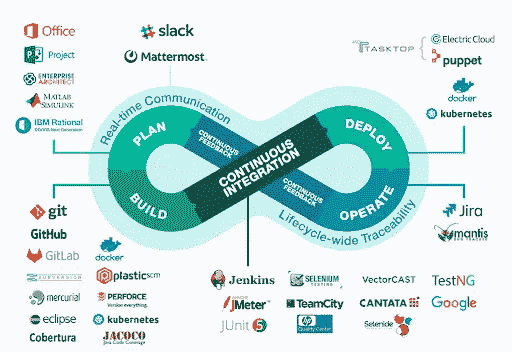
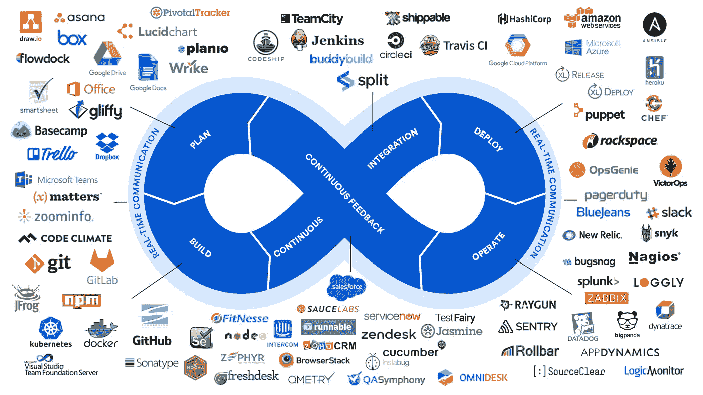
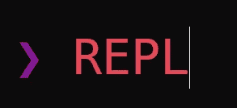
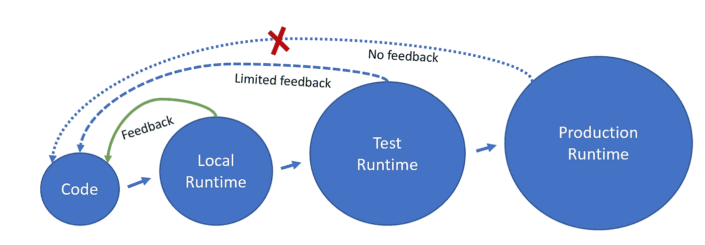
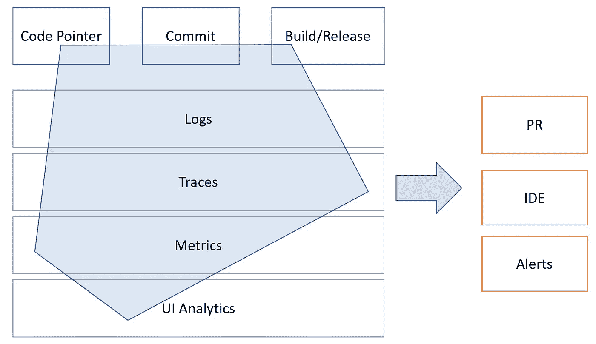

# CI/CD/CF？DevOps 工具链的“缺失环节”

> 原文：<https://levelup.gitconnected.com/ci-cd-cf-the-devops-toolchains-missing-link-b5c88caf6282>

## 面向开发者的持续反馈平台

来源:HowStrange.com

过去的二十年对软件开发工艺来说已经形成了巨大的影响。我感到很幸运，在那段时间里，我一直处于工程组织的核心，与那些对尝试新想法和新技术的前景感到兴奋的聪明人并肩工作。

通常，这种变革时期的意义只有在事后才看得清楚。就我而言，我深深感激这样一个事实:我们都是先锋，这个行业正在发生变化。发生了这么多事！想法、技术、过程和实践:BDD、TDD、DDD、CQRS 事件采购、CI、CD 都是新概念。空气中充满了每个人都想接受和探索的新想法。

然而，我在这里并不是要谈论发生在软件行业的所有这些伟大的事情。我敢肯定，已经有很多关于这个主题的书被写出来，而且还会继续写下去。除了我个人对这些变化的广度和深度的敬畏之外，我没有什么可补充的。

我是来说一些没有发生的事情的。无限 DevOps 循环中的一个缺口未完成。

为了理解缺失了什么，我要求你看看下面的图表，从两个不同的网站上获取。您能看出 DevOps 流程中的哪个部分没有真正的工具吗？

来源:https://www.sdcsystems.com/solutions/devops/

来源:https://www.osolabs.com/blog/devops-tools-of-the-trade/

无数的平台被创建来解决与构建软件、持续测试、部署和操作软件相关的一切问题。但是在这张生态系统图中，很难不注意到一个明显的遗漏。**持续反馈**到底怎么了？

如今，CI 和 CD 是每个人的口头禅，但你上一次听到有人说 CF 这个词是什么时候？有人使用连续反馈平台吗？什么类型的信息真正从产品流回到开发人员手中，以使下一次代码更改更容易、更正确、更智能？

我的大部分背景。NET 和 Java，在 21 世纪初，REPL 的概念让我大吃一惊。我开始接触动态类型的语言，如 Ruby 和 Python，并开始挑战我以前对编码的一些假设。在我 2010 年的企业应用程序中，删除繁琐的构建步骤极其缓慢，这似乎是一次重大升级。从代码到控制台的即时反馈——那只是科幻小说。

对于不太熟悉这个术语的人来说，REPL 是一个交互式 Shell，可以让你实时测试和评估命令。对我来说，这意味着更少的“等待构建”的休息时间。它缩短了从代码构思到不可避免地检查运行时错误的时间。[在任何人将此解释为对 Java 或。请记住，这是十多年前的事了。今天的构建速度更快，而且有许多方法可以更快地测试您的代码】。

然而，在本地运行和代码在生产中实际运行之间仍然有很大差距。每个人都知道“在我的机器上工作”这句话。这是一个真实的陈述。当开发人员在他们 IDE 的无菌实验室中测试代码时，它(几乎)总是工作的。

原因显而易见。并发条件、计时和延迟、请求参数、第三方服务行为和数据等因素通常会决定代码的行为。这些条件在测试中可以模拟到非常有限的程度，但在我们设计代码时却完全不存在。在我们的开发座舱中，没有一个反馈镜被调整来覆盖我们视野中的这个巨大盲点。

让我印象深刻的是:**这些超级花哨的反馈侧视镜已经存在了。**

毕竟，您的代码，也就是您今天一直在编写和修改的代码，已经在生产中运行了。可观察性、日志记录、跟踪和度量收集平台现在可能正在收集大量的相关数据。生产中的代码执行得很差或很好，它抛出可预测或不可预测的运行时错误，伸缩，服务于不同的用例，表现出各种各样的行为。只是目前没有基于收集的信息的见解或学习被整合到代码设计周期中。

我想到了 Google Analytics、Amplitude 和其他针对产品经理的反馈平台，并与寻求从测试和生产环境中获得可操作见解的开发人员所能获得的微薄选择形成对比。没有理由循环的这一部分不存在，除了我们还没有建立它。

# 从*可用性*到可维护性

出于某种原因，我们今天使用的可观察性平台都是针对常见的可疑用例——检测、故障排除和生产运营。也许是因为许多这些工具最初是针对运营和 IT 团队的，或者这只是影响看起来更明显的地方。

一切都在“左移”:测试、安全、运营等。发布过程中越来越多的方面现在由最终对它们负责的团队所拥有。对于可观察性工具来说，它们似乎是“向左推”,而不是做任何类型的移动。

我想看到的是，我们如何使数据更相关，不是在出错后的一天甚至几分钟内，而是在代码仍在设计的时候。我们如何才能做出更明智的重要代码设计决策，并利用我们已经在收集的一些数据。

# 这完全是关于环境的

语境是让它发挥作用的关键。大部分数据已经发出，可以收集和分析，我们只需要再多几个线程将它们连接在一起。为了将这些点连接起来，我们需要用提交标识符、指向代码位置的指针和发布的二进制文件对跟踪、日志和度量进行三角测量。

有了这个上下文，我们可以开始生成有意义的分析，并检查有趣的趋势，这可以使我们的更改更加明智，并提高我们对系统运行时的理解。

我应该强调，这是关于原始数据的**而不是**。例如，将您的代码与 ELK 堆栈直接连接起来是没有用的。生产数据过于庞大和敏感，只会让开发人员超负荷工作，他们将无法见树不见林。趋势、分析和预测是使这种新的信息反向传播有用的关键。

# 带有生产反馈的编码

下面是一个例子:想象一下在你的 IDE 中编辑一个函数，并且完全了解实际通过它的数据工作流。直观地看到人们从哪里访问你的代码，一路回到浏览器页面。反过来说，了解这个函数在几个月内从未在任何生产流程中出现过也是很有趣的。

这几乎就像彩色突然被应用到黑白电影场景中。什么参数值进入这个函数，它们在不同的起源流之间有什么不同？遇到了什么类型的运行时异常，发生率是多少？我们将能够随意右键单击运行时上下文数据和分析。

接下来，我们可以将所有数据关联起来，以检测趋势。响应 JSON 大的时候我的函数表现很差吗？也许特定表的大小会直接影响响应时间，这是我们应该尽早考虑的问题。在一个特定的提交之后，test 或 prod 中有向上的刻度吗？

我们可能会得到我们从未想过要问的问题和答案。既然我们知道在一些生产工作流中有数千个成员，那么我们就可以对发送作为查询输入接收的标识符数组三思。我们将能够查看 PR 中任何给定变更的可能受影响的组件，以确保测试覆盖与实际使用。我们将能够迭代地评估代码变更的影响，因为它们扩展了 done 的定义。

最后，它一路向下。我正在编辑的功能中可用的相同类型的分析将同样有助于理解我正在使用的其他功能、包和微服务。运行时行为数据将允许我理解期望什么，以及如何以更聪明的方式利用其他人的代码。

# 我们有技术

技术和工艺的进步有时是紧密联系在一起的。

快速且不可变的容器使加速测试成为可能，并使连续部署管道变得可行。同样，我相信今天的可观察性标准和技术(OpenTelemetrics、基础设施 API、机器学习)的状态允许我们向真正的连续反馈前进。

我以对过去二十年软件创新的怀旧狂欢开始了这篇博文。同样的开拓意识和未开发的潜力吸引我到这个话题。对于开发人员来说，持续的反馈可能会像在现代 ide 中引入智能感知一样具有革命性。这种“运行时智能感知”可以改变我们编写代码的方式，以至于很难想象没有它我们是如何度过的。

你可能知道，这个话题是我最关心的话题。在接下来的几个月里，我计划继续开发一个持续的反馈平台，发布一些技术和产品方面的考虑。我肯定会寻找喜欢摆弄新技术和流程的早期采用者。如果你在这个问题上有一些想法，或者如果你也对测试新的概念(首先是理论上的，然后是更实际的)感到兴奋，并成为新事物的一部分，请联系我们——我很高兴收到你的来信，无论是通过社交还是电子邮件:roni.dover@gmail.com。

**2013 年 4 月 4 日更新:**我实际上能够召集一个小团队，并启动 digma.ai，这正是这种持续反馈的平台！看一看 https://github.com/digma-ai/digma 的