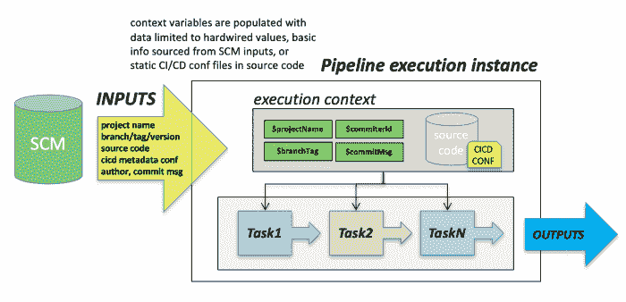
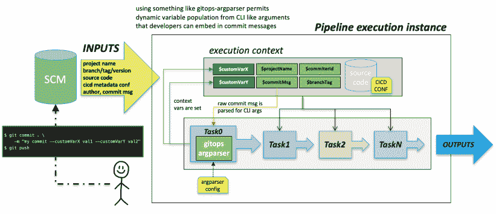

# 具有 Git 提交消息参数的 CI/CD 控制流

> 原文：<https://levelup.gitconnected.com/ci-cd-control-flow-with-git-commit-message-arguments-153b4fcd505e>

CI/CD 系统，因为它们所有迷人的内部工作方式、复杂性和过多的可配置性；在一天结束的时候，和其他定制软件没有什么不同。

就像任何其他软件系统一样，逻辑上 CI/CD 引擎由输入、输出、控制流和错误处理等契约组成。这些“契约”可能通过预先制作的“任务”插件来表达，这些插件提供可配置的输入，这些输入采用静态值或依赖于某种上下文/环境变量，所有这些在 CI/CD 平台上可能有很大的不同。

# CI/CD 基础

通常，开发运维人员将定义由一个或多个任务组成的定制工作流(或管道),这些任务将在运行时以预定的顺序执行，其中后续步骤仅在一个或多个先前步骤成功完成后执行。这些“工作流”通常被硬连线为模板，以重复自动化这些重复的操作集，这些操作集通常以我们都熟悉的两个类别之一结束:构建/测试工件；或者部署它们。

CI/CD“pipeline”模板中可用的行为定制级别通常相当有限，对其流程/行为的更改将需要开发团队向负责实施流程的 DevOps 团队请求更改。第二，总的来说，每个新调用可用的上下文信息(通过变量)非常有限，仅限于基本信息，如应用程序/项目名称、版本、内部版本号、环境等；或者通过与源代码一起检入的某种定制 CI/CD 控制文件。



# 定制 CI/CD 输入合同

理想情况下，在设计 CI/CD 管道时，如果我们能够提供某种级别的定制，这种定制可以在每次触发/调用管道时轻松传达，并且可以在每次独特的管道实例化时发生变化，那就太好了。拥有这种能力可以减少对静态/硬连线管道的更改数量，并为开发人员在提交 SCM 时触发管道扩展功能。

在当今世界中，由“GitOps”驱动的自动化越来越成为规范，由 Git 驱动的 CI/CD 系统的输入契约通常受到 Git 中的设施的约束，这些设施允许在存储库中发生变化时传递定制信息。其中最主要的是基本的 Git 提交消息。那么我们如何利用这一点让开发人员定制每个 CI/CD 调用呢？

也许是这样的？



我也有同样的需求，以下是我的解决方法。

# 提交消息 CI/CD 参数

当时我正在用 [Azure Pipelines](https://azure.microsoft.com/en-us/services/devops/pipelines/) 做一些 CI/CD 原型制作，遇到了一个有趣的特性，叫做[日志命令](https://github.com/microsoft/azure-pipelines-tasks/blob/master/docs/authoring/commands.md)。该特性基本上允许管道中的任务向 *STDOUT* 发送特定格式的文本，Azure 管道将检测该输出并对其采取行动。其中一个函数用于设置管道变量，您向 *STDOUT* 发出的语法如下所示:

```
##vso[task.setvariable]value
```

这样设置的变量可用于管道的后续部分。鉴于此，我决定扩展这个想法，编写一个名为 [gitops-argparser](https://github.com/bitsofinfo/gitops-argparser) 的小实用程序，它扩展了这个想法，让您在 YAML 中定义可接受的参数，然后简单地调用它，传递提交消息，您的变量将被解析并发送到 *STDOUT* 。

它是这样工作的([参见完整的 gitops-argparser 自述文件了解详细信息](https://github.com/bitsofinfo/gitops-argparser)):

首先，定义您的参数配置文件:

```
arguments:
  - long: arg1
    dataType: string
    help: This is argument number one
    defaultValue: arg1default
  - long: arg2
    dataType: string
    help: This is argument number two
    defaultValue: "hi"
  - long: arg3
    dataType: int
    help: This is argument number three
    defaultValue: 2
  - long: arg4
    dataType: bool
    help: This is argument number four
    defaultValue: true
```

接下来，基于您的 CI/CD 平台和它如何工作的细节，定义一个参数变量发射器模板(这支持 [Golang 模板](https://golang.org/pkg/text/template/)和 [Sprig 函数支持](https://github.com/Masterminds/sprig))。这是 Azure 的一个示例。这个文件的位置默认为本地目录，但是可以用 ENV var: `COMMIT_MSG_ARGPARSER_OUTPUT_TMPL_FILE`覆盖

```
{{ range $arg := .Arguments }}
##vso[task.setvariable variable={{$arg.Name}}]{{$arg.Value}}
{{ end }}
```

最后，在你的 Azure Pipeline 任务中，像这样做:

```
...

- task: Bash@3
    displayName: Parse commit message args
    targetType: 'Inline'
    script: ./gitops-argparser $(Build.SourceVersionMessage)

- task: Bash@3
    displayName: Print pipeline vars from commit message args
    targetType: 'Inline'
    script: | 
        echo $(arg1)
        echo $(arg2)
        echo $(arg3)
        echo $(arg4)
```

那么接下来会发生什么？您向 Git 提交触发管道的内容，但在提交消息中指定参数:

例如，类似于:

```
git commit . -m "whatever text -arg1 val1 -arg2 val2"; git push
```

您的管道拾取这些变量，并使这些变量对管道可用，然后您可以利用它们来控制您希望在整个 CI/CD 流中出现的任何行为。

希望您会发现这很有用，或者只是触发一些额外的头脑风暴来解决您的特定需求。目前我唯一的使用例子是 Azure Pipelines，还没有 Docker 镜像，但是我可能会添加一个。在任何情况下，这个想法肯定可以扩大！

[https://github.com/bitsofinfo/gitops-argparser](https://github.com/bitsofinfo/gitops-argparser)

*原载于 2020 年 1 月 4 日*[*【http://bitsofinfo.wordpress.com】*](https://bitsofinfo.wordpress.com/2020/01/04/cicd-git-commit-message-arguments/)*。*