# 通过使用 GitHub 和 Azure DevOps 为 Azure Functions 应用程序提供 CI/CD

> 原文：<https://levelup.gitconnected.com/ci-cd-for-azure-functions-app-by-using-github-and-azure-devops-c6ccfd0decaf>

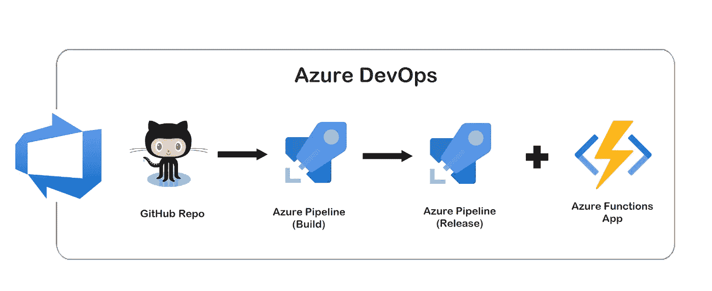

在之前的[帖子](/using-vs-code-to-build-an-azure-function-and-sql-database-app-with-net-core-on-azure-cloud-9ab42febf9fa)中，我们使用。Net Core 3.1 用 VS 代码，通过所谓的*右键发布把我们的 app 发布到 Azure cloud。*说实话，虽然*右键发布*是一个快速构建原型的好方法，但是并不适合现实世界的开发，尤其是一个团队中有多个开发人员的时候。因此，一个自动化的过程是非常重要的，因为它为我们提供了一个可靠的、可重复的、更快的构建工件的过程。

这篇文章详细介绍了使用 Azure DevOps 为我们在上一篇文章中创建的 Azure Functions 应用程序项目实现 CI/CD 管道的过程，以及在此过程中遇到的问题(当然它们已经解决了😃)，以及如何将构建/部署状态徽章添加到我们的 GitHub repo 中。你可以在这里找到回购:[https://github.com/chenjd/AzureFunction.UserCRUD](https://github.com/chenjd/AzureFunction.UserCRUD)

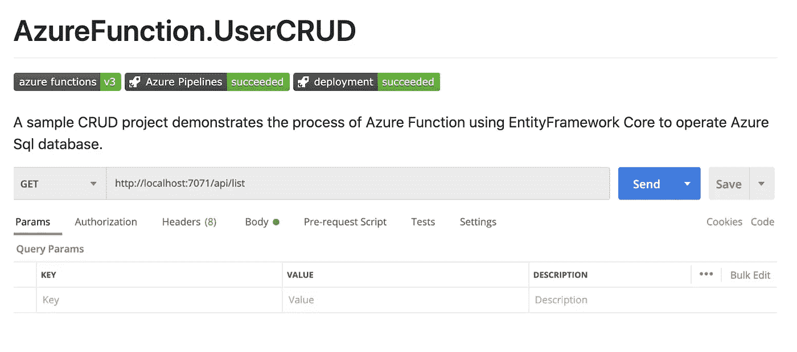

# 在 Azure DevOps 上创建一个项目

我们可以在 Azure 门户网站管理我们的 Azure 资源，另一方面，Azure DevOps 有自己的网站，这里是[https://dev.azure.com/](https://dev.azure.com/)

因此，我们应该首先在 Azure DevOps 网站上创建一个组织和一个项目。

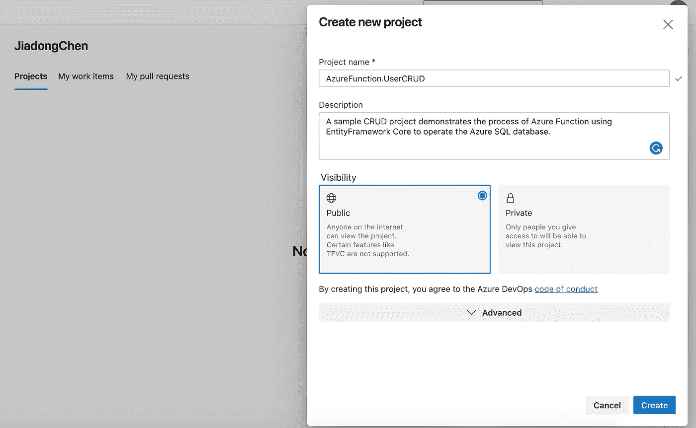

正如你在上面看到的，我创建了一个名为*陈家东*的组织和一个名为 *AzureFunction 的新项目。UserCRUD* 。这是一个公共项目，这意味着每个人都可以访问这个项目，你可以在这里找到它:[https://dev.azure.com/JiadongChen/AzureFunction.UserCRUD](https://dev.azure.com/JiadongChen/AzureFunction.UserCRUD)

现在我们建立了我们的 Azure DevOps 组织和项目。接下来，我们将使用 Azure 提供的模板来创建我们需要的 Azure 管道。

# 连接 GitHub，创建我们需要的 Azure 管道

现在让我们回到 Azure 门户网站，打开我们之前创建的 Azure Functions 应用服务页面。你可以发现在部署部分下面有一个按钮叫做 ***部署中心*** 。如果您还没有为您的应用程序设置 CI/CD 管道，那么您将被要求选择源代码管理提供程序。在这篇文章中，我们将使用 GitHub 作为我们的源代码控制提供者。

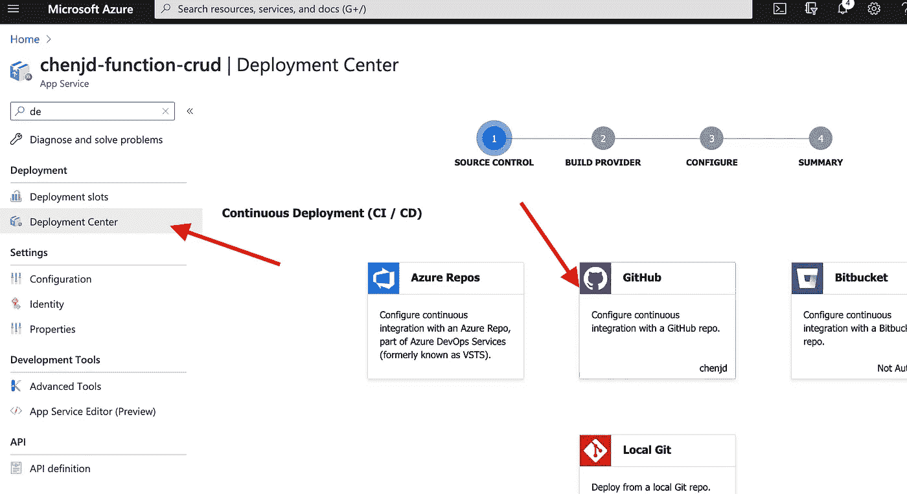

然后我们需要选择构建提供者，为了使用 Azure DevOps，我们将选择 ***Azure 管道(预览)*** (等等，预览？这是后来问题的原因吗？)

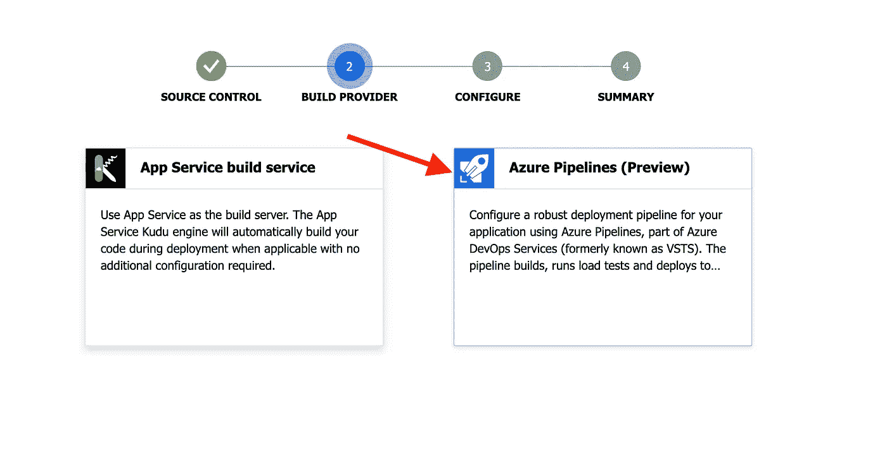

选择构建提供者之后，我们需要为我们的应用程序配置部署管道。在配置页面，我们可以在代码部分选择 GitHub repo/branch，并在构建部分选择我们在 Azure DevOps 网站上创建的 DevOps 项目。

你应该注意的是，默认的**功能应用类型**是脚本应用，因此，供我们的应用使用。Net Core 3.1，我们应该选择**预编译。NET 功能 App** 类型。

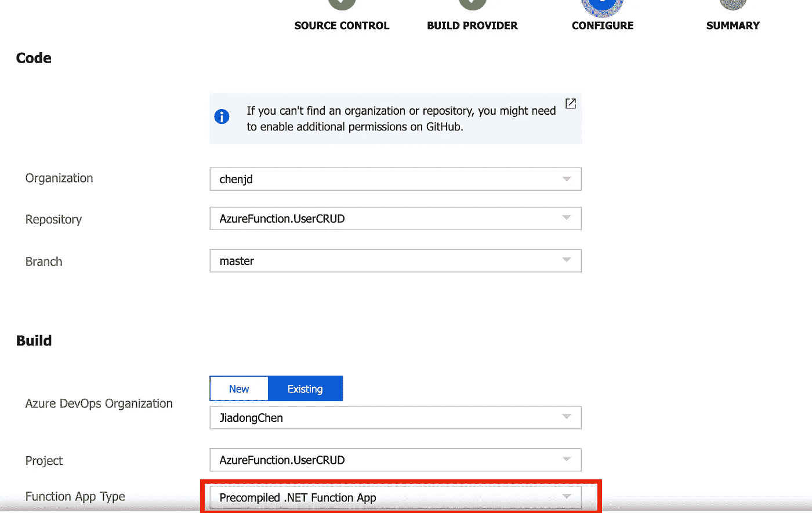

现在，我们的应用程序的部署管道已经设置好了，它应该会自动运行。但是，如果您的应用程序是用 VS 代码创建的，并且使用了。NET Core 3.0 或更高版本，您可能会遇到一些我遇到的问题，第一次构建可能会失败。

# 蔚蓝管道

让我们回到 Azure DevOps 网站，检查我们在网站上创建的项目。

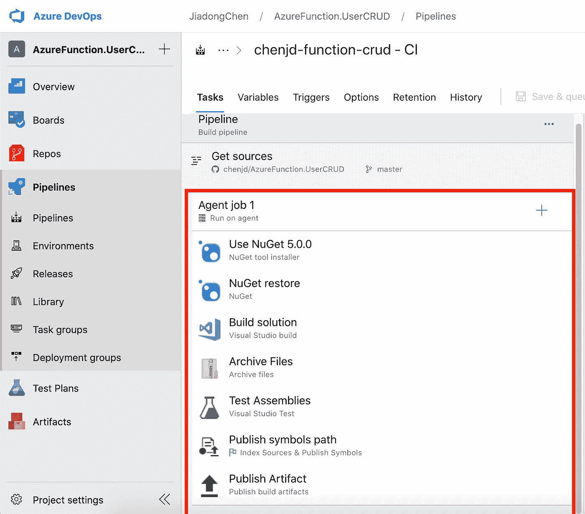

正如您在上面看到的，CI 渠道已经建立。可以 YAML 格式查看管线结构。YAML 文件结构中的典型层次结构如下所示:

```
**Pipeline** 
  **Stage** A 
    **Job** 1 
      **Step** 1.1 
      Step 1.2 
      ... 
    Job 2 
      Step 2.1
```

**管道**是描述 CI/CD 流程的一个或多个阶段。阶段是管道中的主要部分，如*构建*、*测试*。一个**阶段**是一个或多个作业，是可分配给同一台机器的工作单元。**工作**是一系列线性步骤。**步骤**可以是任务、脚本或对外部模板的引用。

而且我们的管道比较简单，下面是 YAML 文件(如果你不喜欢看下面的 YAML 文件，直接跳过)。

```
pool:
  name: Azure Pipelines
  demands:
  - msbuild
  - visualstudio
  - vstest**steps**:
- task: NuGetToolInstaller@1
  displayName: 'Use NuGet 5.0.0'
  inputs:
    versionSpec: 5.0.0- task: NuGetCommand@2
  displayName: 'NuGet restore'
  inputs:
    restoreSolution: '$(Parameters.solution)'- task: VSBuild@1
  displayName: 'Build solution'
  inputs:
    solution: '$(Parameters.solution)'
    msbuildArgs: '/p:DeployOnBuild=true /p:DeployDefaultTarget=WebPublish /p:WebPublishMethod=FileSystem /p:publishUrl="$(Agent.TempDirectory)\WebAppContent\\"'
    platform: '$(BuildPlatform)'
    configuration: '$(BuildConfiguration)'- task: ArchiveFiles@2
  displayName: 'Archive Files'
  inputs:
    rootFolderOrFile: '$(Agent.TempDirectory)\WebAppContent'
    includeRootFolder: false- task: VSTest@2
  displayName: 'Test Assemblies'
  inputs:
    testAssemblyVer2: |
     **\*.test.dll
     !**\obj\**
    platform: '$(BuildPlatform)'
    configuration: '$(BuildConfiguration)'- task: PublishSymbols@1
  displayName: 'Publish symbols path'
  inputs:
    SearchPattern: '**\bin\**\*.pdb'
  continueOnError: true- task: PublishBuildArtifacts@1
  displayName: 'Publish Artifact'
  inputs:
    PathtoPublish: '$(build.artifactstagingdirectory)'
    ArtifactName: '$(Parameters.ArtifactName)'
```

正如你在上面看到的，没有**没有** **管道，没有阶段，也没有工作。**为什么？

这是因为我们的管道只有一个阶段和一个作业，所以我们可以省略**阶段**和**作业**关键字，直接指定**步骤**关键字。

现在，我们对正在使用的管道有了一个了解。接下来，我们来看看您可能遇到的第一个问题。

# 我使用的是 Visual Studio 代码，而不是 Visual Studio

您可能遇到的第一个问题是管道在我们的应用程序项目中找不到解决方案文件。

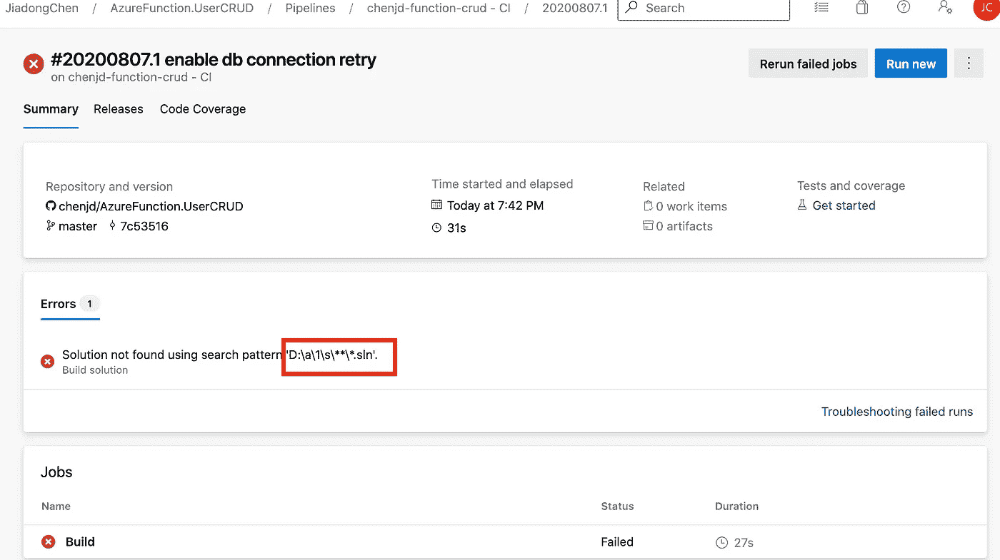

这是正确的，因为我们的项目不包括解决方案文件。在 VS 代码中使用 Azure Functions 扩展创建的 Azure Functions 项目只生成一个`csproj`文件。

因此，我们应该将`Path to solution or packages`参数从`**\*.sln`修改为`**\*.csproj`。

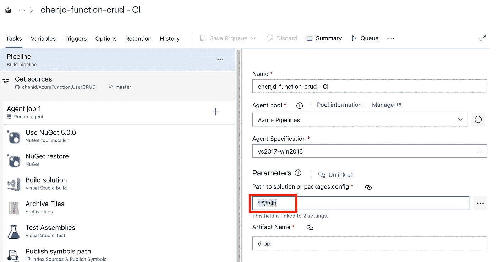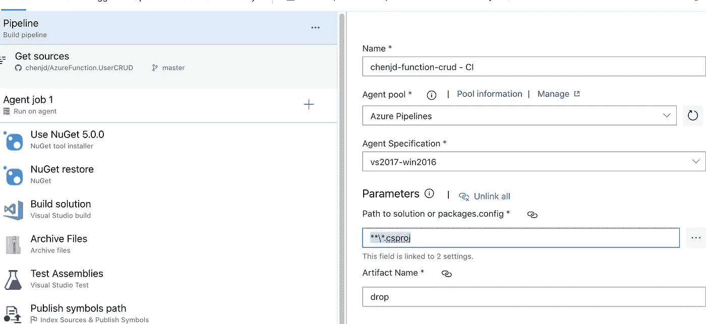

酷毙了。现在这个`Solution not found using search pattern ‘d:\a\1\s\**\*.sln’`错误已经过去了！

# 我需要。网芯 3.1！

您可能遇到的第二个问题是“NETSDK1045”错误，特别是当前的。NET SDK 不支持目标定位。网芯 3.1。

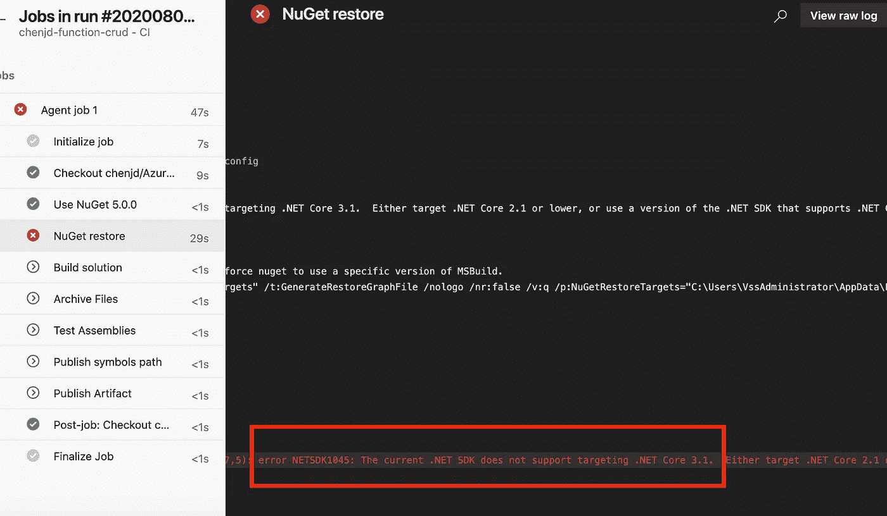

如果你看一下我们管道的默认代理规范，你会发现默认的是 ***vs2017-win2016。如果要用*** 和。网芯 3.1，我们需要用 vs2019 而不是 vs2017。因此，我们应该选择 **windows-2019** 作为**代理规范。**这是因为*windows-2019* 规范在 Azure 上使用了**Windows Server 2019 with Visual Studio 2019**image。

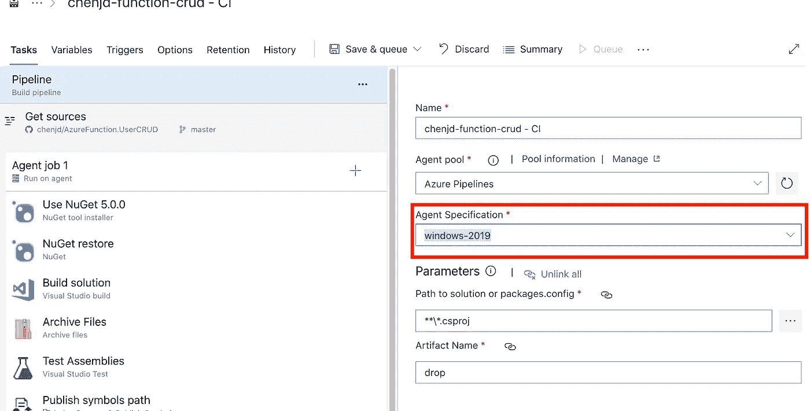

再次运行管道，成功了。耶！

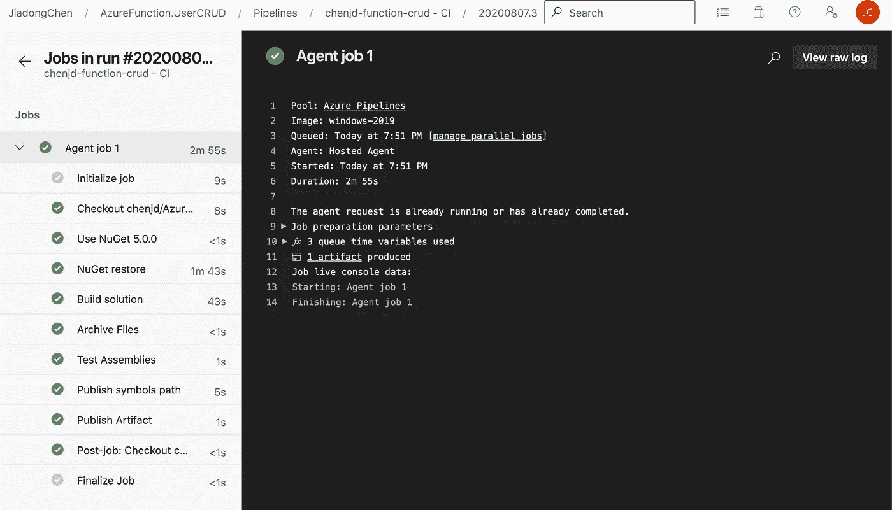

CD 管道也运行成功。

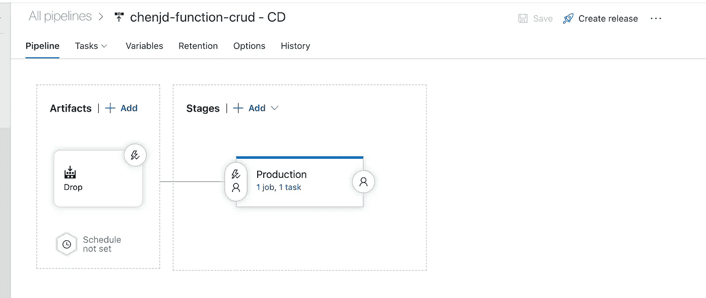

# 向 GitHub Repo 添加状态徽章

现在有了 Azure DevOps，我们可以持续集成我们的代码，持续交付我们的应用。此外，我们可以将构建和部署状态标记添加到 GitHub repo 中，以反映项目的当前状态。

首先，让我们从 Azure DevOps 获得构建状态徽章。您可以在构建管道(CI 管道)的**选项**面板中找到它。

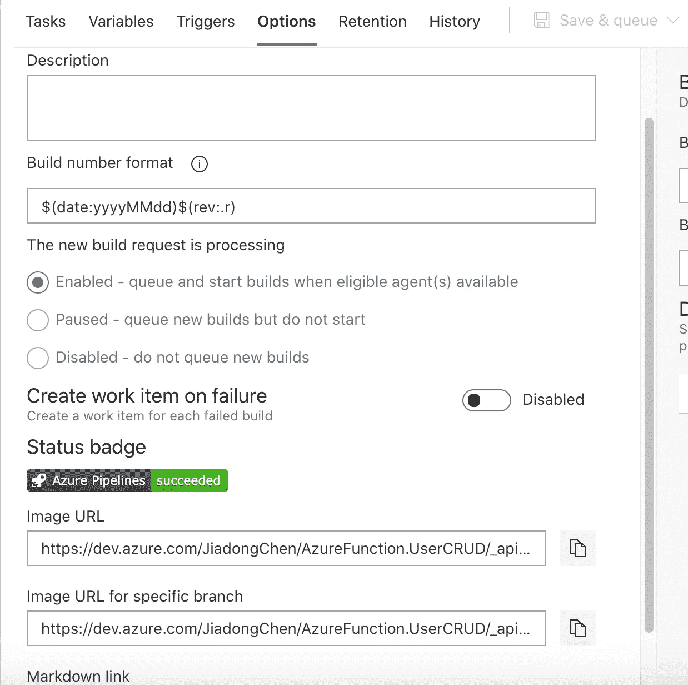

有降价链接和图像 URL，为了在我们的 GitHub repo 上显示，我们应该将降价链接复制并粘贴到我们的 repo 的 README.md 文件中。

接下来，我们可以从发布管道(CD 管道)获得部署状态徽章。你可以在**选项**面板找到它，然后选择集成并检查*启用部署状态徽章*。而生产徽章正是我们要找的！

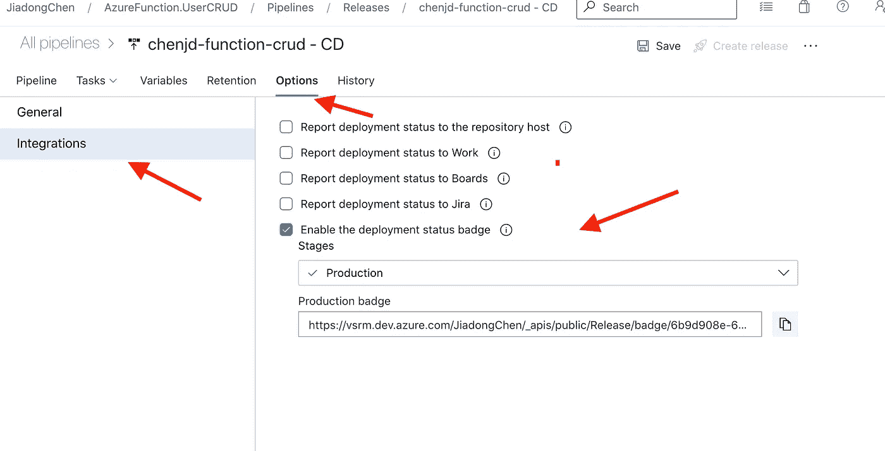

将这些徽章 URL 添加到我们的 README.md 文件后，GitHub repo 看起来如下图所示。酷！


感谢阅读，希望对您有所帮助！

在[https://www.linkedin.com/in/chenjd/](https://www.linkedin.com/in/chenjd/)聊天