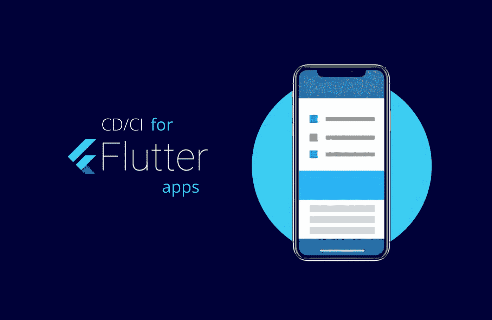
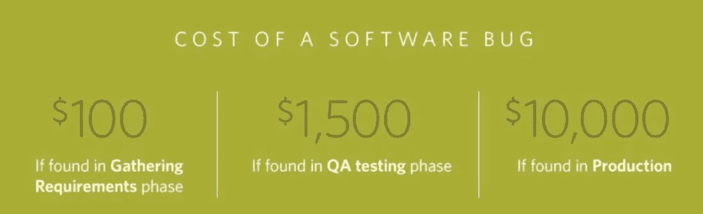
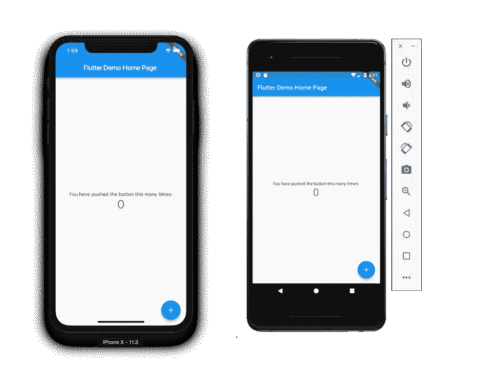
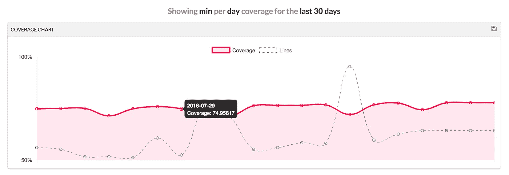
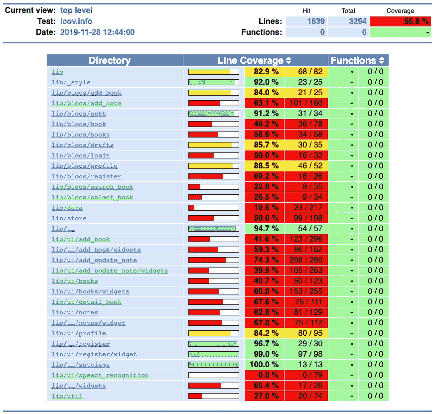
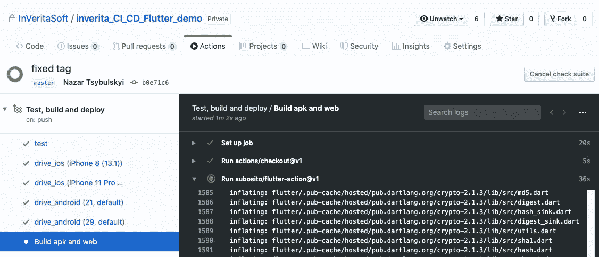
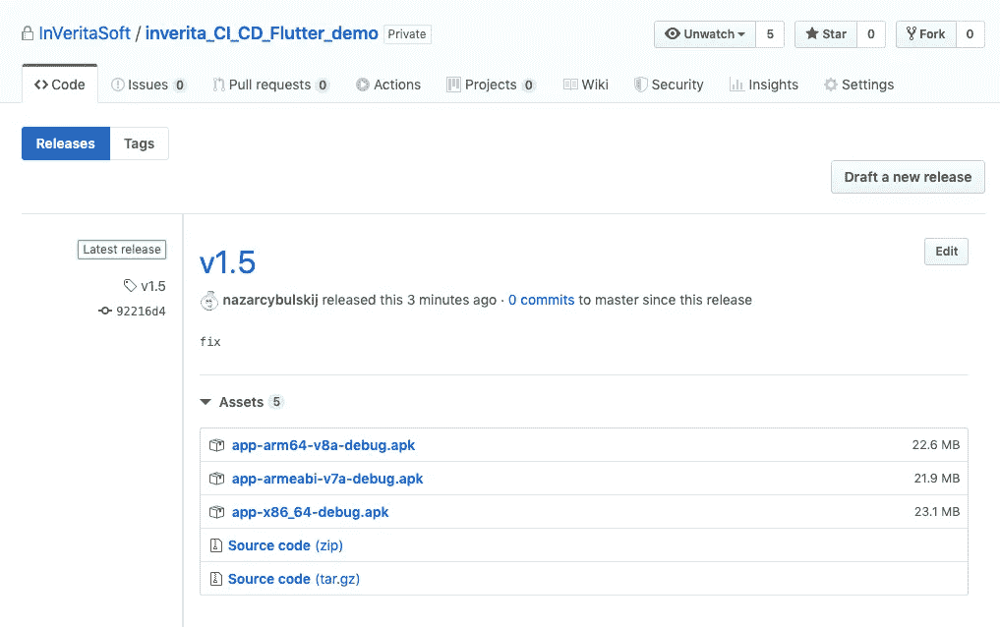
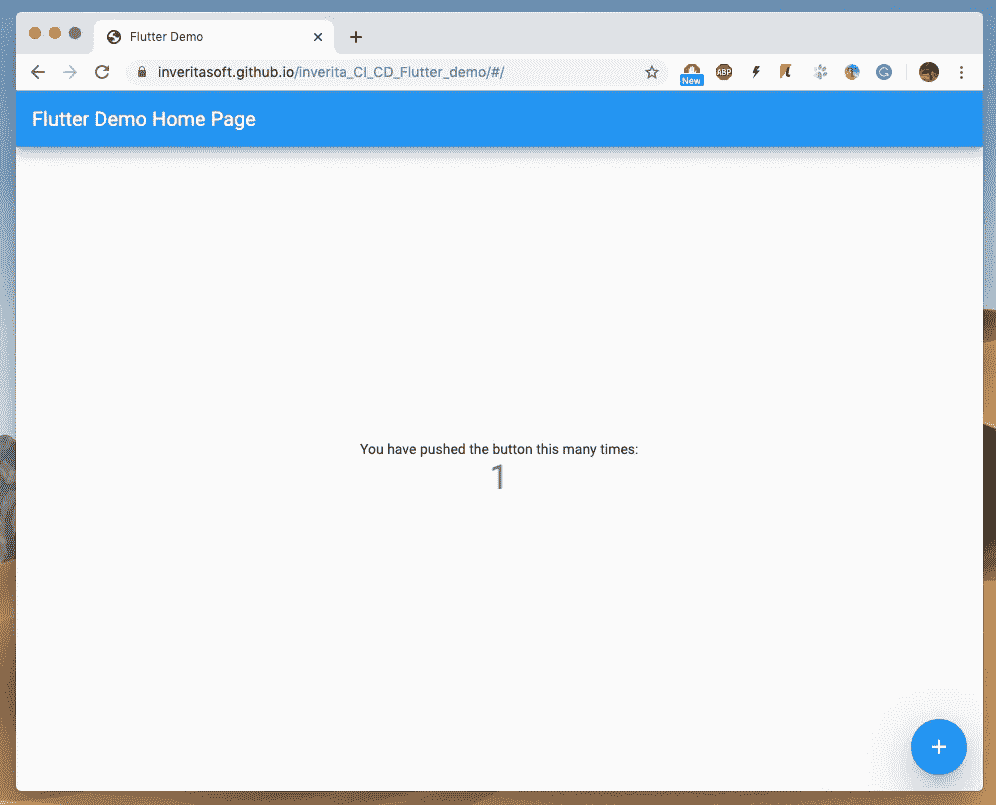
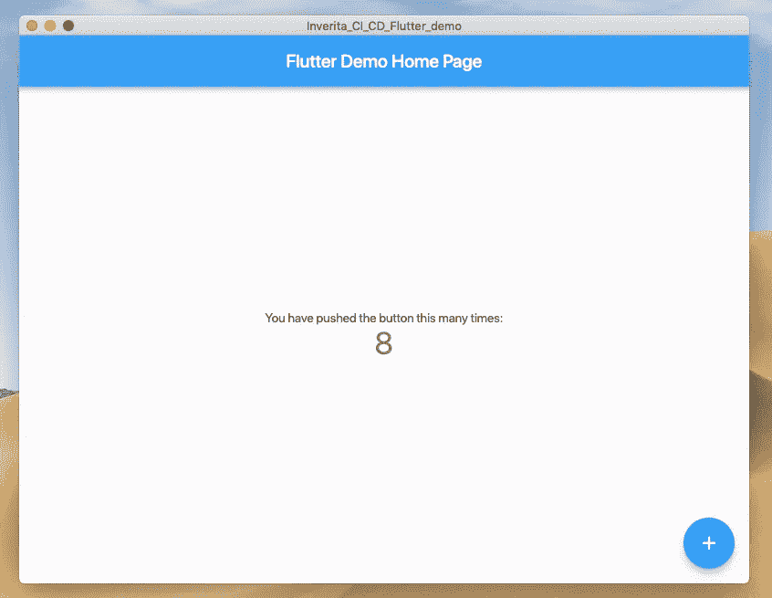

# 如何用 GitHub 动作为 Flutter 应用程序设置 CI/CD

> 原文：<https://levelup.gitconnected.com/ci-cd-for-flutter-apps-3a56e3fc6d8e>

一些程序员声称，在构建好的软件和快速编写代码以实现业务目标之间，总是存在一个两难的选择。有了 CI/CD(持续集成/持续交付),开发人员能够编写更好的软件，也能更快地构建产品，这对每个人来说都是双赢的。

这篇文章是关于[用 Flutter](https://inveritasoft.com/technologies/flutter) 实现 CI/CD 的指南，以及为什么集成到您的工程团队中很重要。

# 理论方面

他们说你不能取悦每个人，但是 CI/CD 打破了这个规则。这个简单的想法属于 IT 先驱[格雷迪·布奇](https://en.wikipedia.org/wiki/Grady_Booch)。你能想象你的同事一天三次拿着软盘从一个部门跑到另一个部门去介绍 CI 吗？这就是 1991 年实施 CI 的挑战性。如今，事情已经不那么复杂了。

CI/CD 的主要目的是将工作产品版本连续合并到主开发分支中，并频繁执行项目构建，以发现潜在的 bug 并解决集成问题。

你越快找到一个 bug，你为它付出的代价就越少。有时价格太高，像 T4 水手 1 号和 Therac 25 号。

# 竞争情报对企业有什么好处？

**1。高效的开发者**

通过整合 CI，开发团队变得更加有利可图，并且软件项目的成本降低。CI 旨在细化集成过程，从而将其分解为简单的日常开发任务，以帮助最小化构建成本并在软件生命周期的早期检测缺陷。

**2。更快的软件构建**

基础架构和部署是自动化的。每个人都喜欢看到他们的工作成果，尤其是开发人员，并且业务部门可以马上看到这些代码的好处。当开发人员可以利用测试自动化时，部署更小的代码补丁风险更小，因此他们有更少的开销和与 QA 团队的协调。

**3。专注于解决业务问题**

开发-运营团队必须支持管道开发，这有助于开发人员专注于解决业务问题，而无需考虑基础设施部署。

# 实用方面

inVerita Flutter 开发人员在使用 CI 系统方面经验丰富，如 Jenkins、Circle IO、Bitrase 和 Gitlab CI。由于我们有一个 Github 项目代码库，最好将 CI 集成到 Github 中，而不是任何其他第三方服务。

Github Actions 是 Github 的一个新特性，允许用户直接在 Github 存储库中创建 CI/CD 系统。开发人员和开发运营人员可以编写单独的任务，称为操作，并将它们组合起来创建一个定制的工作流。它让我们能够构建我们的产品，快速测试我们的应用程序，并发布它们。最棒的是你可以在 Github 内部做到这一点，避免第三方网站。

Github 私有库通常提供每月 2000 分钟的免费构建计划。对于中型和大型项目，我们通常每月使用 1800 分钟的构建时间。

现在我们来谈谈整合一个 Flutter app 的 CI/CD 工作流所需的步骤。

**1)创建 Github 项目**

例如，你有一个标准的颤动计数器应用程序。

然后向项目中添加 Flutter 集成测试、单元测试和小部件测试。

部件测试

集成测试(UI 测试)

**2)添加工作流文件**

在您的 Flutter 项目的根文件夹中，创建一个新文件夹**。github** 和一个子文件夹**工作流**。这就是你的工作流程**所在。yml** 或**。yaml** 扩展文件将驻留(例如我们提供了它的 **main.yaml** )

一个项目可以有多个工作流文件，但是为了简单起见，我们建议该项目只使用一个文件。

**3)写命令**

我们试图用注释解释文件的每一行。如果你需要更多关于 Github 动作语法的信息，点击这里查看。

运行单元和小部件测试作业

我们集成了 CodeCov，从 CI 中自动生成漂亮的报告。

这些报告看起来是这样的:

CI 报告#1

CI 报告#2

CI 报告#3

运行集成测试 iOS 作业

运行集成测试 android 作业

构建和部署作业

> **关于如何改进工作流程的建议。我们建议在 Slack、Telegram 或微信中为开发者添加个人通知，因为这可以让他们在需要时快速提供帮助。**

# 查看 Github 中的工作流和发布

一旦您推送了代码，您可以通过进入`<repo-url>/actions`来查看工作流程。

你可以通过`<repo-url>/releases`看到发布文件。

你的网站将被发布`<yourusername>.github.io/<repo-name>`。这里有一个[的例子](https://inveritasoft.github.io/inverita_CI_CD_Flutter_demo)。

现在您有了一个漂亮的桌面应用程序。

[完整代码在这里](https://github.com/nazarcybulskij/CI_CD_Flutter_Demo)。

# 有用的链接

[关于在 Github actions 上运行颤振驱动测试的伟大文章](https://medium.com/flutter-community/run-flutter-driver-tests-on-github-actions-13c639c7e4ab)

[关于 GitHub 动作 doc](https://help.github.com/en/actions/automating-your-workflow-with-github-actions/workflow-syntax-for-github-actions)

[颤振测试](https://flutter.dev/docs/cookbook/testing)

# 包裹

我们相信，在许多情况下，CI/CD 提高了代码质量，并允许我们比其他方法更快地迭代一流的产品。

什么时候应该使用 CI/CD？我们建议您在从头开始开发时使用它。如果您有单一的 IT 系统，并且您想将 CI/CD 集成到开发过程中，请三思，因为您将不得不根据新的需求重建架构。更有可能的是，在对旧代码进行改进时，你不会从 CI 中受益，但如果你将它用于新项目，你肯定会赢。如果你坚持开发 Flutter 应用程序，请联系 inVerita。

*原载于 2019 年 12 月 9 日*[*inveritasoft.com*](https://inveritasoft.com/blog/ci-cd-for-flutter-apps)