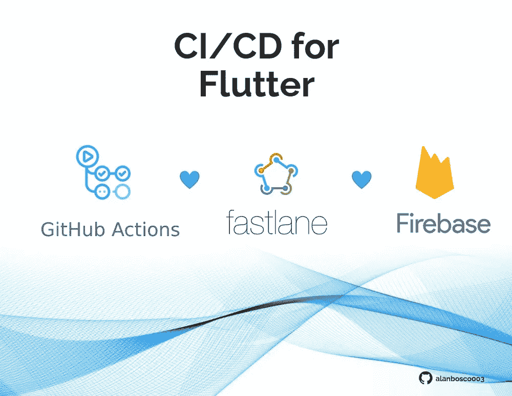
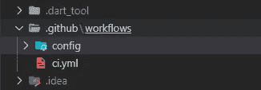
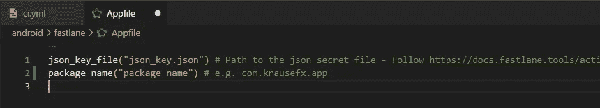
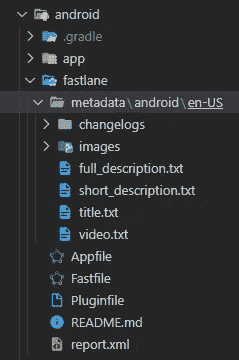

# 使用 Github 动作和浪子的颤振 CI/CD🔥

> 原文：<https://levelup.gitconnected.com/ci-cd-for-flutter-using-github-actions-and-fastlane-6dfc9431ee9a>



众所周知，发布 Apple store 和 Play store 是一项艰巨的任务，尤其是在使用跨平台框架的情况下。这就是 CI / CD 要来帮忙的地方。CI/CD 有助于加快发布速度，因为检测和纠正生产故障的时间更短。因此，逃逸时间较短。然而，软件开发系统中的频繁发布只有在代码是在连续自动化测试系统中开发的情况下才是可能的。


**什么是 CI/CD 管道？**

> CI/CD 管道是为了交付新版本软件而必须执行的一系列步骤。持续集成/持续交付(CI/CD)管道是一种专注于使用 DevOps 或站点可靠性工程(SRE)方法改进软件交付的实践。
> 
> CI/CD 管道引入了监控和自动化来改进应用程序开发过程，特别是在集成和测试阶段，以及交付和部署期间。尽管可以手动执行 CI/CD 管道的每个步骤，但 CI/CD 管道的真正价值是通过自动化实现的。-红帽子

在这里，我将解释如何使用 GitHub actions 和 fastlane 为我的 flutter 应用程序创建一个完整的工作管道。

所以，坐下来发射火箭。🚀

**先决条件🐾**

**1)GitHub repository:**GitHub repository 是配置您的 CI 工作流所必需的，以便在 GitHub 事件发生时、按计划或外部事件发生时使用 repository dispatch webbook 运行。

**2)谷歌开发者账户:**谷歌开发者账户是将你的应用程序推送到 google play 商店所必需的(只是，如果你想把它放在那里的话。否则，您可以将您的工件推送到 firebase app 分发)。

**3) Google 服务帐户:**服务帐户是一种特殊类型的 Google 帐户，旨在代表一个非人类用户，该用户需要验证并被授权访问 Google APIs 中的数据。运行工作流(将捆绑包或 APK 推送到您的 google play 商店)需要此帐户和密钥。要创建和生成密钥，请遵循此页面，其中所有内容都定义得很清楚—[https://medium . com/automating-react-native-app-release-to-Google-play/create-Google-play-service-account-68471 D4 b 398 b](https://medium.com/automating-react-native-app-release-to-google-play/create-google-play-service-account-68471d4b398b)

**4)用 firebase** 配置你的项目(用于使用 Firebase app 分发版)。


**我们开始吧？✨**

**话题分三个！！！**

**i) GitHub 操作。**

ii)快车道。

iii) Firebase 应用程序分发。


1.  **GitHub 行动。**

GitHub Actions 是一个自动化软件，有助于持续集成和持续交付。它使开发人员能够自动化许多不同的任务，如构建、测试、分析和部署。

**再次分题😏**

**a)基本工作流程。**

**b)在云中签名构建。**

**c)上传工件。**

🎇 🎇 🎇

**a)基本工作流程。**

要在 GitHub 存储库中使用 GitHub 操作，首先需要创建目录。github/工作流程:

像这样:—



> 你不需要配置文件。但是,. yml 文件是必需的。这就是我们将要编写工作流的地方。

这是 GitHub action 的工作流程示例。这将在 GitHub 的“发布”分支上初始化推送时触发。

```
name: learn-github-actionson:push:branches:- releasejobs:check-bats-version:runs-on: ubuntu-lateststeps:- uses: actions/checkout@v2- uses: actions/setup-java@v2 #plugin for setting up the javawith:distribution: ‘zulu’java-version: ‘11’ #defines the java version- uses: subosito/flutter-action@v2with:flutter-version: ‘2.5.3’ #You can define the flutter version.- run: flutter pub get #installing the plugins for the flutter project- run: flutter test #running flutter test- run: flutter build apk #building flutter apk- run: flutter build appbundle #building flutter bundle
```

*因此，每当你初始化一个 push on 到‘release’分支时，这个工作流就在你的 GitHub 动作中开始，并且一个新的发布被构建。*

> 这只是一个简单的工作流程，但这个版本不能发送到 google play 控制台。我们需要在 github 操作中签名并上传工件。

**b)在云中签名构建。**

在 flutter 文档中给出了签署 flutter 的良好文档，包括:-

1)创建上传关键点。

2)参考应用程序中的拱顶石。

3)在 gradel 中配置签名。

> 你可以参考这里的文档:-[https://docs.flutter.dev/deployment/android](https://docs.flutter.dev/deployment/android)。
> 
> ***你需要在 GitHub secrets 中保存 KEY_JKS，KEY_PASSWORD，ALIAS_PASSWORD。这将加密您的密钥，并允许您将敏感信息存储在您的组织存储库中或重新定位环境。这些保存的密钥可以帮助您在云环境中签署您的 flutter。***

**c)上传工件。**

创建新的签名构建后，我们需要将构建作为工件上传到 GitHub actions 中。所以这个构建可以部署到 play store 中。

这就是社区来帮助 GitHub actions 的地方，它有很多由社区自己开发的插件，让一切变得更简单。

**你可以用这个代码来**

**创建工件:-**

```
- name: Create github artifact release # disable this to save storageuses: ncipollo/release-action@v1with:artifacts: “build/app/outputs/apk/release/*.apk,build/app/outputs/bundle/release/app-release.aab”token: ${{ secrets.GITHUB_TOKEN }} # this is automatically provided by githubcommit:
```

**上传工件:-**

```
- name: Upload app bundle artifactuses: actions/upload-artifact@v2with:name: appbundlepath: build/app/outputs/bundle/release/app-release.aab- name: Run Fastlaneuses: [maierj/fastlane-action@v1.4.0](mailto:maierj/fastlane-action@v1.4.0)
```

> 我目前正在上传包工件。因为，上传 bundle 到游戏主机比上传 APK 好。

这里是完整的代码，你可以复制这段代码。

```
name: Flutter CICD # action nameon:push:tags:- “v*”jobs:build:runs-on: ubuntu-latestenv:KEY_JKS: ${{ secrets.KEY_JKS }}KEY_PATH: “key.jks”KEY_PASSWORD: ${{ secrets.KEY_PASSWORD }}ALIAS_PASSWORD: ${{ secrets.ALIAS_PASSWORD }}steps:- uses: actions/checkout@v2- uses: actions/setup-java@v2with:distribution: ‘adopt’java-version: ‘12.x’- name: Create key filerun: echo $KEY_JKS | base64 -di > key.jks- uses: subosito/flutter-action@v1with:flutter-version: ‘2.10.2’ # change accordingly- run: flutter pub get- run: flutter build apk — release — split-per-abi- run: flutter build appbundle- name: Create github artifact release # disable this to save storageuses: ncipollo/release-action@v1with:artifacts: “build/app/outputs/apk/release/*.apk,build/app/outputs/bundle/release/app-release.aab”token: ${{ secrets.GITHUB_TOKEN }} # this is automatically provided by githubcommit:- name: Upload app bundle artifactuses: actions/upload-artifact@v2with:name: appbundlepath: build/app/outputs/bundle/release/app-release.aab
```

> 如果一切正常，您会看到 github actions 页面下已经生成了一个工件。

是的，你已经做了一些事情👐


**二)浪子**

fastlane 是一个开源平台，旨在简化 Android 和 iOS 部署。

fastlane 允许您自动化开发和发布工作流程的每个方面。

出于部署的目的，我们将使用 fastlane 进行我们的颤振项目。它有助于为您的 iOS 和 Android 应用程序自动进行测试版部署和发布。🚀它处理所有繁琐的任务，比如生成屏幕截图、处理代码签名和发布应用程序。

**再次分主题😆:**

**a)将 fastlane 配置为颤振项目。**

**b)将 fastlane 添加到 github 操作工作流。**

**c)使用 fastlane 部署到 playstore。**

**d)使用 fastlane 自动增加版本代码。**

去吧🏃

**a)将 fastlane 配置为颤振项目。**

要将 fastlane 添加到您的 flutter 中，您需要在您的系统中安装 ruby。所以，确保你已经在你的系统上安装了它。

在您的终端中运行这个命令，将 fastlane 安装到您的 flutter 项目中:-

```
sudo gem install fastlane
```

这会将 fastlane 安装到您的项目中。

安装 fastlane 后，转到 android 文件夹(如果你正在使用 android)。

```
Cd android
```

然后，

```
fastlane init
```

这个命令将自动为您的 flutter 项目配置 fastlane，您只需要提供您的包 id 和 google 服务帐户的 json 密钥(这是本文的先决条件，您可以转到文章的顶部，并按照链接创建一个服务帐户并生成密钥)。

> 名词（noun 的缩写）B: —如果你不能完成这一步，你可以去新创建的 fastlane 文件夹> Appfile，然后设置 json_key_file 和 package_name。



> 在 Appfile 内部设置 json_key_file 和 pakage_name。

完成这一步后，您已经为您的应用程序设置了快速通道。

要检查它是否正常工作，您可以运行以下命令:-

```
fastlane supply init
```

这将创建一个新的文件夹元数据，其中有所有的元数据，截图，标题和区分。



> *由此，您可以确保 fastlane 在您的项目中正常工作。*


**b)将 fastlane 添加到 github 操作工作流。**

现在我们可以回到我们的。yml 文件在里面。github \定义 github 操作工作流的工作流。

在那里，您可以指定您的车道(查看代码和注释以了解代码)。

```
- name: Run Fastlane #Give a name to your actionuses: [maierj/fastlane-action@v1.4.0](mailto:maierj/fastlane-action@v1.4.0) #Use this plugin developed by the community for the fastlane actionswith:lane: upload_to_google_play_store #Here you can define the lane need to be executed with the work flow.subdirectory: android #mention if the fastlane folder is inside the android folder.
```

> 从注释本身你可以理解代码将执行什么。这样你就可以将所有的车道添加到你的工作流程中。

**参考完整代码:-**

```
name: Flutter CICD # action nameon:push:tags:- “v*”jobs:build:runs-on: ubuntu-latestenv:KEY_JKS: ${{ secrets.KEY_JKS }}KEY_PATH: “key.jks”KEY_PASSWORD: ${{ secrets.KEY_PASSWORD }}ALIAS_PASSWORD: ${{ secrets.ALIAS_PASSWORD }}steps:- uses: actions/checkout@v2- uses: actions/setup-java@v2with:distribution: ‘adopt’java-version: ‘12.x’- name: Create key filerun: echo $KEY_JKS | base64 -di > key.jks- uses: subosito/flutter-action@v1with:flutter-version: ‘2.10.2’- run: flutter pub get- run: flutter build apk — release — split-per-abi- run: flutter build appbundle- name: Create github artifact releaseuses: ncipollo/release-action@v1with:artifacts: “build/app/outputs/apk/release/*.apk,build/app/outputs/bundle/release/app-release.aab”token: ${{ secrets.GITHUB_TOKEN }}commit:- name: Upload app bundle artifactuses: actions/upload-artifact@v2with:name: appbundlepath: build/app/outputs/bundle/release/app-release.aab- name: Run Fastlaneuses: maierj/fastlane-action@v1.4.0with:lane: upload_to_google_play_storesubdirectory: android
```

**c)使用 fastlane 部署到 playstore。**

> 现在，进入 Android 里面的 fast file > fast lane > fast file

在这里，你可以为你需要定义不同的通道(这有助于触发你需要的不同通道用户。例如:firebase 发行版、playstore 发行版、app store 发行版等等)

*创建构建运行本快车道的功能:-*

```
gradel( )
```

*要将版本上传到 google play 商店，您可以使用此功能:-*

```
Upload_to_play_store( )
```

**完整代码:**

```
desc “Deploy to closed beta track”lane : upload_to_google_play_store dobegingradle(task: “clean”)gradle(task: “bundle”,build_type: ‘Release’)upload_to_play_store(track: ‘beta’,aab: ‘../build/app/outputs/bundle/release/app-release.aab’,skip_upload_metadata: true,skip_upload_images: true,skip_upload_screenshots: true,release_status: “draft”,)endend
```

如果这条车道运行成功，你可以看到一个新的建设是在你的谷歌游戏控制台的'测试'轨道创建。

**d)使用 fastlane 自动增加版本代码。**

> 好吧！如果现在再次尝试运行工作流，您将看到工件已创建，但构建不会上传到 google play 商店😢
> 
> 所以，突然间你的快乐变成了悲伤。


> 这是因为您正在尝试将同一版本的应用程序再次上传到 play store。
> 
> 因此，每当你向 google play 推送一个新版本时，你需要通过增加版本代码来修复它。
> 
> 别担心，快车道公司会帮助你的😇

```
increment_version_code( )
```

将帮助您自动增加 gradel 文件中应用程序的版本代码。

> 您所需要做的就是传递当前构建的 gradel 文件路径和版本代码。

*💔但是有没有可能每次都手动输入 build 号呢？*

*💔我们需要检查 gradel 文件中当前的内部版本号吗？*

别担心 fastlane 为您提供了保障🏄。

```
google_play_track_version_codes( )
```

*帮助获取当前版本代码。因此，你不需要每次都检查构建版本代码。*

*我们可以向 Google _ play _ track _ version _ codes()传递一个参数“track ”,以获取该特定曲目的版本代码。*

```
Beta_track_version_code = google_play_track_version_codes(track: ‘beta’)
```

*这将返回测试版的版本代码。*

*我们可以将版本递增 1，并将修改后的新版本传递给 increment_version_code ( )*

这将增加新构建的版本代码，并且您不希望担心每次都增加代码。

如果你有多首曲目，你可以获取每首曲目的所有版本代码，找到最大版本代码，并将其传递给 increment_version_code()。

像这样:

```
g = google_play_track_version_codesgb = google_play_track_version_codes(track: ‘beta’)ga = google_play_track_version_codes(track: ‘alpha’)
```

*快车道是用 ruby 写的，所以你可以这样写 ruby 来求最大值。*

```
max_value = [g[0].to_i, gb[0].to_i, ga[0].to_i].maxversion_updated = max_value + 1
```

*将版本 _ 更新传递给增量 _ 版本 _ 代码()*

```
increment_version_code(gradle_file_path: “./app/build.gradle”, version_code: version_updated.to_i)
```

**参考完整代码:-**

```
desc “Deploy to closed beta track”lane :closed_beta dobegingradle(task: “clean”)g = google_play_track_version_codesgb = google_play_track_version_codes(track: ‘beta’)ga = google_play_track_version_codes(track: ‘alpha’)max_value = [g[0].to_i, gb[0].to_i, ga[0].to_i].maxputs “this is the version number”puts max_valueversion_updated = max_value + 1puts “this is the incremented version number”puts version_updatedincrement_version_code(gradle_file_path: “./app/build.gradle”, version_code: version_updated.to_i)gradle(task: “bundle”,build_type: ‘Release’)upload_to_play_store(track: ‘beta’,aab: ‘../build/app/outputs/bundle/release/app-release.aab’,skip_upload_metadata: true,skip_upload_images: true,skip_upload_screenshots: true,release_status: “draft”,)endend
```

就这样，你已经通过 github actions 和 fastlane 成功完成了你的 flutter 项目的 **CI/CD** 。现在，你可以看到新的版本被上传到你的游戏控制台👏 👏 👏。


**iii)上传构建到 Firebase 应用程序发行版(可选)**

Firebase 应用程序分发使将您的应用程序分发给受信任的测试人员变得没有痛苦。通过将你的应用程序快速下载到测试人员的设备上，你可以更早、更频繁地获得反馈。如果你在你的应用中使用 Crashlytics，你将自动获得所有构建的稳定性指标，这样你就知道你什么时候可以发布了。

先决条件:

你必须为你的颤振项目设置快速通道(如果你已经完成了上述步骤)

请遵循以下步骤👾

将 firebase_app_distribution 插件添加到你的 flutter 项目中。

*从您的 Android 项目的根目录运行以下命令:*

```
fastlane add_plugin firebase_app_distribution
```

b)使用 Firebase 进行认证。

I)你必须为你的颤振项目建立燃烧基地。

ii)你必须有 NodeJs 才能在你的项目上安装 firebase 工具

iii)安装 NodeJS 后，运行以下命令

```
npm install -g firebase-tools
```

iv)从 firebase CLI 登录 firebase(运行以下命令):-

```
firebase login
```

v)登录用于登录 firebase 控制台的 google 帐户。

vi)登录后，您将获得 firebase CLI 中提供的刷新令牌。复制令牌，我们稍后需要使用它。

vii)转到 firebase 控制台，在那里配置您的项目，然后转到 firebase 应用程序分发。单击“开始”

您已经成功设置了 firebase 应用程序分发的应用程序。

**c)设置 firebase app 分发通道**

我们可以使用 firebase_app_distribution()将构建上传到 firebase_App_distribution。

```
firebase_app_distribution(app: “<YOUR APP ID>”,firebase_cli_token: “<REFRESH TOKEN>”,groups: “FIREBASE TESTER GROUP”,release_notes: “RELEASE-NOTE”,android_artifact_type: “APK”,firebase_cli_path: “/usr/local/bin/firebase”,apk_path: “../build/app/outputs/apk/debug/app-debug.apk”,)
```

**注意:确保你已经把所有的参数传递给了这个函数，否则它会给你一个错误。**

**App id:** 你可以从 firebase 项目控制台>项目>通用> app id 获取 App id

**Firebase_cli_token:** 当您使用 Firebase 验证项目时生成的令牌。

**组:**在 firebase 应用控制台中创建一个组。你可以在那里添加测试者的电子邮件。

**Release_note:** 创建一个发布说明，这样测试人员就可以知道你在构建中修复了哪个 bug。

**Android_artifact_type:** 指定你要上传哪个工件(apk 或者 bundle)。尝试上传 apk 进行测试。

**查看上传构建到 firebase 应用分发的完整通道:**

```
desc “Firebase testing”lane :upload_firebase dobegingradle(task: “assemble”,build_type: ‘Debug’)firebase_app_distribution(app: “1:297830272300:android:d885e35be589f8cf9e3089”,firebase_cli_token: “1//0gc9V10iqbz-aCgYIARAAGBASNwF-L9Irro4vffKKaOJ5peLc6JIm0Ri9wItAzsAoXA2QcXrelbm-fDaeuWjAapeiaPQzwf1vCeA”,groups: “allianze-testers”,release_notes: “RELEASE-NOTE”,android_artifact_type: “APK”,firebase_cli_path: “/usr/local/bin/firebase”,apk_path: “../build/app/outputs/apk/debug/app-debug.apk”,)endend
```

好了，现在您已经完成了完整的 CI/CD 管道。但是你可以用 github actions 和 fastlane 做更多的事情，比如截图和向 google playstore 传递元数据。

你可以在这里找到更多的快车道插件:[https://docs.fastlane.tools/plugins/available-plugins](https://docs.fastlane.tools/plugins/available-plugins/)

您还可以在这里找到 github 操作的更多操作:

[](https://github.com/features/actions) [## 功能* GitHub 操作

### 此时您不能执行该操作。您已使用另一个标签页或窗口登录。您已在另一个选项卡中注销，或者…

github.com](https://github.com/features/actions) 

**结论:**

🐸您可能会想，为什么我们要实施整个基础架构，而您只需将构建拖放到控制台即可。但是，相信我，从长远来看，管道会帮助你的。

🐸请始终将您的密钥和敏感信息保存在 github secretes 中。

🐸如果您在本地保存密钥或敏感信息，请确保您在 gitignore 上指定了该文件。所以，这些数据不会在 github 中共享。