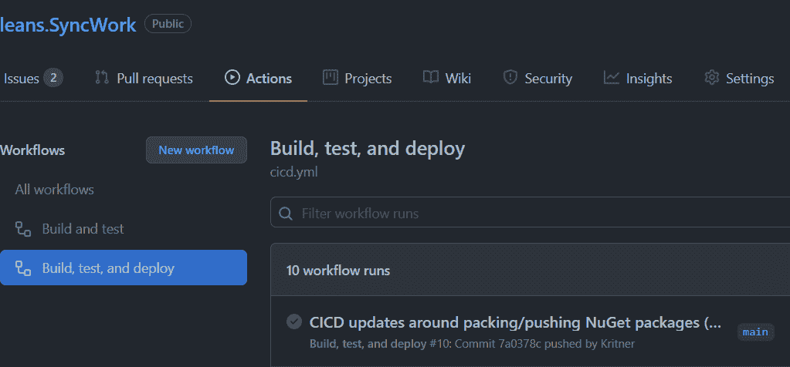
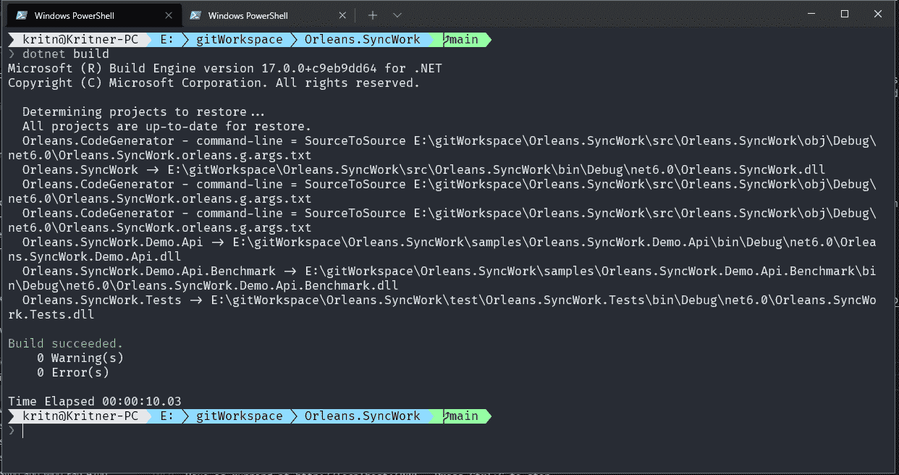
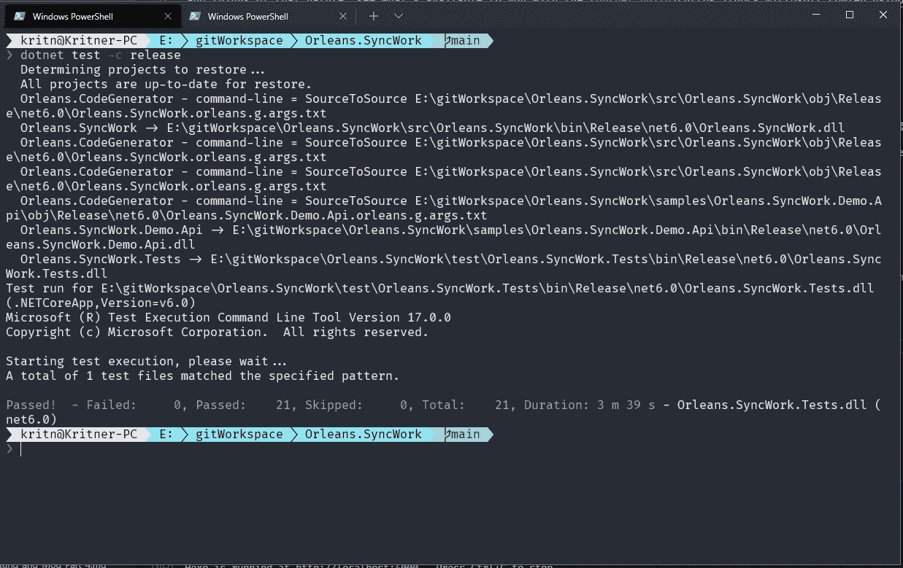
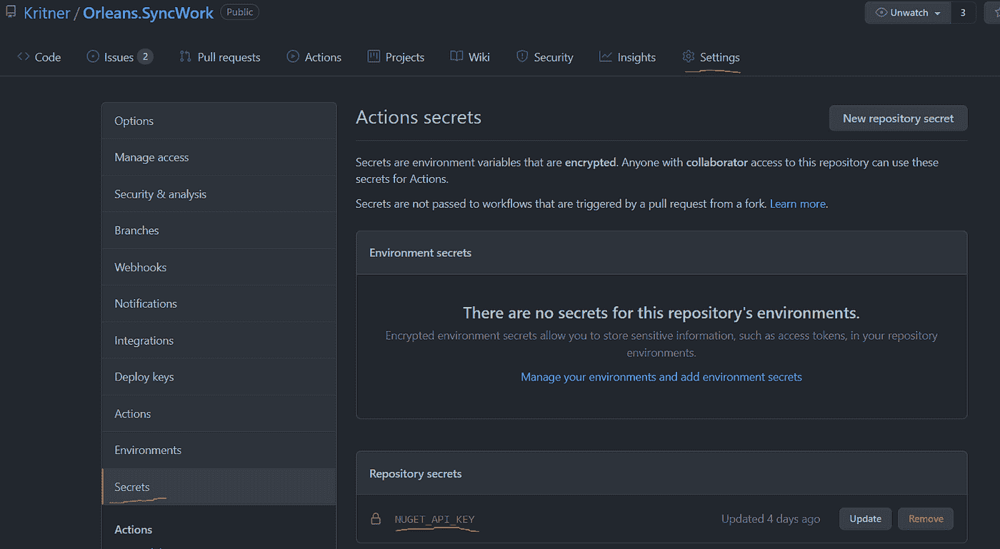

# CI/CD 用于。使用 GitHub 动作

> 原文：<https://levelup.gitconnected.com/ci-cd-for-net-6-using-github-actions-a81fde5c5da2>



随着《奥尔良》的出版。SyncWork ，我有机会探索 GitHub 动作——这是一种自动化工作流的方式。下面是我第一次体验“行动”(呻吟)。

# 自动化工作流程

首先，什么是工作流，自动化意味着什么？亲爱的潜在读者，工作流只不过是完成一项任务的一系列步骤。

来自[维基百科](https://en.wikipedia.org/wiki/Workflow):

> *一个工作流由一个编排好的可重复的活动模式组成，通过将资源系统地组织成转换材料、提供服务或处理信息的过程来实现。它可以被描述为一系列操作、一个人或一组人的工作、一个员工组织的工作，或者一个或多个简单或复杂的机制。*

您可以将工作流视为完成“某件事”所采取的步骤。“某物”可以是任何数量的事物，与任何数量的主题相关。在这篇文章的上下文中，我们将主要讨论与构建和发布管道相关的工作流，通常也称为持续集成(CI)和持续交付(CD)。

我想涵盖奥尔良的 CI 和 CD 两个方面。SyncWork ，那么我们开始吧。

# 你(可能)需要什么

*   使用 [CLI](https://docs.microsoft.com/en-us/dotnet/core/tools/) 的经验
*   为了构建、测试和部署您的代码，您需要采取的步骤的概念。如果这些步骤已经以 CLI 命令的形式出现在您的脑海中，那么您已经成功了！
*   在让你的工作流程合理布局方面需要一些耐心

# 连续累计

在您能够通过工作流(连续交付)部署代码之前，您需要能够将它安全地集成到您的主/主干中。对于 dotnet，通过一些 CLI 命令，代码的构建和测试非常简单。做 CI 还有一个额外的好处，那就是每次都会为构建带来一个全新的环境，这也是为什么我这么长时间以来一直支持[构建服务器](https://blog.kritner.com/2015/01/21/And-its-like-whats-the-deal-with-build-servers)的原因。

# 建设

```
dotnet build
```

上面的命令是在 dotnet 端构建解决方案文件或项目文件所需的最少命令。从持续集成的角度来看，您可能希望在命令中添加一些标志，例如:

```
dotnet build --configuration release
```

和诸如此类的事情，看看用 [dotnet build](https://docs.microsoft.com/en-us/dotnet/core/tools/dotnet-build) 文档你能得到什么。

从 CLI 看可能是这样的:



# 试验

接下来是测试。我可能已经说了太多次了，但是[测试你的代码](https://blog.kritner.com/2018/12/06/getting-started-with-xunit/)！尤其是当你在建图书馆的时候！测试有助于确保您编写的代码确实如您所说的那样。此外，在某种程度上，测试被用作“文档”,如果测试被很好地命名，并且调用代码的方式类似于您的消费者将如何使用它，那么他们将在一个更好的地方开始使用您已经交付的东西。

与 [build](https://blog.kritner.com/2021/11/29/cicd-for-net6-with-github-actions/#build) 命令一样，test 命令也非常简单:

```
dotnet test
```

当然，以上是绝对的最小命令，还有很多参数可以传递给 [dotnet test](https://docs.microsoft.com/en-us/dotnet/core/tools/dotnet-test) 。

从 CLI 看，测试运行可能如下所示:



# CI 操作

有了上面的`dotnet build`和`dotnet test`命令，我们就有了*大部分*自动构建和测试代码所需的东西！

有很多好的信息，甚至一些特定的。对[文档](https://docs.github.com/en/actions/automating-builds-and-tests/building-and-testing-net)进行净测试。我基本上是以文档作为起点，并以这个结尾…

。github/workflows/ci.yml:

```
name: Build and test

on:
  pull_request:
    branches: [ main ]

jobs:
  build:

    runs-on: ubuntu-latest

    steps:
    - uses: actions/checkout@v2
      with:
        fetch-depth: 0

    - name: Setup .NET
      uses: actions/setup-dotnet@v1
      with:
        dotnet-version: 6.0.x

    - name: Restore dependencies
      run: dotnet restore

    - name: Build
      run: dotnet build -c Release --no-restore

    - name: Test
      run: dotnet test -c Release --no-build --verbosity normal --filter "Category!=LongRunning"
```

上面的文件应该非常简单，首先我们用`name`给我们的工作流命名，指定工作流的触发器，在本例中是“针对主分支的拉请求”。然后，该文件继续定义作业“build ”,它指定要运行的操作系统，然后执行步骤。这些步骤做了一些值得注意的事情:

*   签出代码，将其放入上一步中使用的 ubuntu 实例中
*   设置。带有预建操作的. NET
*   恢复依赖关系
*   在项目根目录下生成解决方案文件
*   最后测试代码

我们的构建和测试命令中有一些新的标志，即指定发布的配置，并且不在已经发生的步骤上恢复/构建。最后一点要注意的是`--filter "Category!=LongRunning"`——我在测试运行人员通过我布置的测试时遇到了麻烦。他们花了 3 分钟在本地运行，但是在构建代理上运行了超过 25 分钟。由于这个事实，我将一些“category”的分类添加到长时间运行的测试中，并在上面的 ci.yml 文件中将它们从测试运行中排除。

# 连续交货

持续交付很像持续集成，并建立在它之上。我的想法是，裁谈会应该做 CI 应该做的一切，或者甚至更好，实际上依靠 CI，而不是像我最后做的那样重新定义你的 CICD 的步骤。这有点乱，但是 CD 应该做 CI 应该做的所有事情，除了额外的步骤，即作为其工作流程的一部分，实际上*交付*(部署/推送)代码。

# 交付复杂性

与“CI”相比，交付部分可能有许多细微差别，从而大大增加了复杂性。实际交付代码是什么意思？这很大程度上取决于你实际交付的代码类型。在我的例子中，我正在交付一个 NuGet 包，它有自己的复杂性，但是还有什么呢？我想到的另一件显而易见的事情是网站/ web api，除了代码之外，它还可能会有数据库更改。对我来说，这可能比仅仅推出一个 NuGet 包要复杂得多。在 web 推送或数据库推送出现问题的情况下，如何不仅处理故障，而且检测故障并回滚？也许有一天我能够探索这个问题，但是现在，让我们回到 NuGet 包。

那么，交付一个 NuGet 包是否很复杂呢？是的。手动部署时，NuGet 包版本控制可能是一项大工程，更不用说 CD 了；因为要求 NuGet 包是不可变的。这是否意味着对于每一个的*检入，在*的每一个*潜在分支将被推送到 NuGet，你需要更新一些文本文件或代码来指示下一个构建版本？这是我最初的想法，但谢天谢地，在 Nerdbank 的帮助下，情况并非如此。GitVersioning*

我不认为我有我的 CICD 设置*确切地说*我将如何结束拥有它，但现在它的工作。我安装了 NerdBank。GitVersioning 工具和包，现在对于每一个构建，我在构建时获得 NuGet 包的唯一版本号。我可以在预发布或发布包之间切换，甚至可以发布包含提交散列的“夜间”构建，所有这些都以唯一可识别的 NuGet 包的名义进行。

有相当多的设置，在某些方面我仍在努力，但这篇文章已经够长了，如果你好奇，看看这些公关:【https://github.com/OrleansContrib/Orleans.SyncWork/pull/8 和[https://github.com/OrleansContrib/Orleans.SyncWork/pull/13](https://github.com/OrleansContrib/Orleans.SyncWork/pull/13)。它的“tldr”是，`nbgv`工具使用 git 历史来修订构建期间使用的版本号，允许每次 CI/CD 触发时使用唯一的构建号。

# CD 动作

到目前为止，已经有了相当多的信息，但是在我们的 CI 动作和关于 GitVersioning 的信息之间，我们已经有了我们需要的所有东西来组合“第一遍”cicd.yml。对于 CD，当代码被*推送到*main，以及以“RELEASE/v*”开头的分支时，我们将希望进行交付。我在这里的想法是，由于我们将经常集成到 main 中(理论上)，我们不一定要为每个提交给 main 的*创建完整的“新发布包”。然而，我们可以为每次提交创建“预发布”的 NuGet 包，使这些更改对 NuGet 提要可用，但它们不会被标记为发布版本。否则我有 Nerdbank。GitVersioning 设置为从“release/v*”分支发布包的“RELEASE”版本。*

CD 操作文件本身看起来*非常*类似于 CI 文件，只是增加了一些`dotnet nuget...`命令，如下所示:

。github/workflows/cicd.yml

```
name: Build, test, and deploy

on:
  push:
    branches:
      - 'main'
      - 'RELEASE/v**'

jobs:
  build:

    runs-on: ubuntu-latest

    steps:
    - uses: actions/checkout@v2
      with:
        fetch-depth: 0

    - name: Setup .NET
      uses: actions/setup-dotnet@v1
      with:
        dotnet-version: 6.0.x

    - name: Restore dependencies
      run: dotnet restore

    - name: Build
      run: dotnet build -c Release --no-restore

    - name: Test
      run: dotnet test -c Release --no-restore --no-build --verbosity normal --filter "Category!=LongRunning"

    - name: Pack
      run: dotnet pack src/Orleans.SyncWork/Orleans.SyncWork.csproj -c Release --no-restore --no-build --include-symbols -p:SymbolPackageFormat=snupkg -o .

    - name: Push to NuGet
      run: dotnet nuget push *.nupkg --skip-duplicate -s [https://api.nuget.org/v3/index.json](https://api.nuget.org/v3/index.json) -k ${{secrets.NUGET_API_KEY}}
```

在上面的内容中，您会注意到有超过 50%的内容是与 CI“相同的文件”。我可能会在某个时候研究一下[复合动作](https://docs.github.com/en/actions/creating-actions/creating-a-composite-action)，看看我是否可以将 CI 和 CD“链接”起来，而不是在 CD 文件中重新定义 CI；但是我还没有机会去探索。

除了对“on”事件的更改(pull_request -> push)，底部还有两个新命令`dotnet pack`和`dotnet nuget push`。`dotnet pack`命令用于将指定的项目打包成一个。nupkg”文件(在这种情况下，符号为 snupkg)。最后，使用`dotnet nuget push`命令将新打包的 NuGet 包推送到 NuGet 指定的 feed。在这个命令中，你还可以看到命令的`{{secrets.NUGET_API_KEY}}`部分，它被定义为[库秘密](https://docs.github.com/en/actions/security-guides/encrypted-secrets)，它可以用来将“秘密”信息传递给工作流之类的东西，在这个例子中，它是我的 NuGet API 密钥。这些秘密可以从储存库的【设置】- >“秘密”中设置:



# 仍然要做

“发布一个发布分支”对我来说仍然有点像手工操作。我需要从我的*本地*环境中运行`nbgv prepare-release`，然后推进随后创建的“RELEASE/v*”分支，并更新在 main 下创建的新的预发布版本。

这可能没有意义。

如果我在 main 中使用“1.0-预发布”的预发布版本，当我`nbgv prepare-release`时，main 将(作为一个例子)更新到“1.1-预发布”，并创建一个名为“RELEASE/v1.0”的分支，其发布版本为“1.0”。这两个变更的推送将*目前*构建“1.1-prerelease”的新预发布包和“1.0”的发布包，两者在推送时将包含“相同的内容”。

我不确定我对以上的感觉。我喜欢包的自动构建和部署，但是我不喜欢必须在本地创建发布。我可以设想创建一个手动分派的工作流来为我做这个发布准备，但是与“以前的”预发布包和正在构建的新发布包相比，立即推出一个没有任何变化的预发布包仍然会有一点奇怪。我还不确定“正确的流程”是什么，我现在拥有的*确实有效*，只是看起来有点*混乱。*

也许我最终会像这样研究工作流:

*   CI —继续在 PRs 至 main 上运行
*   CICD —可以在主分支和“RELEASE/v*”分支上执行，但是不能像现在这样自动执行
*   准备发布工作流——在这个工作流中，我想做我目前准备发布所采取的“本地”步骤，但是通过 github 动作来做。

# 参考

*   [奥尔良。GitHub 上的 sync work](https://github.com/OrleansContrib/Orleans.SyncWork)
*   [维基百科](https://en.wikipedia.org/wiki/Workflow)
*   [CLI](https://docs.microsoft.com/en-us/dotnet/core/tools/)
*   [这就像是构建服务器有什么好处？](https://blog.kritner.com/2015/01/21/And-its-like-whats-the-deal-with-build-servers)
*   【XUnit 入门
*   [点网构建](https://docs.microsoft.com/en-us/dotnet/core/tools/dotnet-build)
*   [网络测试](https://docs.microsoft.com/en-us/dotnet/core/tools/dotnet-test)
*   [构建和测试用。NET 使用 GitHub 动作](https://docs.github.com/en/actions/automating-builds-and-tests/building-and-testing-net)
*   Nerdbank。GitVersioning
*   [GitHub 复合动作](https://docs.github.com/en/actions/creating-actions/creating-a-composite-action)
*   [GitHub 加密的秘密](https://docs.github.com/en/actions/security-guides/encrypted-secrets)

*原载于 2021 年 11 月 29 日 https://blog.kritner.com**[*。*](https://blog.kritner.com/2021/11/29/cicd-for-net6-with-github-actions/)*