# 使用 Azure、Jenkins、Nginx 和 GitHub 的 Python 代码的 CI/CD:第一部分

> 原文：<https://levelup.gitconnected.com/ci-cd-for-python-code-using-azure-jenkins-nginx-and-github-part-one-d0e1ab55e688>


来自[突发](https://burst.shopify.com/sky?utm_campaign=photo_credit&utm_content=Browse+Free+HD+Images+of+Rolling+Green+Hills+Under+Puffy+White+Clouds+And+Blue+Skies&utm_medium=referral&utm_source=credit)的 [Alex Nirta](https://burst.shopify.com/@alexnirta?utm_campaign=photo_credit&utm_content=Browse+Free+HD+Images+of+Rolling+Green+Hills+Under+Puffy+White+Clouds+And+Blue+Skies&utm_medium=referral&utm_source=credit) 摄影

作为“使用 Azure、Jenkins、Nginx 和 GitHub 的 Python 代码的 CI/CD”系列的第一篇文章，我将介绍如何通过在 Azure 上创建 Linux 虚拟机并配置 Azure NSG(网络安全组)来在 Azure 上的 Nginx 反向代理服务器后面设置 Jenkins 服务器。当然，我知道微软在 Azure marketplace 中提供了 Jenkins 模板，但我个人更喜欢自己构建 Jenkins 服务。

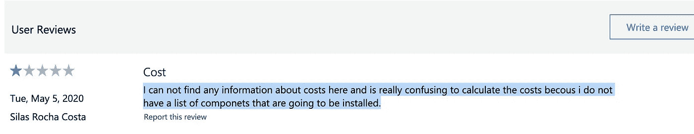

我在模板页面上找到的用户评论

# 创建一个 Linux 虚拟机

所以首先你应该有一个 Azure 订阅，如果你没有，那么你可以在 https://azure.microsoft.com/en-us/free/[创建你的 Azure 免费账户。](https://azure.microsoft.com/en-us/free/)

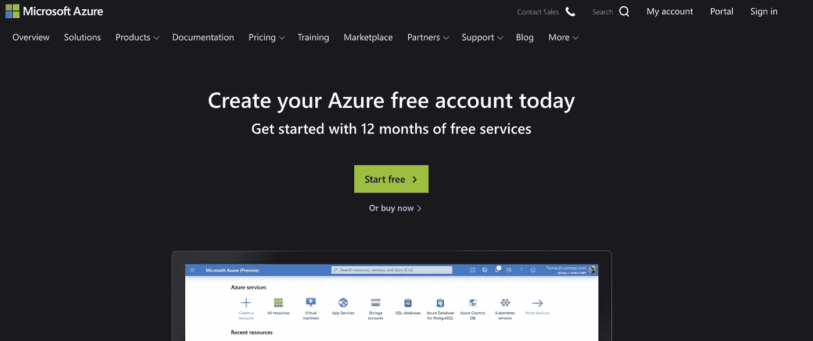

现在登录到你的 Azure 门户页面，创建一个**资源组**。

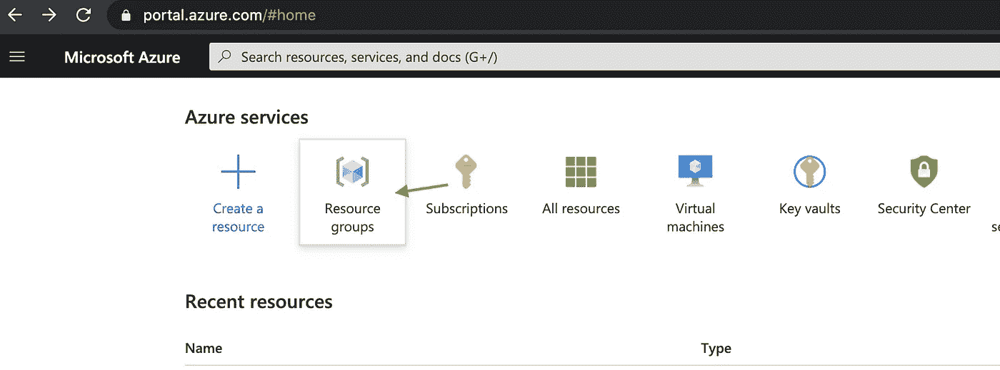

资源组是 Azure 平台的基本元素。资源组是部署在 Azure 上的资源的逻辑容器。换句话说，我们将在 Azure 平台上创建的 Linux 虚拟机将位于一个资源组中。因此，我们首先创建一个资源组。

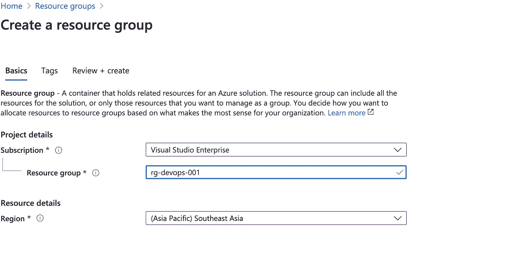

需要注意的一点是，来自多个不同位置的资源可以放在一个资源组中，并且资源组的位置也可以与其中的资源不同。这是因为资源组仅包含关于它所包含的资源的元数据，并且当我们为资源组指定位置时，我们指定元数据存储在哪里。

并且资源组的名称要有意义，比如' **rg-devops-001 '。**你可以在这里找到很多 Azure 资源命名约定的例子:[*https://docs . Microsoft . com/en-us/Azure/cloud-adoption-framework/ready/Azure-best-practices/naming-and-tagging*](https://docs.microsoft.com/en-us/azure/cloud-adoption-framework/ready/azure-best-practices/naming-and-tagging)

接下来，让我们创建一个虚拟机。如下图所示，我们选择我们创建的资源组，将虚拟机命名为'***VM-Jenkins-asse-001***'(格式:资源类型- <服务名称> - <子区域> - < ### >)，并选择 Ubuntu Server 18.04 LTS 映像。

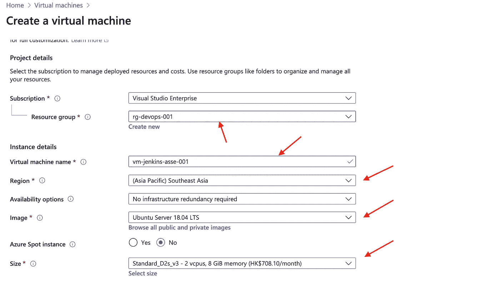

如果您想查看虚拟机大小的所有选项，您可以单击所选大小下方的*选择大小*链接。

然后，我们将使用 ***SSH 公钥*** 作为认证类型。

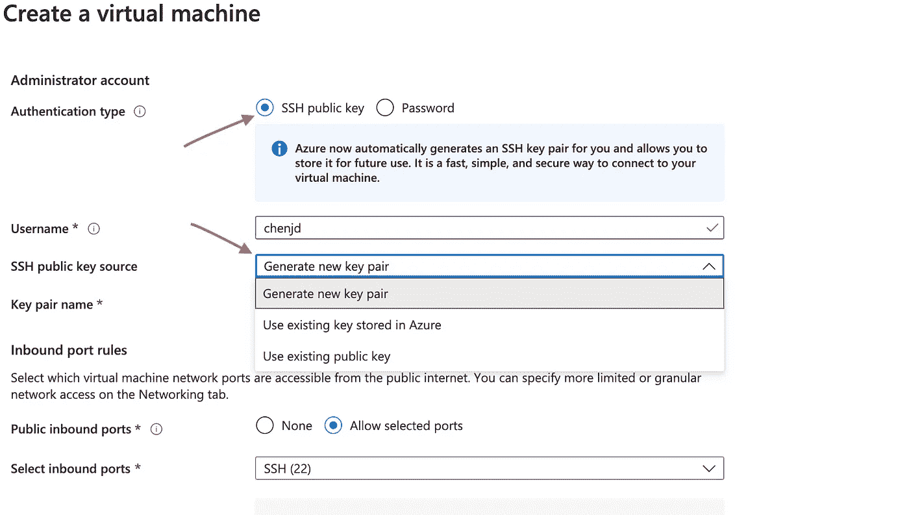

SSH 公钥有 3 个来源，如果您没有现有的公钥，您应该' ***生成新的密钥对*** '。然后，一旦你创建了虚拟机，Azure 将生成密钥对并向你提供私钥，你可以将它存储在你的计算机上。正如您在上面看到的，**端口 22** 将用于 SSH。

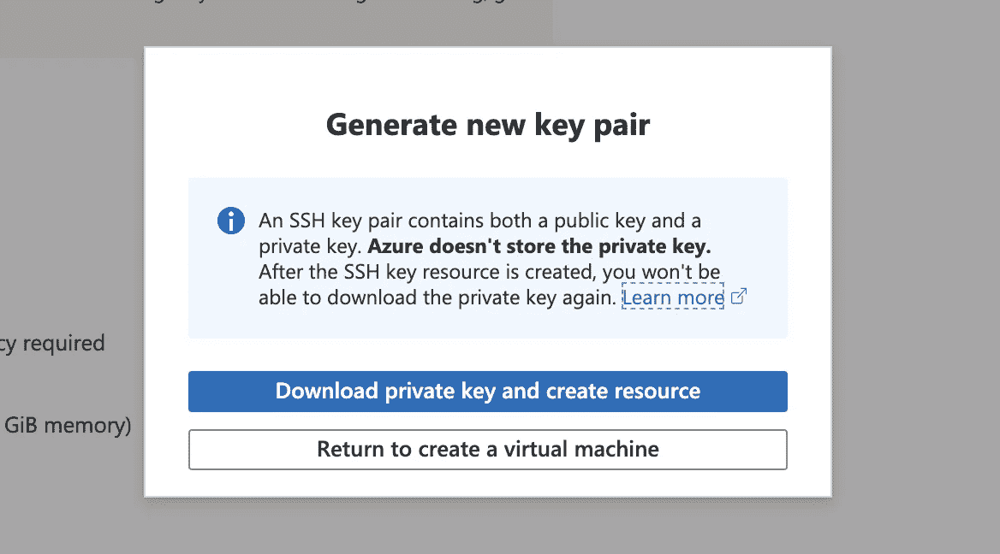

现在我有了 Azure 生成的私钥，并将其存储在 Desktop/azure_ssh_key 文件夹中。然后，我将使用 ssh 从我的 Mac OS 笔记本电脑连接到远程虚拟机。

```
ssh -i ./vm-jenkins-asse-001_key.pem chenjd@23.98.67.148
```

您应该使用 **-i** 选项来识别私钥，但是您可能会遇到错误，如下所示:

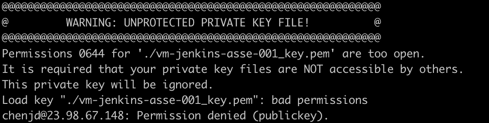

这是因为私钥的默认权限过于开放，0644 意味着所有者有权读写私钥文件。因此，我们应该将所有者对私钥文件的权限设置为只读。

```
chmod 400 ./vm-jenkins-asse-001_key.pem
```

顺便说一下，有一个在线工具可以帮助你计算正确的代码来设置你想要的权限。

[https://chmodcommand.com/](https://chmodcommand.com/chmod-644/)

现在，我们可以连接到虚拟机。

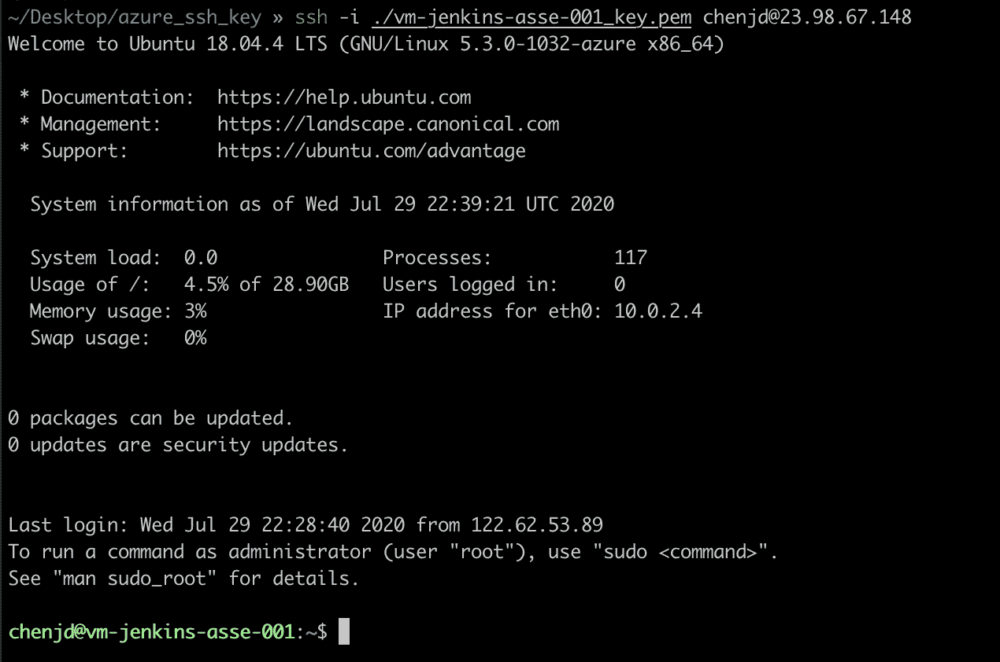

# 在 Nginx 反向代理服务器后面设置 Jenkins 服务器

接下来，我们将安装 Nginx & Jenkins，并在 Nginx 反向代理服务器后面设置 Jenkins 服务器。

先装 Nginx 吧。因为这是我们第一次使用`apt`打包工具，所以我们应该更新我们的本地包索引，这样我们就可以访问最新的包列表。

```
sudo apt update
```

然后安装 Nginx 服务器。

```
sudo apt install nginx
```

现在 Nginx 服务器应该自动运行了。您可以使用 ***systemctl*** 命令打印出 Nginx 服务实例的状态。

```
sudo systemctl status nginx
```

因此，您应该会发现类似于下图的内容。

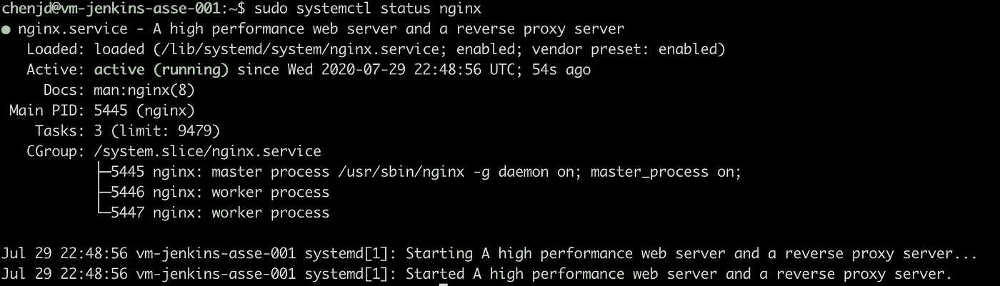

Nginx 服务器会监听**端口 80** ，但是如果你试图在浏览器中通过 IP 地址访问服务器，你会发现你的浏览器无法访问该页面。还记得我们在 Azure 上创建虚拟机时只为 SSH 打开了**端口 22** 吗？

是的，我们也需要打开 80 端口。好了，让我们打开你的虚拟机的网络面板，你可以找到在 **Azure 网络安全组**中定义的默认规则。网络安全组就像一个防火墙，你可以用它过滤进出 Azure 资源的网络流量。

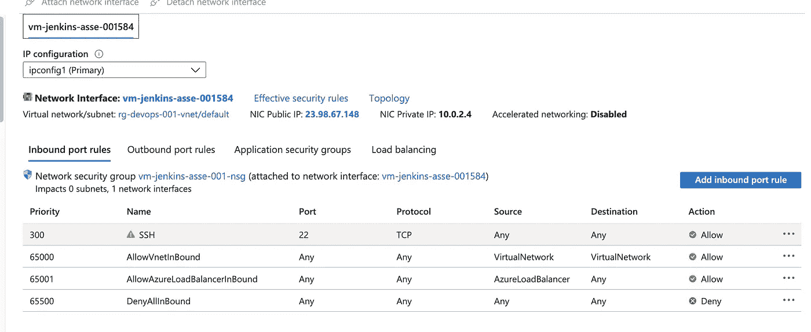

我们添加了一个新的入站端口规则来允许端口 80，您可以在下图中找到名为 ***Port_80*** 的新规则。

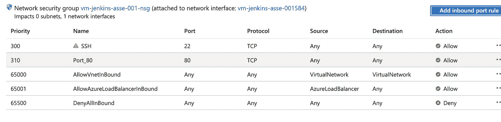

这一次，我们可以在我们的浏览器中通过 IP 地址访问 Nginx 默认页面，酷！

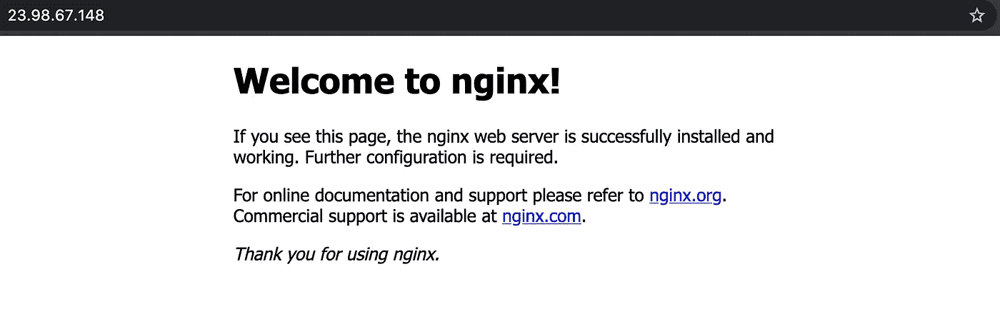

接下来，让我们安装 Jenkins 服务器。由于 Jenkins 是用 Java 编程语言编写的开源自动化服务器，因此我们应该先安装 JDK。

```
sudo apt install openjdk-8-jdk
```

然后安装詹金斯。

```
wget -q -O - https://pkg.jenkins.io/debian-stable/jenkins.io.key | sudo apt-key add -
sudo sh -c 'echo deb https://pkg.jenkins.io/debian-stable binary/ > \
    /etc/apt/sources.list.d/jenkins.list'
sudo apt update
sudo apt install jenkins
```

现在 Jenkins 服务器也应该自动运行了。您可以使用 ***systemctl*** 命令打印出 Jenkins 服务实例的状态。

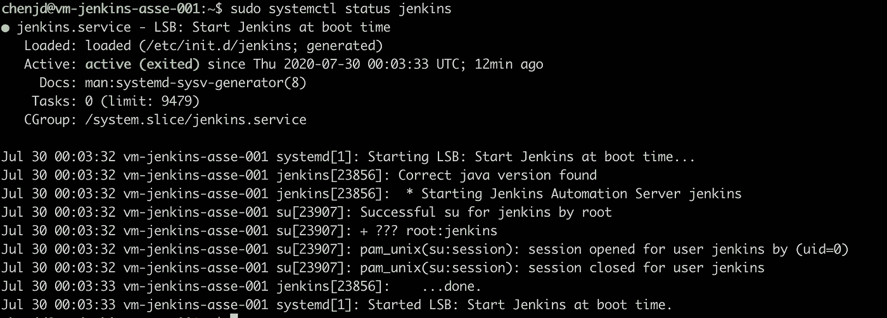

然而，Jenkins 服务器监听**端口 8080** ，我们不允许网络流量进入该端口。这一次，我们不会向 Azure 网络安全组添加新的入站规则，但我们将使用 Nginx 服务器作为反向代理服务器，将发送到端口 80 的流量定向到端口 8080。

为了使用 Nginx 将发送到端口 80 的流量定向到端口 8080，我们应该修改 Nginx 的配置文件。可以在***/etc/nginx/sites-enabled/default***找到，用 Vim 把 proxy_pass 添加到配置文件中。

```
sudo vim /etc/nginx/sites-enabled/default
```

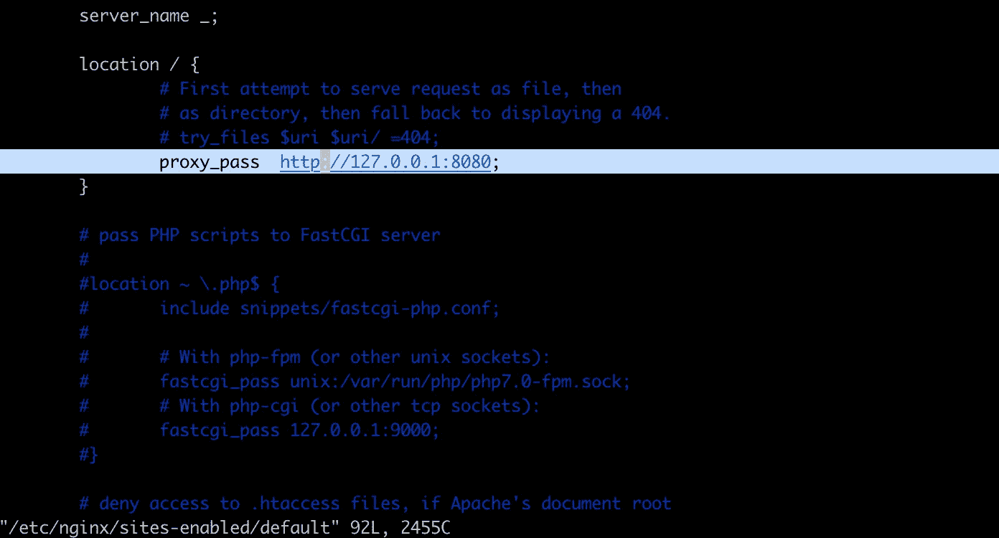

如上所述，为了路由`/`，我们在 ***位置/*** 部分添加了“***proxy _ pass http://127 . 0 . 0 . 1:8080***”。

```
 users --> nginx --- host ---> jenkins on localhost:8080 
```

酷毙了。现在让我们重新加载 Nginx 配置。

```
sudo nginx -s reload
```

在我们的浏览器中刷新 Nginx 默认页面，你会发现 Nginx 默认页面被 Jenkins 页面所取代。耶！

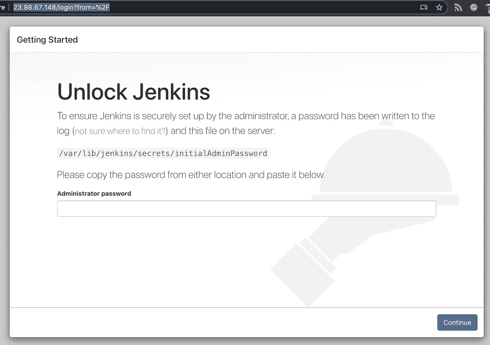

最后，您可以按照说明复制并粘贴初始管理员密码。然后，詹金斯应该安装推荐的插件，我们的詹金斯服务器已准备好服务。

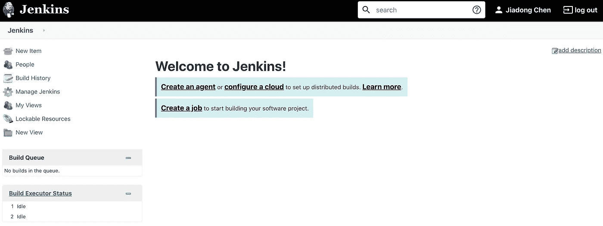

# 摘要

在这篇文章中，我们讨论了如何通过在 Azure 上创建一个 Linux 虚拟机并配置 Azure NSG(网络安全组)来在 Azure 上的 Nginx 反向代理服务器后面设置一个 Jenkins 服务器。这是一个非常有趣的进步。

在下一篇文章中，我将介绍如何使用我们在这篇文章中设置的 Jenkins 服务器来实现 Python 代码的 CI/CD。

感谢阅读，希望有用！